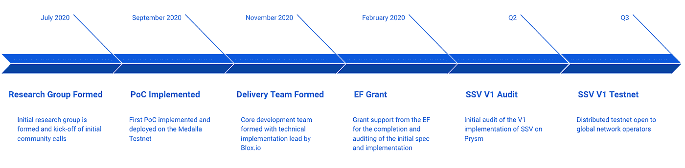
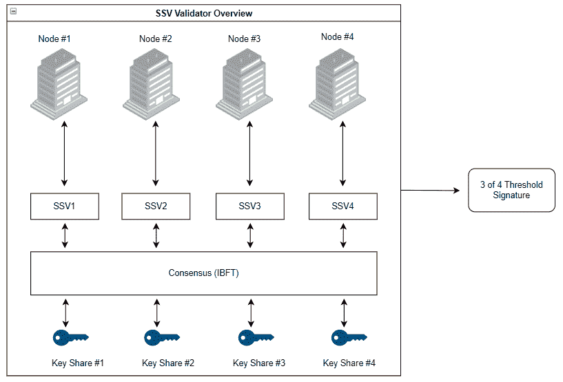
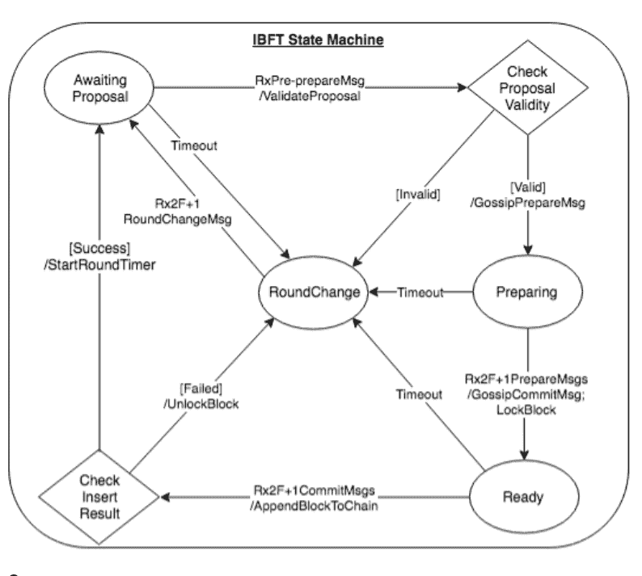

# Eth2 上的分布式验证器技术

> 原文：<https://medium.com/coinmonks/eth2-secret-shared-validators-85824df8cbc0?source=collection_archive---------2----------------------->

## ***马拉施米德&科林迈尔斯| 2021 年 2 月***

***TL；*博士**

*   DVT (fka SSV)是由研究团队和以太坊基金会资助的联合研究项目，旨在为 eth2 信标链带来更好的基础设施弹性
*   该解决方案旨在为机构提供商、staking pool 运营商和家庭验证器提供主动-主动冗余配置，以减轻验证器客户端(VC)和信标节点(BN)级别的潜在故障
*   由 Blox.io 团队建立的第一个基于 Go 的 DVT 实现的测试已经启动并运行，核心团队计划在今年的 Q2 第三季度发布中间件的经审计的开源实现。
*   查看 [Eth2 计算器](https://docs.google.com/spreadsheets/d/1LTv8c-9nfq225bV-esv-JXmb0K-nM_z6qbmVooTAUUo/edit?ts=5f730135#gid=1774476076)以了解更多关于 DVT 配置的经济性，适合您的家庭或基于云的验证器设置。

> 在 ETH2 [**这里**](/coinmonks/secret-shared-validators-on-ethereum-2-0-ea29ab380016) 阅读我们之前关于 DVT (fka SSV)的文章。

## ***Eth2 验证器职责&潜在故障模式***

eth2 网络上验证人员的主要职责领域，也是其相关回报表现和操作风险的关键决定因素，可以大致分为两类:活跃性和安全性。

**热闹:**

*   不要脱机。如果您脱机，请确保当其他人都脱机时，您没有脱机。

**安全:**

*   不要通过双重签名产生可拆分的证明或块。确保不要使用同一个密钥运行多个实例。
*   确保验证程序私钥的安全。防止潜在的危害。

今天，不同的[验证失败的潜在模式](https://notes.ethereum.org/@adiasg/preventing-eth2-validator-failure)通过不同的解决方案得以缓解。

针对信标节点和验证器客户端级别的活动性故障的保护主要是通过诸如硬件提供者、硬件位置、云提供者、云位置和验证器客户端的相关组件中的冗余来实现的。由于 Eth2 中的反相关性惩罚，如果一组验证器同时犯下类似的罪行，该惩罚旨在增加严厉惩罚，多样化的配置和冗余对于所有规模的验证器都特别重要。

大多数提供商利用主动-被动冗余配置来防止其主要设置中的一个或多个基础架构组件出现服务故障。在这种类型的配置中，一个或多个辅助节点在检测到节点故障时充当备份。如果你是一个普通的家庭验证者或者操作一个不可信的赌注池，这种类型的保护是难以实现的，并且需要扩展的专业知识和测试。除此之外，当前的规范和实现对可以引入冗余的子组件级别产生了限制。例如，验证器客户端需要与专用的、特定于客户端的信标节点实例进行通信，这使得在不同客户端上运行的节点之间的主动故障转移成为不可能完成的任务..

用于[斜线保护](/prysmatic-labs/eth2-slashing-prevention-tips-f6faa5025f50)的安全措施已经在两个本地级别上存在，这在现有的验证器客户端(如 Prysm)中是默认启用的。此外，可以远程实施斜线保护。不幸的是，这两种方法都不能防止错误的配置，在错误的配置中，多个验证器实例使用同一个验证器密钥运行，或者为了提高性能而取消本地斜杠保护。不幸的是，最近发生在 eth2 链上的[砍杀事件](https://twitter.com/benjaminion_xyz/status/1334881186003492864?s=20)的根本原因之一就是这些错误设置的结果。

到目前为止，还没有一个开箱即用的解决方案能够有效地减轻所有上述验证器故障的潜在模式 Secret Shared Validators 中间件的发布改变了这一点。

## **T5【分布式验证器技术】DVT**

DVT (fka SSV)中间件在 eth2 网络上的验证器客户端(VC)和信标节点(BN)级别针对所有类型的潜在故障提供最高程度的基础设施弹性。你可以把它看作是以太坊区块链上分布式共识发现任务的大型多重签名。为了简短起见，请查看本演示文稿[或继续阅读。](https://www.youtube.com/watch?v=awBX1SrXOhk)

DVT 由 4 个关键部分组成:分布式密钥生成、BLS 签名的 Shamir 秘密共享、安全多方计算和 DVT BFT 共识层。这 4 个支柱的最终结果可以在下图中看到，它代表了 Eth2 上的一个 DVT 验证器，该验证器在 4 个密钥共享 VC 和 4 个 BNs 配置上利用了 4 个阈值签名中的 3 个。bn 的数量和 VC 的数量取决于需求，并且不需要相同。

## **分布式密钥生成(DKG)**

分布式密钥生成是一个加密过程，其中多方参与计算共享的公钥和私钥集。作为该分布式仪式的一部分的每个代表拥有一部分私钥，防止单个当事人直接访问或控制整个私钥。

DKG 是 DVT 的核心原语，因为它使多台机器能够使用同一个验证器私钥一起工作。此外，它还为将用于给定深静脉血栓形成设置的阈值方案(例如 4 中的 3)奠定了基础。

## **沙米尔秘密分享 BLS 签名**

秘密共享是一种机制，通过该机制，秘密(即私钥)被分割并以每个参与者持有该秘密的一部分的方式分布在不同的参与者之间。为了重构秘密，需要组合份额的预定义阈值(例如，4 的 3)，单个份额不能用于重构秘密。

秘密共享将主要用于在 DVT 配置中的 VC 之间管理给定的验证器密钥。这是一个核心原语，因为它支持跨实例的活动冗余和增强的密钥安全性。

## *BLS 签名*

BLS 签名方案促进了区块链协议中的安全加密，其允许用户验证签名者是可信的。这种方法允许[验证者](https://docs.prylabs.network/docs/terminology#validator)对消息进行签名，然后这些签名被大规模地聚合和验证。这使得拥有大量[验证器](https://docs.prylabs.network/docs/terminology#validator)的完整[利益证明](https://docs.prylabs.network/docs/terminology#proof-of-stake-pos)系统能够在生产中高效运行。现代区块链使用 BLS 签名方案，如 Eth2、Chia、Filecoin 和 Algorand。

BLS 签名是确定性的，因为它们仅依赖于消息和签名者的密钥，这意味着给定消息上具有相同密钥的任意两个 BLS 签名是相同的，这使得多方计算更加容易(稍后讨论)。

BLS 签名的一个主要优点是它的附加属性，这意味着它们对聚合是友好的。这允许将多个签名合并成一个，从而能够对消息进行签名，而不需要重建私钥或完整的 MPC。

使用 BLS 签名方案的诸如 Eth2 之类的基本层区块链允许 DVT 共同工作，以高效的方式在一组节点上对消息进行签名。

## **安全多方计算(MPC)**

MPC 允许多个参与者以保护隐私的方式计算他们输入的函数。将 MPC 应用于秘密共享允许在参与者之间分配秘密份额，以执行这些输入的分散计算并生成秘密共享输出，而无需在单个设备上重建秘密。

MPC 将主要用于使分布式网络实例和/或运营商能够以分散的能力在单独的机器上安全地协调密钥生成和重建仪式。MPC 允许计算 Eth2 后期所需的[保管证明](https://github.com/PlatONnetwork/proof_of_custody)。

## **共识(BFT 伊斯坦堡)**

启用 DVT 配置所需的最终协调机制是在信标节点之间使用的本地共识算法，该算法利用阈值签名。一致性算法用于实现不同信标节点之间的容错。这方面的主要候选是伊斯坦布尔 BFT (IBFT ),它是一种确定性的基于领导者的共识算法，可以容忍高达⅓节点故障。

## *门槛签约*

[密码系统](https://en.wikipedia.org/wiki/Cryptosystem)中的门限签名通过加密信息并在容错计算机群中分发来保护信息。使用[公钥](https://en.wikipedia.org/wiki/Public_key)对消息进行加密，相应的私钥在参与方之间[共享](https://en.wikipedia.org/wiki/Secret_sharing)。因此，要对消息进行签名，预定阈值的参与者必须在签名[协议](https://en.wikipedia.org/wiki/Cryptographic_protocol)中合作(例如 4 个中的 3 个、7 个中的 5 个或 10 个中的 7 个)。

利用门限签名方案允许在一组网络运营商之间将私钥分成指定数量的份额，其中具有相应的门限，用于确定需要多少份额签名来命令验证器(也称为向信标链发送和签名消息)。在这种情况下，没有单个网络运营商会对 Eth2 验证器进行单方面控制，从而创建一个不可信的签名流程，消除当今行业中存在的单点故障缺陷。

## *伊斯坦布尔拜占庭容错*

IBFT 利用一组网络运营商来确定一个提议的区块是否适合添加到链中。DVT 配置中的一个信标节点被任意选择为领导者，并负责块提议和与其他信标节点共享它。如果绝对多数(<66%) of the Validators deem the block to be valid it is added to the blockchain.

*Source: ConsenSys, 2018*

In the event that the chosen leader goes offline during the consensus process, IBFT will undergo a fast leader change and choose another DVT node to take on that role. In Eth2 slot times are 12 seconds and to be on par with current Eth2 clients the DVT should be able to receive a new block at the start of a slot & produce an attestation to it within 4 seconds. However, aggregators on Eth2 wait 8 seconds to collect attestations, setting a time ceiling for how long an additional leader must be selected before the DVT receives an inclusion delay of 1\. IBFT is able to come to finality in 3 rounds, which requires each round of IBFT to be completed in under 1 second, assuming we want to protect against the potential of one leader falling out.

# **用例**

## 基础架构提供商—支持主动-主动冗余配置

目前服务于零售和/或机构投资需求的基础设施提供商倾向于提供基于云提供商和区域的冗余以及多客户端支持，以针对客户端错误相关的违约提供额外的弹性层。

如前所述，在大多数情况下，冗余是通过由多个冗余 VC 和/或 BN 节点组成的主动-被动群集配置来实现的。然而，正如“主动-被动”这个名称所暗示的那样，这种配置中并非所有节点都是主动的。在这种配置中，被动(即故障转移)节点充当备用节点，一旦主动(也称为主)节点出现中断，即可接管。鉴于当前的技术限制，创建这种类型的配置来支持单个部署中的多客户端冗余是一项很难实现的任务。

DVT 配置允许跨基础设施子组件的所有层的主动-主动集群冗余，包括通过 DVT API 启用的跨不同验证器客户端的主动冗余。主动-主动群集的主要目的是最大限度地减少服务中断，并针对各种类型的节点故障增强弹性。

此外，它还为实现更动态的部署创造了潜在的途径，可以根据客户的多样化需求和/或风险承受能力，跨不同的提供商和/或内部设置进行配置。

## 分散的赌注池—防止单个操作员失败

如今，Eth2 赌注池最突出的实施依赖于单个运营商架构。单个操作者架构依赖于单个操作者使用单个验证者密钥来操作给定的赌注池，通常是 32ETH。这些网络通常对任何一个网络运营商可以运行的池的数量和利用门限签名的共享撤销密钥有程序限制。

当用户存入赌注池时，ETH 在 ETH1 链上累积成一个智能契约，然后以块的形式匹配到验证器地址循环方式的白名单(例如 Lido 做 32ETH 块)。如果在池网络中有 4 个不同的网络运营商，则基于网络运营商池限制(如上所述)，分配算法可以首先将股份分配给分配给其节点最少的验证者。

对于存款少于 32ETH 的用户，他们的股份很可能由单个运营商支持，因此引入了单个运营商失败的风险。除了单个运营商故障，如果>⅓部分运营商具有相似的设置和客户端配置，则所有的池参与者都有更高的概率经历跨不同池的相关停机或削减。

与现有的单一运营商设置相比，现有的 Eth2 赌注池可以利用 DVT 配置来增加提供商的多样化，以进一步保护存款人免受意外削减和停机。

需要特别注意的是，在使用现有存款的 2 路 Eth2 之前，现有池不可能迁移到这种类型的配置。鉴于信标链的当前路线图，渴望分散或无信任的现有赌注池将需要经历这一产品演变。

## 家庭验证器——提高基础设施弹性

在没有专用提供者支持的情况下操作他们自己的基础设施的家庭验证者通常缺乏将多级冗余和附加安全措施实施到他们的现有配置中的手段或技术能力。

DVT 中间件允许家庭验证者在一组分布式的主动-主动冗余节点上分配他们的验证者签名能力，大大降低了验证者失败的风险和相关的停机损失。

家庭验证器的设置可以通过一个开源的 DappNode 来进行，就像软件包一样，这将简化设置过程，并包括一个成熟的社区，如果用户遇到困难，可以与之互动。

*由玛拉·施密德特和科林·迈尔斯撰写。*