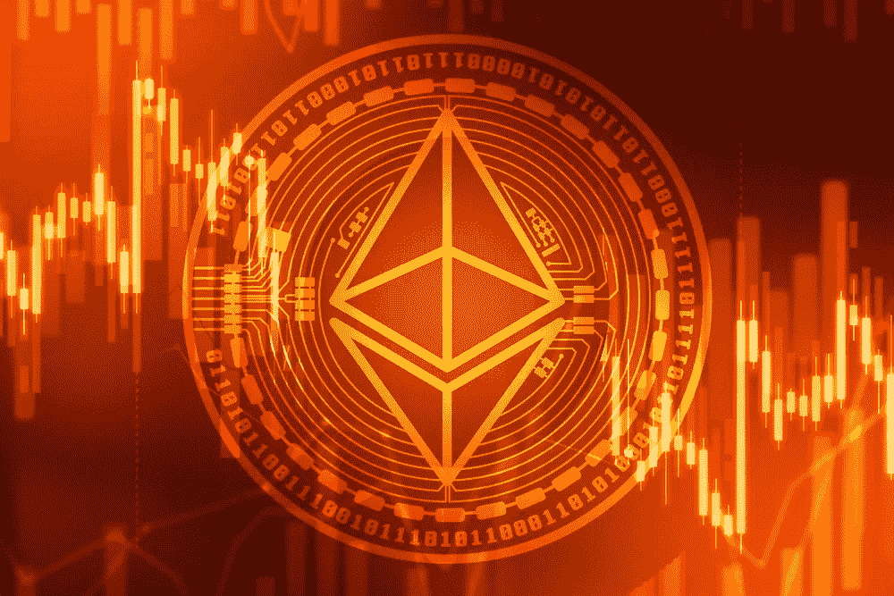

# 以太是否正在成为通货紧缩的加密货币！？

> 原文：<https://medium.com/coinmonks/ether-is-becoming-a-deflationary-cryptocurrency-2d34ab62ff50?source=collection_archive---------0----------------------->

## 以太坊:期待已久的 EIP 1559 发布

期待已久的以太坊网络更新 EIP 1559 现在定于明年 7 月与伦敦 Hardfork 一起进行。这一宣布无疑让大大小小的用户和投资者喜笑颜开。毕竟，以太坊可以随着 EIP 1559 成为通缩资产。