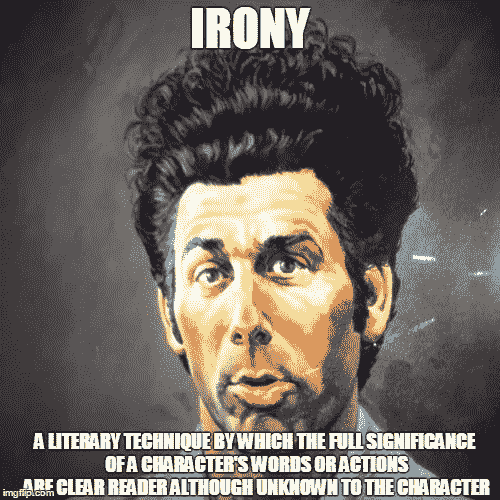
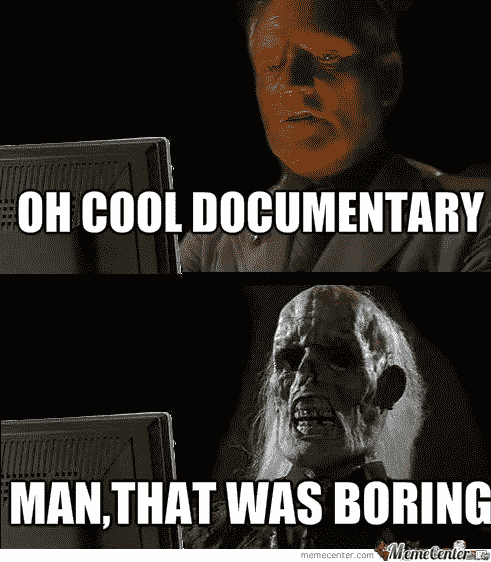

# 以太:是证券吗？

> 原文：<https://medium.com/coinmonks/ether-is-it-a-security-ec91ce01755f?source=collection_archive---------0----------------------->

## 为什么这并不重要。

我不在乎以太或任何努力去中心化的加密货币是否是一种安全。我不在乎，因为如果集中式开发公司正在做他们的工作，如果项目度量趋向于分散化，如果他们已经建立了一个用户和第三方贡献者的社区，那么 SEC 或[在此插入监管者]给它贴上什么标签都无关紧要。

抱歉，让我倒回去。我想我在几周前用“去他妈的”给加密货币与安全的辩论火上浇油了。我正在发微博。”在加密推特的世界里，我称 XRP 是一个安全的地方，因为 Ripple 公司的集中化

These tweets were followed by 2–3 days of general positive reactions then 2 weeks of relentless Ripple trolls.

这些推文是我对 XRP 的公然抽水和集中涟漪共同呈现给网络感到沮丧的直接结果。

Exhibit A — Ripple Co CEO yelling at NYT journalist about an article suggesting weak support for XRP by banks (i.e. not as advertised by Ripple Co).

Exhibit B — Ripple Co attempting to pay (some would say bribe) exchanges into listing XRP.

Exhibit C — Ripple Co execs, “Nothing to see here, Mr. Regulator. This is not an investment promotion event.”

我没有轻率地决定称 XRP 为保安。

我对 XRP 和 2017 年 ICO 热潮的失望可以归结为一个中心原则，即中央加密货币真正代表的是什么——一个开发公司对权力的渴望和对利润的渴望。Ripple Co(60%以上)和类似的代币开发商保留了绝大多数代币供应，这是中央权力机构控制可能的证券并从中获利的最明显的例子。在一个真正分散的项目中，控制利益和技术力量不能与盈利的欲望共存。

我被吸引到加密货币的世界，因为这些项目代表了分散权力的工具，因此，任何人都可以自我授权。这些项目非常非常类似于互联网的原始版本，具有大量的信息分发和点对点连接。今天，互联网主要不是点对点的，但如果使用得当，或者当另一个参与者发起攻击时，如果一个集中的服务提供商站在你这边，基础设施会让自己变得不可阻挡。Telegram 的创始人不顾政府试图关闭 Telegram，努力让 Telegram 继续在俄罗斯运营，就证明了这一点。

显然，我们需要从互联网基础设施中消除对集中式服务提供商的需求，并激励提供商的分布式网络为未来不可阻挡的互联网提供动力。

我们的钱也是如此。我们的钱*和证券*必须势不可挡。集中式加密货币、加密资产和捆绑在这些协议之上的令牌不具备这种不可阻挡的属性。因此，许多最新的 ICO 项目都有被贴上证券标签的风险。这些集中式加密货币面临失败的风险，原因和许多创业公司一样——团队动力和专业知识。这就是为什么早期投资者希望了解开发项目的人；这是评估成功可能性的一个因素。寻求去中心化的比特币和 alts 不再需要任何单一团队，取而代之的是 GitHub 头像、节点和地址字符串的网络。

那么，以太是安全的吗？是中央集权吗？势不可挡吗？

# 以太——不是一件确定的事情。

从实际角度来看，监管者不喜欢追踪不确定的案件。不管 Ripple trolls 会告诉你什么，我实际上在过去与美国证券交易委员会和州监管机构打过交道，如果你有足够的证据和合理的论据，他们不会采取行动。以太坊网络的现状凸显出这不是一个本垒打的案例。虽然许多人认为以太网在预售时是一种证券，但其他人认为以太网网络过于分散，投资者“无法指望仅从推广者或第三方的努力中获利”(即*豪威测试的常见企业元素)。*我认为 XRP 是一种证券，这是基于证券分析需要在发行和发行后进行分析的前提。

上周五，在阅读了 Nathaniel Pomper 关于 VC 为包括 Ether ( [链接](https://www.nytimes.com/2018/04/19/technology/virtual-currency-securities.html))在内的一些加密货币向 SEC 寻求避风港的文章后，我开始写为什么我认为 Ether 在发行时是一种证券，但由于去中心化趋势而不再是一种证券。然后，我就不写了。我停了下来，因为我不再对它感兴趣了(下面会有更多内容)，美国证券交易委员会和 CFTC 的负责人已经确认了我的立场，即安全令牌以后可能会失去安全令牌的地位(美国证券交易委员会声明[和 CFTC 声明](https://coincenter.org/entry/sec-s-clayton-use-of-a-token-can-evolve-toward-or-away-from-being-a-security))。

此外，加密律师 twitter 已经准备好了一场战斗。

## 以太不是一个安全营

[彼得·范·瓦尔肯伯格](https://twitter.com/valkenburgh)在硬币中心—【https://coincenter.org/entry/no-ether-is-not-a-security 

## 以太是一个安全营

普雷斯顿·伯恩——[https://prestonbyrne.com/2018/04/23/on-ethereum-security/](https://prestonbyrne.com/2018/04/23/on-ethereum-security/)

## XRP 是一名保安

我——见上面我所有推文中的链接。如果你敢把它放在谷歌盒子里，还有很多关于这个话题的资源。

## XRP 不是一个安全营

Ripple 的 ***首席市场策略师**** 和美国消费者新闻与商业频道的不可思议的报道—[https://www . CNBC . com/2018/04/12/ripple-says-its-cryptocurrency-xrp-is-not-a-security . html](https://www.cnbc.com/2018/04/12/ripple-says-its-cryptocurrency-xrp-is-not-a-security.html)

**是的，这是显然有偏见的 Ripple 员工的头衔，他被认为是这方面的专家。他的实际工作是根据美国消费者新闻与商业频道的一篇文章(* [*链接*](https://www.cnbc.com/2018/03/08/ripple-hires-bloomberg-tvs-cory-johnson-as-chief-market-strategist.html) *)为 XRP 制定市场策略。具有讽刺意味的是。*

We need more Seinfeld memes.

我认为加密律师真的很喜欢这场辩论，因为我们的法律没有考虑一种技术，可以从证券发行后的等式中删除集中推动者。我之前用我在 XRP 的推文和支持性证据阐述了我的立场，即我将如何分析安全令牌发行后的去中心化。当应用于以太发行后，DAO fork 和以太坊经典的创建是表明控制集中化的最大因素，同时有趣的是，鉴于以太坊基金会不再支持原始链(ETC)，也表明缺乏控制。然而，我认为大多数其他网络指标(贡献、节点、矿工和 ETH 所有权的分布)表明了一种去中心化的趋势。[杰克逊·帕尔默](https://twitter.com/ummjackson)的项目[已经分散化，然而](https://arewedecentralizedyet.com/)是衡量以太坊和其他网络分散化的更好资源之一。如果你对此事有意见，并且认为应该跟踪其他指标，那么[在 GitHub 上贡献](https://github.com/ummjackson/awdy)，因为 Jackson 也开源了它。

## 为什么辩论对我来说很无聊。

以太安全辩论对我来说没有智力刺激，因为安全分析不是非黑即白的。监管是由看着灰色光谱的人执行的。这些人有自己的目的。这些议程被推动这些议程的确定的事情所激励。这就形成了一个执行反馈循环。与以太不同，BitConnect 和 AriseBank 是监管者容易押注的例子。

我对 SEC 的安全分析也不感兴趣，因为我更感兴趣的是让监管变得非常难以执行的技术。是的，我是一名律师，告诉你创造逃避强制执行的技术(*不是法律，因为那不是文字工作的方式*)。虽然有些监管是有道理的，但我倾向于以标准和集体协议的形式来遵守这些基于市场的监管。去中心化的交换、洋葱路由、消息应用的端到端加密和去中心化的浏览器是我们正在做的事情。当战争在看不到水体的地图上肆虐时，这些将为未来的革命提供动力。(*实时观看未来之战* [*此处*](http://map.norsecorp.com/#/) )。

# 那么，我们现在做什么？

## 成功的项目

如果你是一个成功的集中项目(*读作:与一个想要继续建设*的团队一起筹集了最多资金的项目)，你现在应该就……大约……谈判一个解决方案。以下是我对大多数情况的预测:(1)一些内部人士可能会在一段时间内被禁止经营 SEC 监管的实体；(ii)项目将支付足以成为监管机构头条新闻的罚款，但不会损害投资者的利益；㈢一些投资者资金将被退回；以及(iv)这些项目中的一些将把未注册的安全令牌交换为新令牌。这些新令牌将(a)有意避免 SEC 发现的与安全分析相关的特征，或者(b)新令牌将被注册为安全令牌。已注册的安全令牌将具有定期披露、潜在投票或收益权的附加功能。是的，无论如何，这些都是您可能希望从代币预售中获得的功能。

## 不成功的项目

至于不成功的集中项目(*读作:欺诈性项目或没有筹集到大量资金的项目，或团队不想继续建设的项目*)，这些和解谈判也不会进行。随着好律师的钱越来越少，(一)内部人士，*发起人，甚至一些服务提供商*将被禁止进入证券行业；(ii)项目创建者将承认一定数量的违反安全法的行为；以及(iii)资金将返还给投资者。与此同时，欺诈性的集中项目将与 SEC 对抗和/或成为法律的逃犯。这些逃犯将在 2019 年制作成一部无聊的电视纪录片。

Tales from the Crypt was legit scary as a kid. I need to watch me some of that again.

有趣的是，无论是成功的还是不成功的集中化项目，都包括不良行为者和更担心通过白皮书筹集大量资金而不是建立产品和社区来实现去中心化的人。

## 分散的项目

与此同时，有一类完全不同的项目，要么在开始时是安全的，但不再有中央权威，要么从一开始就不拿钱。不可能？没有。和布鲁斯谈谈。他会告诉你关于乌鸦币的一切。

I expected nothing less from a key person behind the Satoshi Roundtable.

SEC 对一个分散化项目的任何行动都将(a)是对法律的错误应用，这可能是由他们试图保护的人引起的(*阅读:现任华尔街类型)*；以及(b)很难执行。强制执行将发生在美元和菲亚特的上下车坡道。超越法令的技术执行几乎是不可能的，因为没有什么比政府官员试图关闭你的互联网项目更能激发创造力了。*看历史，互联网的历史就像你举的例子。*

# /end

***喜欢读什么？*** *想了解更多？你可以付钱给我来回答你所有的问题，或者你可以捐赠给秘鲁的一家非营利性机构*[*Manos Unidas*](http://manosunidasperu.org/)*。我是董事会主席，如果你捐款的话我很乐意和你聊天。我们在年度活动中为我们的最新项目——达里亚咖啡馆——筹集了 25，000 美元，作为有特殊需求的年轻人的工作培训场所。*

 [## Cafe Daria:为有特殊需求的年轻人提供的工作培训网站

### 达里亚咖啡馆是秘鲁库斯科第一个为有特殊需要的年轻人开设的职业培训场所，是一个为…

www.crowdrise.com](https://www.crowdrise.com/o/en/campaign/cafe-daria-job-training-site-for-young-adults-with-special-needs) 

## Manos Unidas 捐赠钱包:

**乙醚**:0x 383 EFD BC 8117 a 678 ACF BD 475312421 b 36fa 13751

**比特币**:3211 ifqvrhjchmmpwb 52 jzwz 2 wf 3 kaler

**比特币现金**:1 lhb 7 V6 mv 7 mdk xeath6h kfcprgnpkybngf

**Zcash** (z 地址可索取):t1 b 7 zgh 7 gknrkjrnca 59 yvbwaiubi 35 r8sf

**莱特币**:mcsq2v 27 fmlmsl 7 qkk w5 v 64 hwgbfqygmru

**破折号**:xpxmyqxgnt 433 aiqbdxijqssbgxxj 6 elaa