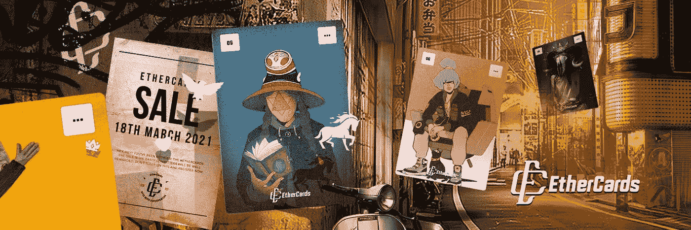

# 以太卡——类固醇上的非甾体抗炎药第 1 部分

> 原文：<https://medium.com/coinmonks/ethercards-nfts-on-steroids-part-1-ad94c8d14f5d?source=collection_archive---------7----------------------->

我倡导 NFTs 已经很长时间了，我已经到达了最后的前沿。在我以前的文章中，我谈到了 NFTs 的未来，讨论了一些令人印象深刻的项目，挖掘了隐藏的宝石，并创建了用户指南。在这两篇文章中，我们将讨论一个前沿的 NFT 项目。这是对非功能性测试“下一步是什么”这个问题的回答。

尽管非金融服务业的基本面依然强劲，但 NFT 市场已经存在泡沫。当前对 NFTs 的大肆宣传是基于几种不同的 NFT 类型:

1.游戏 NFT(如金恩支持的 NFT)

2.数字艺术

3.空投工具(如 NFT 箱)

4.历史意义(如密码朋克)等

尽管如此，还是购买了许多没有任何重要价值的非功能性食物。例如，一件艺术品在以太坊被铸造成一件 NFT，如果同样的艺术品以不同的名字或者在不同的区块链被铸造会发生什么？没有简单的方法来识别这种重复。如果有一个适当的效用，那么这些副本将失去那些效用没有相同的合同，买方会知道吗？NFTs 的新领域和前进方向是组合和集成的实用程序，包括有效地融合物理世界和数字世界。以太卡带来了以前没有尝试过的工具。

## [**以太卡**](https://ether.cards/)

EtherCards 项目正在为艺术家和市场建立一个具有一套工具的平台，以进行不同类型的互动(特别是将艺术货币化和游戏化)。以太卡是控制一些或所有此类交互的一种卡。以太卡拥有者将被赋予随机选择的特性，这将为他们打开用例。让我们探索几个这样的用例:

## ***门票***

创建一个售票系统来销售你的艺术品:例如，你可以通过要求客户购买门票来参与抽奖，而不是为你的艺术品设定一个固定的价格，这样你就可以进一步将销售游戏化，随机抽奖(使用 VRF 链结)将选出一个获胜者。门票的参数(门票数量、价格、预订等)都是可定制的。以太卡将收取 0.1 ETH 的安装费(目前)。

## ***拼图***

艺术家可以用自己的作品创作谜题来吸引粉丝。该平台旨在创建由一组简单规则组成的具有多种设计变化的可定制谜题。

## ***盲袋***

用户可以使用以太卡平台销售盲袋。该平台能够自动创建密封的卡片包。艺术家可以根据牌的稀有程度来定义袋子中出现任何牌的可能性和概率。更便宜的包可能会减少装稀有卡片的机会。

## ***集成***

EtherCards 计划在其他平台上推出其功能。它计划整合 NFT 市场，如 Rarible、OpenSea、Nifty 等。

除了上述功能，EtherCards 计划在未来几天引入许多其他新功能。

## **卡的种类**

以太卡作为独特的数字艺术，具有真正的实用性和价值。在最初的发行中只有 10，000 张卡。这些卡的一些特征将永远不会再被释放。早期预售卡将收到一个特殊的凤凰特质，也将永远不会再次发布。序列号越短，特性越好。以太卡上的序列号越短，您享受的功能就越多。

卡的类型包括:

方正卡

OG 卡

阿尔法卡片

普通卡

所有这些卡片都有独特的特征，这些特征在未来的版本中是找不到的。

在这个 2 部分系列的下一部分，我们将详细讨论卡的类型，并了解它们带来的各种特性和力量。我们还将讨论一下即将到来的公开销售，以及如何获得这些卡片。

**阅读上一篇:** [卡达诺基金 4 概述及主要提案—第一部分](https://tulip311bit.medium.com/cardano-fund-4-overview-and-top-proposals-part-1-5555b5f7f96)

***注:*** *本帖最初发表于* [*此处*](https://www.voice.com/post/@tulip/ethercards-nfts-on-steroids-part-1-1615815083-1445878923) *为与 voice.com 有关联的密码作者。*

**通过我的推荐加入**

[Crypto.com](https://binance.com/en/register?ref=E8PCD3AF)——[币安](https://platinum.crypto.com/r/sut3pd9bzn)

跟我来

**👉** [推特](https://twitter.com/rumadas123)

**👉**[**Linkedin**](https://www.linkedin.com/in/ruma-das-a1439320/)

> **加入 coin monks[Telegram group](https://t.me/joinchat/EPmjKpNYwRMsBI4p)学习加密交易和投资**

## **另外，阅读**

*   **[什么是融资融券交易](https://blog.coincodecap.com/margin-trading)**
*   **最好的[密码交易机器人](/coinmonks/crypto-trading-bot-c2ffce8acb2a) | [网格交易](https://blog.coincodecap.com/grid-trading)**
*   **[3 商业评论](/coinmonks/3commas-review-an-excellent-crypto-trading-bot-2020-1313a58bec92) | [Pionex 评论](/coinmonks/pionex-review-exchange-with-crypto-trading-bot-1e459d0191ea) | [Coinrule 评论](/coinmonks/coinrule-review-2021-a-beginner-friendly-crypto-trading-bot-daf0504848ba)**
*   **[AAX 交易所评论](/coinmonks/aax-exchange-review-2021-67c5ea09330c) | [德里比特评论](/coinmonks/deribit-review-options-fees-apis-and-testnet-2ca16c4bbdb2) | [FTX 交易所评论](/coinmonks/ftx-crypto-exchange-review-53664ac1198f)**
*   **[n ave 零点回顾](/coinmonks/ngrave-zero-review-c465cf8307fc) | [Phemex 回顾](/coinmonks/phemex-review-4cfba0b49e28) | [PrimeXBT 回顾](/coinmonks/primexbt-review-88e0815be858)**
*   **[Bybit Exchange 审查](/coinmonks/bybit-exchange-review-dbd570019b71) | [Bityard 审查](/coinmonks/bityard-review-7d104239be35) | [CoinSpot 审查](https://blog.coincodecap.com/coinspot-review)**
*   **[3 commas vs crypto hopper](/coinmonks/3commas-vs-pionex-vs-cryptohopper-best-crypto-bot-6a98d2baa203)|[赚取加密利息](/coinmonks/earn-crypto-interest-b10b810fdda3)**
*   **最好的比特币[硬件钱包](/coinmonks/the-best-cryptocurrency-hardware-wallets-of-2020-e28b1c124069?source=friends_link&sk=324dd9ff8556ab578d71e7ad7658ad7c) | [BitBox02 回顾](/coinmonks/bitbox02-review-your-swiss-bitcoin-hardware-wallet-c36c88fff29)**
*   **[莱杰 vs n rave](/coinmonks/ledger-vs-ngrave-zero-7e40f0c1d694)|[莱杰 nano s vs x](/coinmonks/ledger-nano-s-vs-x-battery-hardware-price-storage-59a6663fe3b0)**
*   **[密码本交易平台](/coinmonks/top-10-crypto-copy-trading-platforms-for-beginners-d0c37c7d698c)**
*   **[CoinLoan 评论](/coinmonks/coinloan-review-18128b9badc4) | [YouHodler 评论](/coinmonks/youhodler-4-easy-ways-to-make-money-98969b9689f2) | [BlockFi 评论](/coinmonks/blockfi-review-53096053c097)**
*   **最好的[加密税务软件](/coinmonks/best-crypto-tax-tool-for-my-money-72d4b430816b) | [硬币追踪评论](/coinmonks/cointracking-review-a-reliable-cryptocurrency-tax-software-5114e3eb5737)**
*   **最佳[密码借贷平台](/coinmonks/top-5-crypto-lending-platforms-in-2020-that-you-need-to-know-a1b675cec3fa) | [杠杆令牌](/coinmonks/leveraged-token-3f5257808b22)**
*   **[block fi vs Celsius](/coinmonks/blockfi-vs-celsius-vs-hodlnaut-8a1cc8c26630)|[Hodlnaut Review](/coinmonks/hodlnaut-review-best-way-to-hodl-is-to-earn-interest-on-your-bitcoin-6658a8c19edf)**
*   **[Bitsgap 审查](/coinmonks/bitsgap-review-a-crypto-trading-bot-that-makes-easy-money-a5d88a336df2) | [Quadency 审查](/coinmonks/quadency-review-a-crypto-trading-automation-platform-3068eaa374e1) | [Bitbns 审查](/coinmonks/bitbns-review-38256a07e161)**
*   **[埃利帕尔泰坦评论](/coinmonks/ellipal-titan-review-85e9071dd029) | [赛克斯斯通评论](/coinmonks/secux-stone-hardware-wallet-review-15-discount-coupon-2020-7577032faa6e)**
*   **[本地比特币评论](/coinmonks/localbitcoins-review-6cc001c6ed56) | [加密货币储蓄账户](https://blog.coincodecap.com/cryptocurrency-savings-accounts)**
*   **最佳[区块链分析](https://bitquery.io/blog/best-blockchain-analysis-tools-and-software)工具| [赚比特币](/coinmonks/earn-bitcoin-6e8bd3c592d9)**
*   **[加密套利](/coinmonks/crypto-arbitrage-guide-how-to-make-money-as-a-beginner-62bfe5c868f6)指南| [如何做空比特币](/coinmonks/how-to-short-bitcoin-568a2d0b4ae5)**
*   **最佳[加密制图工具](/coinmonks/what-are-the-best-charting-platforms-for-cryptocurrency-trading-85aade584d80) | [最佳加密交易所](/coinmonks/crypto-exchange-dd2f9d6f3769)**
*   **[如何在印度购买比特币？](/coinmonks/buy-bitcoin-in-india-feb50ddfef94) | [WazirX 评论](/coinmonks/wazirx-review-5c811b074f5b)**
*   **[印度比特币交易所](/coinmonks/bitcoin-exchange-in-india-7f1fe79715c9) | [比特币储蓄账户](/coinmonks/bitcoin-savings-account-e65b13f92451)**
*   **[CoinDCX 评论](/coinmonks/coindcx-review-8444db3621a2) | [加密保证金交易交易所](https://blog.coincodecap.com/crypto-margin-trading-exchanges)**

***包含附属链接***

> **[直接在您的收件箱中获得最佳软件交易](/coinmonks/newsletters/coinmonks)**

****