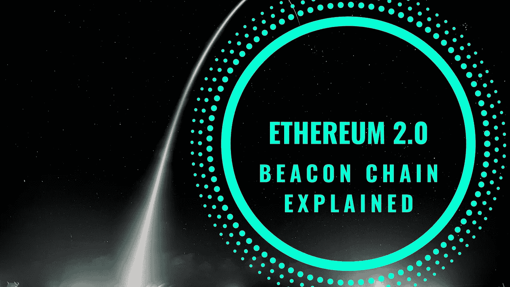
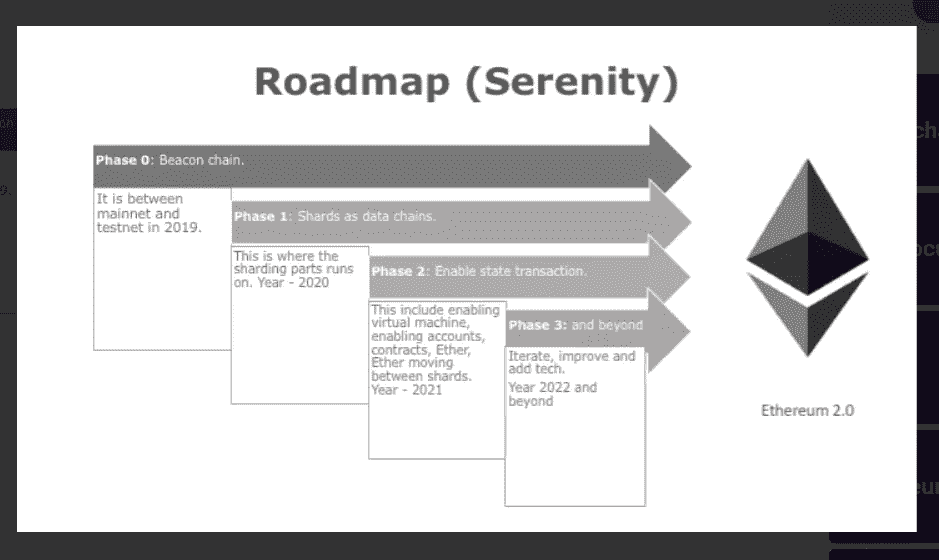

# 以太坊 2.0-信标链解释

> 原文：<https://medium.com/coinmonks/ethereum-2-0-beacon-chain-explained-70287fc9901b?source=collection_archive---------0----------------------->

在我最近关于[以太坊 2.0](/coinmonks/what-to-expect-in-ethereum-2-0-779dfe970642) 的文章中，我已经写了整个以太坊 2.0 系统及其不同阶段的概述。本文将帮助您更详细地了解网络升级过程的第 0 阶段，即[信标链](https://blog.coincodecap.com/ethereum-beacon-chain)及其功能。

以太坊 2.0 正在建设中。Eth 2.0 的主要设计目标之一是降低网络复杂性，如果需要，甚至以效率损失为代价。随着分片和 Casper 的实现，以太坊区块链有望更加稳定。

此次升级将改善以太坊的以下特性，使其达到新的高度:

卡斯帕的利害关系证明:纯粹的 PoS 共识

分片—将可扩展性提高到当前网络的大约 1000 倍。

EWASM-通过 e wasm 快速执行虚拟机

图片[来源](https://etherworld.co/2019/01/04/serenity-the-vision-of-ethereum-2-0/)

## **相位 0 —信标链**

信标链是以太坊 2.0 系统链的核心。它负责管理一致性算法，即针对其自身和所有碎片链的 Casper 利益证明协议。

网络由一组验证者运行。为了成为验证者，节点将其股份发送到当前以太坊区块链上的智能合约中。stake 被锁定，在有效性检查之后，将生成一个包含 ID 的收据，该 ID 指示验证器将被分配到的碎片。一旦他/她的公钥达到 32 ETH 的余额，验证者的状态就升级为活动。当信标链处理来自 Eth 1.0 区块链的存款收据时，验证器被激活。

新的块由每个块的主动验证器提出，并且其他主动验证器必须对其有效性进行投票。证明是信标链上负载的主要来源。证明通常是由验证者的余额支持的验证者的投票。这些是碎片块的可用性投票，同时也是信标块的利害关系证明投票。同一个分片块的足够数量的证明创建了一个链接，将该分片块之前的分片段确认到信标链中。信标链使用这些交叉链接来识别碎片链的更新状态。异步跨片通信也需要这些交叉链接。

信标链正处于开发和测试的最后阶段，但其确切的发布日期仍不确定。

## **信标链的责任**

信标链的主要职责包括:

**管理验证器及其利害关系**——信标链的重要任务之一就是管理网络中运行以太坊 2.0 系统的验证器组。

**在每一步为每一个碎片提名被选中的方块提议者-** 在以太坊 2.0 中，每隔 16 秒就有规律地产生方块，这被称为“槽”。

在每个槽中，为信标链选择的提议者从为前面的块设置的信标链验证器中收集所有证明，并将它们形成一个它发布的块。

**将验证者组织成委员会，对提议的区块进行投票-**

信标链负载依赖于来自其委员会验证器的投票的证明来形成链的历史。Beacon 链还为每个分片随机指定更小的子委员会，负责确认分片的提议者行为正确。

**应用共识规则-** 信标链负责管理自身和所有碎片链的利益证明协议。

**对验证者实施奖励和惩罚**——信标链还负责监控验证者的行为。奖励给验证者，作为保持良好行为的激励。类似地，任何恶意活动，如不可用、不正确履行其职责或发布关于链的冲突信息，都会导致罚款(削减),其中他们在 32 Ether 的一些存款资产会被扣除，或者在最坏的情况下，根据其他因素，会被扔出系统。

如果一个验证者的存款低于 16 以太，他将被踢出验证者集合。

**作为一个锚点，碎片在其上注册它们的状态，以便于跨碎片事务-****每个碎片的当前状态(“组合数据根”)作为一个交叉链接被记录在信标链块中。当信标链块完成时，相应的分片块被认为完成。其他碎片可以依赖它进行跨碎片事务。**

****随机性规定****

**为了维护区块链分片时的安全性，信标链从分配给每个分片块的验证器委员会中执行随机洗牌。该过程防止系统受到任何攻击或被单个不良行为者控制。**

## **网络会是什么样子？**

**在阶段 0 期间，Eth1 链将照常工作。0 期完成后，将有两条活跃的以太坊链。**

**Eth1 链，即当前电源主链。**

**Eth2 链新信标链**

**以太坊 1.0 链有望成为以太坊 2.0 上的第一个碎片链。在此之前，以太坊 1.0 链将继续按照现在运行的方式运行。但预计会进行一定的改进，将其作为以太坊 2.0 碎片嵌入。**

**资源:[https://docs . eth hub . io/ether eum-roadmap/ether eum-2.0/eth-2.0-phases/#简介](https://docs.ethhub.io/ethereum-roadmap/ethereum-2.0/eth-2.0-phases/#introduction)https://ethos.dev/beacon-chain/**

## **另外，阅读**

*   **[最佳加密交易机器人](/coinmonks/whats-the-best-crypto-trading-bot-in-2020-top-8-bitcoin-trading-bot-c16adeb13317)**
*   **[Deribit 审查](/coinmonks/deribit-review-options-fees-apis-and-testnet-2ca16c4bbdb2) |选项、费用、API 和 Testnet**
*   **[FTX 密码交易所评论](/coinmonks/ftx-crypto-exchange-review-53664ac1198f)**
*   **最好的比特币[硬件钱包](/coinmonks/the-best-cryptocurrency-hardware-wallets-of-2020-e28b1c124069?source=friends_link&sk=324dd9ff8556ab578d71e7ad7658ad7c)**
*   **[密码本交易平台](/coinmonks/top-10-crypto-copy-trading-platforms-for-beginners-d0c37c7d698c)**
*   **最好的[加密税务软件](/coinmonks/best-crypto-tax-tool-for-my-money-72d4b430816b)**
*   **[最佳加密交易平台](/coinmonks/the-best-crypto-trading-platforms-in-2020-the-definitive-guide-updated-c72f8b874555)**
*   **最佳[加密贷款平台](/coinmonks/top-5-crypto-lending-platforms-in-2020-that-you-need-to-know-a1b675cec3fa)**
*   **[莱杰纳米 S vs 特雷佐 one vs 特雷佐 T vs 莱杰纳米 X](https://blog.coincodecap.com/ledger-nano-s-vs-trezor-one-ledger-nano-x-trezor-t)**
*   **[block fi vs Celsius](/coinmonks/blockfi-vs-celsius-vs-hodlnaut-8a1cc8c26630)vs Hodlnaut**
*   **Bitsgap 评论——一个轻松赚钱的加密交易机器人**
*   **为专业人士设计的加密交易机器人**
*   **[PrimeXBT 审查](/coinmonks/primexbt-review-88e0815be858) |杠杆交易、费用和交易**
*   **HaasOnline 评论享受九折优惠**
*   **Bitmex 保证金交易的白痴指南**
*   **[eToro 评论](/coinmonks/etoro-review-78807ddeb33c) |交易股票、密码、交易所交易基金、差价合约和商品**
*   **[区块链评论](/coinmonks/blockfi-review-53096053c097) |从您的密码中赚取高达 8.6%的利息**
*   **开发人员的最佳加密 API**
*   **[最佳区块链分析工具](https://bitquery.io/blog/best-blockchain-analysis-tools-and-software)**
*   **[加密套利](/coinmonks/crypto-arbitrage-guide-how-to-make-money-as-a-beginner-62bfe5c868f6)指南:新手如何赚钱**
*   **顶级[比特币节点](https://blog.coincodecap.com/bitcoin-node-solutions)提供商**
*   **最佳[加密制图工具](/coinmonks/what-are-the-best-charting-platforms-for-cryptocurrency-trading-85aade584d80)**
*   **了解比特币的[最佳书籍有哪些？](/coinmonks/what-are-the-best-books-to-learn-bitcoin-409aeb9aff4b)**

> **[直接在您的收件箱中获得最佳软件交易](/coinmonks/newsletters/coinmonks)**

****