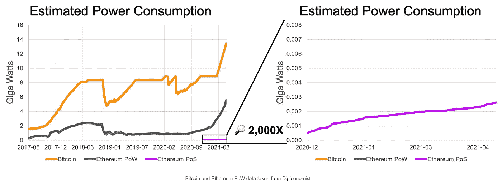
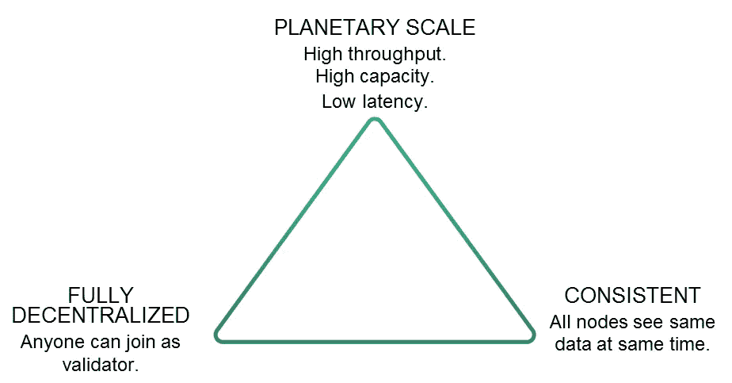

# 以太坊 2.0

> 原文：<https://medium.com/coinmonks/ethereum-2-0-c7175646a0b3?source=collection_archive---------4----------------------->

以太坊 2.0 是以太坊网络的升级版，它提高了网络的速度、效率和可扩展性，同时保持了安全性和分散性。升级对以太坊非常重要，将包括多个阶段，三个主要阶段是:

*   阶段 0——信标链的部署和标桩。
*   阶段 1 —信标链和 Mainnet 之间的合并。
*   第 2 阶段—分片框架。

ETH 2.0 给网络带来的主要变化是:

*   碎片——以太坊将被分成 64 个同时运行的“碎片”。这将大大提高效率。
*   利益相关——从工作证明到利益相关证明对共识协议进行全面检查。

# **以太坊目前的局限性**

以太坊目前采用[工作证明(“PoW”)](https://ethereum.org/en/developers/docs/consensus-mechanisms/pow/)共识。以太坊 2.0 的动机源于当前网络的局限性。

## **高昂的启动成本**

工作证明的经济问题是进入壁垒高。实际上，除非用户加入采矿池，否则电力成本、盈利开采以太坊所需的硬件初始成本都很高。

## **功耗**

据估计[以太坊每年使用 57.01 TWh](https://digiconomist.net/ethereum-energy-consumption/)(在撰写本文时)，这相当于乌兹别克斯坦的电力消耗，使其在环境上不可持续。

## **集中化风险**

较高的启动成本还会导致矿商加入矿池，或导致大型矿商占主导地位的规模经济。这导致了矿工的集中化，抵消了电力系统提供的一些保障。

## **缩放限制**

此外，PoW 更难缩放，因为处理能力受到每个块被顺序挖掘的事实的限制，并且对块大小有有限的限制。如果未决事务的数量超过块大小限制，任何剩余的事务都将排队等待下一个块。以太坊网络目前每秒只能处理大约 15 个交易，考虑到网络不断增长的需求，这实在是太少了。

## **用户成本**

由可扩展性问题引起的网络拥塞的含义是，网络上的运营成本增加了，并且转嫁到了用户身上。

# **以太坊 2.0 上的 Stake 过程证明**

股权证明用验证器和股权取代了矿工和电力。验证者取代了矿工，成为维护网络状态的个体。在以太坊 2.0 上，验证者需要承诺 32 ETH 作为其意图的合法性进入[官方存款契约](https://docs.ethhub.io/ethereum-roadmap/ethereum-2.0/deposit-contract/)。

## **PoS 如何在以太坊上工作**

1.  可以在每个时间段创建块，持续 12 秒。
2.  网络随机选择一个验证者作为每个时隙的提议者。
3.  如果分配的验证器错过了提议阻塞的机会，网络将没有该时隙的阻塞，并前进到下一个时隙。
4.  在每个时间段，验证者将轮流提交证明(为主链投票)。
5.  投票决定每个时段的块(一个时段是 6.4 分钟，由 32 个时隙组成)。
6.  每个验证器在每个时期提交一次它们的证明。
7.  终结需要至少 2 个纪元(≈ 12.8 分钟)。
8.  验证器也将互相监视恶意行为。
9.  如果他们观察到另一个验证者在同一个槽中提出两个块，或者提交与他们自己相矛盾的证明投票，他们就可以警告网络。
10.  该网络将奖励举报者，并将严惩违法者。
11.  奖励、惩罚和砍杀在每个时期都会被处理。通货膨胀的奖励是当验证者进行工作的时候。正确提交证明并在提议阻止时包括其他验证者证明，会产生 2%到 22%的验证者赌注回报，具体取决于整个网络的赌注。
12.  如果验证者未能保持在线并执行他们的计算责任份额，他们的块奖励将适度减少(他们离线的每个时期损失 67K Gwei ),以激励验证者尽可能一致地保持在线。处罚金额被故意设置得很低，以便具有低连通性的诚实验证者仍然可以获得正的赌注回报。

# **优于 PoW**

## **更具经济可行性**

PoW 不需要在昂贵的显卡和采矿设备上投资，在 PoW 中，矿工通过燃烧电力消耗物理能量(称为哈希功率)来确认区块，而用于下注的硬件更便宜，寻求赎回投资的验证者可以撤回他们的赌注，这更具流动性，并出售采矿设备。

## **网络安全**

针对恶意行为者的经济激励在 PoS 网络上更强。在 PoW 中，攻击失败的经济风险等于电力和借来的计算能力的成本，而在 PoS 中，发起攻击的成本等于赌注的金额。如果验证者试图发起攻击来危害网络，他们的 32 个标记将被切断(移除并烧毁)。

严厉的处罚包括在同一个时间段提出两个提案或者提交相互矛盾的证明投票。在大量 ETH 被盗的成功攻击的情况下，网络受到危害，ETH 的价值可能下降，使得攻击在经济上不太成功。一旦验证者被削减，验证者的 ETH 余额将在每个时期减少，直到它们脱离活动集。被削减的验证器将会看到他们的 ETH 余额一次减少 3%到 10%,这取决于赌注比率和在相似的时间框架内有多少验证器被削减。

通过要求最少 16，384 个活动验证器节点(在启动信标链之前大约有 8，000 个节点)，通过更高级别的分散化也提高了安全性。

## **进入门槛低**

公司还为那些选择不运行自己的验证器节点的客户提供堆栈服务。像矿池一样，希望下注少于 32ETH 的个人可以加入赌注池，在那里他们的资金与其他人一起达到所需的 32 ETH。他们的报酬与总贡献成正比。

## **降低能耗**

在证明利害关系时，需要不那么复杂的密码方程，因为它不依赖于电力和计算设备的成本来阻止潜在的攻击，而是依赖于直接的经济激励。因此，在股权证明网络中，每次交易的能量消耗明显较低。根据 R&D 联邦理工学院的研究，几乎低了 99.9%

Credit: [https://blog.ethereum.org/2021/05/18/country-power-no-more/](https://blog.ethereum.org/2021/05/18/country-power-no-more/)

# **分片**

可伸缩性的提高来自一种叫做分片的横向处理技术。分片是水平分割数据库以分散负载的过程，并试图解决区块链系统面临的三重困境:

Credit: [https://docs.ethhub.io/ethereum-roadmap/ethereum-2.0/sharding/](https://docs.ethhub.io/ethereum-roadmap/ethereum-2.0/sharding/)

在当前的区块链中，在每次交易之后，网络的整体必须经过所有参与节点的验证，因此处理速度受到最慢的参与者的速度的限制。这造成了一个瓶颈，增加了交易成本，并需要更多的计算能力和存储。

通过分片，网络将状态和历史的验证分成更小的部分(分片),节点专注于验证接收到的数据的子集(分片),而不是整个区块链，从而无需存储整个以太坊区块链。这种并行处理过程优化了网络的整体处理和存储能力，从而大大提高了网络的整体处理和存储能力。任何人都可以运行能够分片的节点，并且硬件要求低于运行完整节点的要求，从而提高了网络参与度。分片将继续保持网络去中心化。

像当前的系统一样，验证者的严格程度之间仍然会有一个分离。

# **阶段**

Eth2 将分阶段推出，第 0 阶段已于 2020 年 12 月 1 日推出。

## **第 0 阶段**

*   阶段 0 是信标链的启动，它将实现利益相关共识机制的证明， [Casper](https://www.gemini.com/cryptopedia/glossary#casper) 。
*   信标链协调验证器的注册。
*   随着 Phase 0 的推出，出现了一个新的令牌 ETH2。
*   以太坊的用户将能够通过在当前钱包中刻录 ETH 的注册合同，以 1:1 的比例转换为 ETH2。
*   给用户一个取款密钥和一个验证密钥。
*   32 ETH2 需要被标记为信标链上的验证器。
*   ETH 2.0 有一个期限，用户在第一阶段之前不能撤销它。
*   Beacon 链目前不处理账户、交易、存储或智能合同。
*   目前，一个独立的网络与当前的以太坊系统并行运行，确保数据连续性不会中断。
*   在第 1 阶段之前，不支持帐户或智能合同。

最终，信标链将与遗留以太坊链合并，成为以太坊网络的主要结算层，并协调碎片链。

## **第一阶段**

*   创建了信标链和传统以太坊这两种环境之间的桥梁。
*   以太坊 1.0 mainnet shard 将向信标链提供以太坊的历史和当前状态。
*   在此期间，dApps 将开始建造信标链。

最终，侧链将完全发挥作用。

## **第二阶段**

*   阶段 2 将实现由信标链控制的碎片链。
*   预计第二阶段将运行 64 个碎片。
*   以太坊 1.0 区块链将成为 64 个碎片链中的一个，所有碎片链都将使用新的以太坊 PoS 协议运行。
*   eWASM 将增加生态系统的潜在程序员数量，允许程序员从几种语言中选择来编写区块链代码，而无需学习纯以太坊语言。