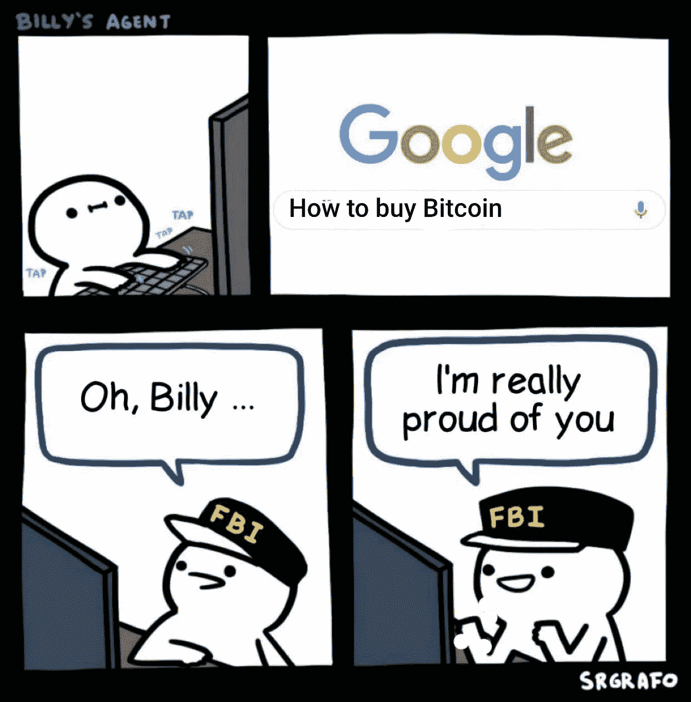
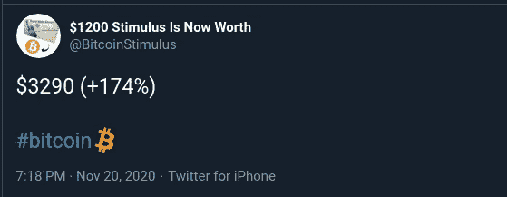
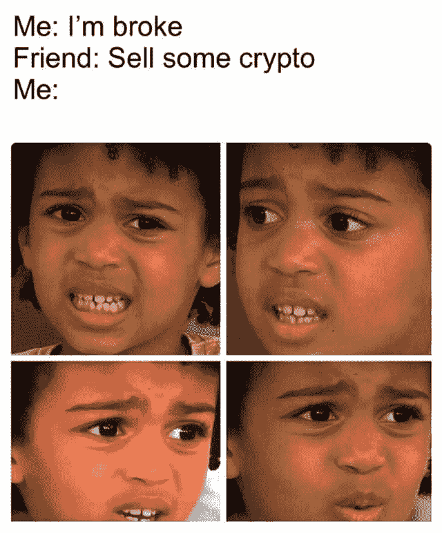
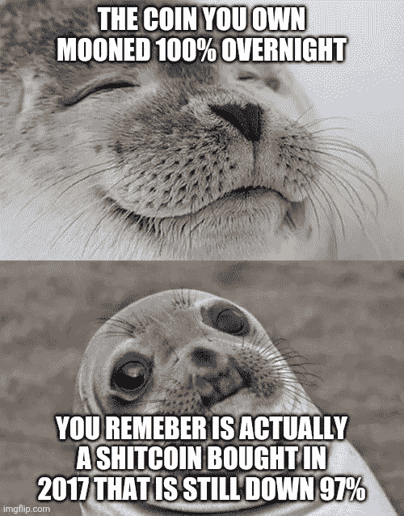
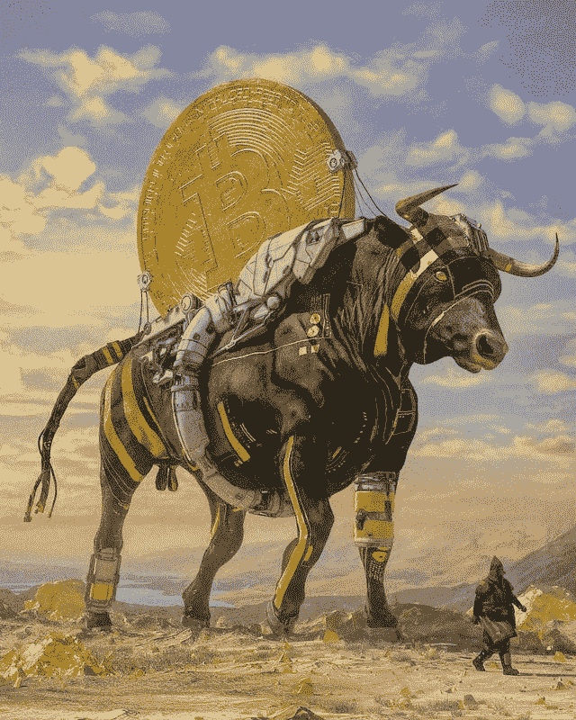

# 以太坊 2.0 存款合同确保有足够的资金启动|美国将利用 USDC 实现其在委内瑞拉的外交政策目标

> 原文：<https://medium.com/coinmonks/ethereum-2-0-cc3462af6a9f?source=collection_archive---------7----------------------->

[Source](https://www.reddit.com/r/CryptoCurrency/comments/jy1ier/wholesome_fbi/)

## 比特币逼近 2 万美元|硬件钱包的黑色星期五交易

*   我知道比特币再次逼近历史高点，大家都在唱比特币的歌。然而，永远记住，“什么上去，就下来。”因此，请**不要投资/交易超过你所能承受的**。
*   11 月初发布的[以太坊 2.0 存款合同](https://etherscan.io/address/0x00000000219ab540356cbb839cbe05303d7705fa)在周一晚些时候已经累积了超过 540，000 ETH(价值超过 3.25 亿美元)，确保以太坊 2.0 的信标链将在下周推出。
*   本组织与委内瑞拉玻利瓦尔共和国和 Airtm 合作，利用 USDC 向委内瑞拉人提供援助
*   Reddit [上的一名用户发布了](https://www.reddit.com/r/Bitcoin/comments/jrxgj8/bitcoin_core_node_hacked/)关于使用 AWS 图像后损失资金的帖子，该图像带有一个已经安装并同步到最近一个区块的比特币完整节点。虽然在帖子中没有完全确定损失的来源，但有人提出，虚拟机映像或其他精选的软件集合，特别是那些为比特币或其他加密货币设计的软件，提供了一种有效的机制，可以将后门软件传递到有价值的服务器。这提醒您应该只安装来源可靠的软件。
*   [Brink](https://brink.dev/) 正在为其[伙伴计划](https://brink.dev/programs#fellowships)和[资助计划](https://brink.dev/programs#grants)寻找申请人，前者用于帮助新的贡献者进入全职比特币开发领域，后者用于资助已有贡献者。

> 当人们破产时，他们努力工作重新获得收入。当政府破产时，他们只是印更多的钱。

## 黑色星期五硬件钱包交易

*   购买[n rave 硬件钱包](https://blog.coincodecap.com/go/ngrave)可享受 30%的折扣。
*   使用**黑色星期五 20** 优惠券代码，在[分类帐商店](https://shop.ledger.com/pages/black-friday?r=da6d9b98e517)享受八折优惠。
*   使用**黑色星期五 2020** 优惠券代码在 [Trezor 商店](https://shop.trezor.io/?offer_id=10&aff_id=5199)享受八折优惠。
*   [Bitbox](https://shiftcrypto.shop/?ref=NGR4VOALV3) 产品九折优惠

## [霍德瑙特](https://app.hodlnaut.com/signup?r=ZGmxQQFoe)

试试 [Hodlnaut](https://app.hodlnaut.com/signup?r=ZGmxQQFoe) ，去 **Hodl** 的最好方法就是赚取你的比特币的利息。阅读我们对 Hodlnaut 的[综合评论。也请查看我们的](/coinmonks/hodlnaut-review-best-way-to-hodl-is-to-earn-interest-on-your-bitcoin-6658a8c19edf)[最佳加密贷款平台](/coinmonks/top-5-crypto-lending-platforms-in-2020-that-you-need-to-know-a1b675cec3fa)列表。

If you had put $1200 Stimulus check in Bitcoin

## 最新消息📰

*   [PayPal 首席执行官](https://cryptopotato.com/paypal-ceo-28-million-merchants-will-be-able-to-use-cryptocurrency-for-transactions-in-2021/):2021 年将有 2800 万商家能够使用加密货币进行交易
*   [暴涨的比特币](https://www.bloomberg.com/news/articles/2020-11-18/rocketing-bitcoin-stakes-its-claim-as-pandemic-refuge-for-brave)赌注声称是勇敢者的疫情避难所
*   软银首席执行官[在“过于分心”后，以 1 . 3 亿美元的损失出售了比特币](https://cryptoslate.com/softbank-ceo-sold-bitcoin-at-a-130m-loss-after-getting-too-distracted/)
*   以太坊 2.0 存款合同[保证足够的资金](https://www.coindesk.com/eth-2-0-deposit-contract-secures-enough-funds-to-launch)来启动
*   DeFi 协议 Pickle 金融令牌在遭受 1970 万美元的黑客攻击后损失了将近一半的价值，现在 Pickle 被合并了，渴望金融
*   BitMEX 创始人的[指控](https://www.coindesk.com/bitmex-risks-for-defi)凸显 DeFi 风险
*   拜登将任命前美联储主席珍妮特·耶伦为财政部长
*   Tor 开发者寻求“匿名令牌”来阻止黑客和 DoS 攻击
*   出于监管考虑，比特币基地将[停止融资融券服务](https://www.theblockcrypto.com/linked/85659/coinbase-discontinue-margin-regulation)
*   密码朋克、加密无政府状态以及比特币如何失去叙事
*   美国国税局错误地向比特币基地用户发出警告通知
*   戴尔拥有的 [VMware](https://www.theblockcrypto.com/linked/85175/dell-vmware-blockchain-enterprises) 推出面向企业的区块链平台
*   币安起诉福布斯诽谤“太极”文件泄露
*   大多数比特币 [Hashrate](https://www.coindesk.com/bitcoin-miners-taproot-schnorr-support) 信号支持主根缩放，隐私升级
*   火币[推出由 1000 万美元基金支持的](https://www.theblockcrypto.com/linked/85629/huobi-filecoin-incubator-fund-launch) Filecoin 孵化器
*   日本顶级银行、[公司](https://www.theblockcrypto.com/linked/85168/japan-banks-companies-private-digital-currency)明年将测试私人数字货币
*   英格兰银行首席经济学家:数字货币可能减轻负利率的必要性
*   GoDaddy [员工利用](https://krebsonsecurity.com/2020/11/godaddy-employees-used-in-attacks-on-multiple-cryptocurrency-services/)攻击多个加密货币服务
*   [Circle 与委内瑞拉玻利瓦尔共和国和 Airtm 合作，通过 USDC 向委内瑞拉人提供援助](https://www.circle.com/blog/circle-partners-with-bolivarian-republic-of-venezuela-and-airtm-to-deliver-aid-to-venezuelans-using-usdc)

> *报税季即将到来，使用最好的* [***加密报税软件***](/coinmonks/best-crypto-tax-tool-for-my-money-72d4b430816b) *来申报你的加密报税吧。*

[**Not Yet**](https://www.reddit.com/r/CryptoCurrency/comments/jy3ggc/not_yet/)

> 想练习交易吗？试试 [**交易馆**](https://tradinggym.app/) ，免费的。

## 好的读物📑

*   定义[堆栈](https://multicoin.capital/2020/11/24/the-defi-stack/)
*   比特币[短缺](https://panteracapital.medium.com/bitcoin-shortage-172a9205dc0)
*   关于密码，性工作者需要知道什么
*   [泡菜金融](https://rekt.ghost.io/pickle-finance-rekt/) — REKT
*   我是如何学会[不再担心](https://www.coincenter.org/how-i-learned-to-stop-worrying-and-love-unhosted-wallets/)并爱上无人保管的钱包的
*   [Covid 时代的现金](https://www.bankofengland.co.uk/quarterly-bulletin/2020/2020-q4/cash-in-the-time-of-covid)
*   开放金融比破产金融更好
*   比特币是最大的空头
*   10 万美元比特币的完整[案例](https://www.coindesk.com/complete-case-for-100k-bitcoin)
*   虚拟合成器以及在哪里可以找到它们
*   《吸血鬼日记》——SushiSwap 案例研究
*   为什么 Uniswap 在一天之内损失了 50%的流动性？
*   国际货币基金组织关于 CBDC 法律的新论文的简要(关键)线索
*   我们的网络:关于握手、波尔卡多特、Celo 和 Kadena 的报道。

> *买一个* [***硬件钱包***](/coinmonks/the-best-cryptocurrency-hardware-wallets-of-2020-e28b1c124069)*[*保护你的加密货币*](/coinmonks/how-to-prevent-cryptocurrency-hacking-and-theft-from-your-wallet-65c8ff767766) *。**

**

*[source](https://www.reddit.com/r/CryptoCurrency/comments/jy4xq9/thats_how_life_is/)*

*本周五，我将代表 Bitquery 参加 Bharat 虚拟研讨会的 [**Build，因此，如果您想了解如何从币安智能链获取数据。**](https://www.binance.com/en/blog/421499824684901115/Build-for-Bharat--House-of-Workshops-feat-Google-Marlin-Band-and-ANKR?utm_campaign=Bitquery%27s%20Newsletter&utm_medium=email&utm_source=Revue%20newsletter) **[**报名**](https://www.airmeet.com/e/0f97f7e0-11e6-11eb-9180-f75161baafe2?utm_campaign=Bitquery%27s%20Newsletter&utm_medium=email&utm_source=Revue%20newsletter) 参加工作坊。***

## *开发商*

*   *[去中心化以太网的未来](https://soliditydeveloper.com/decentralized-etherscan)*
*   *[通过添加一些 TEA，将 IPFS(文件系统)](https://pushbar.medium.com/turn-ipfs-file-system-into-new-ipfs-function-as-a-service-by-adding-some-tea-ec1d97ce59e6)变成新 IPFS(作为服务的功能)*
*   *使用 [RedwoodJS](/coinmonks/using-redwoodjs-to-create-an-ethereum-app-8c385815b717) 创建以太坊应用*
*   *Taquito 批处理 [API 教程](https://observablehq.com/@bitquery/dex-analytics-using-graphql)*
*   *以太坊 JavaScript 库: [web3.js vs. ethers.js](https://blog.infura.io/ethereum-javascript-libraries-web3-js-vs-ethers-js-part-ii)*
*   *如何[在 IPFS 上存储经过签名](https://blog.ceramic.network/how-to-store-signed-and-encrypted-data-on-ipfs/)和加密的数据。*
*   *[如何入股 32 ETH](/coinmonks/how-to-stake-32-eth-the-best-practices-eth2-staking-e35dd0de1ff2) ？—最佳实践(ETH2 打桩)*
*   *Flashbots :引领 MEV 危机*
*   *[使用 GraphQL 的指数分析](https://observablehq.com/@bitquery/dex-analytics-using-graphql)*
*   *为什么股权证明[用了 6 年](https://twitter.com/technocrypto/status/1330150369335316480)？*
*   *88 英里/小时*
*   *[OpenZeppelin](https://forum.openzeppelin.com/t/first-release-of-openzeppelin-contracts-upgradeable/4548) 合同可升级*
*   *令牌[交互](https://consensys.net/diligence/blog/2020/11/token-interaction-checklist/)清单*
*   *[离线仪表盘](https://bitquery.io/blog/offline-dashboards) —仅客户端区块链数据可视化和工具*
*   *[数据联盟](https://blog.streamr.network/data-union-concept-ideas/)概念构想*
*   *账号[抽象](https://our.status.im/account-abstraction-eip-2938/) (EIP-2938):为什么&什么*
*   *一年[以太坊开发者经验](/nomic-labs-blog/nomic-labs-devx-1-year-working-on-ethereum-developer-experience-66ed0a43bbed)*
*   *[Solidity v0.7.5](https://blog.soliditylang.org/2020/11/18/solidity-0.7.5-release-announcement/) 增加了选择 ABI 编码器的能力*
*   *在 Scaffold-Eth 轻松制造一个开放式的 Zeppelin ERC20*
*   *一种新的 EVM 兼容语言*
*   *[该死的易受攻击定义](/@iphelix/damn-vulnerable-defi-setup-and-challenge-1-walkthrough-1ea16ea09709) —设置和挑战#1 演练*

> *想成为一名以太网和 **Web3 开发者**？[从这里开始](http://blog.coincodecap.com/go/learn)。*

**

*[Source](https://www.reddit.com/r/Bitcoin/comments/jzgyqu/bitcoin_trading/)*

## *多方面的*

*   *[Autoloop](https://lightning.engineering/posts/2020-11-24-autoloop/) :闪电流动性你可以设置后一劳永逸！*
*   *[Bitquery IDE](https://gitcoin.co/grants/1568/graphql-ide-for-blockchain-data-exploration) :查询区块链数据的通用 IDE*
*   *谁在[支持主根](https://taprootactivation.com/)？*

## *播客和视频💽*

*   *[joo leitao 谈论扩展拓扑管理和八卦](https://www.youtube.com/watch?v=jheTqE-aEe0&list=PLhuBigpl7lqu6xWpiXtbEzJQtlMH1tqoG&index=1)*
*   *从开始到今天*
*   *[灰度:10B 桥到加密|迈克尔·索南斯坦](http://podcast.banklesshq.com/grayscale-building-the-bridge-to-crypto)*
*   *[海洋协议](https://epicenter.tv/episodes/366) —数据产业的兴风作浪平台*
*   *快速贷款和攻击— [解释](https://www.youtube.com/watch?v=0Q1_95J10XI&feature=youtu.be)*

## *黑客马拉松、活动和峰会*

*   *[你好世界！由波尔卡多特](https://polkadot.network/hello-world-by-polkadot-take-the-challenge/)*
*   *以太坊的一个月*
*   *Eth2 [赌注](https://ethereum.org/en/eth2/get-involved/staking-community-grants/#requirements)社区赠款*

## *加密交易和折扣🔖*

*   *当你加入[***Mudrex***](https://mudrex.com/signup?referral_code=COIN3566)时，获得 25 美元的信用点数，你可以用这些信用点数来支付费用*
*   **在*[***Botsfolio***](/coinmonks/botsfolio.com/?coupon=gaure27)*使用此* [*链接*](/coinmonks/botsfolio.com/?coupon=gaure27) *。**
*   **试用*[***Altrady***](https://app.altrady.com/?a=COINMONKS)*并使用优惠券代码****coin monks***获得 40%的折扣*

## *产品评论和其他加密软件📙*

*   *[block fi vs Celsius](/coinmonks/blockfi-vs-celsius-vs-hodlnaut-8a1cc8c26630)vs Hodlnaut*
*   *2020 年五大[密码借贷平台](https://blog.coincodecap.com/top-5-crypto-lending-platforms)*
*   *2020 年最佳加密交易机器人*
*   *[莱杰 vs 特雷佐](/coinmonks/ledger-nano-s-vs-x-battery-hardware-price-storage-59a6663fe3b0)*
*   *[n 零复习](/coinmonks/ngrave-zero-review-c465cf8307fc)*
*   *[PrimeXBT 审查](/coinmonks/primexbt-review-88e0815be858) —杠杆交易、费用和交易*
*   *[FTX 密码交易所评论](/coinmonks/ftx-crypto-exchange-review-53664ac1198f)*
*   *[Deribit 审查](/coinmonks/deribit-review-options-fees-apis-and-testnet-2ca16c4bbdb2) —选项、费用、API 和测试网*
*   *[YouHodler 评论](/coinmonks/youhodler-4-easy-ways-to-make-money-98969b9689f2)——从你的密码中赚取 12%的利息*
*   *[eToro 评论](/coinmonks/etoro-review-78807ddeb33c) —在美国购买比特币*

*想让我们展示你的产品吗？请通过 Twitter @coinmonks 联系我们*

## *照片说明了一切📷*

**

*[Source](https://www.reddit.com/r/Bitcoin/comments/jxrbf8/bull_run_beeple_artist/)*

## *乔布斯👷*

*   *Nexus Mutual: [在欧洲时区经历了稳健发展](https://angel.co/company/nexus-mutual-1/jobs/967538-smart-contract-engineer)*
*   *Celer 雇佣可靠性和 Go devs。电子邮件:hiring@celer.network*
*   *0x 找[抹茶营销经理](https://boards.greenhouse.io/0x/jobs/4923909002)和[各种口味的开发商](https://0x.org/about/jobs)*
*   *加入 Chainlink Labs 成为[开发者拥护者](https://jobs.lever.co/chainlink/b5cfde5c-4a1f-42dd-869f-87bd1010fb4e?lever-origin=applied&lever-source%5B%5D=Week%20in%20Ethereum)*
*   *比特之路正在招聘[密码分析师](https://jobs.lever.co/trailofbits/56af8506-3205-4c7b-b28d-ba8292bd1a47) & [区块链安全发展部](https://jobs.lever.co/trailofbits/4f459855-3299-462f-9e73-299a840d5baf)*

## *在 Coinmonks 上发布*

*如果你喜欢在 crypto/区块链空间上写教育文章，并且想在 Coinmonks 出版物上发表。就在**【gaurav@coincodecap.com】***给我发邮件或者 DM 我**[***推特***](https://twitter.com/coinmonks)**