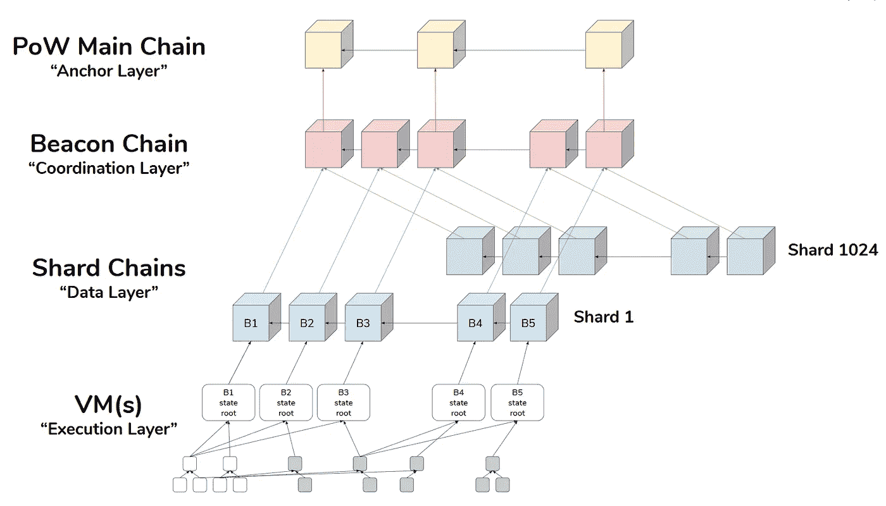

# 虚拟以太坊 2.0—第 1 部分:为什么要升级？

> 原文：<https://medium.com/coinmonks/ethereum-2-0-for-dummies-part-1-why-upgrade-112d8f5b6d88?source=collection_archive---------3----------------------->

# **简介**

如果你参与或一直关注以太网空间，你可能已经听到了很多关于**以太坊 2.0** ，被称为**宁静**的传言(如果你没有，那也没关系——这就是这篇文章的目的)。你可能听说过关于“跑马圈地”和“分块”的片段，以及一大串术语，像我一样，你可能理解其要点，但很难协调所有这些。即使在像加密这样(相对)新的领域，也有如此多的信息要压缩，如此多的噪音要过滤。如果你和我一样，你想要一些全面且容易理解的东西，让你达到那种精神状态。当你拔自己的头发或喝掉你室友的啤酒以免发疯时，不去阅读散布在互联网上的零碎信息。对你来说幸运的是，为了把以太坊宁静升级的许多方面拼凑成一个有凝聚力的总结，我已经拔了一吨头发，并在冰箱里完成了 18 包(让我室友沮丧的是)。

Me writing this article at 2am

在这篇文章中，我们从一个高层次的角度来探索以太坊 2.0 的过渡，在必要的时候深入到杂草中，以帮助完全理解或内化重要的概念。有些材料可能会变得相当枯燥，即使对于像我这样的密码爱好者来说也是如此，所以我会尽我所能不要让你陷入术语和懒惰交付的泥沼。(*我把这篇文章分成了两个系列)。*我将为某些完全需要自己检查的部分提供链接，或者简单地为您提供链接，如果您愿意的话，您可以不看一眼就跳进自己的兔子洞(小心！).

**在第 1 部分** **中，我们从相关术语的词汇表开始，然后深入研究 Serenity 升级背后的基本原理**。我们将讨论为什么我们需要可扩展性，这意味着什么，以及升级如何影响网络安全及其背后的经济基础。对于这些，我们将讨论以太坊 2.0 升级计划引入的解决方案。

**在第 2 部分中，我们深入探讨了锁定和验证的机制。**我们将解开信标链、分片、验证器和股权激励结构证明的线索，然后将它们编织成一幅易于理解的图画。

希望你会觉得这是从和你相似的熟练程度和能力水平写出来的。澄清一下，这意味着你不是维塔利克·布特林 T19 或中本聪本人那样的人类人工智能，而只是一个对空间有爱和兴趣的普通人(读:如果我能做到，你也能做到)。

# **词汇**

**功率/位置** —工作证明/利益证明

**赌注者** —为了运行一个或多个**验证器**而对自己的 ETH 进行赌注/存款/冒险的人

**验证器** —一个**节点**，它验证交易和阻塞以换取赌注奖励。一个验证器将公布一个矿工将得到什么能量。一个 **staker** 可以运行多个验证器，假设它们有足够的 ETH 处于危险之中。

**节点** —运行以太坊软件的分布式计算机网络的一部分。节点就是这些计算机中的一个。有不同类型的节点(例如，完整节点、轻型节点、归档节点)。

**客户端** —以太坊软件的实现。一个节点运行一个客户端软件。客户端用不同的语言编写，但最终做同样的事情——与区块链交互。

**宁静**——以太坊 2.0 的名字

Casper 友好的终结小工具(或简称为 Casper FFG)基本上是一种共识机制。我们稍后再讨论这个。

**随机数**——一个(伪)随机数发生器，从非常简单的意义上来说。当我们谈到验证器过程时，我们将探讨这是如何起作用的。

**证明** —验证器对哪些块有效的两部分投票。

**提议者** —已经被伪随机地( **RANDAO** )选择来构建其他验证者投票的块的验证者(**证明**)。

**分片** —基本上是将区块链分成几个部分，同时处理/验证它们，即“并行执行”。

**信标链**——把它想象成每个人和所有验证者都要返回的主链。我们将在下面有一个完整的东西。

**砍杀** —惩罚恶意验证者，即攻击者，没收他们的部分或全部 ETH 股份。你必须是个真正的混蛋才能被砍伤。

**EVM** —以太坊虚拟机。当人们说“以太坊是一台世界计算机”——这基本上就是计算机。在每个完整节点上都有它的副本。它允许智能合约通过充当智能合约(代码)和计算机操作系统之间的中间人来运行——如果你运行的是节点的话。每个客户端(见上文)都是 EVM 的一个*实现*。

**eWASM** —以太坊 Web 组件。以太坊 2.0 的目标和对 T2 EVM T3 的改进。我在这里不会说得太专业，而是通过说一种你的计算机操作系统可以更快更容易理解的(机器)语言(即 WebAssembly)来思考“更快的以太坊计算机”，从而加快这个过程。

**TPS** —每秒的交易量

# **问题/理由——我们在解决什么？**

为什么是以太坊 2.0，为什么重要？为了了解这一长期规划的网络升级背后的一些基本原理，我们必须了解我们今天面临的问题和障碍的范围。对我来说，以太坊 2.0 升级有两个主要关注点——简单地说**“使用网络与保护网络运行的安全&**。作为人类，我们倾向于用二元的术语来思考——所以我认为这是一个很好的框架来开始我们的旅程。(反正我是这么给自己框的)。

第一，源自用户体验。从技术上讲，矿工和利益相关者都是用户，但当我说“用户体验”时，我指的是最终用户(并不相互排斥)——与 Dapps、Dao、其他智能合约以及你用来持有 ETH 的账户进行交互的人，甚至是智能合约。基本上任何人或任何实体以你、我、企业、系统等的方式与以太坊全球计算机互动。使用互联网做我们做的任何事情。想想金融，或者管理你所在城市的电网，在亚马逊上逛街，和朋友一起玩堡垒之夜。这就是我们进入**可伸缩性**的地方。

我相信你听说过这个术语。但是在这种情况下，缩放到底意味着什么呢？

当我们谈论扩展时，我们谈论的是增加以太坊网络在给定时间内可以处理的计算量或执行量。这是以每秒**事务**来衡量的，因为事务是世界与以太网交互的方式。处理事务的速度称为事务吞吐量。

如果我们希望修改或更新网络的**状态**(即在任何时间点谁拥有什么资产)，我们发送一个“事务”。交易有不同的类型，但这里的要点是，交易是向网络发出的改变整体状态的信号或请求，就像你按下移动银行应用程序上的一些按钮来改变银行余额的状态，或者你点击鼠标将你的英雄联盟冠军从这里移到那里(改变游戏的状态)。

最常用的基准之一是 Visa。“Visa 平均处理 1700 TPS 而以太坊只处理 15 TPS！”—你会一遍又一遍地阅读。这意味着，如果以太坊要成为一个网络，保护的不仅仅是加密味道的 Pringle NFTs(看看吧，我发誓这是真的),并希望为全球金融系统服务，更不用说全球计算系统了——那么**交易吞吐量**将必须大幅增加，同时保持安全性和分散性——这是以太坊使命的核心原则。

**那么这里真正的瓶颈是什么？**

瓶颈的一部分来自于支持复杂的事务。基本上是智能合同。Eth 2.0 的[从 EVM**迁移到 eWASM**](https://academy.ivanontech.com/blog/breaking-down-eth-2-0-ewasm-and-evm-explained) 解决了这个问题。这仍在开发中，有点超出了本文的范围，但最终它应该允许以更低的成本更快地处理智能合约交易。此处链接的文章[提供了很好的介绍。](https://academy.ivanontech.com/blog/breaking-down-eth-2-0-ewasm-and-evm-explained)

瓶颈的很大一部分来自[以太坊状态的访问方式，以及它如何随时间增长](https://www.cityam.com/the-state-of-the-state-of-ethereum/)。随着以太坊网络上发生的事情越来越多，它的状态(同样是所有账户的记录，谁拥有什么，谁做了什么)也在增长。随着该状态的增长，它需要被存储(在网络上的节点上)，并且访问/处理该存储的数据受到节点计算机物理处理和存储数据的速度的限制。

这意味着，如果对在某个时间段内可以完成的处理量没有某种限制，一些节点可能无法验证数据块并与区块链保持同步(这对网络来说不是好事)。由于这个原因，Ethereum 对每个块中可以包含的处理能力进行了限制，这间接限制了每个块中可以包含的事务数量。这个“**处理能力**是用“**气”**来衡量的(越复杂的交易用的气越多)，这个气是付给 ETH 的矿工的。每当你发送一个交易时，你基本上是在为这个**气体/处理能力**与其他发送交易的人**、**竞价，这就是为什么你可以指定一个更高的费用限额来让你的交易更快通过【这与现在的 [EIP 1559](https://www.gemini.com/cryptopedia/ethereum-improvement-proposal-ETH-gas-fee) 略有不同】。上面提到的每个模块对处理能力的限制称为**气体限制**。目前的限制是 15m gas，平均每秒约 15 次交易。

总而言之，对**吞吐量**既有技术上的限制，也有人为设置的限制——既有节点的处理能力，也有 gas 限制(两者相互关联)。这些限制旨在为以太坊用户提供公平的竞争环境，并使节点的存在相对便宜(有助于保持去中心化)，但它们也限制了网络可以安全验证的交易量。**分片**是绕过这些限制的一种方式。

分片并不是一个新的范例。这是一种将区块链分割成更小部分的方法，目标是同时处理这些部分——这被称为**并行处理**。分解区块链本身的概念来源于**水平数据库分区**，你猜对了——为了更有效的处理和组织，数据库被分区或分离。作为 Eth 2.0 升级的一部分，该链最初将被划分为 64 个分片链，从而将网络负载分散到新的链上。它们最终将与 [rollups](https://vitalik.ca/general/2021/01/05/rollup.html) 搭配使用，后者是第 2 层技术，不在本文讨论范围之内。我们将在第 2 部分讨论分片实现的细节，但是关键的一点是**分片将区块链分解成更小、更易管理的部分**。

Not to be confused with “sharting” — image by Consensys Media

以太坊 2.0 关注的第二部分是网络和基础设施——这是我们进入安全背后的**安全**和**经济**的地方。经济学涵盖了以太坊的激励结构、矿工/验证者的集中化、用户参与、攻击缓解和系统风险等等。以太坊 2.0 的**从** **工作证明**到**利益证明**的转变正在解决这些安全和经济风险，这可以说是升级的最大部分。与我们之前关于可伸缩性的讨论非常相似，我们将探讨在这种情况下安全性意味着什么。

关于安全性的讨论通常与防范恶意攻击者有关，这些攻击者试图以不遵守约定协议的方式修改、恢复或强制以太网状态，要么从中获利，要么干脆让网络瘫痪(想想蝙蝠侠中的小丑)。

最广为人知和讨论的攻击媒介是“51%攻击”或其变体。还有更多传统的攻击媒介，如诈骗和合同代码漏洞，但我们不会在这里深入讨论这些，因为这些更多地与用户错误有关，而不是整体系统设计中的缺陷。通俗地说，“51%攻击”意味着攻击者以某种方式控制了大部分网络处理能力，无论是挖掘还是验证，从而获得了对他或她有利的处理交易的能力，通常以其他网络参与者为代价。一个设计良好的系统使攻击的成本高于成功攻击的回报——以太坊的区块链实际上已经做得相当好了。

与所述攻击相关的是**集中化**的风险。这是指一大群(或大多数)挖掘器或验证器由一个或少数实体控制。它本质上是网络基础设施和安全的垄断或寡头垄断，这有几个分支。第一，这产生了单点故障，同时也产生了单点优势，如果这些主导方决定违背其他网络参与者(即像你我这样的用户)的利益。拥有一个完全分散的网络是很有价值的，因为它让用户相信，无论单个政党的议程如何，网络都将按预期运行，让他们安心使用和建设网络。我认为一个恰当的类比是我们今天看到的一些公共技术和媒体平台审查——我不认为这是想象力的延伸，可以看到这种动态如何迅速演变成我们不喜欢的东西。

以太坊安全模型的另一个方面不是安全本身，而是安全成本。目前，在 PoW 模式下，确保网络安全主要产生两项成本:**资本**和**电力**(为了便于讨论，我们在这里将忽略辛苦工作和技术专长，尽管它们显然也是成本)。通过 PoW(即采矿)保护网络，需要购买一个 ASIC(简单来说就是“采矿钻机”)，这是一项前期资本成本(一些机器高达 2 万美元)，然后保持它连续运行，这意味着持续的电力成本。

按年计算，[以太坊矿业消耗的电力大约相当于新加坡。每笔交易的消费相当于一个普通美国家庭在⁴. 3-4 天的消费在这个水平上，污染和二氧化碳排放也变成了同等的因素——但是你会明白的。采矿使用(许多人会说“浪费”)大量的物理资源，即电力和大气健康——我想我们都同意我们想要避免的东西。](https://digiconomist.net/ethereum-energy-consumption/)

**以太坊 2.0 从工作证明到利益证明的转变**旨在解决目前为止出现的所有问题——维护安全性和分散性，同时降低或控制维护成本。我假设作为一个已经阅读了这么多的读者，你至少对 PoW 和区块链有一个基本的了解，但是我将试着在这里把它提炼到可应用的部分。

以太坊区块链只是网络状态(基本上是它的历史)的快照链。每个快照(数据块)都依赖于前一个快照和前一个快照，依此类推。每个数据块/快照都必须经过计算，并得到网络大多数成员的同意。

在**工作证明**(以太坊目前使用的方式)中，你通过成为第一个解决一个乏味难题的人来挖掘一个方块。这是通过 ASIC 机器(如上所述)来完成的，ASIC 机器本身一遍又一遍地运行散列算法，每次都使用不同的随机数(一个随机数)。这导致每次都有不同的数字结果。一旦发现某个数字的值低于某个目标数字(称为难度)，这个“难题”就解决了。谁先解决它，谁就能开采该区块，并获得酬金。其他每个竞争这笔费用的人都向获胜者让步，但在此之前，他们会检查获胜者的答案以确保它是有效的，如果是有效的，他们会将该块添加到自己的区块链中，并开始尝试解决下一块的难题。

**股权证明**表面上看要简单一点。为了挖掘一个块，您锁定 32 ETH 来获得“挖掘”或验证块的权利。每隔几分钟，你就和其他验证者一起对有效区块进行投票，如果每个人都继续以这种方式对有效区块进行投票，每个人都会不断地获得奖励。如果你犯了一个错误或被发现有恶意行为，你将会受到失去部分或全部 ETH 的惩罚，这取决于你违规的严重程度。验证块所涉及的计算远不如 PoW 高。

转向 PoS 使我们能够以更低的成本(更少的财务浪费)维护我们的网络安全。用 PoW 开采以太坊平均需要大约 1/3 的持续电力成本和大约 2/3 的前期资本成本[⁵.ASIC 机器(您的前期资本成本)在被更新更好的硬件磨损或淘汰之前，有大约 2 年的使用寿命。本质上，您的 ASIC 是一种折旧资产，这意味着多年的开采将每两年产生一笔固定成本(随着时间的推移，会增加开采的总成本)。](https://eth.wiki/concepts/proof-of-stake-faqs#what-about-capital-lockup-costs)

随着 Eth 2.0 向利益相关证明的过渡，形势变得不同了。在 PoS 中，你的成本几乎完全是资本成本(你存入的 ETH ),但实际上，这只是在你的硬币被锁定/押上时不能使用它们的**机会成本**。PoS 方案中的电力消耗是最小的，因为不需要昂贵的硬件(即您的家用计算机)就可以完成打桩，并且计算是最小的。与 ASICs 不同的是，你存放的硬币不会贬值(从纯粹的意义上来说:不管美元价值如何，今天的 1 ETH 仍然是明天的 1 ETH)。

ETH 给你一个逐年的回报，而 ASIC 给你一个逐年的折旧。 *这是改进安全性和安全性成本之间权衡的基本要素*。一些人还认为，随着越来越多的硬币被下注并退出流通供应，流通硬币的价值会上升——这意味着流通中的总价值(购买力和用硬币做一些有成效的事情的机会)保持不变，即使硬币被锁定。

实质上，所有这些意味着我们以大幅降低的成本维持了当前的网络水平。这也降低了打桩的门槛，因为不再需要昂贵的专用集成电路([这是一个有争议的观点](https://www.reddit.com/r/ethereum/comments/l2gptb/how_is_proof_of_stake_supposed_to_combat/) ⁶).随着参与者范围的扩大，我们也朝着权力下放的方向迈出了一步。

# 摘要

缩小范围—这篇文章认为以太坊 2.0 过渡有两个主要的高层次目标:**增加可伸缩性**和**降低安全成本**。以太坊目前无法处理传统高交易应用所需的交易**吞吐量**，因为以太坊的交易被网络**节点**处理、存储和挖掘的方式存在真实和人为的限制。Eth 2.0 中的**分片**实现解决了这个问题，这基本上是通过区块链不同部分的**并行处理**来完成的。以太坊 2.0 还将用**利益证明**取代现有的工作证明共识机制。权力矿商被 PoS 验证机所取代，PoS 验证机将一笔 ETH 存入一个锁定机制，以获得验证交易的权利，并获得与持股规模成比例的回报。**不断贬值的 ASIC 矿机**被**不贬值的 ETH 币**所取代，基本上消除了**电力**的浪费消耗以及昂贵机器的经常性资本成本。这降低了网络安全的成本、交易验证的进入壁垒，并减少了网络安全提供者(验证者或挖掘者)的集中化。

在下一节的**中，我们将介绍新的 Eth2.0 区块链设计的具体细节——从验证实际上是如何完成的，信标链和碎片是什么样子，与处理事务相关的奖励和惩罚，以及它们是如何组合在一起的。**

参考

[1]伊凡科技(2020 年 6 月 27 日)*分解 ETH 2.0——EVM 和 eWASM 解释*[https://academy . ivanon Tech . com/blog/Breaking-Down-ETH-2-0-e wasm-and-EVM-解释](https://academy.ivanontech.com/blog/breaking-down-eth-2-0-ewasm-and-evm-explained)

[2]Crypto AM(2021 年 2 月 26 日)*以太坊之邦*[https://www.cityam.com/the-state-of-the-state-of-ethereum/](https://www.cityam.com/the-state-of-the-state-of-ethereum/)

[3]维塔利科·布特林(2021 年 1 月 5 日)*一个不完整的汇总指南*[https://vitalik.ca/general/2021/01/05/rollup.html](https://vitalik.ca/general/2021/01/05/rollup.html)

[4]数字经济学家*以太坊用电指数*【https://digiconomist.net/ethereum-energy-consumption/ 

[5]以太坊维基*股权证明常见问题:资金锁定成本如何？*[https://eth . wiki/concepts/proof-of-stake-FAQ # what-about-capital-lock-costs](https://eth.wiki/concepts/proof-of-stake-faqs#what-about-capital-lockup-costs)

[6]Reddit r/以太坊(2021 年 1 月 21 日)*“股权证明应该如何对抗集权？”*[https://www . Reddit . com/r/ether eum/comments/l2gptb/how _ is _ proof _ of _ stake _ possible _ to _ combat/](https://www.reddit.com/r/ethereum/comments/l2gptb/how_is_proof_of_stake_supposed_to_combat/)

> 加入 [Coinmonks 电报频道](https://t.me/coincodecap)，了解加密交易和投资

## 另外，阅读

*   [什么是保证金交易](https://blog.coincodecap.com/margin-trading) | [美元成本平均法](https://blog.coincodecap.com/dca)
*   [BigONE 交易所评论](/coinmonks/bigone-exchange-review-64705d85a1d4) | [电网交易机器人](https://blog.coincodecap.com/grid-trading)
*   [3 商业评论](/coinmonks/3commas-review-an-excellent-crypto-trading-bot-2020-1313a58bec92) | [Pionex 评论](/coinmonks/pionex-review-exchange-with-crypto-trading-bot-1e459d0191ea) | [Coinrule 评论](/coinmonks/coinrule-review-2021-a-beginner-friendly-crypto-trading-bot-daf0504848ba)
*   [莱杰 vs n rave](/coinmonks/ledger-vs-ngrave-zero-7e40f0c1d694)|[莱杰 nano s vs x](/coinmonks/ledger-nano-s-vs-x-battery-hardware-price-storage-59a6663fe3b0) | [币安评论](/coinmonks/binance-review-ee10d3bf3b6e)
*   [Bybit Exchange 审查](/coinmonks/bybit-exchange-review-dbd570019b71) | [Bityard 审查](/coinmonks/bityard-review-7d104239be35) | [CoinSpot 审查](https://blog.coincodecap.com/coinspot-review)
*   [3 commas vs crypto hopper](/coinmonks/3commas-vs-pionex-vs-cryptohopper-best-crypto-bot-6a98d2baa203)|[赚取加密利息](/coinmonks/earn-crypto-interest-b10b810fdda3)
*   最好的比特币[硬件钱包](/coinmonks/the-best-cryptocurrency-hardware-wallets-of-2020-e28b1c124069?source=friends_link&sk=324dd9ff8556ab578d71e7ad7658ad7c) | [BitBox02 回顾](/coinmonks/bitbox02-review-your-swiss-bitcoin-hardware-wallet-c36c88fff29)
*   [BlockFi vs 摄氏](/coinmonks/blockfi-vs-celsius-vs-hodlnaut-8a1cc8c26630) | [Hodlnaut 点评](/coinmonks/hodlnaut-review-best-way-to-hodl-is-to-earn-interest-on-your-bitcoin-6658a8c19edf) | [KuCoin 点评](https://blog.coincodecap.com/kucoin-review)
*   [Bitsgap 审查](/coinmonks/bitsgap-review-a-crypto-trading-bot-that-makes-easy-money-a5d88a336df2) | [Quadency 审查](/coinmonks/quadency-review-a-crypto-trading-automation-platform-3068eaa374e1) | [Bitbns 审查](/coinmonks/bitbns-review-38256a07e161)
*   [密码本交易平台](/coinmonks/top-10-crypto-copy-trading-platforms-for-beginners-d0c37c7d698c) | [Coinmama 审核](/coinmonks/coinmama-review-ace5641bde6e)
*   [印度的加密交易所](/coinmonks/bitcoin-exchange-in-india-7f1fe79715c9) | [比特币储蓄账户](/coinmonks/bitcoin-savings-account-e65b13f92451)
*   [CoinDCX 评论](/coinmonks/coindcx-review-8444db3621a2) | [加密保证金交易交易所](https://blog.coincodecap.com/crypto-margin-trading-exchanges)
*   [CoinLoan 审查](/coinmonks/coinloan-review-18128b9badc4) | [YouHodler 审查](/coinmonks/youhodler-4-easy-ways-to-make-money-98969b9689f2) | [BlockFi 审查](/coinmonks/blockfi-review-53096053c097)
*   最好的[加密税务软件](/coinmonks/best-crypto-tax-tool-for-my-money-72d4b430816b) | [硬币追踪评论](/coinmonks/cointracking-review-a-reliable-cryptocurrency-tax-software-5114e3eb5737)
*   [Stackedinvest 评论](https://blog.coincodecap.com/stackedinvest-review) | [北海巨妖评论](/coinmonks/kraken-review-6165fc1056ac) | [期货交易机器人](/coinmonks/futures-trading-bots-5a282ccee3f5)
*   最佳[加密借贷平台](/coinmonks/top-5-crypto-lending-platforms-in-2020-that-you-need-to-know-a1b675cec3fa) | [杠杆令牌](/coinmonks/leveraged-token-3f5257808b22)
*   最佳[加密制图工具](/coinmonks/what-are-the-best-charting-platforms-for-cryptocurrency-trading-85aade584d80) | [最佳加密交易所](/coinmonks/crypto-exchange-dd2f9d6f3769)
*   [如何在印度购买比特币？](/coinmonks/buy-bitcoin-in-india-feb50ddfef94) | [WazirX 评论](/coinmonks/wazirx-review-5c811b074f5b)
*   [CryptoHopper 替代品](/coinmonks/cryptohopper-alternatives-d67287b16d27) | [HitBTC 审查](/coinmonks/hitbtc-review-c5143c5d53c2)
*   [WazirX vs CoinDCX vs bit bns](/coinmonks/wazirx-vs-coindcx-vs-bitbns-149f4f19a2f1)|[block fi vs coin loan vs Nexo](/coinmonks/blockfi-vs-coinloan-vs-nexo-cb624635230d)
*   [本地比特币评论](/coinmonks/localbitcoins-review-6cc001c6ed56) | [加密货币储蓄账户](https://blog.coincodecap.com/cryptocurrency-savings-accounts)
*   [比特币基地评论](/coinmonks/coinbase-review-6ef4e0f56064) | [德里比特评论](/coinmonks/deribit-review-options-fees-apis-and-testnet-2ca16c4bbdb2) | [FTX 评论](/coinmonks/ftx-crypto-exchange-review-53664ac1198f) | [StealthEX 评论](/coinmonks/stealthex-review-396c67309988)
*   [n 零审核](/coinmonks/ngrave-zero-review-c465cf8307fc) | [Phemex 审核](/coinmonks/phemex-review-4cfba0b49e28) | [PrimeXBT 审核](/coinmonks/primexbt-review-88e0815be858)
*   最佳[区块链分析](https://bitquery.io/blog/best-blockchain-analysis-tools-and-software)工具| [赚比特币](/coinmonks/earn-bitcoin-6e8bd3c592d9) | [Swapzone 评论](/coinmonks/swapzone-review-crypto-exchange-data-aggregator-e0ad78e55ed7)
*   [加密套利](/coinmonks/crypto-arbitrage-guide-how-to-make-money-as-a-beginner-62bfe5c868f6)指南| [如何做空比特币](/coinmonks/how-to-short-bitcoin-568a2d0b4ae5) | [Prokey 回顾](/coinmonks/prokey-review-26611173c13c)
*   [币安交易机器人](/coinmonks/binance-trading-bots-d0d57bb62c4c) | [OKEx 审查](/coinmonks/okex-review-6b369304110f) | [阿塔尼审查](https://blog.coincodecap.com/atani-review)
*   [最佳加密交易信号电报](/coinmonks/best-crypto-signals-telegram-5785cdbc4b2b) | [MoonXBT 评论](/coinmonks/moonxbt-review-6e4ab26d037)
*   [Godex.io 审核](/coinmonks/godex-io-review-7366086519fb) | [邀请审核](/coinmonks/invity-review-70f3030c0502) | [BitForex 审核](/coinmonks/bitforex-review-c4bb28d9e271)