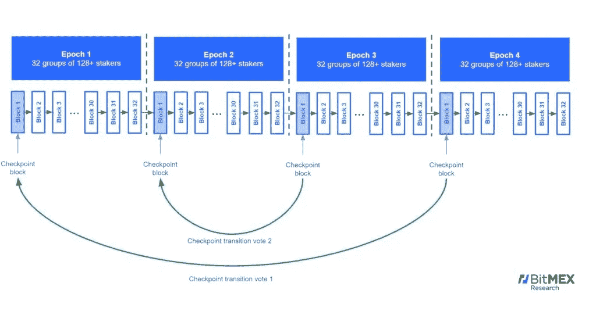

# 虚拟以太坊 2.0—第 2 部分:打桩实际上是如何工作的？

> 原文：<https://medium.com/coinmonks/ethereum-2-0-for-dummies-part-2-how-does-staking-actually-work-96bb714e4ad4?source=collection_archive---------0----------------------->

这是两部分系列的第二部分。你可以在这里 阅读 Part 1 [*。*](https://tobyornottoby.medium.com/ethereum-2-0-for-dummies-part-1-why-upgrade-112d8f5b6d88)

**以太坊 2.0 (Serenity)** 是以太坊经济基础设施的升级版，旨在为可伸缩性、安全性和效率的提高提供新的途径。在 [**第 1 部分**](https://tobyornottoby.medium.com/ethereum-2-0-for-dummies-part-1-why-upgrade-112d8f5b6d88) 中，我们讨论了网络升级及其从工作证明到利益证明的过渡背后的总体思路和基本原理。我们提到了**分片**及其对增加可伸缩性的预期效果，以及使用**验证器**代替挖掘器——从而实现更高效的网络安全。[我还介绍了一个快速术语表，**这将有助于在继续**本节](https://tobyornottoby.medium.com/ethereum-2-0-for-dummies-part-1-why-upgrade-112d8f5b6d88)之前阅读/复习(实际上我真的推荐它)。有些东西可能会变得有点枯燥，所以我撒了一些迷因让你继续下去:)

# 分阶段的 ETH 2.0

我们从 Eth 2.0 升级的计划阶段概述开始，这实际上是一组[相互关联的升级](https://www.gemini.com/cryptopedia/ethereum-2-0-blockchain-roadmap-proof-of-stake-pos):

**阶段 0 —信标链&利益证明**

Serenity 更新包的第 0 阶段将于 2020 年 12 月 1 日推出，包括引入信标链和利益证明协议(下面将详细讨论)。它将独立运行并与 PoW Eth 1.0 链并行运行，并作为 Eth 2.0 的中心点(主链)，并广播和接收来自系统其余部分的数据，包括碎片链。每个节点将维护它自己的本地信标链副本，很像现在的 Chain。信标链将维护一组验证器和它们的平衡，并且本质上管理新的利益相关证明协议。

**第一阶段——分片/分片链**

第 1 阶段将实现碎片链，这是一个扩展解决方案(在第 1 部分和下面解释),它将以太坊网络分成 64 个更小的碎片，以提高容量和交易速度。它还将为[汇总](https://vitalik.ca/general/2021/01/05/rollup.html)提供框架，这是另一个扩展解决方案，包括离线处理和汇总交易，以便在链上执行和确认。这预计将在今年年底或 2022 年初推出。

**阶段 1.5——将原始工作证明链与新的利益证明链合并**

第 1.5 阶段将弥合当前 PoW 链和新 PoS 链之间的差距。通过成为碎片链之一，当前的工作证明链将被合并到新的信标链中。这个 ETH 1.0 mainnet shard 将向新的信标链提供以太坊的历史和当前状态，并作为从旧网络到新网络的过渡。这一转变将意味着以太坊 2.0 正式上线。

**阶段 2.0 —在分片上启用交易处理(智能合同执行)**

阶段 2.0 将带来宁静升级的最后润色。这包括向碎片引入不同的执行引擎，这意味着它们将能够支持智能合约，并变得完全可操作。在这一阶段，负责处理合同代码的以太坊虚拟机(EVM)将被以太坊 Web Assembly (eWASM)取代，这将提高交易处理和合同执行的效率。

既然你对游戏的总体计划有所了解，让我们深入细节。但在此之前，让我们休息一下。

# **信标链**

为了更好地理解[信标链](https://ethos.dev/beacon-chain/)，我们首先需要尝试一下什么是分片。正如在第 1 部分中所讨论的，以太坊的可伸缩性问题的一部分是每个节点必须验证和执行每个事务。我们提到过，通过将区块链分割成多个部分，用于并行处理**的验证器/节点子集**，链的处理速度会快得多。这是伟大的，但在这一点上，碎片链仍然需要在一个单一的真理的规范来源中进行聚合和验证。这就是**信标链**的用武之地。

为了简单起见，我们可以认为信标链是 Eth 2.0 的主链，是系统的核心。碎片链将通过**交叉链接**与主链协调，我们稍后将对此进行探讨。在以太坊 2.0 的初始阶段，将有 64 个碎片链(总共有 1024 个碎片链的容量，以后可以添加)。

# **槽和时期**

信标链在称为**时隙**和**时期**的规则时间窗口中被处理。一个**时段由 32 个时隙**组成，每个时隙为 12 秒——因此每个时段为 6.4 分钟(12 秒×32 个时隙)。每个槽都是一个将块添加到链中的机会。每 12 秒(时隙)，添加一个信标链块和 64 个分片块。你可以把每个时期想象成区块链验证过程中的一个循环。

from ethos.dev

# **确认人和证明人**

那么，如何在信标链上的时隙和时段内处理块呢？

这是通过组合提议块和对它们进行投票(或证明)来完成的。提案和投票是由验证者做出的，他们实际上相当于今天的战俘矿工。**块提议者是一个验证者，它被伪随机地选择来构建一个块**，然后由其他验证者证明(*投票*)。大多数情况下，验证者将扮演一个**证明者**的角色，因为他们对信标和分片块进行投票。验证者被分成**个委员会**，这些投票被汇总(详见下文)。这些聚集的投票将确定最近的有效信标链块，以及最近的有效碎片链块，也称为“**链头”。**

staker 和 validator 在语义上是有区别的。在 Eth 2.0 中，用户(stakers)使用 Eth 来激活和运行验证器。对于每 32 个 ETH 桩，激活 1 个验证器。下注者可以下注他们喜欢的 ETH，但是验证者的最大余额是 32 ETH。一个 staker 可以运行多个验证器。验证器使用验证器**客户端**利用**信标(链)节点**跟踪并读取区块链。一个验证器客户机可以执行一个或多个验证器。您可以在不运行验证程序的情况下运行信标节点。困惑了吗？下面是一个更具体的例子:

**Staker***stakes 64 ETH*>*这个激活(2)* ***验证器*** > *验证器使用同一个* ***客户端*** *(计算机程序/节点)参与>客户端使用一个* ***信标节点*** *(通常是自己的但可以是第三方)* ***客户端*** > *验证器客户端使用该数据，以便(2)* ***验证器*** *可以运行*>*【2】验证器运行并为* ***下注者*** 生成下注奖励

# **交叉链接**

交叉链接是碎片链块与信标链相协调的方式。在每个 12 秒的时隙中，提出一个信标链块。一个信标链块最多可以包含 64 个交叉链接，每个分片一个。只要验证器在那 12 秒的时间段内投票并为碎片提出了一个块，它就可以被交叉链接到相应的信标链块。

Let’s take another meme break

# **委员会&提议者**

一个委员会本质上是一个至少由 128 个验证者组成的团体(但是可以并且通常会更多)。

**提议器**是为每个时隙随机选择的验证器。他们临时承担提议或构建该时间段的块的角色，以便其他验证者(分组为委员会)可以对其进行投票。

在每个 6.4 分钟的时间段内，网络上的验证者被平均分配到 12 秒的时间段内，然后被细分为委员会，验证者可以从中投票。特定时隙内的每个委员会尝试交叉链接特定碎片。**这意味着每个时期只允许一个验证者验证/投票一次**。每个证明都是由两部分组成的投票，一部分投票给验证器分配的碎片，另一部分投票给信标链的头。

例如，假设我们有 32，032 个验证器(不是一个真实的数字——目前大约有 185，000 个)。1001 验证器被分配给插槽#1，1001 被分配给插槽#2，…..1001 到插槽#32 (* *32，032 个验证器/ 32 个插槽)*。槽#1 中的 1001 个验证器被细分成 7 个委员会和伪随机分配的碎片。为了简单起见，我们说碎片 1 2，3，4，5，6，& 7(实际上，这些将是非常随机的选择)被选为碎片分配。槽#1 中的所有 1001 个验证器为信标链头投出一票(称为一个 [**LMD 幽灵投票**](https://blog.ethereum.org/2020/02/12/validated-staking-on-eth2-2-two-ghosts-in-a-trench-coat/) ⁴，稍后将详细介绍)。7 个委员会之一的 143 个验证者(* *1001 / 7 = 143* )试图链接碎片 1。7 个委员会中的另一个委员会的 143 个验证者试图链接碎片 2，等等。

对于时隙#2，重复该过程。时隙#2 中的 1001 个验证器被细分成 7 个委员会，它们被分配给碎片 10、15、20、25、30、35、40。所有 1001 个验证者为信标链头投票，然后每个由 143 个验证者组成的委员会尝试交叉链接碎片 10、15、20、25、30、35、40。

对于剩余的 32 个时隙(时期)，重复该过程。每个时代都有不同的委员会。同样，一个验证者每个时期只能投票一次，这意味着它每个时期只能在一个委员会中。128 人的最小委员会规模是有意的——这背后有一个统计学原理，需要一点高中数学知识，你可以在这里阅读**⁵**。**要点是，128 ( *或更准确地说是 111* )是一个数字，只要所有**验证者中的 2/3 是诚实的，任何一个委员会都极不可能被不诚实的验证者占 2/3 的优势(这意味着他们将拥有大多数并能够恶意行动)。****

# ****关卡，LMD 幽灵，卡斯珀·FFG，以及结局****

**顾名思义，每个纪元块包含一个检查点块，并作为所有各方最终确定或同意区块链的最后一点。你可以把它们粗略地看作是电子游戏中的保存点。如果你的角色死了，你可以回到上次保存游戏的地方。它们在其他地方也被称为 Epoch Boundary Blocks (EBB ),但是我们在这里将坚持使用“checkpoint”。**

****

**在每个时期，一个验证器将投出一个 LMD 幽灵投票和一个卡斯珀 FFG 投票，作为我前面提到的两部分投票的一部分。我会在这里解释这些是什么:**

**一个 **LMD 幽灵投票** **是对链**的信标头的投票(通常是在它们当前分配的槽上的块)。LMD 幽灵代表“传递的最后一条消息是观察到的最贪婪最重的子树”。如果这看起来是一个令人生畏的概念，那是因为它确实如此。简单地说，LMD-幽灵协议通过选择哪个分支拥有最多投票来选择链的头(假设其中一个验证器错过了一个块，并投票选择前一个块作为块头，而其他人投票选择当前块。幻影协议将选择当前块，因为它具有更多投票)。**

**一个**卡斯珀·FFG 投票** **是对**当前**时期内的检查点**(称为**目标**)的投票，以及对**之前的**检查点(称为**源**)的投票。**

**一个块或一个检查点必须有所有有效验证者总数的 2/3 的票数。这被称为**绝对多数。****

**本质上，每个检查点被投票两次，一次作为**目标**，一次作为**源**。当目标检查点获得绝对多数时，它被认为是**合理的**。一旦检查点在两种情况下都获得了绝对多数，它就实现了**终结**，并且被认为**终结**。大多数时候，终结是在两个时代多一点的时间里实现的。这很像我们今天在 PoW 中看到的必需的块确认。**

****

**Whew, you’ve made it this far! Time for another meme break**

# ****RANDAO — ETH 2.0 的随机数生成器****

**你可能想知道委员会、提议者、验证者是如何随机分配的，为什么这篇文章使用了“伪随机”这个词，而不仅仅是“随机”。这是因为计算机不能产生真正的随机数。计算机可以被认为是一个确定性系统，这意味着给定相同的输入，它总是产生相同的输出(这是有争议的，但我们不会在这里引爆炸药)。同样地，对于 1 + 1 的和，计算器总是给出 2，而对于同样的输入，计算机不会给出不可重复的输出。这意味着计算机充其量只能模拟随机性，或者一个合理的“随机”数。为了做到这一点，计算机需要一个**种子**，一个半随机的输入或起点来进行计算——就像你的熔岩灯中的气泡在任何特定时间点的位置([这是一个真实的东西，看看](https://qz.com/1642628/cloudflare-uses-lava-lamps-to-generate-a-crucial-resource/#:~:text=Cloudflare%20uses%20lava%20lamps%20to%20generate%20a%20fundamental%20resource%3A%20Randomness&text=In%20Cloudflare's%20San%20Francisco%20office,lamps%2C%20but%20the%20office%20environment.))。在 Eth 2.0 的情况下，“随机验证器选择”模拟是双重的。首先，验证器在存放它们的第 32 个 ETH 时选择一个随机数，这个数被散列。在每个方块中，每次显示一个验证者的随机数。一旦所有的数字显示出来，这些数字将被放在一起，形成一个新的随机数，它将决定下一个块的随机选择。这种范式与一种称为可验证延迟函数(VDF)的机制相结合，VDF 本质上是一种对随机过程的检查机制。我在这里尽量保持简单，但如果你想更深入地了解 Eth 2.0 随机生成器背后的逻辑，[你可以在这里找到更多信息](https://our.status.im/two-point-oh-randomness/)。**

# ****奖惩****

**下注你的 ETH 的明显动机是你可以通过运行一个验证器来获得回报。然而，如果您未能完成预期的任务或有恶意行为，也有失去部分或全部股份的风险。**奖励和惩罚都与验证者的行为成比例，并构成以太坊 2.0 激励结构的基础**。**

**让我们从好的方面开始。这些奖励是如何发放的？**

**验证者会因为做出证明、提出一个最终完成的块，或者发出另一个验证者犯了**严重错误**的警报而获得奖励(在 ETH 2.0 中，告密者不会被缝针，他们会获得奖励)。在每个时期，一个验证者可以获得奖励，使*LMD·幽灵/卡斯珀·FFG*的投票得到大多数其他验证者的同意。对于每个槽，验证者有机会被选为块的提议者。如果发生这种情况，并且验证者提出了一个最终确定的块，他们将获得可观的奖励。持续做好验证工作的验证者会因为提出一个有效的块而获得大约 1/8 的总奖励。提供另一个验证者正在恶意行为的证据的验证者被奖励。**

**验证器也可能会受到惩罚，但是这可能以不同的方式和程度发生。您可能会因为未证明或证明未完成的块而受到处罚(即，您的验证程序离线)。这些都是相对次要的，如果你离线或一整年都没有证明，你将会失去当年你可能获得的金额的大约 1/2(例如，如果年化回报率平均为 10%，如果你没有全程证明，你将会损失大约 7.5%)。这意味着几天甚至几周的离线仍然是一个相对较小的惩罚——特别是与下一个惩罚方法**砍杀**相比。**

**验证器可能会被恶意地或有意地破坏系统。这被称为**可砍的进攻**并以三种方式定义:双重提议、FFG 环绕投票和 FFG 双重投票。**

**在**双重提议**中，被选中的提议者试图为其分配的时段提议一个以上的区块。**

**在 **FFG 环绕投票**中，您为目标和源(当前和先前的检查点块)投票，该目标和源被您先前的 FFG 投票所环绕。这基本上降低了你之前投票的有效性，是不允许的。例如，在您之前的投票中，您投票将时隙 32 作为源，将 64 作为目标，但是在当前的时段中，您投票给时隙 0 和时隙 96。你现在的投票会围绕着之前的投票。**

**在**双重投票**中，你在同一个时期投了两张 FFG 的票，而不是允许的那张。**

**如果你被砍了，你会失去你所有的股份(32 ETH)。你将失去至少 1/32 的余额并被停用(作为验证者强制退出)。*作为一个旁注，在正常操作过程中，如果验证器的余额下降到 16 ETH 以下，它将通过停用自动强制退出。**

**还有一种罕见但严重的惩罚，称为不活动泄漏惩罚。这是为了防止整个系统无法完成检查点。本质上，如果从验证器完成检查点开始已经过了 4 个以上的时期，则评估不活动惩罚，该惩罚以平方增加，直到检查点完成。这种泄漏确保了有问题的验证器被强制退出，从而以最佳方式运行的验证器保持 2/3 的多数，并且区块链的终结机制正常运行。**

**ETH 2.0 中的回报通常以年化利率计算，并遵循平方根倒数函数。通俗地说，这意味着赌注越大，每个验证者的回报越低。在当前的 ETH 存款水平下，验证者将获得约 7% — 7.5%的年化回报率。有一个很长的公式来计算不同行为的不同回报(例如证明与提议)以及验证者是否按时履行职责等因素。它看起来像这样:**

********

**这个对话有点太专业了，简单地使用[奖励计算器](https://www.stakingrewards.com/earn/ethereum-2-0) ⁸.要容易得多**

****

**Last meme. You’re nearly there!**

# ****作为验证者退出/撤销您的 ETH****

**为了让一个诚实的(未剥离的)验证器自愿退出，它需要服务 2048 个时期——大约 9 天。另一方面，验证程序需要等待 2⁸时间(大约 27 小时)才能被撤销。这确保了如果一个验证器行为不端，仍然有一段时间可以被发现和攻击。ETH 2.0 协议最终限制了在一个时期内可以被激活或退出的验证器的数量。这使得攻击者更难快速升级并攻击系统。**

# ****我怎样才能参与进来？****

**单独下注 —你可以通过建立一个验证器客户端(可能还有一个信标节点)并在存款合同中存入 32 ETH 来下注。一旦一个有效的交易被提交到这个合同，您的验证器客户机现在将处于“已存放”状态。您的存款将在几个小时内得到处理，然后被分配一个索引号并放入队列等待激活。一旦验证器到达队列的前面，它就被分配一个激活时期，从那里验证器被激活并被分配上述职责。**

**随着升级的展开，这将成为许多文献的主题。以太坊 PoS 协议不提供 PoW 或其他 PoS 实现所具有的一些功能，即流动性。因此，市场已经并将继续介入，使打桩更加方便和有效。这采用了分池的形式，允许参与者将他们的 ETH 集中在一起，并将运行验证器的操作方面委托给该池。资金池可能会提供额外的服务，如维持流动性 ETH 储备以满足提款需求，或针对削减的保险。一个预期的功能是以 ERC-20 令牌的形式对赌注池进行令牌化，这些令牌可用于其他应用程序，如 Defi。这些池可以是集中式的(例如比特币基地或币安)或分散式的(例如 RocketPool 或 Lido ),每个池都有自己的优点和缺点，您应该在互动或存放任何代币之前仔细研究这些优点和缺点。一些人认为，这种集中或引入赌注衍生品的做法降低了 PoS 的安全性，并刺激了其自身的集中化，因为它们将赌注/削减方面与批量生产方面分开(委托代理问题)。然而，其他人认为，衍生品降低了赌注的显性成本和机会成本，导致更多的参与和更多的赌注。这是一场我们目前只能推测的辩论，看看它如何收场将会很有趣。**

# ****总结****

**以太坊 2.0 宁静升级计划分阶段实施。**第 0 阶段**引入了信标链和利益证明。**第一阶段**将引入分片和分片链。**阶段 1.5** 将合并现有的工作证明链和新的利益证明链，作为后者的碎片链之一。阶段 2.0 将在碎片链上引入执行引擎，允许智能合同在碎片链上执行。以太坊虚拟机(EVM)将被替换为**以太坊 Web Assembly (eWASM)** ，这将允许更快的交易处理和吞吐量。**信标链**将作为主要的 ETH 2.0 区块链，管理验证器和利益相关协议的证明。**碎片链**将同时运行，并与信标链保持一致。每 12 秒**时隙**处理一个信标链块和多达 64 个碎片链块(每个块一个)。每 32 个时隙构成一个**时期**，它类似于块验证过程中的一个周期。每个验证器被允许对信标和碎片链的链头 **(LMD 幽灵投票**)以及当前和先前的检查点块(分别是**目标**和**源**)进行投票，称为证明。这种对检查点的投票是认证的**卡斯珀 FFG** **投票**部分。当当前或目标检查点块获得 2/3 的票数时，(**绝对多数**，被认为**合理**。如果在另一个时期过去后，它作为一个来源获得了绝对多数票，则被认为是最终确定的(**终结**)。验证器是伪随机选择的，并在至少 128 个验证器的**委员会**之间洗牌，使用一个称为**随机**的伪随机数生成过程。这些随机委员会被划分，以便对块头进行投票，尝试**将**碎片链与信标链交叉链接，并被设计为帮助阻止链上的恶意活动。验证者通过证明最终确定的区块，以及建议最终确定的区块(当他们被选为建议者时),获得**奖励**。他们还可以通过提供某人犯下了**滔天罪行的证据来获得奖励。验证者也可能受到惩罚，离线或不验证(相对较小的惩罚)，或者受到更严重的惩罚，犯下严重的罪行，包括双重投票，在同一时期提出两个区块，或者投出与前一次投票冲突的卡斯珀·FFG 投票。你可能会因为犯下令人发指的罪行而失去你所有的股份。人们可以通过**单独提交**——提交 32 个 ETH 和你自己的验证器节点，或者提交一些 ETH 到提交池中。**赌注池**允许你和其他参与者一起分享你的 ETH，绕过 32 ETH 的最低要求。资金池处理赌注的操作方面，并可能将您在资金池中的股份进行令牌化，为您提供流动性以用于其他应用。总而言之，我们应该会非常兴奋地看到宁静升级的激活。ETH 2.0 旨在为应用程序和计算提供一个更加可扩展的分散平台，我个人迫不及待地想看到它的实现:)****

**参考**

**[1]Tobias Fan(2021 年 6 月 25 日)*虚拟以太坊 2.0—第一部分:为什么要升级？*[https://tobyornottoby . medium . com/ether eum-2-0-for-dummies-part-1-why-upgrade-112 D8 F5 B6 d 88](https://tobyornottoby.medium.com/ethereum-2-0-for-dummies-part-1-why-upgrade-112d8f5b6d88)**

**[2]Cryptopedia(2021 年 6 月 21 日)*以太坊 2.0 的宁静升级三期*[https://www . Gemini . com/Cryptopedia/以太坊-2-0-区块链-roadmap-proof-stake-pos](https://www.gemini.com/cryptopedia/ethereum-2-0-blockchain-roadmap-proof-of-stake-pos)**

**[3]ethos . dev(2020 年 5 月 23 日)*灯塔链以太坊 2.0 讲解者你需要先阅读*[https://ethos.dev/beacon-chain/](https://ethos.dev/beacon-chain/)**

**[4]Carl Beekhuizen(2020 年 2 月 12 日)*验证，押上 eth 2:# 2——两个穿风衣的鬼*[https://blog . ether eum . org/2020/02/12/Validated-Staking-on-eth 2-2-两个穿风衣的鬼/](https://blog.ethereum.org/2020/02/12/validated-staking-on-eth2-2-two-ghosts-in-a-trench-coat/)**

**[5]Chi-Cheng Liang(2019 . 7 . 12)*最小委员会规模解释*[https://medium . com/@ chihchengliang/Minimum-Committee-Size-Explained-67047111 fa 20](/@chihchengliang/minimum-committee-size-explained-67047111fa20)**

**[6] Amanda Shendruk，Quartz(2020 年 8 月 19 日) *CloudFlare 使用 Lavalamps 生成基本资源:随机性*[https://qz . com/1642628/cloud flare-Uses-lava-lamps-to-Generate-a-critical-Resource/#:~:text = cloud flare % 20 Uses % 20 lava % 20 lamps % 20 to % 20 Generate % 20a % 20 基本资源:% 20 随机性& text=In](https://qz.com/1642628/cloudflare-uses-lava-lamps-to-generate-a-crucial-resource/#:~:text=Cloudflare%20uses%20lava%20lamps%20to%20generate%20a%20fundamental%20resource:%20Randomness&text=In%20Cloudflare's%20San%20Francisco%20office,lamps,%20but%20the%20office%20environment)**

**[7]光轮(2019 年 5 月 7 日)*两点哦:随机性*[https://our.status.im/two-point-oh-randomness/](https://our.status.im/two-point-oh-randomness/)**

**[8]赌注奖励*奖励计算器*https://www.stakingrewards.com/earn/ethereum-2-0**

> **加入 [Coinmonks 电报频道](https://t.me/coincodecap)，了解加密交易和投资**

## **另外，阅读**

*   **[什么是融资融券交易](https://blog.coincodecap.com/margin-trading) | [美元成本平均法](https://blog.coincodecap.com/dca)**
*   **[BigONE 交易所点评](/coinmonks/bigone-exchange-review-64705d85a1d4) | [电网交易 Bot](https://blog.coincodecap.com/grid-trading)**
*   **[3 商业评论](/coinmonks/3commas-review-an-excellent-crypto-trading-bot-2020-1313a58bec92) | [Pionex 评论](/coinmonks/pionex-review-exchange-with-crypto-trading-bot-1e459d0191ea) | [Coinrule 评论](/coinmonks/coinrule-review-2021-a-beginner-friendly-crypto-trading-bot-daf0504848ba)**
*   **[莱杰 vs n rave](/coinmonks/ledger-vs-ngrave-zero-7e40f0c1d694)|[莱杰 nano s vs x](/coinmonks/ledger-nano-s-vs-x-battery-hardware-price-storage-59a6663fe3b0) | [币安评论](/coinmonks/binance-review-ee10d3bf3b6e)**
*   **[Bybit 交易所评论](/coinmonks/bybit-exchange-review-dbd570019b71) | [Bityard 评论](/coinmonks/bityard-review-7d104239be35) | [CoinSpot 评论](https://blog.coincodecap.com/coinspot-review)**
*   **[3 commas vs crypto hopper](/coinmonks/3commas-vs-pionex-vs-cryptohopper-best-crypto-bot-6a98d2baa203)|[赚取秘密利息](/coinmonks/earn-crypto-interest-b10b810fdda3)**
*   **最好的比特币[硬件钱包](/coinmonks/the-best-cryptocurrency-hardware-wallets-of-2020-e28b1c124069?source=friends_link&sk=324dd9ff8556ab578d71e7ad7658ad7c) | [BitBox02 回顾](/coinmonks/bitbox02-review-your-swiss-bitcoin-hardware-wallet-c36c88fff29)**
*   **[BlockFi vs 摄氏度](/coinmonks/blockfi-vs-celsius-vs-hodlnaut-8a1cc8c26630) | [Hodlnaut 审核](/coinmonks/hodlnaut-review-best-way-to-hodl-is-to-earn-interest-on-your-bitcoin-6658a8c19edf) | [KuCoin 审核](https://blog.coincodecap.com/kucoin-review)**
*   **[Bitsgap 审查](/coinmonks/bitsgap-review-a-crypto-trading-bot-that-makes-easy-money-a5d88a336df2) | [Quadency 审查](/coinmonks/quadency-review-a-crypto-trading-automation-platform-3068eaa374e1) | [Bitbns 审查](/coinmonks/bitbns-review-38256a07e161)**
*   **[密码本交易平台](/coinmonks/top-10-crypto-copy-trading-platforms-for-beginners-d0c37c7d698c) | [Coinmama 审核](/coinmonks/coinmama-review-ace5641bde6e)**
*   **[印度加密交易所](/coinmonks/bitcoin-exchange-in-india-7f1fe79715c9) | [比特币储蓄账户](/coinmonks/bitcoin-savings-account-e65b13f92451)**
*   **[CoinDCX 评论](/coinmonks/coindcx-review-8444db3621a2) | [加密保证金交易交易所](https://blog.coincodecap.com/crypto-margin-trading-exchanges)**
*   **[CoinLoan 审查](/coinmonks/coinloan-review-18128b9badc4) | [YouHodler 审查](/coinmonks/youhodler-4-easy-ways-to-make-money-98969b9689f2) | [BlockFi 审查](/coinmonks/blockfi-review-53096053c097)**
*   **最好的[加密税务软件](/coinmonks/best-crypto-tax-tool-for-my-money-72d4b430816b) | [硬币追踪评论](/coinmonks/cointracking-review-a-reliable-cryptocurrency-tax-software-5114e3eb5737)**
*   **[Stackedinvest 评论](https://blog.coincodecap.com/stackedinvest-review) | [北海巨妖评论](/coinmonks/kraken-review-6165fc1056ac) | [期货交易机器人](/coinmonks/futures-trading-bots-5a282ccee3f5)**
*   **最佳[加密借贷平台](/coinmonks/top-5-crypto-lending-platforms-in-2020-that-you-need-to-know-a1b675cec3fa) | [杠杆令牌](/coinmonks/leveraged-token-3f5257808b22)**
*   **最佳[加密制图工具](/coinmonks/what-are-the-best-charting-platforms-for-cryptocurrency-trading-85aade584d80) | [最佳加密交易所](/coinmonks/crypto-exchange-dd2f9d6f3769)**
*   **[如何在印度购买比特币？](/coinmonks/buy-bitcoin-in-india-feb50ddfef94) | [瓦济克斯审查](/coinmonks/wazirx-review-5c811b074f5b)**
*   **[隐翅虫替代品](/coinmonks/cryptohopper-alternatives-d67287b16d27) | [HitBTC 审查](/coinmonks/hitbtc-review-c5143c5d53c2)**
*   **[WazirX vs CoinDCX vs bit bns](/coinmonks/wazirx-vs-coindcx-vs-bitbns-149f4f19a2f1)|[block fi vs coin loan vs Nexo](/coinmonks/blockfi-vs-coinloan-vs-nexo-cb624635230d)**
*   **[本地比特币审核](/coinmonks/localbitcoins-review-6cc001c6ed56) | [加密货币储蓄账户](https://blog.coincodecap.com/cryptocurrency-savings-accounts)**
*   **[比特币基地评论](/coinmonks/coinbase-review-6ef4e0f56064) | [德里比特评论](/coinmonks/deribit-review-options-fees-apis-and-testnet-2ca16c4bbdb2) | [FTX 评论](/coinmonks/ftx-crypto-exchange-review-53664ac1198f) | [StealthEX 评论](/coinmonks/stealthex-review-396c67309988)**
*   **[n rave ZERO Review](/coinmonks/ngrave-zero-review-c465cf8307fc)|[phe MEX Review](/coinmonks/phemex-review-4cfba0b49e28)|[PrimeXBT Review](/coinmonks/primexbt-review-88e0815be858)**
*   **最佳[区块链分析](https://bitquery.io/blog/best-blockchain-analysis-tools-and-software)工具| [赚比特币](/coinmonks/earn-bitcoin-6e8bd3c592d9) | [Swapzone 评论](/coinmonks/swapzone-review-crypto-exchange-data-aggregator-e0ad78e55ed7)**
*   **[加密套利](/coinmonks/crypto-arbitrage-guide-how-to-make-money-as-a-beginner-62bfe5c868f6)指南| [如何做空比特币](/coinmonks/how-to-short-bitcoin-568a2d0b4ae5) | [Prokey 回顾](/coinmonks/prokey-review-26611173c13c)**
*   **[币安交易机器人](/coinmonks/binance-trading-bots-d0d57bb62c4c) | [OKEx 审查](/coinmonks/okex-review-6b369304110f) | [Atani 审查](https://blog.coincodecap.com/atani-review)**
*   **[最佳加密交易信号电报](/coinmonks/best-crypto-signals-telegram-5785cdbc4b2b) | [MoonXBT 评论](/coinmonks/moonxbt-review-6e4ab26d037)**
*   **[Godex.io 审核](/coinmonks/godex-io-review-7366086519fb) | [邀请审核](/coinmonks/invity-review-70f3030c0502) | [BitForex 审核](/coinmonks/bitforex-review-c4bb28d9e271)**