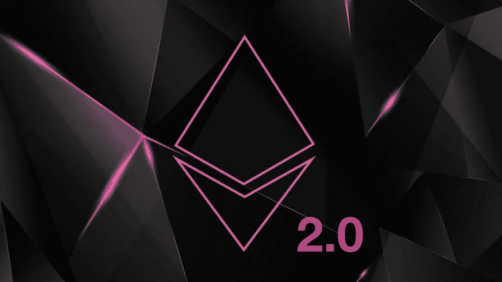
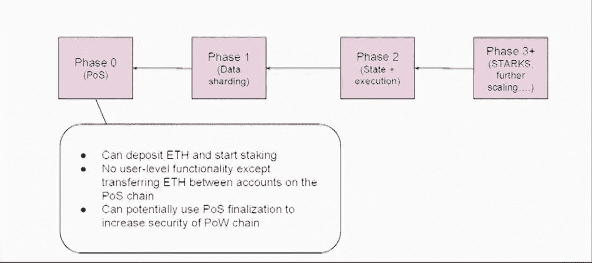
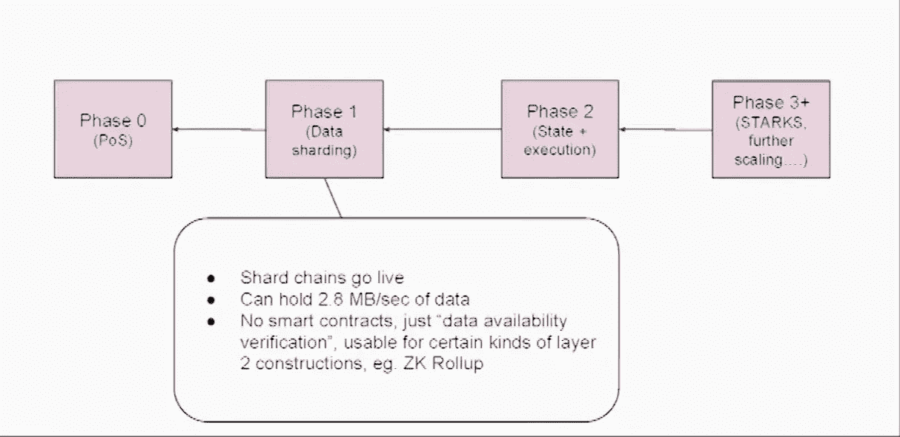
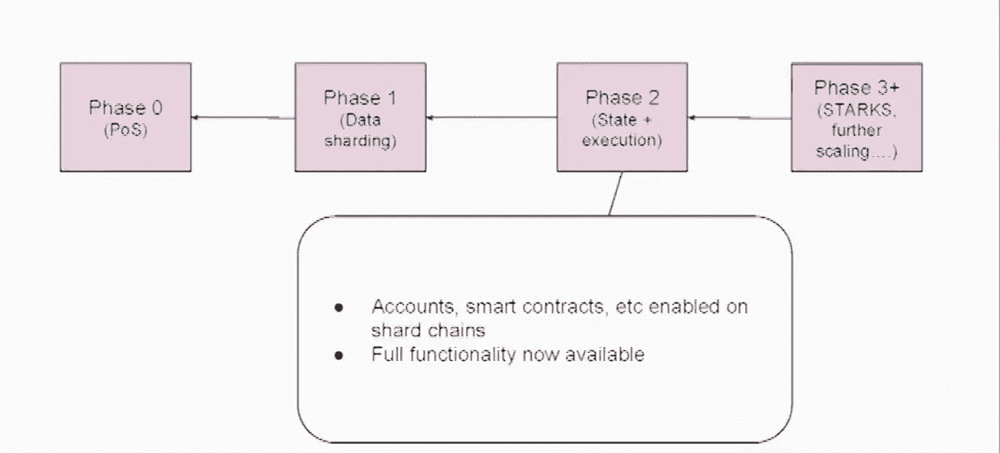
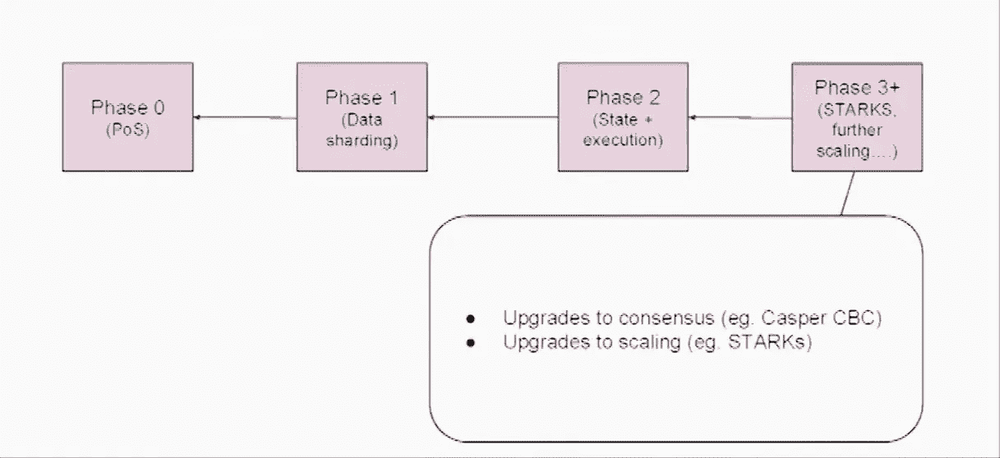
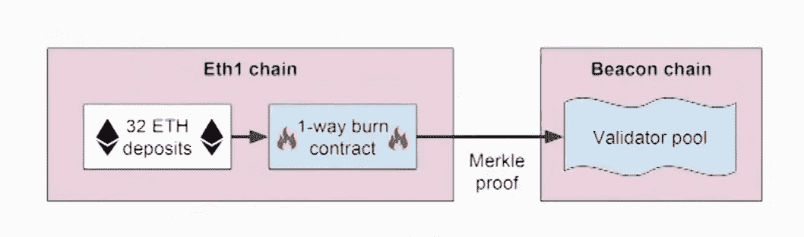
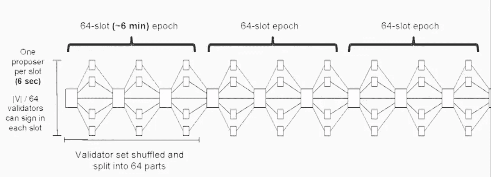
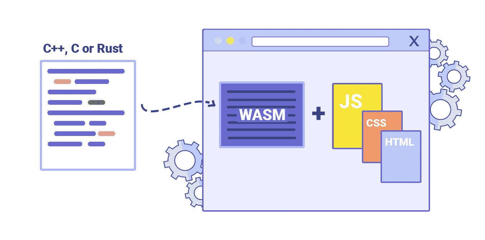
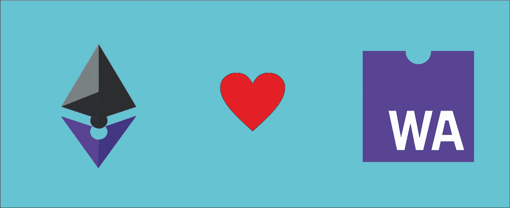

# 以太坊 2.0:终极财富

> 原文：<https://medium.com/coinmonks/ethereum-2-0-the-ultimate-fortune-5810b176193c?source=collection_archive---------2----------------------->

下一个牛市，整个生态系统需要升级，肯定是以太坊 2.0，预计今年发布，但已经推迟。更新的第 0 阶段预计在今年，但当它将发布一部分即将到来的新闻和开发者的升级时，我们将讨论技术细节以及它将给整个以太坊生态系统带来什么变化。

# 以太坊 2.0 是什么？

以太坊 2.0 是对之前以太坊协议的计划更新。主要的升级将是机制，它将改变为“利益证明”,目前是“工作证明”,这将通过生态系统增加以太坊的可扩展性和可用性。

**升级将分四个阶段实施，**

**第 0 阶段** :-将共识机制改为“利益相关证明”

Phase 0

**第 1 阶段:-** 数据分片将包含在此阶段中。

Phase 1

**第 2 阶段:-** 将提供完整的分片功能

Phase 2

第三阶段:- 剩下的几个升级将会完成，例如:Casper，STARKs 等。

Phase 3

# **以太坊 2.0 会有什么变化？**

1.  **通过(POS)风险证明提高可扩展性:-**
    自 2014 年开始研究以来，对架构、工作和迁移的研究越来越多。在工作证明(POW)机制中，挖掘者是事务验证者，但是在 POS 中，验证是由利益相关者完成的，这是两种机制之间的主要区别。

**架构:-** 信标链扩展到以前的以太坊链。它是 POS 机制中最重要的部分，可以说它是整个 POS 机制的管理者。信标链管理协议的方面包括:

验证者及其股份的管理，

验证人及其委员会的管理，以对特定区块进行投票，

同时给予罚款和奖励，

在每个步骤阻止每个碎片的提名，

伪造交叉碎片事务。

Beacon Chain within Proof of stake Architecture with the original Ethereum chain.

32 以太被要求在以太坊 2.0 网络上下注，信标链扮演着重要的角色，它维护着运行以太坊 2.0 系统的一组验证器。
信标链对验证器标记“活动”,只有被标记的验证器才能加入以太网，可能还有对验证器标记的其他状态，如“非活动”、“休眠”等。

Beacon Chain Overview

然后，主动验证者通过提议块来参与网络，当他们被信标链选择，然后由碎片链实现时，另一方面，他们加入委员会来为块投票。

这个 Becon 链是以太坊 2.0 中主要的架构升级

在进行下一次重大升级之前，你应该知道以太坊虚拟机{EVM}的功能，因为这次升级将彻底改变 EVM，所以简而言之，我将向你解释 EVM，

**以太坊虚拟机:-** 所有去中心化的生态系统需要虚拟机在去中心化的层面上运行，无论是比特币还是以太坊，对于比特币来说，虚拟机是交易的起点，但在以太坊生态系统中，它需要处理智能合约和交易。因为，一个智能契约将需要是不可更改的，总是相似的，并且具有高水平的安全性，以及运行节点不妥协

作为以太坊的核心，EVM 存在一些问题，

1.  EVM 很慢，但并不符合要求。
2.  EVM 的操作码是不可变的，不容易与所有平台的所有硬件兼容。
3.  EVM 不得不同时进行多项行动，有时会变得行动不便。这降低了网络效率。
4.  EVM 并没有从它最初的规格发展太多。这就是编程所需的工具和语言极其有限的原因。
5.  在同一台旧机器上进行新的升级是不可能的，这就像给一台旧引擎一个最新的模型，想象驾驶它是不可能的，这些问题将以太坊从 EVM 转移到电子世界

这就引出了上述问题答案的第二部分

**2。EVM 到 Wasm 升级**

WASM overview

EVM 现在是以太坊虚拟机，它是智能合约被执行的方式。这都是关于开发者编写代码，然后编译成字节码(操作码),然后由 EVM 在网络上执行。EVM 是以太坊自己的伟大发明，它是最成功的执行环境，建立这种执行环境需要几十年的时间，例如 Java，JAVA 虚拟机现在非常快，因为他们每天都在开发它，建立 JVM 需要很多时间。

EVM 是最近创建的，与 JAVA 相比，它是非常新的，在 EVM 有许多效率低下的地方，所以 ETH 的所有者 Vitalik Buterin 和开发人员认为我们可能会花费大量的金钱和精力、时间等来改进 EVM，或者转向世界范围内采用的主流技术，所以他们没有转向 JVM，而是转向了 eWASM。

# **什么是 eWASM** ？

Ethereum loves Web assembly creates eWASM

**eWASM(以太坊青睐的 web 组件)= Web 组件(WASM) +与以太坊的交互**

它是非常快速漂亮的虚拟机它可以比 EVM 更有效率，因为在 eWASM 上编程基本上可以在所有语言上完成，你不一定要使用 solidity，只是这是代码将如何执行的主要变化之一它将更快更强，因为从相当一段时间来看，它是一个全球性的努力，所有大的技术都在为 WASM 做贡献，无论是谷歌还是微软等，因为 WASM 是一个网络标准。顺便说一下，这是一个非常好的举动，EOS 也使用 WASM，这将是一个惊人的性能，因为以太坊上的应用程序正变得越来越复杂。

以太坊的这一根本性变化将带来越来越多的 defi 项目和越来越多你无法支付巨额交易费用的用例。

我能给出的唯一结论是以太坊 2.0 是最大的财富，因为它将解决整个去中心化生态系统的许多问题。无论是可扩展性、功能性还是交易速度，因为以太坊 2.0 承诺 10，000 到 15，000 / tps，这确实是一个巨大的数字。没有多少第 2 层协议试图在我们的生态系统中解决这些问题，但如果以太坊做到了，那么它将炸毁市场。从开发者的角度来看，这次升级后，他们可以用他们喜欢的编程语言编写智能合同，这是一个双赢的局面。最后但并非最不重要的是，下注至少需要锁定 25 个 ETH，锁定的 ETH 越多，奖励就越高，所以，所有的 ETH 都只是为了市场，对吗？系好安全带，因为我们要飞向以太坊的终极财富。

> [*在您的收件箱中直接获得最佳软件优惠*](https://coincodecap.com/?utm_source=coinmonks)

