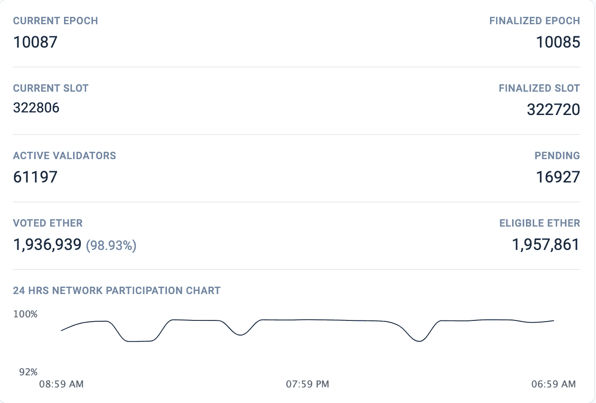

# 以太坊 2.0 vs 符号(第二部分):共识协议

> 原文：<https://medium.com/coinmonks/ethereum-2-0-vs-symbol-part-2-consensus-protocols-73e0a2589242?source=collection_archive---------4----------------------->

## 对于采用区块链的企业来说，回滚的可能性总是一个问题。终结带走了这种担心。

NEM 从利益证明(PoS)衍生产品开始，以太坊一直计划从工作证明(PoW)转向利益证明，现在已经部分实施。让我们一起来看看它们是如何减轻从 PoS 继承的一些缺点的。

*NEM 基础设施系统 1 (NIS1)使用重要性证明(PoI)，这是一种专有的共识协议，使 PoS 中的“富人越来越富”缺点。*

*形成区块的过程称为收获，提出并签署区块的帐户称为收获者。PoI 协议中的收割机不需要运行一个节点。他们需要做的就是为自己赢得收割的资格。*

*为此，一个账户需要有 10，000 XEM(ni S1 的本地货币)。大约每 24 小时，一个账户中 10%的未归属股份将被归属。也就是说，对于一个有资格获得的新账户，最快的方法是存入 100，000 XEM，然后等待 24 小时，它就会获得一个重要性分数。拥有非零分数的帐户可以加入 harvester 池。*

*然而，重要性分数并不仅仅基于既得 XEM。它还基于帐户使用网络的活跃程度。帐户在 30 天内进行的交易量被考虑在重要性计算中。比起“霍德勒”，它更青睐用户。*

*委托收集是一个过程，其中合格的帐户将其重要性分数委托给有收集槽可用的节点。收获账户(主账户)不需要运行节点，并且通过远程账户委托重要性分数使得它非常安全，因为主账户的私钥不会被共享，并且收获的费用将被路由到主账户。远程帐户的余额将始终为零。*

*由于节点在这个收集过程中没有被激励，它们通常由超级节点(在具有特殊支出的超级节点计划下)、使用 NIS1 的公司的节点以及运行自己的节点的收集器组成。*

*所有的 XEM 都是预先设定好的。因此，奖励完全基于收取的交易费。*

## ****【凭证桩加(PoS+)】****

*PoS+非常类似于 PoI。在 PoS+中，将块添加到链中的过程仍被称为收集，签署块的帐户仍被称为收集器。采集者需要 10，000 XYM(符号的原生货币)在他们的账户里，并且需要一个非零的重要性分数。*

*PoS+鼓励用户而不是“搬运工”。与 NIS1 不同的是，Symbol 的新供应率下降，这意味着有新的 XYM 加入流通，但加入网络的新供应将随着时间的推移而减少。收割者不仅会得到交易费，还会得到新加入的 XYM。在 PoS+中，收割者将需要与他们委托其重要性分数的节点(具有指定的受益人帐户)分享他们收入的百分比。这种机制鼓励更多的节点加入符号网络。对于不具有高重要性分数的帐户的节点所有者来说，让具有高重要性分数的帐户在他们的节点上进行委托是有益的。这是一个双赢的局面。*

*重要性分数对于收割机选择很重要。分数高的账号被选中的几率更大。Symbol 中分数的计算与 NIS1 中略有不同。它基于 3 个标准:*

1.  *赌注分数:账户的赌注越高，这个分数越高。*
2.  *交易得分:账户在网络中的活跃程度。*
3.  *节点得分:如果该帐户也被命名为某个节点的受益人，它将获得该类别的得分。*

*(我可能会在专门讨论 PoS+的其他文章中更详细地讨论这个计算的权重。)*

> ***符号**总是更喜欢可用性而不是一致性，但是它可选地支持在其本地共识之上使用终结性小工具。这个小玩意引入了一种受 BFT 启发的投票系统，这种系统与批量生产和批量共识是正交的。”—来自 NEM 技术参考的符号。*

*终结将在符号公共链中实现。在 NIS1 中，如果网络中出现差异，最大回滚设置为 360 个数据块(大约 6 小时)。在 Symbol 中，这也可以是私有链的一个选项。*

*Epoch 是组合在一起的块(数量在*网络中设置:votingSetGrouping)* ，投票者将投票决定这些块。一旦完成，这些数据块将无法恢复。*

*与收获不同，投票者基于收获余额(投票者账户中 XYM 的余额)而不是重要分数进行加权。所有投票者需要运行一个节点，并期望在所有轮投票，但不要发送每轮多张选票。截至目前，符号中没有实现斜线/惩罚。*

**(一个历元有多少块？一个选民需要多少收割天平？所有这些都将在 mainnet 启动时进一步讨论，因为可能会有变化。最新更新可在*[https://forum.nem.io/](https://forum.nem.io/)*)*找到*

**

## ****以太坊中的工作证明****

*以太坊使用与比特币类似的工作证明。以太坊的封锁时间比比特币(10 分钟)短很多，平均 15 秒。由于高陈旧率，短阻塞时间会导致安全性降低。当一个块在网络中传播得不够快时，它就变得陈旧，而当另一个块传播得更快时，它就不会被添加到链中。这造成了能量的浪费。这种浪费无助于网络安全，并且[增加了对集中化的担忧](https://ethereum.org/en/whitepaper/#modified-ghost-implementation)。*

*以太坊实现了一个简化版本的[幽灵](https://www.avivz.net/pubs/15/btc_ghost.pdf)(贪婪最重观察子树)协议，它下降了 7 级。这通过将陈旧块作为“叔叔”包括在最长链的计算中并以基本奖励的百分比奖励叔叔来解决问题。*

*以太(以太坊的货币)没有最大供应量。随着每一个区块的开采，新的醚供应被添加到网络循环中。要检查当前乙醚的总供应量，请转到[乙醚扫描](https://etherscan.io/stat/supply)。*

## ****卡斯珀****

*2020 年 12 月 1 日，[信标链](https://beaconscan.com/)发货，标志着标杆转变的开始。此时，PoW 和 PoS 并行运行。虽然块仍然在 mainnet 上被挖掘，但是它们在基于 Casper 友好终结小工具(FFG)的信标链上被终结，Casper 友好终结小工具是一种基于拜占庭容错的 PoS 协议。*

> *" Casper 覆盖提供了几乎所有工作链的证明，并提供了额外的保护来防止块反转."— [Casper 友好的终结小工具](https://arxiv.org/pdf/1710.09437.pdf)*

*那些想要参与确认终结性的人(被称为确认者)需要通过发送智能契约 staking 32 ETH 来加入信标链。目前，信标链上有 61197 个验证器，还有 16927 个等待被接纳。这是因为每个时期只允许 4 个验证器。每个时期有 32 个时隙，每个时隙是 12 秒。每个时期的第一个槽是一个检查点。因此，如果你想加入队列，你可能需要 2-3 周才能开始提议和证明。*

**

*Source: [https://beaconscan.com/](https://beaconscan.com/) Date: 15th Jan 2020*

*一旦你被录取，你将被随机选为验证者之一。作为一个验证者，您投票决定链的高度，检查点来调整它前面的块，以及之前调整的检查点。这意味着一个纪元将需要 6.4 分钟来调整，12.8 分钟来完成。此后，块和事务不能恢复。*

> *"利害关系的证明打破了这种对称，因为它不依赖于安全奖励，而是依赖于惩罚."— [“验证设计理念”](/@VitalikButerin/a-proof-of-stake-design-philosophy-506585978d51)，Vitalik Buterin。*

*信标链中有一个切割系统。如果验证者在一个时间段内提出两个不同的区块或者在一个时期内提交一个以上的证明，他们的股份将被削减。*

*除了他们的股份被削减，验证者的股份撤回期也将被推迟。在退出堆栈时，验证程序需要等待 256 个时期才能撤回它们的 ETH。对于削减的验证器，它们需要等待 8，192 个时期。像进入验证器池一样，验证器也需要排队退出。进入和退出验证者池的队列用于控制有资格投票的验证者数量的波动。*

*对于采用区块链的企业来说，回滚的可能性总是一个问题。终结带走了这种担心。“无风险”攻击是 PoS 最关心的问题。有了最终结果，只要商家等待区块最终确定，这种情况就可以避免。这是一个适合采用的最佳方案吗？这完全取决于是否 13 分钟(大约。以太坊块终结时间)会太长。*

*从我上面收集的信息来看，我们注意到两个区块链都在向用户灌输信心。它们在执行上确实有一些不同，例如，当以太坊使用排队系统来控制验证器池时，Symbol 要求投票者有更高的赌注并运行节点。*

*特别感谢 [Anthony](https://dev.to/anthonylaw) 审阅本文。下一个话题是什么？有什么想法吗？我知道，但是也许你的想法比我的好。请留下评论，让我知道。*

*同时，注意安全，保持关注。*

**参考文献**

1.  *来自 NEM 技术参考的符号[https://docs . symbol platform . com/catapult-white paper/main . pdf](https://docs.symbolplatform.com/catapult-whitepaper/main.pdf)*
2.  *NEM 技术参考[https://nem platform . com/WP-content/uploads/2020/05/NEM _ tech ref . pdf](https://nemplatform.com/wp-content/uploads/2020/05/NEM_techRef.pdf)*
3.  *符号技术文件[https://docs.symbolplatform.com/index.html](https://docs.symbolplatform.com/index.html)*
4.  *【https://forum.nem.io/t/symbol-tokenomics-update/26516 号*
5.  *以太坊白皮书【https://ethereum.org/en/whitepaper/#ethereum *
6.  *[https://hack MD . io/@ Benjamin ion/eth 2 _ news/https % 3A % 2F % 2f hack MD . io % 2F % 40 Benjamin ion % 2f wine 2 _ 2012 30](https://hackmd.io/@benjaminion/eth2_news/https%3A%2F%2Fhackmd.io%2F%40benjaminion%2Fwnie2_201230)*
7.  *卡斯珀友好终结小工具[https://arxiv.org/pdf/1710.09437.pdf](https://arxiv.org/pdf/1710.09437.pdf)*
8.  *[https://ether eum . org/en/developers/docs/consensus-mechanisms/pow/mining/](https://ethereum.org/en/developers/docs/consensus-mechanisms/pow/mining/)*
9.  *[https://ether eum . org/en/eth 2/beacon-chain/# what-the-beacon-chain-do](https://ethereum.org/en/eth2/beacon-chain/#what-does-the-beacon-chain-do)*
10.  *[https://Twitter . com/VitalikButerin/status/1029900695925706753](https://twitter.com/VitalikButerin/status/1029900695925706753)*
11.  *[https://www . Reddit . com/r/eths taker/comments/i46sjm/is _ there _ a _ reason _ why _ the _ activation _ queue _ is _ so/](https://www.reddit.com/r/ethstaker/comments/i46sjm/is_there_a_reason_why_the_activation_queue_is_so/)*
12.  *深入探究以太坊 2.0:第 1 部分[https://medium . com/stakefish/deeper-Dive-into-ether eum-2-0-Part-1-93c 475 a 18735 #:~:text = Epochs % 20 and % 20 slots，be % 20 created % 20 for % 20 each % 20 slots](/stakefish/deeper-dive-into-ethereum-2-0-part-1-93c475a18735#:~:text=Epochs%20and%20slots,be%20created%20for%20each%20slot)。*