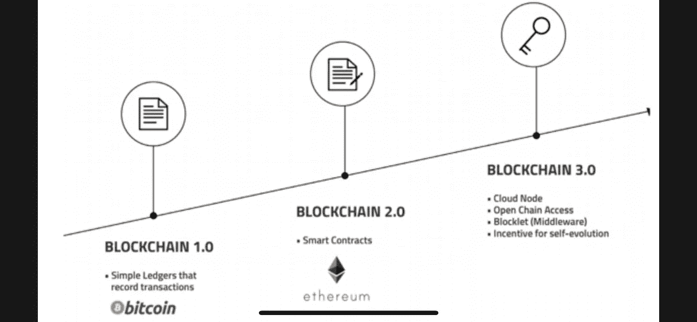

# 以太坊 2.0 vs 符号(第 3 部分):智能合约和插件

> 原文：<https://medium.com/coinmonks/ethereum-2-0-vs-symbol-part-3-442b0d34c857?source=collection_archive---------1----------------------->

## 而以太坊智能合约就像 Play-Doh，符号插件就像乐高。

与大多数人所提倡的相反，我相信比较能让双方都表现出最好的一面。这是一个视角的问题。

## ***什么是以太坊智能合约？***

Source: [https://medium.com/@alexlwitt/why-blockchain-is-the-yin-to-ais-yang-7aeb84a062ae](/@alexlwitt/why-blockchain-is-the-yin-to-ais-yang-7aeb84a062ae)

2015 年以太坊起步时，随着智能合约的推出，被视为区块链 2.0。

什么是智能合同？根据 ethereum.org[的说法，“它是一个集合代码和数据，驻留在以太坊区块链上的一个特定地址。”一旦满足所有标准，代码将自动执行。](https://ethereum.org/en/developers/docs/smart-contracts/)

以太坊平台有两种类型的账户。一种类型表示用户，另一种表示智能合约。它们都持有余额，并可以通过网络发送交易。虽然用户帐户由持有私钥的用户控制，但智能合约帐户没有私钥，而是由用户帐户发送的交易触发。

以太坊不是分布式账本，而是分布式状态机。“要改变账户状态，需要向网络发送交易，包括部署智能合约。任何人都可以用 Solidity 或 Vyper 编写智能合约。问题是，“它防弹吗？”

## ***智能合约挑战***

根据《剑桥词典》， [smart](https://dictionary.cambridge.org/dictionary/english/smart?q=Smart) 的意思是使用计算机使某物以独立的方式工作。而“[契约](https://dictionary.cambridge.org/dictionary/english/contract)”是指陈述和解释两个(或多个)不同的人或团体之间的正式协议的法律文件。智能合约除了不是 100%独立的，也没有真正的法律强制执行之外，都是上述的。

> 他们不聪明。它们不是合同。—大卫·布莱克

EVM(以太坊虚拟机)上的智能合约可以任意运行任何逻辑，因为 EVM 是图灵完全的。随着智能合约的实施，两方或多方可以在不使用可信第三方的情况下相互信任。这大大减少了执行合同的时间和成本。一个非常简单的例子，Alice 想从 Bob 那里获得一个在线节目。通常，他们会选择一家经销商，确保爱丽丝付款，鲍勃交货。有了智能合同，双方都不需要担心一方不遵守，因为所有权的交换是自动完成的。(当然，应用程序可以比这复杂得多，但是我们在这里不讨论用例。)

有时候，你的优点就是你的缺点。以太坊的扎实不是难学而是难掌握。很难掌握，在我看来主要是以太坊的图灵完备性，而不是坚固性本身。

1.  一个 [DApp](https://en.wikipedia.org/wiki/Decentralized_application) (分散式应用)的所有计算都发生在 EVM。一旦部署，只要 EVM 活着，它就永远在那里。正如 Ivan on Tech 所说，“……[由于智能合同是自动执行的，因此在黑客之前发现它们的安全风险至关重要。](https://academy.ivanontech.com/blog/defi-deep-dive-smart-contract-security)“如果智能合约部署后发现了 bug，你是没有办法整改的。为了消除风险，您可能需要部署另一个智能合同。(你可以在这里阅读[，在这里](https://blog.bankex.org/nine-pitfalls-of-ethereum-smart-contracts-to-be-avoided-f7464761211c)阅读[，以获得一些错误的例子。)](https://pragmaticcoders.com/blog/solidity-smart-contract/)
2.  即使智能合约没有错误，也不允许临时基础。如果 Bob 的程序出现问题，不得不中途停止，Alice 不可能停止计划的付款。
3.  正如 EVM 在分布式网络中运行，而你的智能合约代码在 EVM 上运行。它将在成千上万台计算机中运行多次，而且成本可能很高。如果代码陷入死循环，调用智能合约进行交易的用户将会发现账户被清空。

问题 2 可以通过仅使用确定性结果的智能契约来缓解，任何“假设”都可以忽略或具有更复杂的逻辑。问题 3 可以通过限制帐户中的资金来最小化。至于问题 1，有经验的开发人员和高质量的代码非常重要，这就是为什么稳健性很难掌握的原因。

> 新加坡国立大学发现了几个严重的智能合约漏洞。因此，创建了一个名为 Oyente 的分析工具来扫描智能合同。在他们分析的 19366 份以太坊智能合约中，有 8833 份存在 bug！ (2018)

一份好的智能合同需要是[确定性的、可终止的、独立的。](https://blockgeeks.com/guides/different-smart-contract-platforms/)

此外，智能合同很难掌握，因为区块链本身是一个大话题，很难掌握。在为区块链、DApp 或其他地方开发应用程序时，我们需要额外考虑数据结构、安全性、透明度、易用性和产生的成本。这些因素影响着整个区块链。为了降低调用智能合约的交易成本，另一个选择是在将结果提交给主链之前，使用一个离链或侧链来聚合交易。

## 符号插件

符号不是图灵完全区块链。它具有在以太坊中作为智能合约部署的功能，并作为其插件加载。

 [## 以太坊 2.0 vs 符号(第一部分)

### 这两款区块链都将于 2015 年发布，并且几乎同时发布了它们的 2.0 版本。与他们的第二…

medium.com](/coinmonks/ethereum-2-0-vs-symbol-part-1-c289ac68ad2c) 

> [图灵不完全:一个图灵不完全区块链将具有有限的功能，并且不能进行跳转和/或循环。因此他们不能进入一个死循环。](https://blockgeeks.com/guides/different-smart-contract-platforms/)—blockgeeks.com

有时候，看似是缺点的东西也可能是优点。正是由于它的“图灵不完全性”，Symbol 不需要担心事务陷入死循环。

像多重签名、托管服务、命名服务、令牌化等功能都作为插件预先加载在 Symbol 中。这些功能已经过彻底的安全性测试。

> 我们的契约框架使 Symbol 更能抵御人为错误和网络攻击。这提供了灵活性并消除了复杂性，加快了开发和上线时间。—[symbolplatform.com](https://symbolplatform.com/developers)

预加载到 Symbol 的插件涵盖了构建应用程序所需的必要和常用功能。有了这些插件，你将能够构建大多数需要的应用程序。要调用一个函数，你只需要发送一个与之关联的事务。如果你以任何方式发现你需要的一些功能不见了，你可以[构建你自己的插件](https://docs.symbolplatform.com/concepts/plugin.html#architecture)并部署到符号区块链。新的插件将需要被接受到符号区块链。网络中选择不采用配置升级的任何节点将分叉。

> 插件方法允许开发者通过事务引入不同的方法来改变链的状态，而无需修改核心引擎或破坏其他功能。——【symbolplatform.com 

一个插件需要用 C++编写，语言符号是用。然而，要使用可用的插件，用户只需发送一个事务来调用相应的插件。这可以完全通过代码和 CLI 来完成，也可以使用应用程序来完成。要将应用程序与 Symbol 区块链集成，该应用程序可以用任何语言编写。集成将通过 API 调用来完成。这大大减少了开发和测试应用程序的时间。它允许遗留应用程序与符号区块链集成，而无需重新构建应用程序或重新培训用户。用户甚至可能不会注意到符号区块链在后台运行。

虽然它不是图灵完全的，但是像上面提到的爱丽丝和鲍勃之间的情况那样的确定性动作可以用 Symbol 的*聚合事务*插件以分散的方式执行。

符号插件是*确定性的*、*可终止的*和*隔离的*。

哪个区块链比较好？这取决于你在寻找什么。一个完全分散的应用程序，还是一个更具可扩展性和成本效益的应用程序？

陈词滥调？也许吧。**选择**。这不就是不同区块链的可用性的原因吗？

而以太坊智能合约就像 Play-Doh，符号插件就像乐高。Play-Doh 可以制作任何形状的模型，但更脆弱，而乐高制作的模型有边缘，但更坚固。本质上，两者都可以构建任何东西。

> “我们倾向于高估一项技术的短期效果，而低估其长期效果，”—罗伊·阿马拉。

还有很多值得期待的发展。看好这个空间，让我们一起见证革命！

特别感谢[安东尼](https://dev.to/anthonylaw)和[大卫](https://davidgarcia.dev/)审阅本文。

*参考文献*

1.  [https://medium . com/thunder core/a-deep-dive-into-smart-contracts-EC 446 c 27887 f](/thundercore/a-deep-dive-into-smart-contracts-ec446c27887f)
2.  [https://blockgeeks.com/ethereum-smart-contract-clients/](https://blockgeeks.com/ethereum-smart-contract-clients/)
3.  [https://block geeks . com/guides/different-smart-contract-platforms/](https://blockgeeks.com/guides/different-smart-contract-platforms/)
4.  [https://academy . ivanontech . com/blog/defi-deep-dive-smart-contract-security](https://academy.ivanontech.com/blog/defi-deep-dive-smart-contract-security)
5.  坚实的基础[https://ferdikurt.medium.com/](https://ferdikurt.medium.com/)
6.  [https://ethereum.org/en/developers/docs/smart-contracts/](https://ethereum.org/en/developers/docs/smart-contracts/)
7.  [https://www . Forbes . com/sites/David black/2019/02/04/区块链-smart-contracts-arent-smart-and-arent-contracts/？sh=5d16d06a1e6a](https://www.forbes.com/sites/davidblack/2019/02/04/blockchain-smart-contracts-arent-smart-and-arent-contracts/?sh=5d16d06a1e6a)
8.  [https://medium . com/@ look FWD/solidity-smart-contract-development-is-very-hard-Abe 36d 69414 b](/@lookfwd/solidity-smart-contract-development-is-very-hard-abe36d69414b#:~:text=Solidity%20runs%20in%20a%20quite,array%20might%20be%20very%20expensive)
9.  [https://docs . symbol platform . com/concepts/plugin . html # extending-symbol](https://docs.symbolplatform.com/concepts/plugin.html#extending-symbol)
10.  [https://github . com/nem group limited/symbol-bootstrap/blob/main/config/node/resources/config-network . properties . mustache](https://github.com/nemgrouplimited/symbol-bootstrap/blob/main/config/node/resources/config-network.properties.mustache)
11.  [https://docs . symbol platform . com/catapult-white paper/main . pdf](https://docs.symbolplatform.com/catapult-whitepaper/main.pdf)

> 加入 coin monks[Telegram group](https://t.me/joinchat/EPmjKpNYwRMsBI4p)学习加密交易和投资

## 另外，阅读

*   什么是[闪贷](https://blog.coincodecap.com/what-are-flash-loans-on-ethereum)？
*   最好的[密码交易机器人](/coinmonks/crypto-trading-bot-c2ffce8acb2a) | [网格交易](https://blog.coincodecap.com/grid-trading)
*   [3 商业评论](/coinmonks/3commas-review-an-excellent-crypto-trading-bot-2020-1313a58bec92) | [Pionex 评论](/coinmonks/pionex-review-exchange-with-crypto-trading-bot-1e459d0191ea) | [Coinrule 评论](https://blog.coincodecap.com/coinrule-review-a-perfect-trading-bot)
*   [AAX 交易所评论](/coinmonks/aax-exchange-review-2021-67c5ea09330c) | [德里比特评论](/coinmonks/deribit-review-options-fees-apis-and-testnet-2ca16c4bbdb2) | [FTX 密码交易所评论](/coinmonks/ftx-crypto-exchange-review-53664ac1198f)
*   [n 零审核](/coinmonks/ngrave-zero-review-c465cf8307fc)
*   [Bybit Exchange 审查](/coinmonks/bybit-exchange-review-dbd570019b71) | [Bityard 审查](https://blog.coincodecap.com/bityard-reivew)|[inter tax 审查](https://blog.coincodecap.com/interdax-review)
*   [3Commas vs Cryptohopper](/coinmonks/3commas-vs-pionex-vs-cryptohopper-best-crypto-bot-6a98d2baa203)
*   最好的比特币[硬件钱包](/coinmonks/the-best-cryptocurrency-hardware-wallets-of-2020-e28b1c124069?source=friends_link&sk=324dd9ff8556ab578d71e7ad7658ad7c) | [BitBox02 回顾](/coinmonks/bitbox02-review-your-swiss-bitcoin-hardware-wallet-c36c88fff29)
*   [总账与 n 平均](https://blog.coincodecap.com/ngrave-vs-ledger)
*   [密码拷贝交易平台](/coinmonks/top-10-crypto-copy-trading-platforms-for-beginners-d0c37c7d698c) | [比特码拷贝交易](https://blog.coincodecap.com/bityard-copy-trading)
*   [莱杰 nano s vs x](https://blog.coincodecap.com/ledger-nano-s-vs-x)
*   [沃德评论](https://blog.coincodecap.com/vauld-review) | [尤霍德勒评论](/coinmonks/youhodler-4-easy-ways-to-make-money-98969b9689f2) | [区块链评论](/coinmonks/blockfi-review-53096053c097)
*   最好的[加密税务软件](/coinmonks/best-crypto-tax-tool-for-my-money-72d4b430816b) | [硬币追踪评论](/coinmonks/cointracking-review-a-reliable-cryptocurrency-tax-software-5114e3eb5737)
*   最佳[加密借贷平台](/coinmonks/top-5-crypto-lending-platforms-in-2020-that-you-need-to-know-a1b675cec3fa)
*   [莱杰纳米 S vs 特雷佐 one vs 特雷佐 T vs 莱杰纳米 X](https://blog.coincodecap.com/ledger-nano-s-vs-trezor-one-ledger-nano-x-trezor-t)
*   [block fi vs Celsius](/coinmonks/blockfi-vs-celsius-vs-hodlnaut-8a1cc8c26630)|[Hodlnaut 审查](https://blog.coincodecap.com/hodlnaut-review)
*   [Bitsgap 审查](/coinmonks/bitsgap-review-a-crypto-trading-bot-that-makes-easy-money-a5d88a336df2) | [四项审查](/coinmonks/quadency-review-a-crypto-trading-automation-platform-3068eaa374e1)
*   [埃利帕尔泰坦评论](/coinmonks/ellipal-titan-review-85e9071dd029) | [赛克斯斯通评论](https://blog.coincodecap.com/secux-stone-hardware-wallet-review)
*   [BlockFi 评论](/coinmonks/blockfi-review-53096053c097) |在您的密码中赚取高达 8.6%的利息
*   [DEX Explorer](https://explorer.bitquery.io/ethereum/dex) 和[区块链 API](https://explorer.bitquery.io/graphql)
*   [加密套利](/coinmonks/crypto-arbitrage-guide-how-to-make-money-as-a-beginner-62bfe5c868f6)指南:新手如何赚钱
*   最佳[加密制图工具](/coinmonks/what-are-the-best-charting-platforms-for-cryptocurrency-trading-85aade584d80)
*   了解比特币最好的[书籍有哪些？](/coinmonks/what-are-the-best-books-to-learn-bitcoin-409aeb9aff4b)

> [直接在您的收件箱中获得最佳软件交易](/coinmonks/newsletters/coinmonks)

