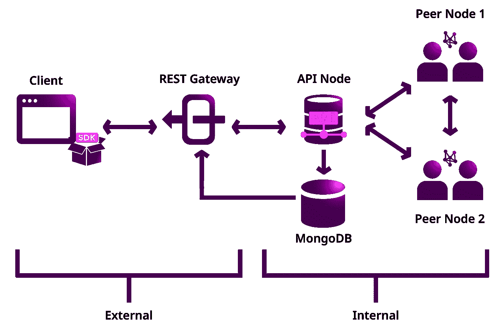

# 以太坊 2.0 vs 符号(第 4 部分):节点

> 原文：<https://medium.com/coinmonks/ethereum-2-0-vs-symbol-part-4-nodes-9448bca93a7e?source=collection_archive---------4----------------------->

## 那么，面对所有这些选择，你和我应该做些什么来为网络做贡献呢？

淋巴结就像你身体的细胞。你是由细胞组成的，但单个细胞并不能定义你。你不是变形虫。区块链也不是。你的身体由不同类型的细胞组成，区块链有不同类型的节点。你拥有构建你的心脏和大脑(以及其他器官)的细胞，没有它们你无法生存，区块链的心脏和大脑分布在各个节点上。

*以太坊 1.0 使用的工作证明有 3 种类型的节点。您可以用用不同语言编写的不同客户端来设置节点。*

## 完整节点

运行一个完整的节点意味着你在你的客户端下载以太坊区块链的全部历史。[需要巨大的存储量](https://etherscan.io/chartsync/chaindefault)。它验证块和状态，并根据轻客户端的请求提供数据。完整节点是以太坊的主干，因为它们执行共识协议并保持网络的完整性。

要成为以太坊的挖掘节点，需要是完全节点。但是，完整节点不一定是挖掘节点。

## 光节点

轻型节点只存储块头，因此不需要那么大的存储空间。在嵌入式设备和手机上托管是有用的。

## 存档节点

它是一个完整的节点，具有历史状态的存档。通常只有在需要查询特定块的数据时才需要。在向区块链探索者和链式分析者提供信息时，这很有用。这是唯一不会删除区块链数据的节点类型。

*虽然以太坊 1.0 中有 3 种类型的节点，但本质上，网络仅由完整节点保护。以太坊 2.0 有两种类型的节点，都负责网络的安全。*

## 信标节点

以太坊 2.0 的中坚力量。首先，它与以太坊 1.0 中的对等节点同步。它监听传入的验证器契约，激活验证器，为投票而打乱验证器，如果发现违反规则，就砍掉验证器的股份。通常，验证器的注册表由信标节点控制。当验证器被允许退出时，它驱逐恶意的验证器并处理验证器的退出。

 [## 以太坊 2.0 vs 符号(第二部分):共识协议

### NEM 从风险证明(PoS)衍生产品开始，以太坊一直计划从工作证明(PoW)转移到…

medium.com](/coinmonks/ethereum-2-0-vs-symbol-part-2-consensus-protocols-73e0a2589242) 

它还传播块、处理历元并与其他信标节点同步。它不处理交易或智能合约，也不需要赌注。

最终，它将协调任务并促进[碎片](https://ethereum.org/en/eth2/shard-chains/)之间的通信。

## 验证程序客户端

建议和证明块是验证器客户机的主要功能。在运行验证器客户端之前，staker 需要通过以太坊 1.0 中的一个契约来 stake 32 ETH。它将因提出和证明有助于区块终结的区块而获得奖励，并将因逃避责任或违反规则而受到惩罚。

验证器客户端类似于以太坊 1.0 中的一个完整节点。由于 Beacon Chain 使用的是利害关系证明而不是工作证明，因此验证器客户机的硬件要求比完整节点低得多。它可以在单板机和手机等消费级设备上运行，存储空间很小。

与信标节点不同，验证器客户机维护着与信标节点的专用连接。

如果你热衷于成为一名验证者，有很多方法可以做到。查看 [*这个网站*](https://www.argent.xyz/blog/eth-2-validator-setup/) *对所做选择的简洁解释。*

符号有 3 种类型的节点。

[4-layered architecture of Symbol Blockchain](https://docs.symbolplatform.com/concepts/node.html#node)

## 对等节点

它是网络的主干。它验证事务和块，运行一致性算法，创建新块，通过网络传播更改，并存储链状态。这意味着它负责收集过程，允许收集帐户[将其重要性分数委托给节点，并获得回报](https://docs.symbolplatform.com/guides/accountlink/activating-delegated-harvesting.html#activating-delegated-harvesting)。(参见[第一部分](/coinmonks/ethereum-2-0-vs-symbol-part-1-c289ac68ad2c?sk=639f0905ffcd0c76ecb20e44b272650b)和[第二部分](/coinmonks/ethereum-2-0-vs-symbol-part-2-consensus-protocols-73e0a2589242?sk=cd76097533495f30abb79c65cd693107)

对等节点相互通信以传播关于新事务和新获取的块的信息。但是，它不直接回答客户端的请求。它通过 API 节点和 REST 网关。

 [## 以太坊 2.0 vs 符号(第一部分)

### 这两款区块链都将于 2015 年发布，并且几乎同时发布了它们的 2.0 版本。与他们的第二…

medium.com](/coinmonks/ethereum-2-0-vs-symbol-part-1-c289ac68ad2c) 

## API 节点

符号区块链以插件的形式预装了用户需要的常用功能。它们可以通过 API 调用来访问。API 节点的主要作用是让交易准备好接受对等节点的验证，包括确保在将转换传递给对等节点之前， [multisig 帐户](https://docs.symbolplatform.com/concepts/multisig-account.html)所需的所有签名都已就绪。一旦事务被确认，API 节点就以更易读的形式将它们写入 MongoDB，以便于查询。API 节点比对等节点更占用内存和存储空间。

任何人都可以运行对等节点或 API 节点或双功能节点。打桩是可选的。指示结束[这里](https://docs.symbolplatform.com/guides/network/running-a-test-net-node.html)。

## 投票节点

任何拥有 300 万 XYM 或更多股份的节点(对等节点、API 节点或 dual 节点)都可以选择成为投票节点。这可以通过使用 SDK 向网络发送一个 [VotingKeyLinkTransaction](https://docs.symbolplatform.com/serialization/coresystem.html#voting-key-link) 或者仅仅让[符号引导](https://docs.symbolplatform.com/guides/network/running-a-test-net-node.html#enabling-voting)处理它来容易地完成。投票节点对于网络的最终确定非常重要。(参见[第 2 部分](/coinmonks/ethereum-2-0-vs-symbol-part-1-c289ac68ad2c?sk=639f0905ffcd0c76ecb20e44b272650b)和[第 3 部分](/coinmonks/ethereum-2-0-vs-symbol-part-3-442b0d34c857?sk=e9d448005c6e42d7907a48325af3b3fe))。点击[此处](https://docs.symbolplatform.com/concepts/reward-programs.html#voting-node-program)查看投票节点程序。

在执行其作为投票节点的职责时，它们保持其原始角色(作为对等体、API 或双功能节点)。

*补充说明:为了激励在 Symbol 早期阶段加入网络的节点所有者，将实施一项名为超级节点计划的特殊计划。超级节点所有者将会得到一笔特殊的奖金。要获得该计划的资格，所有者需要下注 100 万 XYM 及以上，并符合标准。详情查看* [*此处*](https://docs.symbolplatform.com/concepts/reward-programs.html#supernode-program) *。*

那么，面对所有这些选择，你和我应该做些什么来为网络做贡献呢？

我的看法？给你:

1.  如果你有很多 ETH 或者 XYM，或者计划购买足够的东西来做一个验证器，在 Ethereum 2.0 上设置一个验证器客户端或者在 Symbol 上运行一个投票节点。一路上你会赢得奖励。(在以太坊 2.0 中成为验证者将会锁定你 3 年，直到 Serenity 发布。)
2.  如果您没有足够的 ETH 或 XYM，但仍然希望参与并在过程中获得一些奖励，请在 Symbol 上设置一个对等节点。您将获得收获账户获得的收获奖励的 [25%。(委托收割本身就值得一个话题。此时，请注意，在 Symbol 中，运行一个节点和提出一个块(称为收获)可以由两个不同的实体来完成。)你也可以在以太坊 1.0 设置一个矿工节点。](https://docs.symbolplatform.com/concepts/harvesting.html#rewards)
3.  如果你是一个善良的撒玛利亚人，只想运行一个节点来帮助维持网络的活性，你可以在以太坊上运行一个完整的节点或信标节点，或者在 Symbol 上运行一个对等节点(根本不激活收集功能)，API 节点或双功能节点。

在撰写本文时，以太坊 2.0 和 Symbol 都没有完全上市。除了从上述选项中选择，你还需要考虑硬币的价格和区块链的大小，因为这些会影响托管节点的成本。

愿节点与你同在！

特别感谢 [Anthony](https://dev.to/anthonylaw) 审阅本文。

1.  【https://ethereum.org/en/developers/docs/nodes-and-clients/ 
2.  [https://www.ethernodes.org/](https://www.ethernodes.org/)
3.  [https://docs . eth hub . io/以太坊-路线图/以太坊-2.0/eth-2.0-客户端-架构/](https://docs.ethhub.io/ethereum-roadmap/ethereum-2.0/eth-2.0-client-architecture/)
4.  [https://block geeks . com/guides/what-are-ether eum-nodes-and-sharding/](https://blockgeeks.com/guides/what-are-ethereum-nodes-and-sharding/)
5.  [https://www.allnodes.com/host](https://www.allnodes.com/host)
6.  [https://medium . com/alethio/ether eum-2-a-validators-journey-through-the-beacon-chain-843 f 70 aaab 2e](/alethio/ethereum-2-a-validators-journey-through-the-beacon-chain-843f70aaab2e)
7.  [https://docs . pry labs . network/docs/how-prysm-works/beacon-node/](https://docs.prylabs.network/docs/how-prysm-works/beacon-node/)
8.  [https://docs.symbolplatform.com/](https://docs.symbolplatform.com/)
9.  [https://docs . symbol platform . com/concepts/block . html # finalization](https://docs.symbolplatform.com/concepts/block.html#finalization)

> 加入 Coinmonks [电报集团](https://t.me/joinchat/EPmjKpNYwRMsBI4p)，了解加密交易和投资

## 另外，阅读

*   什么是[闪贷](https://blog.coincodecap.com/what-are-flash-loans-on-ethereum)？
*   最好的[密码交易机器人](/coinmonks/crypto-trading-bot-c2ffce8acb2a) | [网格交易](https://blog.coincodecap.com/grid-trading)
*   [3 商业评论](/coinmonks/3commas-review-an-excellent-crypto-trading-bot-2020-1313a58bec92) | [Pionex 评论](/coinmonks/pionex-review-exchange-with-crypto-trading-bot-1e459d0191ea) | [Coinrule 评论](https://blog.coincodecap.com/coinrule-review-a-perfect-trading-bot)
*   [AAX 交易所评论](/coinmonks/aax-exchange-review-2021-67c5ea09330c) | [德里比特评论](/coinmonks/deribit-review-options-fees-apis-and-testnet-2ca16c4bbdb2) | [FTX 交易所评论](/coinmonks/ftx-crypto-exchange-review-53664ac1198f)
*   [n ave 零点回顾](/coinmonks/ngrave-zero-review-c465cf8307fc) | [Phemex 回顾](/coinmonks/phemex-review-4cfba0b49e28) | [PrimeXBT 回顾](/coinmonks/primexbt-review-88e0815be858)
*   [Bybit Exchange 审查](/coinmonks/bybit-exchange-review-dbd570019b71) | [Bityard 审查](https://blog.coincodecap.com/bityard-reivew) | [CoinSpot 审查](https://blog.coincodecap.com/coinspot-review)
*   [3Commas vs Cryptohopper](/coinmonks/3commas-vs-pionex-vs-cryptohopper-best-crypto-bot-6a98d2baa203)
*   最好的比特币[硬件钱包](/coinmonks/the-best-cryptocurrency-hardware-wallets-of-2020-e28b1c124069?source=friends_link&sk=324dd9ff8556ab578d71e7ad7658ad7c) | [BitBox02 回顾](/coinmonks/bitbox02-review-your-swiss-bitcoin-hardware-wallet-c36c88fff29)
*   [莱杰 vs n ave](https://blog.coincodecap.com/ngrave-vs-ledger)|[莱杰 nano s vs x](https://blog.coincodecap.com/ledger-nano-s-vs-x)
*   [密码拷贝交易平台](/coinmonks/top-10-crypto-copy-trading-platforms-for-beginners-d0c37c7d698c) | [比特码拷贝交易](https://blog.coincodecap.com/bityard-copy-trading)
*   [Vauld Review](https://blog.coincodecap.com/vauld-review)|[you hodler Review](/coinmonks/youhodler-4-easy-ways-to-make-money-98969b9689f2)|[BlockFi Review](/coinmonks/blockfi-review-53096053c097)
*   最好的[加密税务软件](/coinmonks/best-crypto-tax-tool-for-my-money-72d4b430816b) | [CoinTracking 评论](/coinmonks/cointracking-review-a-reliable-cryptocurrency-tax-software-5114e3eb5737)
*   最佳[加密借贷平台](/coinmonks/top-5-crypto-lending-platforms-in-2020-that-you-need-to-know-a1b675cec3fa) | [杠杆代币](/coinmonks/leveraged-token-3f5257808b22)
*   [莱杰纳米 S vs 特雷佐 one vs 特雷佐 T vs 莱杰纳米 X](https://blog.coincodecap.com/ledger-nano-s-vs-trezor-one-ledger-nano-x-trezor-t)
*   [block fi vs Celsius](/coinmonks/blockfi-vs-celsius-vs-hodlnaut-8a1cc8c26630)|[Hodlnaut Review](https://blog.coincodecap.com/hodlnaut-review)
*   [Bitsgap 审查](/coinmonks/bitsgap-review-a-crypto-trading-bot-that-makes-easy-money-a5d88a336df2) | [Quadency 审查](/coinmonks/quadency-review-a-crypto-trading-automation-platform-3068eaa374e1)
*   [埃利帕尔泰坦评论](/coinmonks/ellipal-titan-review-85e9071dd029) | [赛克斯斯通评论](https://blog.coincodecap.com/secux-stone-hardware-wallet-review)
*   [DEX Explorer](https://explorer.bitquery.io/ethereum/dex) | [区块链 API](https://explorer.bitquery.io/graphql)|[local bitcoins 审核](https://blog.coincodecap.com/localbitcoins-review)
*   最佳[区块链分析](https://bitquery.io/blog/best-blockchain-analysis-tools-and-software)工具| [赚比特币](https://blog.coincodecap.com/earn-bitcoin)
*   [加密套利](/coinmonks/crypto-arbitrage-guide-how-to-make-money-as-a-beginner-62bfe5c868f6)指南:新手如何赚钱
*   最佳[加密制图工具](/coinmonks/what-are-the-best-charting-platforms-for-cryptocurrency-trading-85aade584d80) | [最佳加密交易所](/coinmonks/crypto-exchange-dd2f9d6f3769)
*   了解比特币最好的[书籍有哪些？](/coinmonks/what-are-the-best-books-to-learn-bitcoin-409aeb9aff4b)

> [直接在您的收件箱中获得最佳软件交易](/coinmonks/newsletters/coinmonks)

