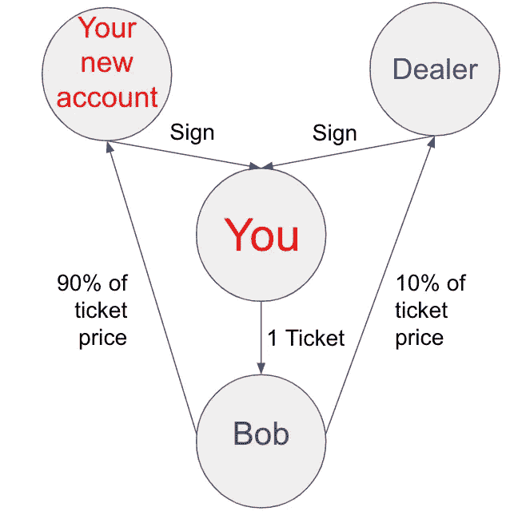

# 以太坊 2.0 vs 符号(第五部分):可替换令牌

> 原文：<https://medium.com/coinmonks/ethereum-2-0-vs-symbol-part-5-fungible-tokens-73dcc7c6fb71?source=collection_archive---------1----------------------->

## ERC-20 和马赛克

当我们谈论物理世界中的符号化时，我们希望将无形的东西变得有形。例如,“感谢的象征”就是我们如何通过用礼物来表达无形的“感谢”,使之变得有形。而在数字或虚拟世界中，当我们谈论标记化时，我们希望将一些有形的东西变成无形的。例如，将美元与美元挂钩。

标记化是区块链的一个重要且最常用的功能。它允许资产在没有中介的情况下从一方转移到另一方。有两类代币，可替换的和不可替换的。可替代代币就像忠诚度积分或金钱。比如，我们俩都有一块钱，如果我们交换，我们俩还是一块钱。价值不会改变。不可替换的令牌就像护照一样。假设我们都持有同一个国家签发的护照。它们从外面看起来是一样的，但是里面列出的信息是不同的。如果我们交换护照，他们不再真正代表我们，因为每本护照都是独一无二的。

## ERC-20

一般来说，以太坊中的令牌是通过向网络部署智能合约来生成的。由于以太坊的智能合约非常通用，这也意味着任何人都可以部署智能合约来创建任何格式的令牌。想象一下，如果我们申请护照时没有标准的表格，每个人都可能以不同的顺序提交他们的个人信息，这对官员来说将是一个大难题。因此，为了更好的用户体验，尤其是像交易所这样的实体，引入了一个标准——ERC-20。这是目前最常用的标准。点击[这里](https://etherscan.io/tokens)查看 ERC-20 代币列表。

ERC-20 的智能合约被称为象征性合约。ERC-20 令牌合约中有 6 个强制功能和 3 个可选功能(第 7-9 项)。

1.  totalSupply():这表示流通中有多少令牌。这是部署智能合约时唯一需要有值的函数。
2.  balanceOf(address):返回地址拥有的令牌数。
3.  transfer(address，value):将所述数量的令牌移动到提到的地址。
4.  transferFrom(发送者的地址，接收者的地址，值):将所述数量的令牌从发送者移动到接收者。当您使用令牌支付服务费用时，这很有用，这意味着您需要调用另一个契约。
5.  approve(花费者的地址，值):这允许第三方地址花费令牌所有者设置的总额。
6.  津贴(所有者的地址，支出者的地址):返回支出者仍然被允许代表所有者消费的代币的余额。
7.  name():您要赋予令牌的名称。由于没有令牌契约的中央注册中心，因此名称的唯一性得不到保证。
8.  symbol():名称()的简称。例如 OmiseGO 的“OMG”。通常是股票。不保证唯一性。
9.  decimal():指示要显示的标记。以太坊的最大整除数是 18。以太坊不处理十进制。这是为了视觉目的。

稍后将通过一个例子解释每个功能的工作原理。

有两个事件涉及到代币合约。

1.  Transfer(发送方地址、接收方地址、值):该事件触发令牌从一个地址到另一个地址的传输。如果目标地址是合同地址，则触发合同中的代码。
2.  Approve(所有者的地址，支出者的地址，值):调用此事件以允许第三方代表所有者转移资金，通常是服务合同。它还规定了允许的总额。如果代币的所有者向同一个消费地址发送几个呼叫，它将取代前一个。

现在我们已经讨论了与令牌协定相关的函数和事件，为了便于说明，让我们从一个例子开始。

说您想要创建一个令牌来代表一张音乐会的门票。你从准备智能合同开始。你命名()它为“concertTicket”，符号为()“CTC”。由于分割票证没有意义，因此小数()将为“0”。所有这些函数都是可选的，但是您必须声明 totalSupplyl()的值。如果您计划销售 1，000 张票，请将该值设置为 1，000。其余的功能需要符合 ERC-20 标准。

然后，通过将令牌智能合约发送到地址“0x0”来部署令牌智能合约。事实上，**你实际上并没有创造代币，你创造了记录代币所有权和所有权转移的分类账/合同/地图。**让我解释一下这一点以及关于其他功能的其他问题。*在这一过程中，可能会有其他功能被纳入，但不会被带入讨论，以保持简单。区块链是个兔子洞。*

The ledger/map of addresses with CTC balance.

部署“CTC”令牌合同后，您现在可以开始销售音乐会门票。假设 Alice 从你这里买了一张票，你想把票寄给她。你调用函数 transfer(Alice 的地址，1 票)。此事件将触发事件转移(您的地址，爱丽丝的地址，1 张门票)，并更改您(从 1000 到 999)和爱丽丝(从 0 到 1)拥有的门票余额。

The ledger/map of addresses with CTC balance.

说你还指定了一个经销商代表你卖 100 张票，你需要授权经销商代表你转让票。您需要致电批准(经销商的地址，100 张票)。它将触发事件批准(您的地址、经销商的地址、100 张门票)并将允许经销商销售的津贴余额更改为 100 张门票。请注意，这不会改变您地址中 CTC 的平衡。

The ledger/map of addresses with CTC allowance to spend.

当经销商向 Bob 出售一张门票时，经销商将调用函数 transferFrom(您的地址，Bob 的地址，1 张门票)。这将把您的地址的票余额更改为 998，Bob 的地址更改为 1，经销商的津贴更改为 99。

The ledger/map of addresses with CTC balance.

The ledger/map of addresses with CTC allowance to spend.

当您想要检查一个地址拥有的令牌时，调用函数 balanceOf(address)。当你想知道允许第三方移动的代币的余额时，称为 allowance(拥有者的地址，花费者的地址)。

至此，我们已经涵盖了与令牌合约相关的所有功能和事件。您可能已经注意到，与 CTC 音乐会门票令牌所有权转移相关的所有操作都只发生在令牌合同本身内。

以太坊有两种类型的账户。这两个帐户都是:

*   用地址从 0x 开始表示，
*   可以接收、发送和保存以太网和令牌，以及
*   可以与部署的智能合约进行交互。

1.  外部拥有的账户(EOA):用户拥有的账户，创建它不需要任何交易费用。它由一个私有和公共密钥对组成。它可以发起交易。
2.  合约帐户:通过部署智能合约创建。因此，它需要交易费，因为它使用网络存储。它没有私钥，因此不能签署交易。代币的所有权只有在收到触发代码的交易时才能易手。

ERC-20 有几个已知的问题需要格外小心。首先，事件处理问题。接收方不会被通知有交易进入，也不能拒绝任何有效的交易。如果发送到正确的地址，这不是问题。这里，我说的不是 A 想把代币发给 B，却不小心发给了 c，我说的是 A 本来想发给另一个 EOA，却不小心发给了一个合约账户。更糟糕的是，如果你发送给它的合同帐户不处理你发送的令牌，它将留在中间状态。

第二，批准()问题。正如在介绍令牌合同的功能时提到的，新的 approve()取代了以前的 approve()。如果支出者注意到批准的津贴发生了变化，则撤回以前的津贴，并在新的 approve()到来时再次撤回。

有针对这些问题提出的补救措施，如 ERC-223 将解决第一个问题。虽然向后兼容，但并不常用。以太坊是非常通用的，可以编写一些函数来解决这些问题。仔细彻底的思考过程和测试是至关重要的。

*补充说明:* ETH 不是 ERC-20，因为它是在标准建立之前创建的。与 ERC-20 相关的其他主题，如 ERC-223 如何解决这个问题，将在其他文章中讨论。

## 马赛克

T 他可替换的象征符号——马赛克，就是插件中的一个。马赛克的标准在平台发布之前就已经设定好了。符号的原生令牌 XYM 本身就是一个马赛克。关于插件请参考[第三部](/coinmonks/ethereum-2-0-vs-symbol-part-3-442b0d34c857?sk=e9d448005c6e42d7907a48325af3b3fe)。

 [## 以太坊 2.0 vs 符号(第三部分)

### 智能合同和插件

medium.com](/coinmonks/ethereum-2-0-vs-symbol-part-3-442b0d34c857) 

一个马赛克有 [6 个可配置属性](https://docs.symbolplatform.com/concepts/mosaic.html#properties)。

1.  初始供应:最初创建的马赛克的初始数量。一个马赛克的最大数量是 90 亿。
2.  可分性:这表明马赛克是如何可分的。马赛克的最大整除数是 6。
3.  持续时间:马赛克将在持续时间结束后过期。如果要创建无过期镶嵌，请将该属性设置为零。否则马赛克的最大寿命是 3650 天。过期后不可更新。
4.  Suply mutable:这是一个布尔型字段。当设置为“真”时，镶嵌的总供应量可以在严格的规则下改变。只有创造者能改变马赛克的总供应量。
5.  可转移:这是一个布尔型字段。当它设置为“真”时，马赛克可以在任何帐户之间自由交换。否则，创建者可以将它转移到任何帐户，但它只能将其转移回创建者。不属于任何其他账户。
6.  Restrictable:这是一个布尔型字段。当设置为“真”时，可以在镶嵌图上设置更高级的规则。这将涉及到另一个插件——马赛克限制*。*

*如前所述，Symbol 不遵循智能合约概念，而是使用插件。要创建马赛克，您需要调用相关的事务—*MosaicDefinitionTransaction*和*MosaicSupplyChangeTransaction*。为了简化开发，提供了 6 个属性，可用的 SDK 将负责其余的执行。*

*让我们举一个之前用过的例子。您将初始供应量设置为 1，000，代表音乐会门票；将整除率设置为零；将持续时间设置为音乐会后的两个月，因为您不希望任何未使用的门票仍然可用；将供应可变性设置为“false ”,因为您不打算更改座位的数量；设置“false”使门票不可转让，因为您不希望买方以更高的价格转售门票；您设置“真”来限制马赛克。*

*创建马赛克时，除了交易费之外，还会向 sink 帐户支付一次性费用。你可能已经注意到了，我没有提到关于马赛克的名字。在 Symbol 中，镶嵌由 64 位无符号整数表示。为了给马赛克命名，涉及到另一个叫做 Namespace 的插件，我们将在另一个时间讨论它。现在，请注意，这是可能的，使马赛克更容易辨认。*

*在 Symbol 中，有两种类型的帐户:*

1.  *[账号](https://docs.symbolplatform.com/concepts/account.html#):私人和公共密钥对。这是存放所有马赛克的地方。在 Symbol 中，每个帐户拥有的马赛克余额记录在帐户状态中。*
2.  *[多联账户](https://docs.symbolplatform.com/concepts/multisig-account.html):账户转换而来。转换后，它不能再启动任何事务。它仍然可以像普通帐户一样做任何事情。它可以持有马赛克并发送交易，但交易必须由拥有托管权的账户发起。你可以把它想象成一个联名银行账户。*

*现在，你可以开始卖票了。爱丽丝想买一张票。她付给你 XYM(象征本国货币)，你送她一张票。双方都需要调用一个[*transfer transaction*](https://docs.symbolplatform.com/concepts/transfer-transaction.html)插件来进行交换。现在，你将拥有 999 张票，爱丽丝拥有一张。您也可以通过使用[聚合事务](https://docs.symbolplatform.com/concepts/aggregate-transaction.html)插件使交换自动发生。*

**

*All these can be done in an aggregate transaction.*

*你不能指定一个经销商把票从你的账户中转出。此外，由于您已经将票证的“transferrable”属性设置为“false”。因此，门票只能转让给买方一次，买方将在音乐会当天将门票转让给你。但是，您可以将创建门票的帐户更改为 Multisig 帐户，并添加经销商以共同保管门票。您可以使用售票应用程序来创建交易，在买家付款时，将 10%的佣金发送给经销商，将 90%的佣金发送到您的帐户。假设经销商卖给鲍勃一张票，他付款，90%给你，10%给经销商。之后，您和经销商都签署了一项交易，从 Multisig 帐户向 Bob 发送一张彩票。所有这些都可以是一个，就像在一个使用聚合事务的事务中一样。*

*说这是一场 Lady Gaga 的演唱会，而且只有一场。1000 张票肯定不够大家用。所以，你决定只卖给她的粉丝俱乐部成员。因为您已经将“Restrictable”属性设置为“true ”,所以您将能够添加高级功能来处理这个问题。*

*需要配置两个部分。首先，限制门票马赛克可转移到被标记的帐户。第二，粉丝的账户需要由处理 KYC(了解你的客户)过程的人来标记。有了这些设置，非球迷的帐户将无法收到门票马赛克。*

*至此，我们已经了解了 Mosaic 的特性和行为。*

## *仔细观察不同之处*

1.  *创建马赛克的标准是预先设定的，并且必须遵守。所有马赛克都可以转让给任何帐户，除非它们是不可转让的或有限制。即便如此，交易还是会失败，不会有马赛克被打入冷宫。马赛克被认为永远丢失的唯一方式是持有马赛克的帐户丢失了其私钥。这个问题适用于整个区块链。*
2.  *只有一种方法可以转移马赛克，那就是通过 TransferTransaction。即使使用了聚合事务，TransferTransaction 仍会在聚合事务中处理。*

*总之，ERC-20 和 Mosaic 都很灵活。他们不是一个平面模型，每个部分都必须进入它的确切位置来完成模型。除了一些你需要遵循结构的框架，你可以发挥你的想象力来构建各种各样的应用程序。*

> *而以太坊智能合约就像 Play-Doh，符号插件就像乐高。——以太坊 2.0 vs 符号(第三部分)*

*我们知道，以太坊用途广泛。你可以让 dApp 以任何方式运行。你只需要确保它经过良好的测试，以抵御任何恶意行为。*

*如果你需要令牌来执行复杂的规则，以太坊是个不错的选择。如果您需要标记您的资产以便于跟踪和转移，Symbol 的 Mosaic 因其简单性和经过良好测试的系统而成为明显的赢家。*

*知道刀可以切割是基本知识。知道如何利用刀子是一种力量。你不需要大砍刀来涂黄油。*

*特别感谢 [Anthony](https://dev.to/anthonylaw) 审阅本文。*

** *保留所有翻译权利。**

**参考文献:**

1.  *[https://eips.ethereum.org/EIPS/eip-20](https://eips.ethereum.org/EIPS/eip-20)*
2.  *[https://ethereum.org/en/developers/docs/accounts/](https://ethereum.org/en/developers/docs/accounts/)*
3.  *[https://medium . com/@ dex aran 820/ERC 20-token-standard-critical-problems-3c 10 FD 48657 b](/@dexaran820/erc20-token-standard-critical-problems-3c10fd48657b)*
4.  *[https://medium . com/@ jgm . orinoco/understanding-ERC-20-token-contracts-a809a 7310 aa 5 #:~:text = Essentially % 2C % 20a % 20 token % 20 contract % 20 is，a % 20third % 20the 持有人的% 20 信誉](/@jgm.orinoco/understanding-erc-20-token-contracts-a809a7310aa5#:~:text=Essentially%2C%20a%20token%20contract%20is,a%20third%20the%20holder%27s%20reputation)*
5.  *[https://www . LinkedIn . com/pulse/ERC-223-token-standard-kiran-Kumar/](https://www.linkedin.com/pulse/erc-223-token-standard-kiran-kumar/)*
6.  *[https://docs.symbolplatform.com/concepts/mosaic.html](https://docs.symbolplatform.com/concepts/mosaic.html)*

> *加入 Coinmonks [Telegram group](https://t.me/joinchat/EPmjKpNYwRMsBI4p) 并了解加密交易和投资*

## *另外，阅读*

*   *什么是[闪贷](https://blog.coincodecap.com/what-are-flash-loans-on-ethereum)？*
*   *最好的[密码交易机器人](/coinmonks/crypto-trading-bot-c2ffce8acb2a) | [网格交易](https://blog.coincodecap.com/grid-trading)*
*   *[3 商业评论](/coinmonks/3commas-review-an-excellent-crypto-trading-bot-2020-1313a58bec92) | [Pionex 评论](/coinmonks/pionex-review-exchange-with-crypto-trading-bot-1e459d0191ea) | [Coinrule 评论](https://blog.coincodecap.com/coinrule-review-a-perfect-trading-bot)*
*   *[AAX 交易所评论](/coinmonks/aax-exchange-review-2021-67c5ea09330c) | [德里比特评论](/coinmonks/deribit-review-options-fees-apis-and-testnet-2ca16c4bbdb2) | [FTX 交易所评论](/coinmonks/ftx-crypto-exchange-review-53664ac1198f)*
*   *[n 零复习](/coinmonks/ngrave-zero-review-c465cf8307fc) | [Phemex 复习](/coinmonks/phemex-review-4cfba0b49e28) | [PrimeXBT 复习](/coinmonks/primexbt-review-88e0815be858)*
*   *[Bybit Exchange 审查](/coinmonks/bybit-exchange-review-dbd570019b71) | [Bityard 审查](https://blog.coincodecap.com/bityard-reivew) | [CoinSpot 审查](https://blog.coincodecap.com/coinspot-review)*
*   *[3 commas vs Cryptohopper](/coinmonks/3commas-vs-pionex-vs-cryptohopper-best-crypto-bot-6a98d2baa203)|[赚取加密利息](/coinmonks/earn-crypto-interest-b10b810fdda3)*
*   *最好的比特币[硬件钱包](/coinmonks/the-best-cryptocurrency-hardware-wallets-of-2020-e28b1c124069?source=friends_link&sk=324dd9ff8556ab578d71e7ad7658ad7c) | [BitBox02 回顾](/coinmonks/bitbox02-review-your-swiss-bitcoin-hardware-wallet-c36c88fff29)*
*   *[总账 vs n 平均](https://blog.coincodecap.com/ngrave-vs-ledger) | [总账 nano s vs x](https://blog.coincodecap.com/ledger-nano-s-vs-x)*
*   *[密码拷贝交易平台](/coinmonks/top-10-crypto-copy-trading-platforms-for-beginners-d0c37c7d698c) | [比特码拷贝交易](https://blog.coincodecap.com/bityard-copy-trading)*
*   *[Vauld Review](https://blog.coincodecap.com/vauld-review)|[you hodler Review](/coinmonks/youhodler-4-easy-ways-to-make-money-98969b9689f2)|[BlockFi Review](/coinmonks/blockfi-review-53096053c097)*
*   *最好的[加密税务软件](/coinmonks/best-crypto-tax-tool-for-my-money-72d4b430816b) | [硬币追踪评论](/coinmonks/cointracking-review-a-reliable-cryptocurrency-tax-software-5114e3eb5737)*
*   *最佳[加密借贷平台](/coinmonks/top-5-crypto-lending-platforms-in-2020-that-you-need-to-know-a1b675cec3fa) | [杠杆代币](/coinmonks/leveraged-token-3f5257808b22)*
*   *[莱杰 Nano S vs 特雷佐 one vs 特雷佐 T vs 莱杰 Nano X](https://blog.coincodecap.com/ledger-nano-s-vs-trezor-one-ledger-nano-x-trezor-t)*
*   *[block fi vs Celsius](/coinmonks/blockfi-vs-celsius-vs-hodlnaut-8a1cc8c26630)|[Hodlnaut Review](https://blog.coincodecap.com/hodlnaut-review)*
*   *[Bitsgap 审查](/coinmonks/bitsgap-review-a-crypto-trading-bot-that-makes-easy-money-a5d88a336df2) | [Quadency 审查](/coinmonks/quadency-review-a-crypto-trading-automation-platform-3068eaa374e1)*
*   *[埃利帕尔泰坦评论](/coinmonks/ellipal-titan-review-85e9071dd029) | [赛克斯斯通评论](https://blog.coincodecap.com/secux-stone-hardware-wallet-review)*
*   *[DEX Explorer](https://explorer.bitquery.io/ethereum/dex)|[w](https://explorer.bitquery.io/graphql)|[local bitcoins 评论](https://blog.coincodecap.com/localbitcoins-review)*
*   *最佳[区块链分析](https://bitquery.io/blog/best-blockchain-analysis-tools-and-software)工具| [赚比特币](https://blog.coincodecap.com/earn-bitcoin)*
*   *[加密套利](/coinmonks/crypto-arbitrage-guide-how-to-make-money-as-a-beginner-62bfe5c868f6)指南:新手如何赚钱*
*   *最佳[加密制图工具](/coinmonks/what-are-the-best-charting-platforms-for-cryptocurrency-trading-85aade584d80) | [最佳加密交易所](/coinmonks/crypto-exchange-dd2f9d6f3769)*
*   *[如何在印度购买比特币](https://blog.coincodecap.com/buy-bitcoin-app-india)？*
*   *[印度比特币交易所](/coinmonks/bitcoin-exchange-in-india-7f1fe79715c9) | [比特币储蓄账户](https://blog.coincodecap.com/bitcoin-savings-account)*
*   *了解比特币的[最佳书籍有哪些？](/coinmonks/what-are-the-best-books-to-learn-bitcoin-409aeb9aff4b)*

> *[直接在您的收件箱中获得最佳软件交易](/coinmonks/newsletters/coinmonks)*

**