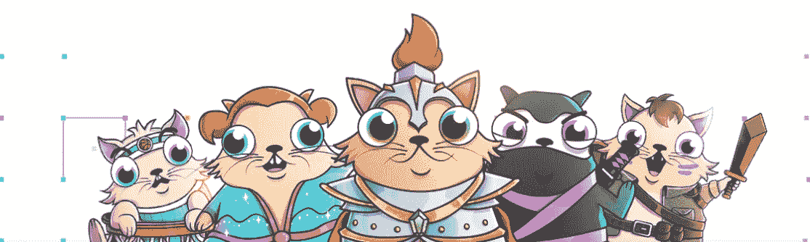
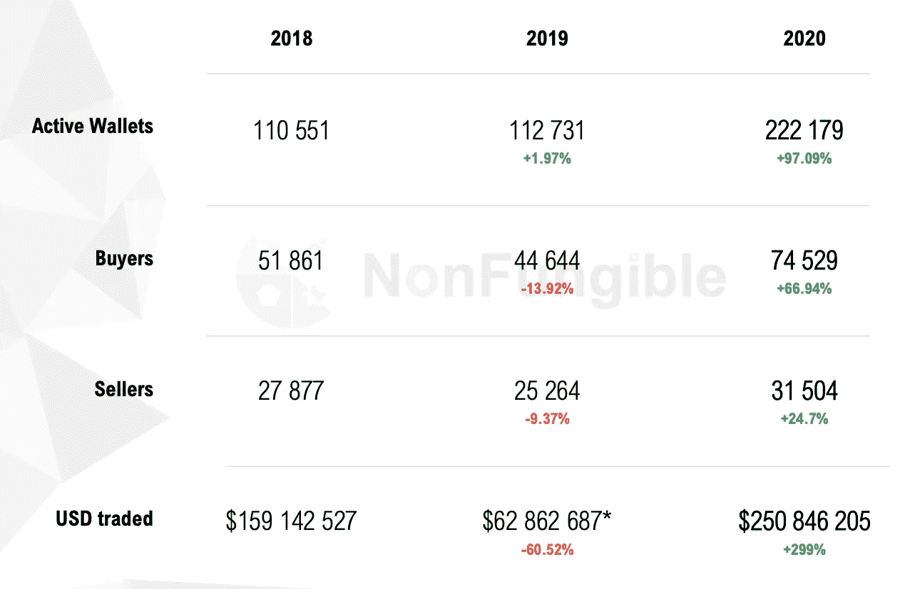
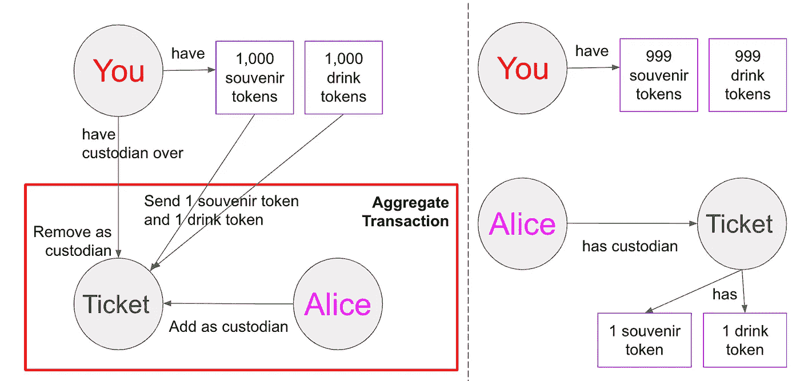
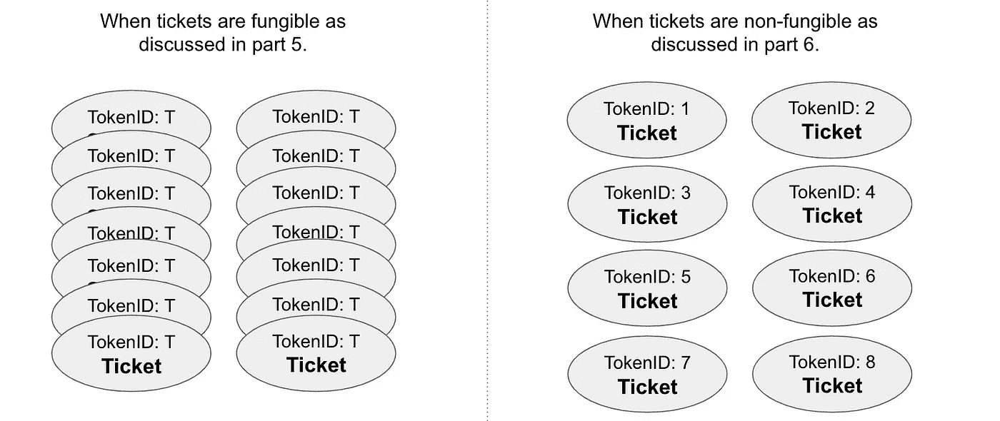
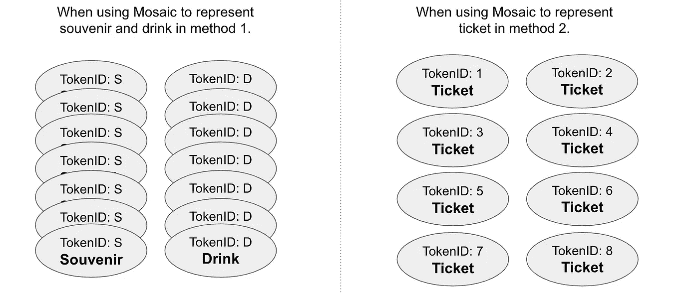
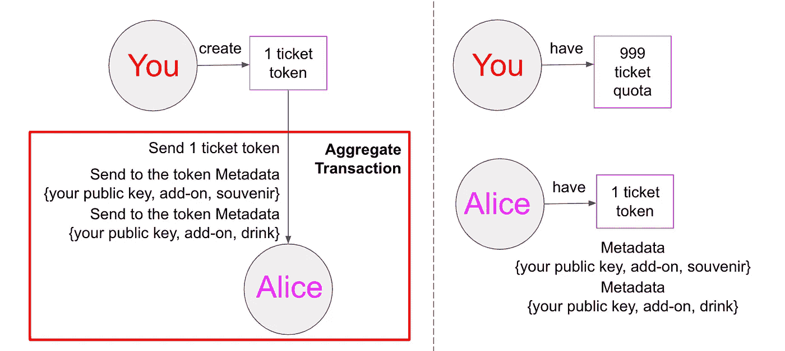

# 以太坊 2.0 vs 符号(第 6 部分):不可替换的令牌

> 原文：<https://medium.com/coinmonks/ethereum-2-0-vs-symbol-part-6-non-fungible-tokens-42290ce34854?source=collection_archive---------5----------------------->

Source: [https://www.cryptokitties.co/](https://www.cryptokitties.co/)

你是许多人中的一个；你是独一无二的。你具有人类的共同特征，然而你是独一无二的。你是不可替代的。

区块链允许各方在没有中介的情况下交换资产。有时，我们交换一些可互换的东西，比如不同面值的钱。有时候，我们会用一些可替代的东西来交换一些独特的东西，比如付钱买房子，或者用一些独特的东西来交换另一个独特的东西，比如用口袋妖怪交易卡来交换另一个。这就是不可替代令牌(NFT)发挥作用的地方。

Source: NonFungible.com. Trade volumes of NFTs.

尽管 NFT 交易不像加密货币交易那样普遍，但它肯定会火起来。据 NonFungible.com 称，2020 年，非金融交易的交易额同比增长 299%，超过 2.5 亿美元。非功能性钱包的活跃用户数量也显著增加。似乎市场已经为越来越多的玩家做好了准备。

## ERC-721

RC-721 是以太坊的 NFT 标准。以太坊上的大多数非功能性传输都符合 ERC-721 标准。最近流行的密码朋克不是 ERC-721 的代币，因为它的产生早于 ERC-721。然而，密码朋克的主人可以[用 ERC-721 标准包装代币，以便于交换](https://www.nasdaq.com/articles/cryptopunk-bounties%3A-ark.gallery-rolls-out-blind-bids-on-8-bit-nft-collectibles-2020-10-06)。

CryptoPunks

> ***crypto 朋克*** 于 2017 年 6 月作为首批[不可替代令牌](https://en.wikipedia.org/wiki/Non-fungible_token) (NFT)在[以太坊](https://en.wikipedia.org/wiki/Ethereum) [区块链](https://en.wikipedia.org/wiki/Blockchain)上发布。……[加密艺术](https://en.wikipedia.org/wiki/Crypto_art) [区块链](https://en.wikipedia.org/wiki/Blockchain)项目是 NFTs 的 ERC-721 标准和现代加密艺术运动的灵感来源。—Wikipedia.com

与创建 ERC-20 令牌一样，您实际上并没有创建 ERC-721 令牌，而是创建了记录令牌所有权和所有权变更的分类账/地图/合同。

制造一架 ERC-721 NFT 比制造一架 ERC-20 复杂得多，因为每架 ERC-721 都是独一无二的。以 CryptoKittie 为例，涉及 [7 个智能合约](https://github.com/cryptocopycats/awesome-cryptokitties-bubble/tree/master/contracts)。根据 NFTs 的目的，智能合同可能会有很大不同。CryptoKittie 智能合同涉及混合小猫的基因，而另一个受欢迎的 NFT [NBA Top Shot](https://www.nbatopshot.com/) 涉及短片，称为 Moments。在本文中，我们将只集中讨论 ERC-721 标准。

 [## 以太坊 2.0 vs 符号(第五部分):可替换令牌

### ERC-20 和马赛克

medium.com](/coinmonks/ethereum-2-0-vs-symbol-part-5-fungible-tokens-73dcc7c6fb71) 

下面是一个 ERC-721 标准的功能:*(为了行文简洁，除非必要，这里将不讨论一些异常或交易失败原因等细节。参见* [*文档*](https://eips.ethereum.org/EIPS/eip-721) *。)*

1.  balanceOf(所有者地址):该函数调用属于同一个 ERC-721 的唯一令牌的数量。例如，它返回该地址在密码 kittie ERC-721 下拥有的小猫数量。
2.  ownerOf(令牌 ID):ERC-721 中的每个令牌都有自己唯一的 ID，以区别于其他对等体。该函数返回特定令牌的所有者地址。
3.  safeTransferFrom(所有者地址、接收者地址、令牌 ID、数据):这个函数将特定的令牌从所有者转移到新的所有者。可由拥有者/操作者/批准的地址(msg.sender)调用。此函数检查令牌是否属于所述的所有者地址，并检查接收者是否是合同地址。如果它是一个合同地址，它调用另一个接口(稍后解释)以确保合同处理 ERC-721。否则，转移将不会发生。该功能还允许附加没有特定格式的额外数据。
4.  safetransform(所有者地址、接收者地址、令牌 ID):与另一个 safetransform 函数相同，但是没有附加额外的数据。
5.  transferFrom(所有者地址、接收者地址、令牌 ID):将令牌从所有者转移到下一个所有者。发送方(msg.sender)负责确保接收方能够收到令牌。否则，令牌可能会永远丢失。不如使用 safeTransferFrom 安全。
6.  approve(地址由所有者批准，令牌 ID):令牌的所有者调用此函数来批准第三方代表管理特定令牌。
7.  setApprovalForAll(operator 的地址，布尔值):令牌的所有者调用此函数来批准或撤销对操作员的任何任命，以管理所有者的所有令牌。
8.  getApproved(token ID):该函数返回被批准管理特定令牌的地址。
9.  isApprovedForAll(所有者的地址，操作员的地址):该函数检查操作员是否得到所有者的批准。

有 3 个事件:

1.  Transfer(所有者的地址、接收者的地址、令牌 ID):当所有权发生转移时，以及当令牌被创建和销毁时，将发出该事件。*与函数 transferFrom()和 safeTransferFrom()相关。*
2.  批准(所有者地址、所有者批准的地址、令牌 ID):当地址被批准或重新确认以管理令牌时，将发出此事件。当令牌所有权转移给新的所有者时，批准会自动撤销。*与职能批准()相关。*
3.  ApprovalForAll(所有者的地址，操作者的地址，布尔值):当一个地址被指定或撤销为操作者来管理所有所有者的令牌时，会发出此事件。*与函数 setApprovalForAll()相关。*

你可能已经注意到 ERC-721 的名称()、符号()和小数()没有被提及。首先，由于 ERC-721 标准的每个令牌都是独一无二的，对其进行划分是没有意义的，因此，小数点()在这里是不相关的。为了使代币交易更加安全，引入了 ERC-165 来检测每个契约所采用的接口。在 ERC-165 下有许多接口，其中之一是“ERC721Metadata ”,其中声明了 name()、symbol()和 tokenURI()。“ERC721Enumerable”说明总供应量、令牌索引和每个令牌的所有者。每个 ERC-165 接口由一个标识符表示。例如，ERC721Metadata 的标识符为`*0x5b5e139f*`，而 ERC721Enumerable 的标识符为`*0x780e9d63.*`，合同账户接收 ERC-721 令牌的接口为“ERC721TokenReceiver”，标识符为`*0x150b7a02*`。

检查合同是否实现了任何 ERC-165 接口的方法，请参见此处的。ERC-165 也适用于 ERC-20。

继续第 5 部分的音乐会门票用例，让我们看看 ERC-720 是如何工作的。

ERC-721 合同被创建，其符号为“CTC ”,并且总共供应 1000 张独特的机票。你，组织者，将根据门票等级和座位号出售门票，价格不同。与每张票一起，买家可以选择附加产品，如纪念品和饮料(所有的纪念品和饮料都是一样的)。附加组件选择将由票务应用程序处理，并将被传递给创建新票证令牌的智能合约。假设 Alice 购买了一张带有纪念品的高级门票作为附加产品，售票应用程序将触发智能合同来创建唯一的 CTC 令牌，支付和门票易手。您调用 safeTransferFrom()将票安全地传输给 Alice。*(还涉及 ERC721Enumerable，ERC721Metadata)*

你还决定指定一个经销商。因此，您通过调用 setApprovalForAll()来批准经销商的地址，以处理在 CTC ERC-721 下创建的令牌。根据整个票务应用的架构，其他功能的一些安全和权限问题可能需要仔细考虑。然后，经销商可以出售门票，并调用 safeTransferFrom()将门票转让给买家。

其他函数大多是查询令牌、所有者或操作者信息的“GET”方法。类似功能说明参见[第 5 部分](/coinmonks/ethereum-2-0-vs-symbol-part-5-fungible-tokens-73dcc7c6fb71?sk=620ca92498cca91ae07b44d9d0aa51de)。

爱丽丝说，如果在任何情况下都想充值，你可以[通过调用另一个函数来编辑令牌的 URI](https://ethereum.stackexchange.com/questions/87853/updating-erc-721-tokens-metadata-after-it-was-minted) 。经销商可能有权这样做，这取决于所给予的访问权限。所有这些都可以通过不同的方式完成，可以是链上的，也可以是链下的，这取决于你希望你的票务应用有多分散。

## 帐户和马赛克

目前，Symbol 中的不可替换令牌还没有任何具体的标准集。有许多方法可以做到这一点，我将用两种方法来处理这个问题。

T 他第一个方法，用一个[账号](https://docs.symbolplatform.com/concepts/account.html)来代表某个独一无二的东西。帐户由私有和公共密钥对组成，并且是唯一的。使用我们一直在使用的同一个票务示例，不同价位的门票是唯一的，因此是不可替代的。这里还有一些可替换的元素，纪念品和饮料，我们将用[马赛克](https://docs.symbolplatform.com/concepts/mosaic.html)来表示。

作为音乐会的组织者，您将创建 1000 个帐户，代表 1000 张音乐会门票。所有这 1000 个账户都需要转换成 [Multisig 账户](https://docs.symbolplatform.com/concepts/multisig-account.html)(一个有托管人的账户)以便转移所有权。你还用马赛克创造了 1000 个纪念品和 1000 个饮料纪念品。(*在这个用例中，您还可以使用元数据来替换马赛克。)*

当 Alice 想买票时，您可以通过将 Alice 添加为 Multisig 帐户的联署人来转移所有权，并删除您自己的所有者身份。由于 Alice 也想购买饮料作为附加服务，您将“饮料”令牌转移到 Alice 现在拥有的 Multisig 帐户。所有这些都可以在一个[聚合事务](https://docs.symbolplatform.com/concepts/aggregate-transaction.html)中完成。现在，爱丽丝拥有了“饮料”附带的“门票”。如果 Alice 想要添加纪念品，您可以将“纪念品”令牌转移到 Alice 的“门票”Multisig 帐户。

Transfer of ticket ownership to Alice.

如果您决定指定一个经销商，请将该经销商的账户添加为代表“门票”的 Multisig 账户的保管人之一，以及持有“纪念品”和“饮料”代币的账户。其余的程序将与组织者没有什么不同。需要仔细考虑授权和访问，以避免滥用权力。

第二种方法，用马赛克来表示彩票，但是使用[元数据](https://docs.symbolplatform.com/concepts/metadata.html)来区分每个马赛克。首先，创建 1000 个马赛克，每个马赛克代表一张独特的门票。**注意**:与[第 5 部分](/coinmonks/ethereum-2-0-vs-symbol-part-5-fungible-tokens-73dcc7c6fb71?sk=620ca92498cca91ae07b44d9d0aa51de)不同的是，我们创建了 1 个“CTC”马赛克，有 1000 个副本，但只有一个标识符，这里我们创建了 1000 个马赛克，每个马赛克都有自己的标识符。

Comparing tickets as fungible and non-fungible tokens.

Comparing method 1 and method 2.

由于一个镶嵌不能拥有另一个镶嵌，因此，我们将使用元数据来标记插件镶嵌。每个镶嵌图都可以附加多个元数据。Alice 想买一张带有纪念品的票作为附加品，您传输代表她喜欢的座位号的特定马赛克，并向其添加元数据`{ your public key, add-on, souvenir }`。元数据是元组形式的，包括添加元数据的帐户和键值对。当 Alice 想要添加饮料作为附加组件时，您将向 Alice 的 ticket Mosaic 发送另一个元数据事务。

Transfer of ticket ownership to Alice.

对经销商的处理将与方法一相同。

**注意**:对于这两种方法，您都可以根据需要创建代表门票的账户和马赛克。这里不讨论门票总供应量的控制。

> *更新:对于这个例子，元数据是合适的。对于一些需要将令牌与特定商品绑定的 NFT，比如数字艺术，我不会选择元数据。请看符号上的*[*【NFT】:元数据还是不是？*](https://www.youtube.com/watch?v=CF4Ilclnwsw) *了解更多详情。*

每一个不可替代的令牌都是独一无二的。它可以有多种设计方式。我已经用第一种方法为区块链符号上的一个名为“训练你的狗”的游戏提出了一个概念验证。在开始构建它之前，我打算研究设计它的不同方法。

 [## ivyfung1/trainyourdog

### 不拥有龙？！没问题，反正狗比较好接近。虚拟的更容易。拿起你的并开始…

github.com](https://github.com/ivyfung1/trainyourdog) 

有几个问题很重要，在决定之前应该考虑:

1.  转让的便利性。为了吸引用户，用户界面需要易于使用和直观。虽然听起来与区块链无关，但是，在某种程度上，它们是交织在一起的。
2.  区块链上的每一笔交易都需要支付交易费。因此，为了节省交易费用，需要仔细考虑申请的步骤和流程。
3.  有些功能最好在链外处理，不会降低应用程序的可信度。仔细考虑这一点，因为它会节省你的交易费用或成本你的声誉。
4.  最重要的一点是:交易所喜欢什么样的格式。只有可交易的 NFT 才有实际价值。

由于要令牌化的资产的性质，可能会有比我提到的更重要的问题。但是，我们不要去那个兔子洞。

准备好开始了吗？

特别感谢[安东尼](https://dev.to/anthonylaw)审阅本文。

* *保留所有翻译权利。*

*参考文献:*

1.  [https://ether eum . org/en/developers/docs/standards/tokens/ERC-721/](https://ethereum.org/en/developers/docs/standards/tokens/erc-721/)
2.  [https://eips.ethereum.org/EIPS/eip-721](https://eips.ethereum.org/EIPS/eip-721)
3.  [https://www . LinkedIn . com/pulse/why-2021 年-不可替代-令牌-nfts-ruben/](https://www.linkedin.com/pulse/why-2021-year-non-fungible-tokens-nfts-ruben/)
4.  [https://www . the block crypto . com/linked/93230/spot-crypto-exchange-volume-January](https://www.theblockcrypto.com/linked/93230/spot-crypto-exchange-volume-january)
5.  https://www.theblockcrypto.com/data/crypto-markets/spot
6.  【https://docs.symbolplatform.com 
7.  [https://docs . symbol platform . com/concepts/aggregate-transaction . html # aggregate-bonded](https://docs.symbolplatform.com/concepts/aggregate-transaction.html#aggregate-bonded)