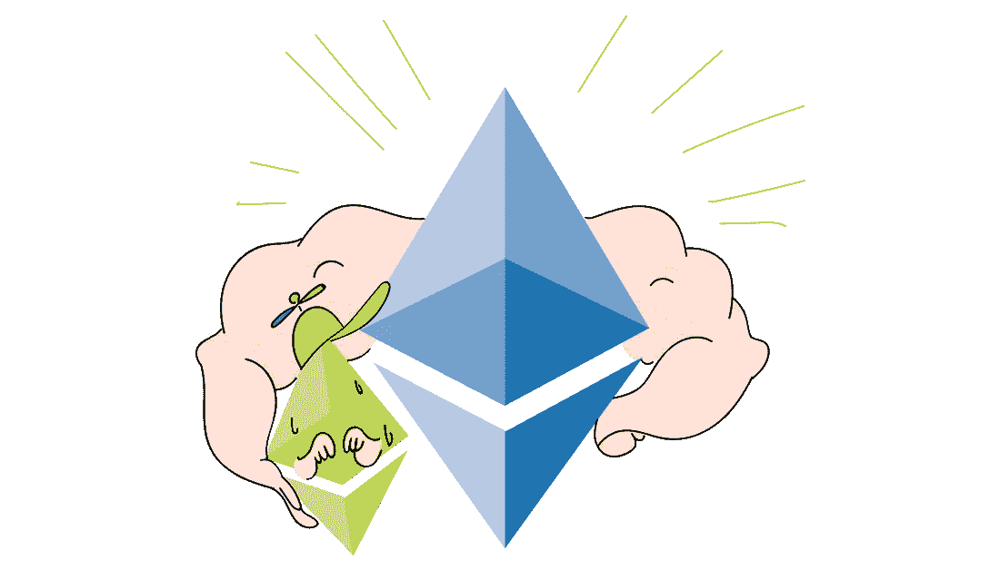

# 以太坊 2.0:期待什么

> 原文：<https://medium.com/coinmonks/ethereum-2-0-what-to-expect-c89319812ffb?source=collection_archive---------2----------------------->

## Eth2.0 新特性概述

*以太坊为什么暴涨暴跌？以太坊的翻新。以太坊 2.0 (Serenity)上线后如何才能赚更多钱？*

# 以太坊 1.0

根据创始人的说法，以太坊的想法出现是因为不满太多的应用程序集中存储在亚马逊、微软和谷歌等巨型平台上。

以太坊的目的是给全世界提供一个机会，用以太坊区块链制作分散的应用程序。以太坊的中心思想是一个智能合同，在没有第三方的情况下履行协议。这意味着这些交易是不可逆转和透明的。

创始人表示，在过去的两年中，进行了大量的研究来提高可伸缩性和交易速度。现在，开发者们更加意识到利益证明和分片安全模型的可能性。

# 从以太坊 1.0 到以太坊 2.0

以太坊 2.0(2020 年下半年推出)最大的变化是从挖矿过渡到跑马圈地。直到最近，以太坊还在使用工作证明算法。以前，矿工们会参加解决一个极其复杂的数学问题的比赛，并因此获得奖励。为了开采加密货币，人们购买了令人印象深刻的设备，并准备支付巨额电费。

利益证明(PoS)算法确定这个或那个节点(网络参与者)形成区块链中下一个块的概率，该概率与节点的加密货币份额成比例。这为网络不间断工作创造了经济激励。为了参与积木的放置，投资者需要启动他的节点，并且在他的账户上有至少 32 个 ETH 硬币。符合这些条件，以及帐户的活动和在网络中花费的时间将允许参与者创建阻止。优势将是那些帐户中有更多资金的人。

在最重要的更新中，可以区分以下几项:

1.  分片
2.  利害关系证明
3.  电子邮件

# 转向宁静的路线图

以太坊 2.0 将在 Serenity chain 下更新，Serenity chain 代表全球计算机。它将能够在不增加佣金的情况下同时支持数千笔交易，并且仍将保持能源效率。

# 阶段 0 —信标链

以太坊链将转移到共识算法与信标区块链的利害关系证明。

信标链的主要目标是 PoW 和 PoS 之间的协调，以及与碎片链(一个子链系统，用于更好的可伸缩性)和虚拟机的通信。

# 第 1 阶段–分片

分片是一种处理所有事务并将它们分割成段(分片)的技术。同时，每个区块链节点处理整个块的一部分，这在不损失处理速度的情况下支持可扩展性。

# 第二阶段—电子政务

在这一步，将添加帐户余额和智能合同的履行情况。以太坊虚拟机 eWasm 的集成允许更快地完成代码。它还提供了一个更方便的开发环境。

# 第 3 阶段—进一步改进

计划实施以下技术:

*   с跨碎片事务 —这些是涉及两个不同碎片的节点的事务；
*   **轻型客户端** —需要较少数据来下载到区块链的连接，然后在 ETH 网络上进行交易的移动客户端；
*   **超二次或指数分片** —当需要在事务和上一级的块头之间进行两级以上的通信时使用(即需要“分片的分片”时)；
*   **与主链安全紧密耦合。**

# 这些变化会带来什么？

与采矿一样，赌注将创建一个奖励系统，尽管利益相关方可以获得多少收入的问题尚未确定。创始人表示，我们谈论的是 1.5%至 18%的范围，具体取决于总额。然而，有经验的以太坊用户声称，真实数字很可能在 5%左右。

宁静号是一项技术上雄心勃勃的计划，旨在创造一种新的全球计算机。如果开发人员成功地实现了他们的想法，一个真正可扩展的智能合同网络的区块链将被创建，它具有各种可以吸引开发人员、投资者和普通用户的资产。

> [直接在您的收件箱中获得最佳软件交易](https://coincodecap.com/?utm_source=coinmonks)

