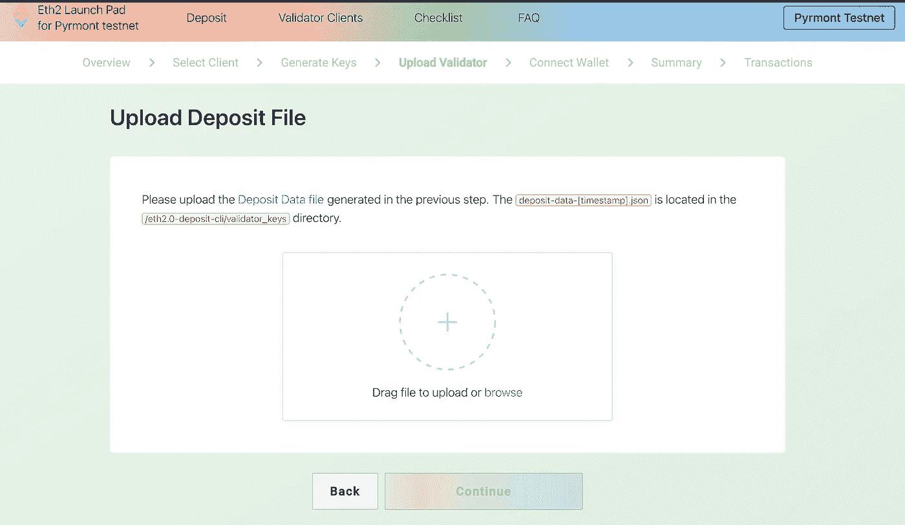

# 以太坊 2:在信标链上添加第二个存款

> 原文：<https://medium.com/coinmonks/ethereum-2-adding-a-second-deposit-on-the-beacon-chain-b3d27c8e1b79?source=collection_archive---------0----------------------->

这篇文章的目的是在某人已经在 ETH 2 的信标链中做了初始存放之后作为第二个指南。有一些关于初始设置的很好的参考资料和文档，包括:

[https://newsletter . banklesshq . com/p/-guide-how-to-be-a-validator](https://newsletter.banklesshq.com/p/-guide-how-to-become-a-validator)

但是，我发现很难找到如何在一段时间后添加第二个存款和后续验证程序的信息。这是我关于这个主题的快速教程。我将引用 Pyrmont 而不是 Mainnet，因为在生产之前进行测试总是最好的！还要注意，我将把 prysm 显示为 ETH2 客户端，但我认为它对其他客户端也同样适用。

最后一点，我提供这个只是作为一个指南——做你自己的功课！总有出错的风险，这就是为什么测试和小心翼翼地做这件事是极其重要的。

如果您按照 Prysm 提供的说明进行操作——这里提供:[https://docs . pry labs . network/docs/testnet/pyr mont](https://docs.prylabs.network/docs/testnet/pyrmont)，您应该可以成功设置您的第一个验证器。假设一切顺利，几周或几个月后，当你看到[testnet] ETH 滚滚而来时，你可能会想再咬一口苹果！该过程与初始存款类似，但有两个关键方面。

1.  获取您的存款数据
2.  导入新的钱包(这是一种相同的，但你现在应该看到更多的帐户)

先说存款 _ 数据。您已经安装了存款 cli，因此导航到该目录并键入以下命令:

```
./deposit existing-mnemonic
```

在那里，你会被要求输入你在第一次创建钱包时收到的助记符。希望你把它写在了某个地方…

如果您在中成功输入了此短语，您将得到以下回应:

```
Enter the index (key number) you wish to start generating more keys from. For example, if you've generated 4 keys in the past, you'd enter 4 here, [0]:
```

有点不言自明，但以防万一 0 是第一个钱包，1 是第二个，以此类推。所以如果这是第二次存款，你会想在这里用 1。接下来，您将看到:

```
Please choose how many validators you wish to run:
```

这取决于你，但是记住每个验证器都是 32 ETH，你将需要它来匹配你放在 launchpad 中的内容:【https://pyrmont.launchpad.ethereum.org/

```
Please choose the (mainnet or testnet) network/chain name (mainnet, witti, altona, medalla, spadina, zinken, pyrmont) [mainnet]:
```

如果您在链中放入 pyrmont 和/或-num_validators 1)，您可以跳过上面的步骤，但是我喜欢通过这些步骤来获得更多的确认。最后，您必须输入您的密钥库密码。

如果成功，在 cli 文件夹中，您现在应该有两个新文件:一个新的 deposit_data 文件和一个新的 keystore 文件(或者更多，取决于验证器的数量)。除了索引(如果这是第二个帐户，它应该是 1)之外，keystore 文件将与其他文件具有相同的名称。

这个新创建的 deposit_data 文件是我们需要放入 launchpad 的文件，如下所示:



将此过程进行到底，并获得您的确认，即 ETH 已存入 ETH2 合同。

现在，因为您可能正在运行您的验证器，所以您需要在导入这个新帐户时将其关闭一段时间(注意:可能有一个更好的方法可以在不关闭验证器的情况下做到这一点，但是这并不需要很长时间，所以我就这样做了)。进入 prysm 目录后，现在运行以下命令:

```
./prysm.sh validator accounts import --keys-dir=/path/to/validator_keys --pyrmont
```

如果您没有使用默认位置，它还会询问您的钱包目录。每次我这样做的时候，它总是会生成一个新的钱包，这很好——你只需用新的替换现有的。也许有人知道更好的方法。在任何情况下，您都需要输入密钥库的密码。希望你能看到这个:

```
Successfully imported {n} accounts, view all of them by running accounts list
```

在这里，我用新创建的钱包替换现有的钱包，并运行:

```
./prysm.sh validator accounts list --wallet-dir=/path/to/wallet
```

回应应该是这样的:

```
Showing {n} validator accountsView the eth1 deposit transaction data for your accounts by running `validator accounts list --show-deposit-data**Account 0** | **easily-relative-lemur****[validating public key]** 0xa531....**Account 1** | **clearly-selected-chimp****[validating public key]** 0x99c...
```

继续并再次启动验证器，您应该可以开始了！

```
./prysm.sh validator --wallet-dir=/path/to/wallet --pyrmont
```

如果存款没有反映在 ETH2 中，你必须等待，如果有验证者的队列(900/天)，你必须再等一会儿。但是你可以随时检查[https://pyrmont.beaconcha.in/validator/](https://pyrmont.beaconcha.in/validator/)并粘贴公共密钥来查看你的位置。

快乐验证！

> 加入 Coinmonks [电报集团](https://t.me/joinchat/EPmjKpNYwRMsBI4p)，了解加密交易和投资

## 另外，阅读

*   [学习以太坊和 Web3 开发](http://blog.coincodecap.com/go/learn)
*   最好的[密码交易机器人](/coinmonks/crypto-trading-bot-c2ffce8acb2a)
*   [3 商业评论](/coinmonks/3commas-review-an-excellent-crypto-trading-bot-2020-1313a58bec92)
*   [Pionex 审查](/coinmonks/pionex-review-exchange-with-crypto-trading-bot-1e459d0191ea)
*   [AAX 交易所评论](/coinmonks/aax-exchange-review-2021-67c5ea09330c) |推荐代码、交易费用、利弊
*   [Deribit 审查](/coinmonks/deribit-review-options-fees-apis-and-testnet-2ca16c4bbdb2) |选项、费用、API 和 Testnet
*   [FTX 密码交易所评论](/coinmonks/ftx-crypto-exchange-review-53664ac1198f)
*   [n 零审核](/coinmonks/ngrave-zero-review-c465cf8307fc)
*   [比特交换评论](/coinmonks/bybit-exchange-review-dbd570019b71)
*   [3Commas vs Cryptohopper](/coinmonks/3commas-vs-pionex-vs-cryptohopper-best-crypto-bot-6a98d2baa203)
*   最好的比特币[硬件钱包](/coinmonks/the-best-cryptocurrency-hardware-wallets-of-2020-e28b1c124069?source=friends_link&sk=324dd9ff8556ab578d71e7ad7658ad7c)
*   [密码本交易平台](/coinmonks/top-10-crypto-copy-trading-platforms-for-beginners-d0c37c7d698c)
*   [莱杰 nano s vs x](https://blog.coincodecap.com/ledger-nano-s-vs-x)
*   [Vauld 审查](https://blog.coincodecap.com/vauld-review)
*   最好的[加密税务软件](/coinmonks/best-crypto-tax-tool-for-my-money-72d4b430816b)
*   [最佳加密交易平台](/coinmonks/the-best-crypto-trading-platforms-in-2020-the-definitive-guide-updated-c72f8b874555)
*   最佳[加密贷款平台](/coinmonks/top-5-crypto-lending-platforms-in-2020-that-you-need-to-know-a1b675cec3fa)
*   [莱杰纳米 S vs 特雷佐 one vs 特雷佐 T vs 莱杰纳米 X](https://blog.coincodecap.com/ledger-nano-s-vs-trezor-one-ledger-nano-x-trezor-t)
*   [block fi vs Celsius](/coinmonks/blockfi-vs-celsius-vs-hodlnaut-8a1cc8c26630)vs Hodlnaut
*   [bits gap review](/coinmonks/bitsgap-review-a-crypto-trading-bot-that-makes-easy-money-a5d88a336df2)——一个轻松赚钱的加密交易机器人
*   为专业人士设计的加密交易机器人
*   [硬币追踪审查](/coinmonks/cointracking-review-a-reliable-cryptocurrency-tax-software-5114e3eb5737)
*   [优霍德勒评论](/coinmonks/youhodler-4-easy-ways-to-make-money-98969b9689f2)
*   [埃利帕尔泰坦评论](/coinmonks/ellipal-titan-review-85e9071dd029)
*   [赛克斯石评论](https://blog.coincodecap.com/secux-stone-hardware-wallet-review)
*   [BlockFi 评论](/coinmonks/blockfi-review-53096053c097) |赚取高达 8.6%的加密利息
*   [共同规则审查](https://blog.coincodecap.com/coinrule-review-a-perfect-trading-bot)
*   [最佳区块链分析工具](https://bitquery.io/blog/best-blockchain-analysis-tools-and-software)
*   [加密套利](/coinmonks/crypto-arbitrage-guide-how-to-make-money-as-a-beginner-62bfe5c868f6)指南:新手如何赚钱
*   最佳[加密制图工具](/coinmonks/what-are-the-best-charting-platforms-for-cryptocurrency-trading-85aade584d80)
*   了解比特币的[最佳书籍有哪些？](/coinmonks/what-are-the-best-books-to-learn-bitcoin-409aeb9aff4b)

> [在您的收件箱中直接获得最佳软件交易](/coinmonks/newsletters/coinmonks)

[](https://medium.com/coinmonks/newsletters/coinmonks)