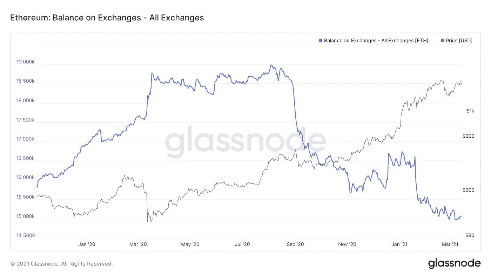
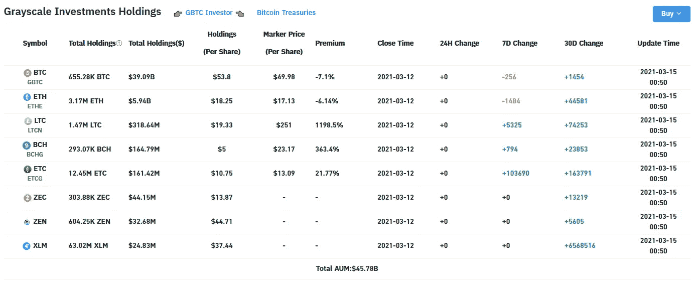
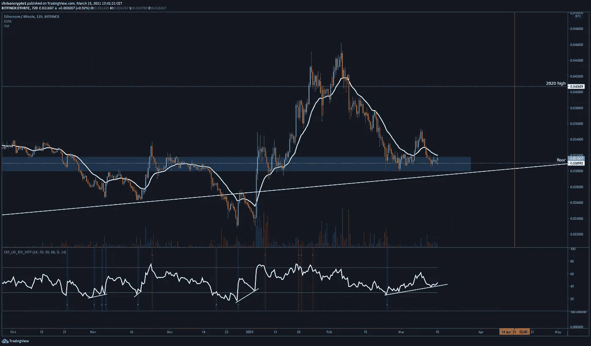
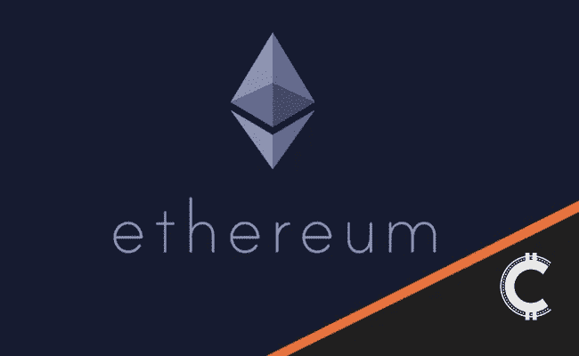

# 三月底 2500 美元以上以太坊？

> 原文：<https://medium.com/coinmonks/ethereum-above-2-500-by-the-end-of-march-4b567fbbad4c?source=collection_archive---------11----------------------->

## 我记得 6 万美元的 BTC 就像昨天一样。但无论如何，伟大的比特币龙(bitcoin long)都没有几周来一直在表面下冒泡的以太坊(Ethereum)交易有趣。

咱们挖吧。

# 以太坊外汇储备随着机构积累更多而减少

以太坊交易所供应上周创下新低，延续了始于 2020 年 8 月的多月趋势。持续的下跌趋势表明，高净值个人、机构和鲸鱼正在将大量 ETH 从交易所转移到托管钱包，正如[鲸鱼警报](https://chrisoncrypto.com/blog/f/ethereum-whales-quietly-continue-to-accumulate-supply)所揭示的那样。

自 2 月 3 日以来，以太坊的表现不如其他替代硬币，如波尔卡多特(dot)和币安硬币(BNB)，这很有趣，因为以太坊是唯一一个拥有越来越多机构支持的“替代硬币”(如果你可以这么称呼它的话)。事实上，在 2 月底-3 月初，全球首只[以太坊 ETF](https://chrisoncrypto.com/blog/f/ci-global-files-worlds-first-ethereum-etf) 已由 CI Global Asset Management 备案。

几天后的 3 月 2 日，灰度 ETH [持仓量](https://chrisoncrypto.com/blog/f/grayscale-steps-on-the-gas-accelerating-ethereum-accumulation)暴涨，重仓进行中。根据下面的 Bybt 数据，尽管有所缓和，但灰度的 E ticker 在 30 天内仍处于累积模式(44，581 次净流入)。

GBTC(-7.1%)和埃塞(-6.14%)最近的价格折扣可能归因于市场上新的[竞争对手](https://www.bitcoininsider.org/article/107095/discount-grayscales-gbtc-plunges-new-record-low-competition-emerging-rivals)。GBTC 不再是唯一的游戏，该公司现在正在寻求建立一个交易所交易基金。

Grayscale cryptocurrency holdings

根据以太坊的联合创始人 Vitalik Buterin 的说法，这发生在以太坊即将解决 100 倍的可扩展性问题的时候——这将严重削弱侧链第 2 层解决方案。

**查看** [完整故事这里](https://chrisoncrypto.com/blog/f/ethereum-whales-quietly-continue-to-accumulate-supply) **！**

# 技术上来说

## ETH/BTC 底价-价格暂时保持不变

以太坊在 0.030 Satoshi 水平上方交易，自 2 月 23 日以来一直横向运行。随着这一关键的多年趋势在 6 个月内第四次受到考验，抛售压力目前已经消退。

12 小时看涨相对强弱指数(RSI)背离也已形成，为持刀价格忍者提供了机会，就像他们在之前的机会出现时一样。

与比特币的美元对相反，以太坊对美元尚未突破其历史高点。

与此同时，今天的抛售，见证了超过14 亿美元在 BTC 的长期清算，对比特币来说比 ETH 更具戏剧性。

这可能是因为通常情况下，当一个主要市场创下新的历史高点时，另一个主要市场最终会跟进，在这种情况下，ETH/USD 应在短期内交易超过 2045 美元(如果整体市场强势持续，本月将达到 2500 美元[)。虽然历史不能保证，但过去的行为肯定值得注意——尤其是当 ETH 目前的估值与新兴基本面脱节时。ETH 多头能抓住胜利吗？或者这种向下的螺旋将永远不会停止折磨以太人？](https://www.tradingview.com/x/8kKCS4OP/)

下次再见。

**加入** [电报](https://t.me/chrisoncryptochannel) **频道进行实时更新！
关注我** [推特](https://twitter.com/ChrisOnCrypto1) **&** [多嘴多舌](https://gab.com/chrisoncrypto) **下面还有我的社交门户。**

[https://www.paypal.com/donate?hosted_button_id=C9VRLGTBHQX2N](https://www.paypal.com/donate?hosted_button_id=C9VRLGTBHQX2N)

# 阅读更多:以太坊鲸悄悄继续积累 ETH 供给

[https://chrisoncrypto.com/blog/f/ethereum-whales-quietly-continue-to-accumulate-supply](https://chrisoncrypto.com/blog/f/ethereum-whales-quietly-continue-to-accumulate-supply)

[http://www.chrisoncrypto.com/](http://www.chrisoncrypto.com/)

你也可以用比特币支持我！
**BTC** 地址:**3 eydseypjhn 68 axkncuqbb 7 ebqcxrejamr**

最诚挚的问候，
**克里斯托·阿塔尔德**
克里斯对加密的创始人
贡献者[www.cityam.com](https://www.cityam.com)
直接接通:[电报](https://t.me/chrisoncrypto)

***原载于***[***https://mailchi . MP/85 f 40 a 62 de 2c/ether eum-above-2500-by-the-end-of-March？e =【UNIQID***](https://mailchi.mp/85f40a62de2c/ethereum-above-2500-by-the-end-of-march?e=[UNIQID)

> *加入 coin monks[Telegram group](https://t.me/joinchat/EPmjKpNYwRMsBI4p)并了解加密交易和投资*

## *另外，阅读*

*   *最好的[密码交易机器人](/coinmonks/crypto-trading-bot-c2ffce8acb2a) | [网格交易](https://blog.coincodecap.com/grid-trading)*
*   *[3 商业评论](/coinmonks/3commas-review-an-excellent-crypto-trading-bot-2020-1313a58bec92) | [Pionex 评论](/coinmonks/pionex-review-exchange-with-crypto-trading-bot-1e459d0191ea) | [Coinrule 评论](/coinmonks/coinrule-review-2021-a-beginner-friendly-crypto-trading-bot-daf0504848ba)*
*   *[AAX 交易所评论](/coinmonks/aax-exchange-review-2021-67c5ea09330c) | [德里比特评论](/coinmonks/deribit-review-options-fees-apis-and-testnet-2ca16c4bbdb2) | [FTX 交易所评论](/coinmonks/ftx-crypto-exchange-review-53664ac1198f)*
*   *[n ave 零点回顾](/coinmonks/ngrave-zero-review-c465cf8307fc) | [Phemex 回顾](/coinmonks/phemex-review-4cfba0b49e28) | [PrimeXBT 回顾](/coinmonks/primexbt-review-88e0815be858)*
*   *[Bybit Exchange 审查](/coinmonks/bybit-exchange-review-dbd570019b71) | [Bityard 审查](/coinmonks/bityard-review-7d104239be35) | [CoinSpot 审查](https://blog.coincodecap.com/coinspot-review)*
*   *[3 commas vs crypto hopper](/coinmonks/3commas-vs-pionex-vs-cryptohopper-best-crypto-bot-6a98d2baa203)|[赚取加密利息](/coinmonks/earn-crypto-interest-b10b810fdda3)*
*   *最好的比特币[硬件钱包](/coinmonks/the-best-cryptocurrency-hardware-wallets-of-2020-e28b1c124069?source=friends_link&sk=324dd9ff8556ab578d71e7ad7658ad7c) | [BitBox02 回顾](/coinmonks/bitbox02-review-your-swiss-bitcoin-hardware-wallet-c36c88fff29)*
*   *[莱杰 vs n rave](/coinmonks/ledger-vs-ngrave-zero-7e40f0c1d694)|[莱杰 nano s vs x](/coinmonks/ledger-nano-s-vs-x-battery-hardware-price-storage-59a6663fe3b0)*
*   *[密码本交易平台](/coinmonks/top-10-crypto-copy-trading-platforms-for-beginners-d0c37c7d698c)*
*   *[沃德评论](/coinmonks/vauld-review-2021-lend-trade-and-buy-bitcoin-in-india-e37a96374961) | [尤霍德勒评论](/coinmonks/youhodler-4-easy-ways-to-make-money-98969b9689f2) | [区块链评论](/coinmonks/blockfi-review-53096053c097)*
*   *最好的[加密税务软件](/coinmonks/best-crypto-tax-tool-for-my-money-72d4b430816b) | [硬币追踪评论](/coinmonks/cointracking-review-a-reliable-cryptocurrency-tax-software-5114e3eb5737)*
*   *最佳[密码借贷平台](/coinmonks/top-5-crypto-lending-platforms-in-2020-that-you-need-to-know-a1b675cec3fa) | [杠杆令牌](/coinmonks/leveraged-token-3f5257808b22)*
*   *[block fi vs Celsius](/coinmonks/blockfi-vs-celsius-vs-hodlnaut-8a1cc8c26630)|[Hodlnaut Review](/coinmonks/hodlnaut-review-best-way-to-hodl-is-to-earn-interest-on-your-bitcoin-6658a8c19edf)*
*   *[Bitsgap 审查](/coinmonks/bitsgap-review-a-crypto-trading-bot-that-makes-easy-money-a5d88a336df2) | [Quadency 审查](/coinmonks/quadency-review-a-crypto-trading-automation-platform-3068eaa374e1) | [Bitbns 审查](/coinmonks/bitbns-review-38256a07e161)*
*   *[埃利帕尔泰坦评论](/coinmonks/ellipal-titan-review-85e9071dd029) | [赛克斯斯通评论](/coinmonks/secux-stone-hardware-wallet-review-15-discount-coupon-2020-7577032faa6e)*
*   *[本地比特币评论](/coinmonks/localbitcoins-review-6cc001c6ed56)*
*   *最佳[区块链分析](https://bitquery.io/blog/best-blockchain-analysis-tools-and-software)工具| [赚比特币](/coinmonks/earn-bitcoin-6e8bd3c592d9)*
*   *[加密套利](/coinmonks/crypto-arbitrage-guide-how-to-make-money-as-a-beginner-62bfe5c868f6)指南| [如何做空比特币](/coinmonks/how-to-short-bitcoin-568a2d0b4ae5)*
*   *最佳[加密制图工具](/coinmonks/what-are-the-best-charting-platforms-for-cryptocurrency-trading-85aade584d80) | [最佳加密交易所](/coinmonks/crypto-exchange-dd2f9d6f3769)*
*   *[如何在印度购买比特币？](/coinmonks/buy-bitcoin-in-india-feb50ddfef94) | [瓦济克斯审查](/coinmonks/wazirx-review-5c811b074f5b)*
*   *[印度比特币交易所](/coinmonks/bitcoin-exchange-in-india-7f1fe79715c9) | [比特币储蓄账户](/coinmonks/bitcoin-savings-account-e65b13f92451)*
*   *[CoinDCX 评论](/coinmonks/coindcx-review-8444db3621a2)*

> *[直接在您的收件箱中获得最佳软件交易](/coinmonks/newsletters/coinmonks)*

**