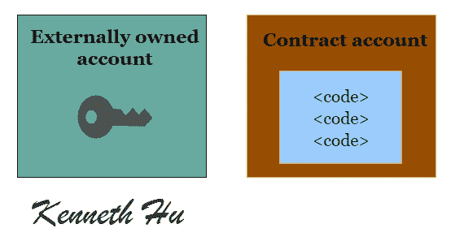
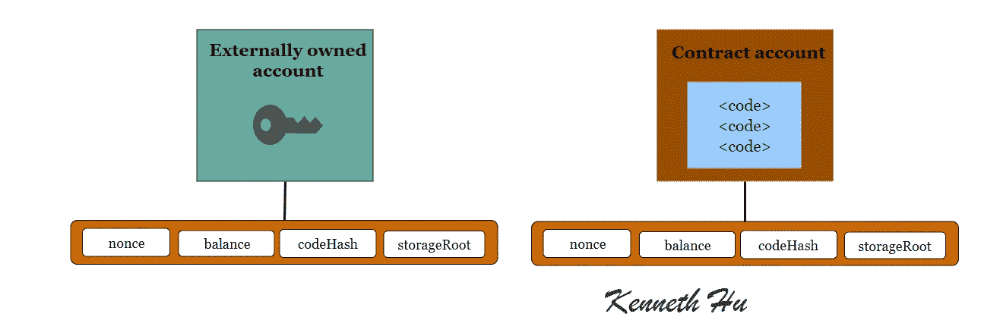
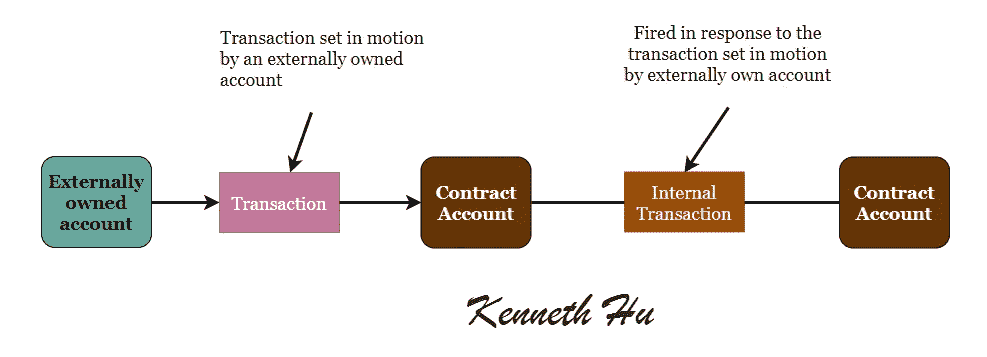
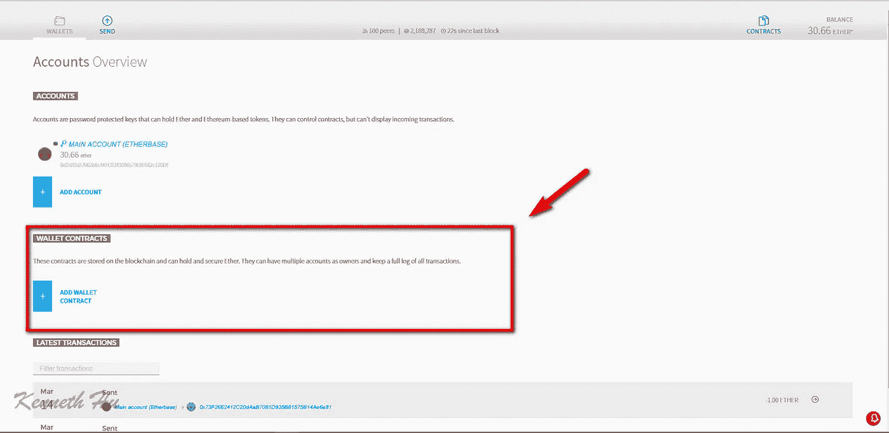
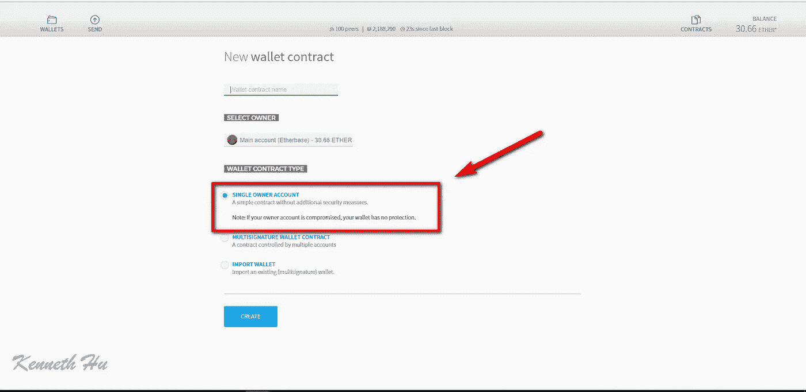
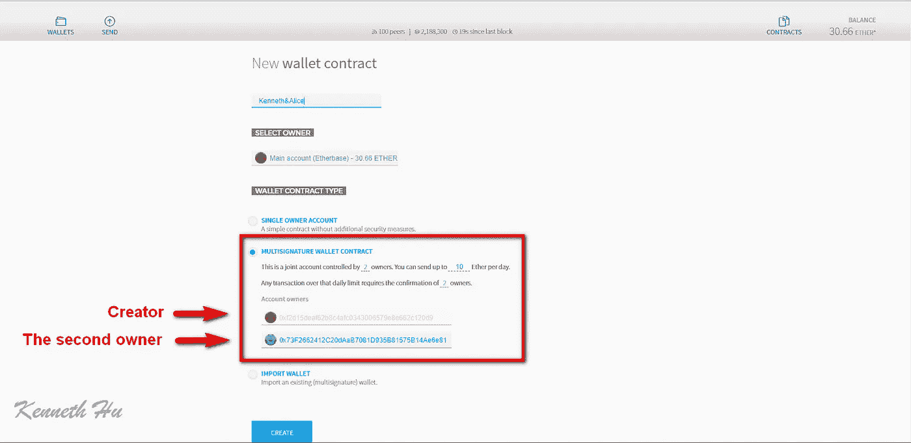
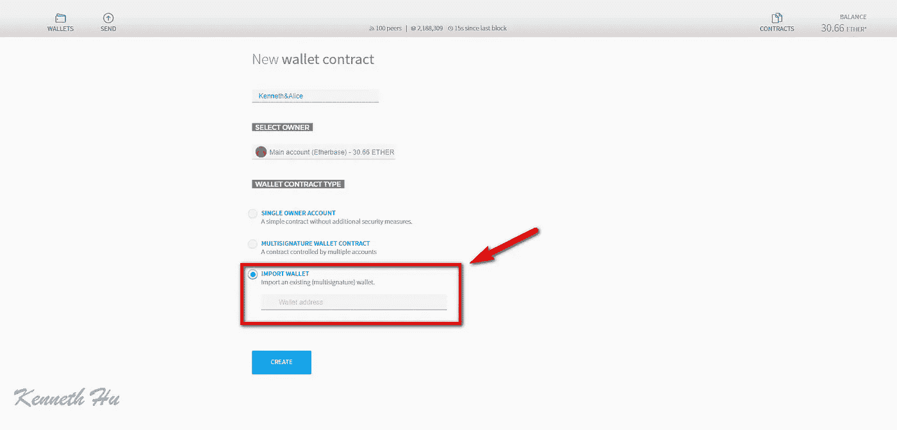
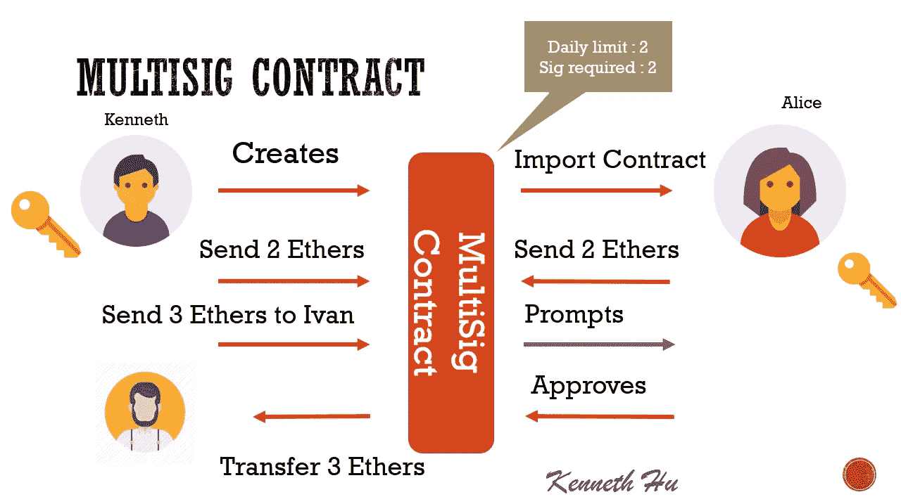

# 以太坊账户

> 原文：<https://medium.com/coinmonks/ethereum-account-212feb9c4154?source=collection_archive---------2----------------------->

这篇文章引用了"[以太坊到底是如何工作的？](/@preethikasireddy/how-does-ethereum-work-anyway-22d1df506369)[普瑞蒂·卡西雷迪](/@preethikasireddy?source=post_header_lockup)所写的，可以在[这里找到](/@preethikasireddy/how-does-ethereum-work-anyway-22d1df506369)。

*   外部拥有的帐户(用户帐户由私钥控制)
*   合同账户(由代码控制)

> [发现并回顾最佳区块链软件](https://coincodecap.com)

## 帐户状态

账户**状态**由四个部分组成，无论账户类型如何都存在:

*   **nonce** :如果账户是外部拥有的账户，这个数字代表从账户地址发送的交易次数。如果账户是合同账户，随机数是账户创建的合同数量。
*   **余额**:该地址拥有的卫数。每以太有 1e+18 威。
*   **storage root**:Merkle Patricia 树的根节点的 256 位哈希，对账户的存储内容进行编码(256 位整数值之间的映射)，编码到 trie 中，作为从 256 位整数键的 Keccak 256 位哈希到 RLP 编码的 256 位整数值的映射。此树编码此帐户存储内容的散列，默认情况下为空。
*   **codeHash** :该账户的 EVM(以太坊虚拟机)代码的哈希——这是该地址收到消息调用时执行的代码；它是不可变的，因此与所有其他字段不同，在构造后不能更改。所有这样的代码片段都包含在状态数据库中它们相应的散列下，以供以后检索。对于合约账户，这是被散列并存储为 **codeHash** 的代码。对于外部拥有的帐户， **codeHash** 字段是空字符串的散列。

更多细节请参考[以太坊黄皮书](https://ethereum.github.io/yellowpaper/paper.pdf)

# 外部拥有的账户(eoa)

外部控制的账户

*   具有醚平衡，
*   可以发送交易(以太网传输或触发合同代码)，
*   是由私钥控制的，
*   没有关联的代码。

# 合同账户(有些文章称之为合同钱包)

一份合同

*   具有醚平衡，
*   有关联的代码，
*   代码执行由从其他契约接收的事务或消息(调用)触发。
*   当被执行时——执行任意复杂度的操作(图灵完全性)——操纵其自己的持久存储，即，可以具有其自己的永久状态——可以调用其他契约

Exchange 中的合约帐户向用户帐户发送 ETH 的费用为 21000 gas，但向合约发送 ETH 的费用更高，这取决于交易中发送的合约代码和数据。

## 合同帐户相对于用户帐户的优势:

*   合同帐户可以列出收到的交易
*   合同帐户可以设置为多重签名帐户
*   多签名账户可以有一个您指定的每日限额，只有当超过每日限额时，才需要多次签名

## 合同帐户相对于用户帐户的缺点:

*   无论何时使用合同账户，都会产生费用。

创建用户帐户不会耗费任何汽油，但创建合同帐户会。您付费创建和使用合同账户，因为它们使用网络的宝贵计算和存储资源。

另一点是，外部拥有的帐户可以通过使用其私钥创建和签署交易来向其他外部拥有的帐户或其他合同帐户发送消息。两个外部拥有的账户之间的消息仅仅是价值转移。但是从外部拥有的账户到合约账户的消息激活合约账户的代码，允许它执行各种动作(例如，转移令牌、写入内部存储、铸造新令牌、执行一些计算、创建新合约等。).

与外部拥有的账户不同，合约账户不能自行发起新的交易。相反，合约帐户只能触发交易以响应它们收到的其他交易(从外部拥有的帐户或从另一个合约帐户)。我们将在“事务和消息”一节中了解更多关于契约间调用的信息。

工具:

*   以太网在线钱包:[https://wallet.ethereum.org](https://wallet.ethereum.org)
*   [MetaMask](/singapore-blockchain-dapps/metamask-metamask-installation-a62865a69d35)

# 合同账户类型

合约账户有两种——简单账户和多重签名(**多重签名**)账户

简单账户和多重账户由账户创建和拥有。

*   简单账户:只有一个账户创建并拥有这个账户。
*   Multisig 账户:一个 Multisig 钱包有几个所有者账户，其中一个也是创建者账户。

## 要创建简单的钱包:

1.  点击添加钱包合同。
2.  在 wallet 合同类型下，确保选择了单个所有者帐户，然后输入您的 WALLET 的名称。
3.  点击创建。然后输入您在中使用的当前帐户的密码

## 要创建 Multisig 钱包:

1.  点击添加钱包合同。
2.  在电子钱包合同类型下，选择多重签名电子钱包合同。
3.  设置有多少人拥有这个钱包。默认为 3 个所有者。在我的例子中，我把它改为 2。
4.  根据您的设置填写所有者的地址。
5.  点击创建。然后输入您使用的当前帐户的密码。
6.  复制并粘贴另外两个所有者帐户的地址。
    重要提示:不要将合同钱包添加为 Multisig 钱包的所有者。只有帐户可以成为所有者。

显示 Multisig 帐户的默认设置。在本例中，我们使用默认的 3 选 2 设置，但是我们将每日限制减少到了 10 以太网。

# 多签名帐户用户案例

**Click to read more about ethereum**