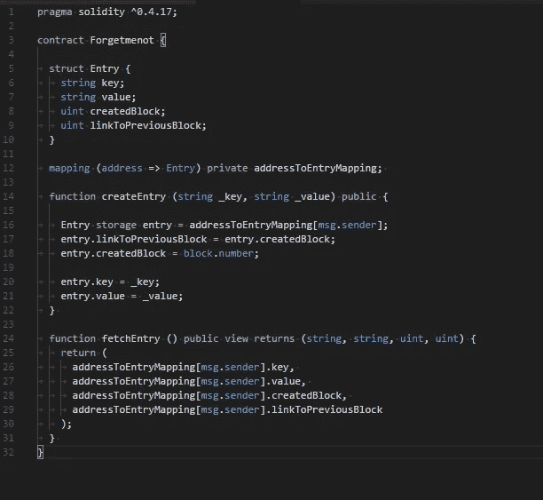

# 以太坊！永远永远！

> 原文：<https://medium.com/coinmonks/ethereum-always-and-forever-812371145aa?source=collection_archive---------8----------------------->

Unlike your mother, the blockchain will never forget

最近在区块链的一次会议上，我了解到[一般数据保护条例(GDPR)，更具体地说是第 17 条*删除权*](https://gdpr-info.eu/art-17-gdpr/) ，**被遗忘权**。这位发言者指出，如果 DApp 将个人数据放在区块链上，你就不可能遵守第 17 条，因为区块链上的数据不能修改或删除。

> 区块链和 GDPR 的第 17 条根本不兼容。

我认为这种见解是理所当然的，并认为，*“当然，这就是我们在这里的原因”*，只是意识到许多人对此感到震惊和惊讶，甚至一些技术人员也有点困惑。

我决定写一个非常快速(和肮脏)的以太坊 DApp 来证明一旦东西被存储在区块链上，它就永远在那里！

## 遗忘契约

Forgetmenot.sol

在契约中只有一个变量( *addressToEntryMappin* g)，它将存储特定帐户地址的一些信息。用户(拥有帐户)能够存储一个*键*(某个字符串)和一个相应的*值*(某个其他字符串)。密钥可以是一个 *launch_code* 并且值是非常敏感的相应数据 *kyj123* 。我们可以通过调用 *createEntry* 函数来保存它，并将它存储在区块链上。如果我们决定不要公开区块链的这些信息，会发生什么？我们如何*删除这些信息？*

## 不变的部分

我可以再次调用 *createEntry* 方法并传递假数据，这些数据将替换我的 *launch_code* 值，这样一切都没问题了。幸运的是，这不起作用。是的，当前的键-值对将被更新以反映新的值，但是先前的值**(契约状态)**将不会改变。原来的*发射 _ 代码*已经包含在区块链已经胶结的前一个区块中。

为了测试这一点，我们必须查询合同中的数据。这可以通过多种方式实现。一种流行的方法是 [*web3js*](https://github.com/ethereum/wiki/wiki/JavaScript-API#web3ethcontract) ，这是一个 JavaScript 库，它简化了应用程序和区块链之间的通信。但是阅读文档时，您会注意到许多函数都带有一个可选参数`Number|String`。

***…如果您传递此参数，它将不会使用默认块集…***

这意味着我们可以去看看你原来的 *launch_code* 和你曾经*保存的任何其他键值对。我们可以构建您的整个键值历史，如果您存储了本应该“*可擦除*”的东西，这是个坏消息。*

*区块链的这一属性已经实现了真正有趣的应用程序和关于数据如何存储和建模的奇怪的思考方式，并且在开发 DApp 时应该记住这一点。*

*工作测试 DApp 的代码可以在我的 Github 页面上找到。按照指示在本地运行它，体验区块链的神奇！*

* [## phzietsman/健忘

### 健忘——区块链人永远不会忘记。这是一个简单的演示，展示了如何以及为什么不应该将“易遗忘”的数据存储在…

github.com](https://github.com/phzietsman/forgetmenot) 

看看我的推特上真正专家的观点。

 [## 保罗·齐茨曼(@phzietsman) |推特

### Paul Zietsman (@phzietsman)的最新推文。对☁️的区块链、软件开发和其他事物充满热情

twitter.com](https://twitter.com/phzietsman) 

# ❤️喜欢，分享，留下你的评论

如果你喜欢这篇文章，不要忘记喜欢，与你的朋友和同事分享，并在下面留下你对这篇文章的评论。跟我来……

> [直接在您的收件箱中获得最佳软件交易](https://coincodecap.com/?utm_source=coinmonks)

*