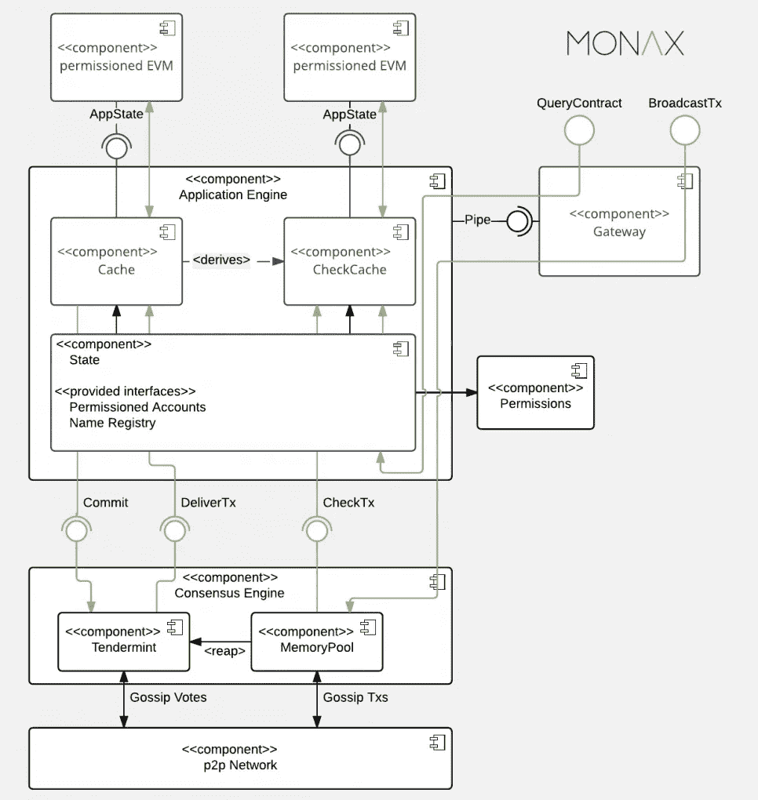
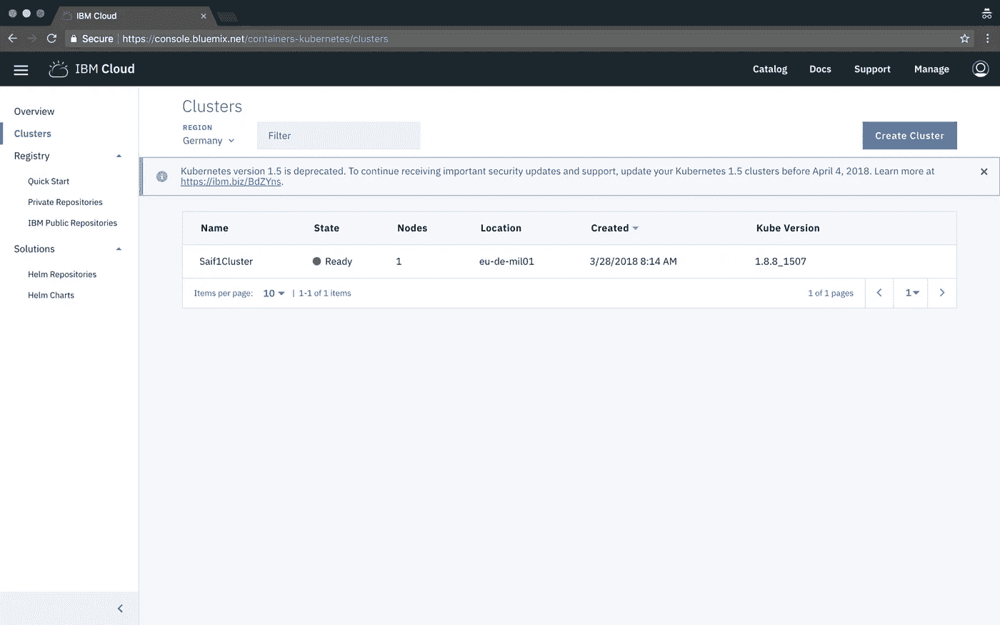
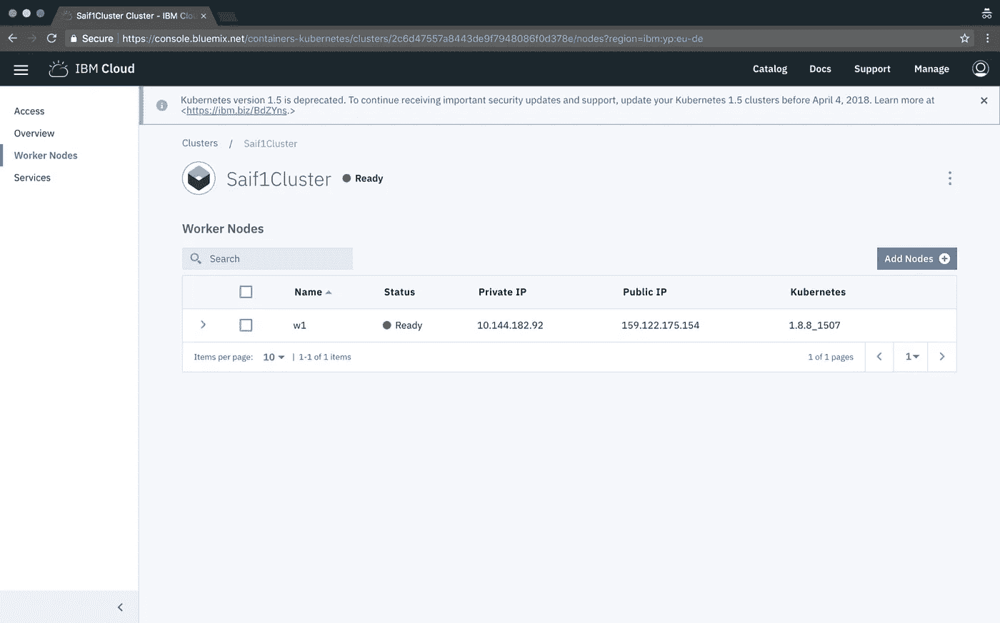
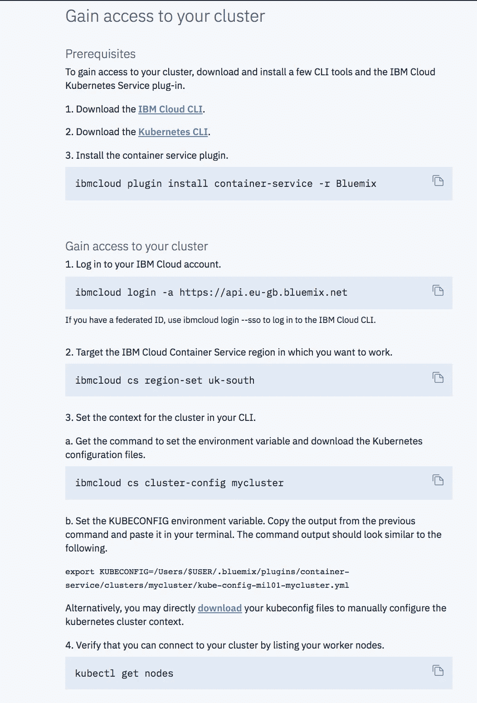
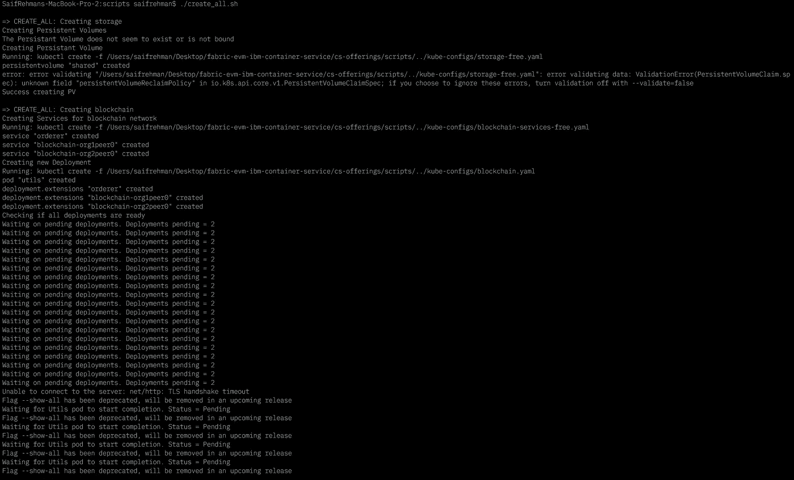
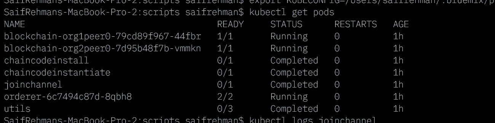
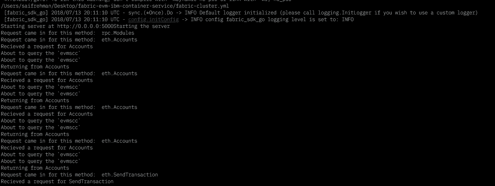
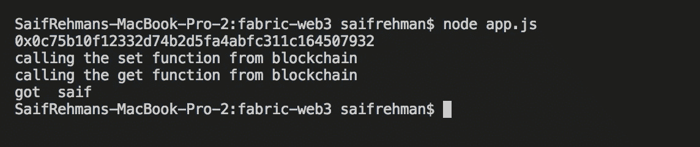

# 以太坊和 Fabric 交叉:在 Hyperledger Fabric 区块链上部署以太坊智能合约

> 原文：<https://medium.com/coinmonks/ethereum-and-fabric-crossover-deploying-ethereum-smart-contract-on-hyperledger-fabric-blockchain-fe937e2e3680?source=collection_archive---------1----------------------->


> “ [Hyperledger](http://hyperledger.org/) 和[以太坊](http://ethereum.org/)社区的任何竞争性定位都是不正确的，”——Hyperledger 项目执行总监[布莱恩·贝伦多夫](https://www.linkedin.com/in/brianbehlendorf)

# 介绍

重要的是要注意到超账本和以太坊的交集正在扩大。在 Tendermint 共识引擎下运行的 Hypeledger Burrow 项目允许我们使用 Hyperledger Fabric EVM 链码插件在 Fabric 上运行以太坊智能合约。

> Hyperledger Fabric 和 Ethereum 是互补而非竞争关系

# 什么是 Hyperledger Burrow？

陋居以前被称为 ErisDB。简而言之，陋居是一个允许的智能合同机器。它在许可的虚拟机上执行以太坊 EVM 智能合约代码(通常用 [Solidity](https://solidity.readthedocs.io/) 或 [Viper](https://github.com/ethereum/vyper) 编写)。陋居由 Monax 拥有和开发，现在隶属于 Hyperledger。陋居项目于 2014 年 12 月成立并开源，并获得 GPL3 许可。

> Monax 首席执行官 Casey Kuhlman 表示:“它为模块化的区块链客户端提供了一个许可的智能合同解释器，该解释器部分是根据[以太坊虚拟机](https://blog.ethereum.org/2016/06/02/go-ethereums-jit-evm/) (EVM)的规范构建的。”。

# 让我们钻地洞



1.  **共识引擎**:它有一个叫做应用引擎的东西，负责维护网络堆栈。
2.  **应用区块链接口(ABCI):** 允许应用引擎和共识引擎进行通信，允许开发者用任何语言编写智能合约
3.  **智能合同应用程序引擎:**为应用程序构建者提供强确定性智能合同引擎，用于操作复杂的工业流程。
4.  **网关:**为系统集成和用户界面提供编程接口
5.  **许可的以太坊虚拟机:**它为以太坊区块链带来许可，并且它被构建为遵守以太坊操作代码规范，该规范确保已经授予正确许可的断言
6.  **应用二进制接口(ABI):** 区块链上的任何交易都必须制定为区块链节点可以处理的二进制格式，ABI 允许我们这样做。
7.  **密码安全共识:**这是由 Tendemint 协议提供的，它在一组已知的验证器上达成共识。
8.  **远程签名:** Burrow 有一个用于远程签名的接口，它允许并接受客户端公式化/签名的事务

> [发现并回顾最佳区块链软件](https://coincodecap.com)

# 让我们建造吧！

## 首先，沉住气，完成前提条件


## 先决条件

1.  免费注册 [IBM Cloud](http://ibm.biz/ioblockchain)
2.  安装 [IBM Cloud CLI](https://console.bluemix.net/docs/cli/reference/bluemix_cli/get_started.html)
3.  安装[对接器](https://docs.docker.com/install/)
4.  安装 [Kubectl](https://kubernetes.io/docs/tasks/tools/install-kubectl/)
5.  转到您的 [IBM 云仪表板](https://console.bluemix.net/dashboard/apps/)并登录
6.  转到 [IBM 容器服务](https://console.bluemix.net/containers-kubernetes/clusters)并创建一个集群
7.  安装 Golang 1.9.3 并设置 GOPATH



8.准备就绪后，单击您的群集，然后单击工作节点以检查其公共 ip 并记下



9.现在，要访问 IBM Cloud 上托管的集群，请单击 Access 选项卡，然后按照类似下图的步骤操作。



10.现在通过使用 kubectl，您将能够在 IKS 上与您的集群进行交互

## **将带有 EVM 插件的 Fabric 部署到 IBM 容器服务中**

1.  克隆此回购

```
$ git clone [https://github.com/SaifRehman/fabric-evm-ibm-container-service.git](https://github.com/SaifRehman/fabric-evm-ibm-container-service.git)
```

2.导航到目录

```
$ cd fabric-evm-ibm-container-service
```

3.导航到脚本文件夹

```
$ cd cs-offerings/scripts
```

4.使用 IBM 容器服务的 EVM 插件部署到 Fabric

```
$ ./create_all.sh
```

5.删除部署

```
$ ./delete_all.sh -i
```



**Give it sometime to deploy**

6.这些脚本将部署 2 个对等方(每个组织 1 个)和 1 个订购方。这些脚本还将建立一个 id 为`channel1`的通道，创建与网络对话所需的凭证，最后安装&实例化一个示例链代码。

7.运行 *kubectl get pods* 查看是否所有的 pods 都运行良好



8.将`crypto-config` 文件夹从一个 pod 复制到本地主机。这可能是任何吊舱

```
$ kubectl cp <pod name>:/shared/crypto-config crypto-config
```

9.打开`fabric-cluster.yml`文件并编辑

10.找到文件中的`<path-to-crypto-config-folder>`并用`crypto-config directory`替换

11.找到并替换文件中的`<cluster-ip>`为`cluster ip of your cluster`

12.这可以通过运行以下命令来实现

```
$ bx cs workers <cluster-name>
```

## 运行代理以将以太坊智能合约部署到结构

1.  导航到 GOPATH

```
$ cd $GOPATH
```

2.导航到 github.com 目录

```
$ cd src/github.com
```

3.创建一个名为 hyperledger 的文件夹

```
$ mkdir hyperledger
```

4.导航至 hyperledger 目录

```
$ cd hyperledger
```

5.在该路径克隆存储库

```
$ git clone [https://github.com/SaifRehman/fabric-chaincode-evm.git](https://github.com/SaifRehman/fabric-chaincode-evm.git)
```

6.运行代理

```
$ ETHSERVER_CONFIG=<path-to-fabric-cluster.yml-you-configured>/fabric-cluster.yml go run main.go
```



## 在结构上创建和部署以太坊智能合约

1.  克隆回购

```
$ git clone [https://github.com/SaifRehman/fabric-web3.git](https://github.com/SaifRehman/fabric-web3.git)
```

2.导航到目录

```
$ cd fabric-web3
```

3.安装所有依赖项

```
$ npm i 
```

4.智能契约示例，带有一个简单的 setter 和一个 getter 函数

5.将此契约部署到 Remix IDE 以获取其 ABI 和字节码

6.转到[混音](https://remix.ethereum.org/)

7.粘贴实体代码，选择运行选项卡，从环境中选择 javascript vm，然后单击部署

8.转到“编译”选项卡，点击“详细信息”以获取 ABI 和字节码

9.查看示例 app.js 代码以供参考

10.运行 app.js

```
$ node app.js
```

11.这将在 fabric 上创建和部署智能合约，然后调用 solidty 智能合约中定义的 set 和 get 函数

注意:一旦部署后，你可能只需要获得合同地址来调用 set 并再次从 solidity 获得函数，而不是重新部署它。

```
myContract = Contract.at(web3.eth.getTransactionReceipt(deployedContract.transactionHash).ContractAddress) // this code gets the contract address
```



# 限制

1.  因为部署使用本地存储，所以不支持有许多工作人员的群集
2.  不支持松露和 geth
3.  对于生产使用不稳定
4.  仅支持 Web3 与以太坊代理交互
5.  仅支持 GO 1.9.3

# 去做

1.  支持 geth 和块菌
2.  增加对 EVM 的支持
3.  构建更多示例
4.  为部署到支持多个节点的集群添加 NFS 支持

# 信用

*   Monax 创建了这个叫做 Hyperledger Burrow 的项目
*   用于创建 EVM 链码插件以在结构上部署以太坊智能合约的 Hyperledger
*   Tendermint 用于创建证明 Hyperledger Burrow 正在使用的利害关系可插拔共识
*   她是 Hyperledger Fabric 项目的开源开发人员之一，我用她的脚本将 EVM 可插拔 Fabric 部署到 IBM 容器服务中。她还帮助我克服了部署这个项目的一些障碍。我将为她的工作做出贡献，为这个项目带来更多的 EVM 功能。

# 阅读更多信息:

1.  关注我更多:[https://www.engineerability.com](https://www.engineerability.com)

# 资源

1.  超分类帐洞穴

[](https://github.com/hyperledger/burrow) [## 超分类帐/洞穴

### 洞穴-总账洞穴

github.com](https://github.com/hyperledger/burrow) 

2.嫩薄荷协议

[](https://github.com/tendermint/tendermint) [## 嫩薄荷/嫩薄荷

### tender mint-go 中的⟁ Tendermint 核心(BFT 共识)

github.com](https://github.com/tendermint/tendermint) 

3.更多关于 Tendermint 协议的信息

[](https://blog.cosmos.network/tendermint-explained-bringing-bft-based-pos-to-the-public-blockchain-domain-f22e274a0fdb) [## Tendermint 解释-将 BFT 的 PoS 带入公共区块链领域

### 我们深入研究共识算法及其在实践中的应用。

博客.宇宙.网络](https://blog.cosmos.network/tendermint-explained-bringing-bft-based-pos-to-the-public-blockchain-domain-f22e274a0fdb) 

4.超分类帐结构

[](https://github.com/hyperledger/fabric) [## 超分类帐/结构

### https://gerrit.hyperledger.org/r/#/admin/projects/fabric 的只读镜像

github.com](https://github.com/hyperledger/fabric)