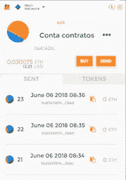
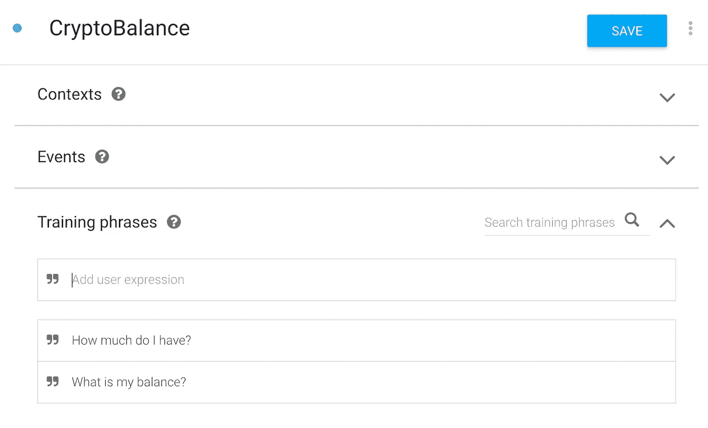
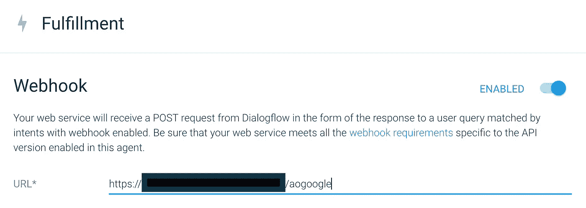
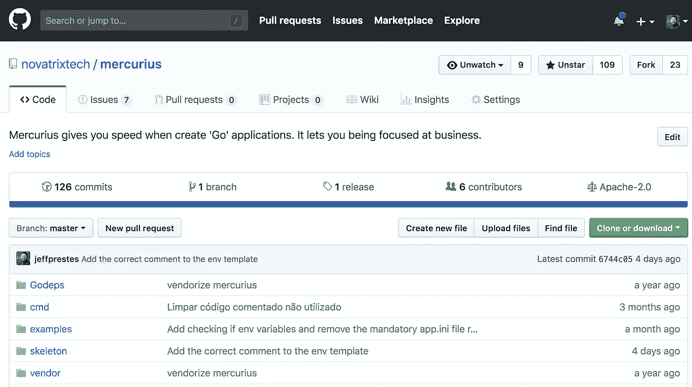
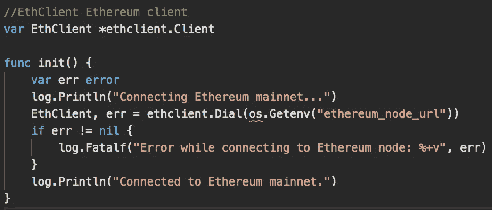
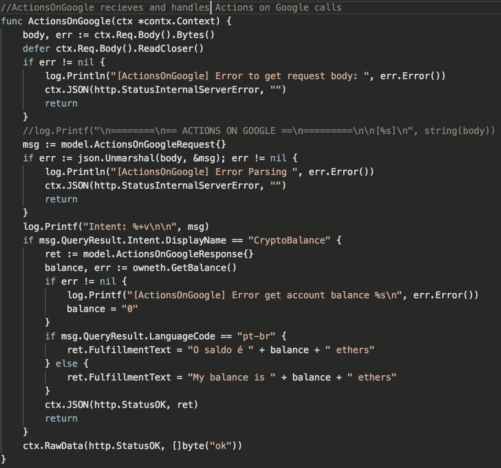

# 以太坊和谷歌助手

> 原文：<https://medium.com/coinmonks/ethereum-and-google-assistant-d50b1cfe0a98?source=collection_archive---------8----------------------->

越来越多的人正在访问区块链项目和执行行动。加密货币、代币、存储数据和通过智能合同做生意。然而，不懂技术的用户仍然面临为软件开发人员构建的技术的限制。

糟糕的网站体验，糟糕的移动应用程序和几乎没有聊天机器人，给没有悟性的区块链用户留下了区块链技术离真实事物很远的印象。然而，事实并非如此。这种情况发生的更多是因为市场更关注为大交易者建立工具，而不是由于技术限制。此外，区块链社区必须留下一些偏见，不要再说集成不安全。有几种技术和工具可以在软件集成中带来安全性。

那么，为什么不帮助用户并创建解决方案，为人们最习惯使用的工具带来区块链的好处呢？

(谷歌助手聊天机器人获取以太坊账户余额的视频演示)

在区块链以太坊， [ConsenSys](https://medium.com/u/6c7078bf7b01?source=post_page-----d50b1cfe0a98--------------------------------) 在构建 Infura、Remix 和 MetaMask(以及其他提高生产力的小工具)方面做得很好。我真的相信其他球员也必须做出贡献。

上周在圣保罗举行的[开发者大会](http://www.thedevelopersconference.com.br/tdc/2018/index.html)上，我们在 Google Actions 的基础上构建了一个聊天机器人——Google 的技术允许公司创建整合到 Google Assistant 中的聊天机器人——为用户提供他的以太坊账户余额。这个想法是允许乙醚持有人快速获取她用于小额交易的账户中的余额。我们还致力于脸书的一体化。这是阿尔法·法斯的一个简单工具。

到 https://console.actions.google.com 参观[。你可以使用你的个人谷歌帐户，或者如果你想作为一个公司来部署，你可以使用你将用于在谷歌 Play 商店上发布应用程序的同一帐户。](https://console.actions.google.com)

在幕后，我们使用 Google 的 DialogFlow 创建了一个聊天机器人。这个聊天机器人有一个叫做密码平衡的意图。我们训练它理解几个要求检查账户余额的句子。

然后，在履行部分，我们设置一个 webhook 来连接我们将开发的后端，以便向以太坊节点请求帐户余额。

然后我们创建了一个使用墨丘利([https://github.com/novatrixtech/mercurius](https://github.com/novatrixtech/mercurius)——内置于 [Go](https://golang.org) 的快速微服务框架开发)的后端解决方案

它通过 HTTP POST 接收 DialogFlow 的请求，然后启动对 [ConsenSys](https://medium.com/u/6c7078bf7b01?source=post_page-----d50b1cfe0a98--------------------------------) ' Infura 以太坊节点的 JSON-RPC 调用，以获得帐户余额(它将能够连接到任何其他启用 web socket 的以太坊节点)。

以太坊节点返回账户余额后，后台回复 DialogFlow，并发送给 Google Assistant，最终发送给用户。

这个工具是一小步。需要越来越多的终端用户工具来帮助区块链技术普及和广泛使用。

*感谢****Sachit Mishra****和****Neto Marin****对谷歌行动的支持*