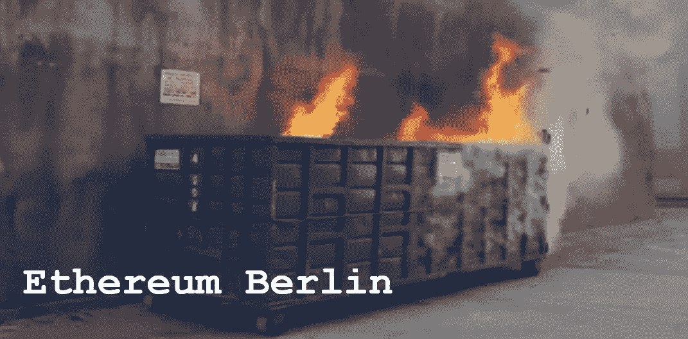

# 以太坊柏林共识失败

> 原文：<https://medium.com/coinmonks/ethereum-berlin-consensus-failure-1c0da2d32673?source=collection_archive---------3----------------------->

## 概述以太坊的设计哲学如何不同于比特币，以及回顾 2021 年 4 月 15 日柏林硬分叉共识失败的事件

令人惊讶的是，以太坊在昨天，也就是 2021 年 4 月 15 日计划了一次硬分叉，代号为“柏林”，结果[导致共识失败](https://decrypt.co/66692/ethereum-devs-fix-software-after-berlin-upgrade-goes-awry)。以太坊采用了与比特币根本不同的设计理念。比特币提供了一个建立经济体系的不可动摇的法律规则，更喜欢在边缘创新，以太坊每 6-12 个月彻底重写一次规则，并计划对其整个规则结构进行重大改革，这将被称为 ETH 2.0。

当我们谈到法治或规则结构时，我们指的是软件的规则。比特币有具体的属性，你必须围绕这些属性进行调整，然而，你也可以确定这些规则不会改变；换句话说，地毯不会从你身下被拉出来。这对长期经济规划和货币本身的作用非常重要。

以太坊无视法律规则，支持开发商的规则。他们通过说“不，不，我们是分散的，我们都升级，我们都同意”来掩盖这一点这是不真诚的。从一开始，我们就被告知以太坊是一项正在进行的工作，这将普通用户置于开发者的摆布之下，因为谁将做这项工作，谁是说不的正常人？

无论如何，这是一些背景情况。昨天，他们有另一个叫做“柏林”的规则变化当他们过渡到新的代码时，有一种叫做共识失败的东西。网络上不同的节点组开始对当前状态产生分歧。换句话说，节点不会彼此同步。

这很糟糕。加密货币和去中心化的整个理念都围绕着共识的理念。以太坊号称是一个可以为世界供电的智能合约平台，或者至少是一个数字金融可以依赖的平台。然而，像这样的协商一致失败与这一目标相矛盾。如果一个合同被编程为在时间 Y 做某个动作 X，但是由于共识失败而不能，潜在的数十亿美元的经济活动将处于危险之中。此外，在未来，以太坊希望从采矿转向所谓的赌注。以太代币的拥有者会把他们的硬币作为抵押品来参与一致同意的过程。这种股权证明制度包括一些积极的奖励，但也有惩罚。如果你违反规则，你会失去你的硬币。

然而，在一致失败的情况下，这些节点将被解释为违反规则。因此，共识的失败对于利害关系证明系统可能是灾难性的。

回到柏林。周四早上，以太坊网络上的节点同步出现了问题。这个问题蔓延到了构成以太坊生态系统 90%的大部分集中式服务，包括 Consensys、比特币基地、北海巨妖、以太扫描等。

该问题与网络上的一个软件品牌(又名客户端软件)有关，该软件计算的天然气价格与其他软件略有不同，导致该品牌的软件无法同步，并扰乱了整个网络。在长达一个小时的时间里，它很快就被修复了，只是不是通过分散的努力，而是由最大品牌的比特币软件以太坊 Go 上的集中开发人员修复的。这一事件再次证明以太坊是一个由开发人员董事会控制的集中式协议。

这里要吸取的主要教训是，这对于以太坊来说并不反常。它不断打破和有共识失败。他们总是修补后继续前进，说“这里没什么可看的。”其次，他们的整个设计理念并不符合 100%的运行时间和可靠性。理解复杂性是安全的敌人是至关重要的。你做的东西越复杂，就越有可能有破坏性的错误。

以太坊的路线图永无止境。他们离功能性的 ETH 2.0 实现至少还有 3-4 年的时间，在此过程中，他们将对系统进行修补并增加复杂性。有一天，如果网络只是长时间停止工作，我们不会感到惊讶。随着几分钟变成几小时，几小时变成几天，它就会崩溃。价值数十亿美元的投资、时间和努力将化为乌有。当以太坊在这个未来事件后重新上线时，它将会是它自己的缩小版，并且永远不会恢复。

*最初发表于 2021 年 4 月 16 日《比特币与市场研究》。*