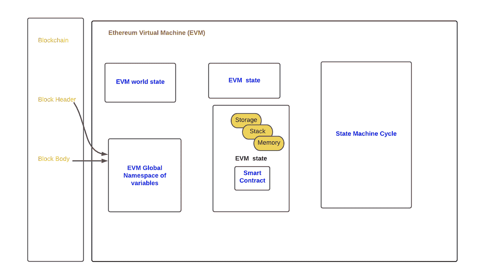

# 以太坊区块链

> 原文：<https://medium.com/coinmonks/ethereum-blockchain-d4398ff7c0cf?source=collection_archive---------4----------------------->

## **什么是以太坊区块链，以太坊虚拟机(EVM)，GWEI，气费，ERC 20 标准，EVM 功能组件。**

以太坊是一个开源的区块链，上面的**以太**是可以开采的令牌。根据以太坊网站的说法，*“以太坊是为加密货币、以太(ETH)和数以千计的分散应用提供动力的社区运营技术”。*为以太坊提供动力的核心引擎是以太坊虚拟机(EVM)。这是一个区块链软件平台，使用智能合约来验证以太坊块的交易。

**以太坊**是一个使用对等网络的开源分散平台，可用于开发分散应用(Dapps)。**以太坊虚拟机**是一个去中心化的应用，每个节点运行 EVM 来执行智能合约。

**Vitalik Buterin** ，加拿大计算机程序员，以太坊联合创始人之一。当以太坊启动时，预设数量的以太坊被提交给以太坊区块链，以支付任何提交错误的开发者。

以太坊市值 5000 亿美元创历史新高。这一价值随市场趋势而变化。目前估计在以太坊上建造/提交一个方块需要 13.13 秒。

以太坊中使用的智能合约是使用 **solidity** 编程语言开发的。 **Solidity** 是一种类似 JavaScript 的语法语言。智能合约是一种在没有人工干预的情况下使用代码执行和验证协议的方式，智能合约消除了对中间人服务的需求，并防止了冲突。智能合约一旦开发出来，就会被编译成字节码，并在 EVM 上运行。

Solidity 是由 Gavin wood 发现的一种编程语言，它是支持开发智能合同的 4 种编程语言之一。构成智能合同的指令集遵循满足业务用例的预先编写的逻辑。智能合同可以用来交换财产或购买任何有价值的东西。

## **以太坊——什么是 GWEI，燃气费**

在以太坊，使用的不同术语是供气、供气费和& Gas。交易费用称为**气费。**以太的最小单位是 GWei。一个 **ETH** 代表 10 亿 **gwei** 。Gwei 是计算油费的一个有用的单位。

Gas 在以太坊中用于计算交易费用，也用于计算资源。Gas 是一个非常重要的以太坊执行交易和执行智能合约。

共识算法是**工作证明(POW)** ，和比特币(工作证明)一样。很快以太坊将转向**利益证明(POS)，**一种不同的共识算法，比 POW 需要更少的计算资源。以太坊区块链的主要目标是成为一个大型的分散式系统，为在其上运行的分散式应用程序(Dapps)提供动力。

在 EVM，每个可编程计算都需要一种叫做气体的燃料。气费是完成一项交易所花费的气费，该费用支付给确认或完成交易的矿工。未用完的汽油被返还给外部呼叫者或交易的发起者。

# 一致性算法

# 工作证明

**工作证明** consensus 涉及区块链中的挖掘器(验证块中的交易的节点)，以在将块提交给区块链以太坊之前，求解一个称为块随机数的复杂数学值。该数据块的复杂随机数和哈希唯一标识区块链中的一个数据块。随着以太网的发展，使用 POW 验证块所需的计算复杂度/能力也在增加。矿工因成功计算区块链中的唯一随机数而获得奖励。决定所挖掘的事务是否成功的一致性证明算法遵循最长链规则来决定挖掘哪个块。在最长链规则中，矿工密切关注区块链网络，寻找新的开采区块。最长的链成为有效的区块链，并且花费了最多的努力来构建。

# 以太坊——股份证明

在股权共识证明中，矿工的选择是基于他们可以持有的股权，以保证他们可以在区块链从事采矿工作。当 POS 被引入以太坊时，一个矿工需要 32 个以太才能参加。如果一个矿工不能把预期的醚股份，他可以选择加入股份池。一名矿工从赌注池中被选中。如果矿工成功开采、签署和验证区块，矿工将获得一些交易费作为奖励。汽油量是客户愿意为成功的乙醚交易支付的价格。

区块链上的任何采矿行为都会引发恶意活动，矿工会失去他所押的乙醚，他的采矿权也会被取消。然而，对于一个矿工来说，要执行任何恶意的行动，黑客应该在网络中拥有 51 %的股份；这么高的赌注实际上是不可能的。以下是 POS 上的几点。

1.  在利益一致的证明中，一个矿工可以扮演利益相关者的角色或者是一个验证者，需要 32 个醚。如果一个矿工没有足够的赌注，那么为了参与采矿，他可以加入 POS 赌注池。
2.  验证者是从一组赌注者中随机选择的。在以太坊上，一组验证器(128 个堆栈器)要么将块提交给区块链，要么验证块。
3.  在 POS 中，块被分为链和碎片。分片链允许以太坊同时创建多个块，从而提高交易吞吐量和安全分片。
4.  什么是碎片链？区块链被分成多个区块，以降低开采区块的复杂性。这些块组合起来形成碎片链。信标链将协调管理碎片链所需的理解。Beacon Chain 持续扫描、验证、收集投票，并奖励正确证明块的验证者，扣除不在线者的奖励，并削减恶意参与者的 ETH。
5.  POS 51%股权攻击还是有可能的，但是 51%股权损失这么大一笔钱的风险让攻击没什么意思。风险越大，保持区块链健康的动力就越大。
6.  与 POW 相比，POS 的资源密集程度相对较低，但是 POS 尚未经过实战考验，无法在现实世界的区块链市场中保持稳健。

# 以太坊 ERC -20 标准

ERC 20 是我们建造以太坊代币的标准。区块链以太坊上的代币必须遵循 ERC 20 标准。ERC-20 标准具有特定的方法，这些方法是强制性的，为了使令牌有效，必须实现这些方法。需要实施的方法有:

> 总供应、转移、余额、批准、允许、转移自

ERC-20 令牌被编码为智能合约，并在分散以太坊虚拟机(EVMs)上执行。这些标准具有特定的接口，要求实现基于令牌的传输和批准是如何发生的。开发人员使用 Solidity 编程语言来实现 ERC-20 令牌。Solidity 在语法上类似于 Javascript / Java 语言，易于使用(业务友好)。

可选接口为令牌名、符号和小数(至 18)。

## ERC 20 标准—代码接口

ERC 代表**以太坊请求置评。**该请求的编号为 20。

如上所述，为了符合 ERC-20 令牌，应该实现以下标准。这些方法分为强制令牌和可选令牌。

> 函数 totalSupply()公共视图返回(uint 256)；
> function balance of(address token owner)public view returns(uint)；
> function allow ance(address token owner，address spender)
> public view returns(uint)；
> 函数传递(address to，uint tokens)公共返回(bool)；
> 函数 approve(address spender，uint tokens)public returns(bool)；
> 函数 transferFrom(address from，address to，uint tokens)公共返回(bool)；

实现这些标准的令牌执行命令来检查钱包的余额，并通过适当的授权进行转账。

# 以太坊虚拟机

*   以太坊区块链中的每个节点都运行一个 EVM，这是一个执行智能合同的虚拟化环境。EVM 不是一个硬件组件，而是一个类似 Java 虚拟机(JVM)的虚拟化环境。
*   EVM 是一个独立的虚拟组件，在以太坊上运行着数百万行代码和数据。EVM 为智能合约提供了一个沙箱，以便在提交到主区块链之前运行。智能合约使用 solidity 或任何其他类似的语言编写，编译为字节码，并在 EVM 上运行。。

> EVM 的简化架构包含以下组件。——
> EVM 州。
> 堆栈内存
> Bycode 代码状态
> 物理存储

*   图:**以太坊虚拟机上下文**

*   EVM 世界状态存储在持久存储器中。EVM 执行模型使用堆栈和易失性内存。编译后的智能合约字节码作为许多 EVM 操作码执行，这些操作码执行标准的堆栈操作，如 AND、ADD、SUB。
*   EVM 是一种状态机，其执行受到有限数量的执行步骤的限制。这由每次交易的有限气体供应来控制。
*   每个事务使用有限的 Gas 供应，以避免 EVM 线程和缓冲区溢出，并防止智能合约的无限循环执行。
*   EVM 的执行是单线程的。EVM 之外还有一个 EVM 计划组件。
*   EVM 使用内存堆栈来执行编译成字节码的智能合约。它有输入、输出和永久存储器。它有一个不可变的代码(编译智能合同)，易失性内存和永久存储(零初始化)。
*   EVM 将所有内存中的值存储在一个堆栈中。它使用 256 位的字长，并具有几个可寻址的数据部分，以便于散列和椭圆曲线运算。

堆栈由以下组件组成:

*   一个叫做 ROM 的不可变程序
*   易失性存储器，将存储器的每个位置初始化为零。
*   初始化为零的永久存储器。
*   可以在 EVM 上执行的不同操作有
*   按位和算术运算
*   控制逻辑操作。
*   对堆栈、内存和存储的访问
*   日志记录和其他运算符
*   执行上下文访问

# 以太坊虚拟机功能组件

## EVM 机器空间

EVM 空间有堆栈存储器、易失性存储器和持久性存储器。

## EVM 堆栈

EVM 代码在虚拟机上运行，命令在堆栈上执行。不同的操作，如推送、拷贝交换。读/写基于 256 位操作。

## EVM 记忆

EVM 存储器是线性的，初始化为零，并在字节级寻址。它可以是 8 位存储或 256 位存储。不同的说明是:

POP//从堆栈中移除顶部项目
m Load//从内存加载一个字
m store//将一个字保存到内存
m store 8//将一个字节保存到内存

## EVM 电码

使用高级语言编写的智能合约代码被编译成字节码，并在 EVM 上本机执行。

## EVM 帐户存储

EVM 存储是将 256 位字映射到 256 位字的键值存储。可以用 SSTORE/SLOAD 指令访问存储器。存储位置最初被定义为零。

## EVM 的高级代码执行流程

*   高级代码被编译成 EVM 字节码。
*   字节码有特定操作的必要指令。
*   有一个初始存储的燃料称为气体，以启动交易。指令在堆栈上执行。
*   堆栈的中间值存储在易失性存储器中。
*   最终值和存储在账户存储器中的(持久的)。

这篇文章讨论了以太坊区块链的一些概念，即什么是以太，Gwei，天然气价格，股权证明，以太坊虚拟机及其功能组件。阅读更多关于 IAM & Security @[https://iamblockc.medium.com/](https://iamblockc.medium.com/)的文章

> 加入 Coinmonks [电报频道](https://t.me/coincodecap)和 [Youtube 频道](https://www.youtube.com/c/coinmonks/videos)了解加密交易和投资

## 另外，阅读

*   [什么是融资融券交易](https://blog.coincodecap.com/margin-trading) | [成本平均法](https://blog.coincodecap.com/dca)
*   [支持卡审核](https://blog.coincodecap.com/uphold-card-review) | [信任钱包 vs 元掩码](https://blog.coincodecap.com/trust-wallet-vs-metamask)
*   [Exness 回顾](https://blog.coincodecap.com/exness-review)|[moon xbt Vs bit get Vs Bingbon](https://blog.coincodecap.com/bingbon-vs-bitget-vs-moonxbt)
*   [如何开始通过加密贷款赚取被动收入](https://blog.coincodecap.com/passive-income-crypto-lending)
*   [BigONE 交易所评论](/coinmonks/bigone-exchange-review-64705d85a1d4) | [电网交易 Bot](https://blog.coincodecap.com/grid-trading)
*   [新加坡十大最佳加密交易所](https://blog.coincodecap.com/crypto-exchange-in-singapore) | [购买 AXS](https://blog.coincodecap.com/buy-axs-token)
*   [投资印度的最佳加密软件](https://blog.coincodecap.com/best-crypto-to-invest-in-india-in-2021) | [WazirX P2P](https://blog.coincodecap.com/wazirx-p2p)
*   [7 大最佳零费用密码交易平台](https://blog.coincodecap.com/zero-fee-crypto-exchanges)
*   [分散交易所](https://blog.coincodecap.com/what-are-decentralized-exchanges) | [比特 FIP](https://blog.coincodecap.com/bitbns-fip)
*   [用信用卡购买密码的 10 个最佳地点](https://blog.coincodecap.com/buy-crypto-with-credit-card)
*   [加拿大最佳加密交易机器人](https://blog.coincodecap.com/5-best-crypto-trading-bots-in-canada) | [Bybit vs 币安](https://blog.coincodecap.com/bybit-binance-moonxbt)
*   [火币加密交易信号](https://blog.coincodecap.com/huobi-crypto-trading-signals) | [Swapzone 审查](/coinmonks/swapzone-review-crypto-exchange-data-aggregator-e0ad78e55ed7)
*   最佳[密码交易机器人](https://blog.coincodecap.com/best-crypto-trading-bots) | [购买索拉纳](https://blog.coincodecap.com/buy-solana) | [矩阵导出评论](https://blog.coincodecap.com/matrixport-review)
*   [Coldcard 评论](https://blog.coincodecap.com/coldcard-review) | [BOXtradEX 评论](https://blog.coincodecap.com/boxtradex-review)|[uni swap 指南](https://blog.coincodecap.com/uniswap)