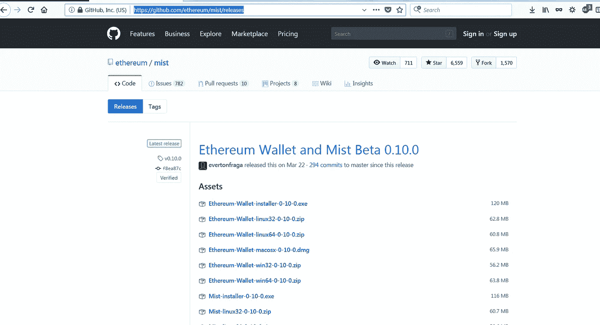

# 以太坊区块链“Hello World”智能合约与 JAVA

> 原文：<https://medium.com/coinmonks/ethereum-blockchain-hello-world-smart-contract-with-java-9b6ae2961ad1?source=collection_archive---------0----------------------->


Ethereum

本教程涵盖了使用 web3j Java 框架在私有[以太坊](https://blog.coincodecap.com/tag/ethereum/)节点中开发第一个智能合约所需的完整步骤。

区块链正在颠覆软件行业。区块链一词已经成为一个热门话题。每个人都在谈论区块链及其在分散式应用中的用法。但是大多数时候，区块链的下划线概念被误解了。让我们试着用简单的术语来理解它。区块链可以被认为是一种数据库技术，用于以分布式方式存储数据。它使用哈希算法来维护数据的完整性，这与 Git 非常相似。区块链的每个节点都有自己的数据存储副本。工作证明算法可以防止对数据存储中的记录进行操作。处理节点对等连接，并将自主工作。这使得能够消除第三方参与者，如银行系统，在交易中间管理风险。比特币等加密货币是区块链技术的一个应用实例。但不仅限于加密货币。


Blockchain

区块链技术的目的是消除需要有一个中间人来促进金融交易。在典型的支付系统中，银行或金融机构会通过充当中间人来最小化交易的风险。


Typical transaction flow

区块链技术在没有中间玩家的情况下促进了支付。例如，您可以将数字货币从您的账户转移到您的供应商账户，而无需借助 paypal 或任何其他第三方支付提供商的功能。所以区块链就是这么简单。


Direct peer-to-peer transaction

**定义:**区块链是一种通过共识伪造的点对点分布式账本，结合“智能合约”和其他辅助技术的系统。记住区块链不是一种单一的技术。它是技术的集合。


Blockchain Technology

让我们试着理解这些技术。

**DLT :** 分布式账本使用独立的计算机(称为节点)在各自的电子账本中记录、共享和同步交易(而不是像传统账本那样保持数据集中)。区块链将数据组织成块，这些块以仅附加模式链接在一起。


**区块链**是分布式账本技术的一种特定形式或子集。这就是数据在 DLT 中的存储方式。但区块链这个术语已经成为整个技术堆栈的时髦词汇。

**对等:**区块链中的节点是对等连接的。您可以将笔记本电脑上运行的本地节点无缝连接到区块链网络。

分散式:在分散式系统中，每个节点都是自主运行的。与分布式系统的主要区别在于，在分布式系统中，有一组专用的节点来控制其他节点。但是在一个分散的系统中，没有人互相指挥。没有主从客户端服务器的概念。每个人都有平等的决定权。


Decentralized

**密码安全:**区块链使用数字签名(SHA256)算法来维护/验证数据的完整性。


Digital Signature

**匿名:**在区块链，一个有密钥对(公钥&私钥)的账户被用于提交交易的钱包。无法通过查看交易来识别用户或任何其他个人信息。完全匿名。例如，如果你进入 etherscan.io，它是查看以太坊区块链交易的中心应用程序，那么“从”帐户和“到”帐户将如下所示。


Anonymous

我们将在后面更详细地讨论这些技术。让我们看看区块链的历史。

**我的其他出版物:**

[采用 Vert 的 Java“Hello world”微服务。x、Docker 和 Kubernetes](/@thusharaj/java-hello-world-microservice-with-vert-x-docker-and-kubernetes-f52ec62fc426?source=your_stories_page---------------------------)

[甲骨文 JDK 不再免费！！](/@thusharaj/oracle-jdk-is-no-longer-free-615280e9cc0f?source=your_stories_page---------------------------)

[简化的 Java 代码约定](/@thusharaj/java-code-convention-simplified-f476bd8aa719?source=your_stories_page---------------------------)

[在以太坊区块链中创建自己的加密货币](/coinmonks/create-your-own-cryptocurrency-in-ethereum-blockchain-40865db8a29f?source=your_stories_page---------------------------)

[以太坊区块链“Hello World”智能合约与 JAVA](/coinmonks/ethereum-blockchain-hello-world-smart-contract-with-java-9b6ae2961ad1?source=your_stories_page---------------------------)

[现实生活中的 Git—Git flow 分支模型](/@thusharaj/git-in-real-life-3762131d1e5f?source=your_stories_page---------------------------)

[JAVA 持续集成(CI)工具链](/@thusharaj/quality-source-522b63d3d9fd?source=your_stories_page---------------------------)

[带有 RESTEasy、JSON、TestNG、Mockito & Maven](/@thusharaj/rest-web-services-with-rest-easy-json-mockito-maven-50d913219824?source=your_stories_page---------------------------) 的 Java Web 服务

历史:区块链技术为拜占庭将军问题找到了一个解决方案，如下文所示。


Byzantine generals problem

[](/wolverineblockchain/blockchain-the-byzantine-generals-problem-2f17097bad73) [## 区块链:拜占庭将军的问题

### 计算中有一个问题，直到最近还没有解决。这个问题叫做拜占庭…

medium.com](/wolverineblockchain/blockchain-the-byzantine-generals-problem-2f17097bad73) 

**区块链的类型:**主要有两种类型的区块链实现。开放/公共和企业。在比特币或以太坊这样开放的公共区块链中，任何人都可以作为节点加入主网络。但是在诸如 Hyperledger 结构的企业区块链中，只有授权的节点才能进入网络。


Types of blockchains

区块链技术有许多实现方式。我们将讨论以太坊。


Blockchain Implementations

**比特币:**2008 年 10 月 31 日，一个名叫中本聪的不知名人士提交了一份白皮书，内容是关于在不需要中间方的情况下进行电子交易。这就是比特币的起源。比特币技术的全部目的是在当前的金融交易合同中以点对点的方式在双方之间转移资金，这些交易是在中介(如银行)的帮助下进行的。


BitCoin


[https://bitcoin.org/bitcoin.pdf](https://bitcoin.org/bitcoin.pdf)

**以太坊:【2013 年 12 月，Vitalik Buterin 撰写了一份白皮书，介绍如何将区块链技术扩展到金融交易和智能合约之外。这就是以太坊的由来。**

[https://github.com/ethereum/wiki/wiki/White-Paper](https://github.com/ethereum/wiki/wiki/White-Paper)

[http://web . archive . org/web/20131228111141/http://vbuterin . com/ether eum . html](http://web.archive.org/web/20131228111141/http://vbuterin.com/ethereum.html)

[https://block chain review . io/WP-content/uploads/2018/03/02.01。_ final _ ether eum-White-Paper-Made-simple . pdf](https://blockchainreview.io/wp-content/uploads/2018/03/02.01._final_Ethereum-White-Paper-Made-Simple.pdf)


Vitalik Buterin : Co-founder of Ethereum


Main components of Ethereum

**以太坊**是用 [Go](https://golang.org/) 编程语言编写的。 [Geth](https://github.com/ethereum/go-ethereum/wiki/geth) 是运行完整以太坊节点的命令行工具/界面。你可以选择连接到主以太网或者创建你自己的私人网络。如果您连接到主网络，那么整个区块链数据(~45GB)将被下载到您的机器。因此，我们将使用一个节点建立自己的网络。


Ethereum

**以太坊中的智能合约**是一段代码，可以被部署和执行以执行业务功能。编译后的代码在每个使用以太坊 JVM 的节点上运行。合同有自己的帐户地址。调用者应该为在节点中部署和执行智能契约付费。代币([货币](https://www.ethereum.org/token))也是智能合约。这些合同是用实体语言写的。你可以将**自己的货币**定义为智能合约。

**以太坊中的账号**是账号地址、公钥和私钥的组合。地址用于执行交易，如资金转账。账户地址来源于公钥。私钥用于签署交易。

除了主以太网之外，还有几个测试以太网。Ropsten、Kovan & Rinkeby 可用于在进入生产主网络之前测试您的应用程序。


Accounts

**Wallet** 用于创建/管理您的账户。钱包可以有多个账户。

**MetaMask** 是一款钱包管理器应用，可以作为 Chrome 扩展下载。你必须相信他们会保管好你的私钥。

Remix 是一个 solidity 语言的在线集成开发环境。Remix 运行自己的以太坊节点进行测试。

**web3js** 是一个 **java script** 框架，可以用来与以太坊节点进行交互

**web3j** 是一个 **java** API，可以用来与节点进行交互

**Mist** 是一款浏览云端托管的 dApps 的浏览器。它也可以用作钱包管理。

**Geth** 是用于与区块链交互的命令行工具

事务是区块链的基本消息结构。

以太坊区块链由多个节点组成。每个节点都有自己的块副本。节点使用八卦协议进行对等通信。


Transaction


Transaction

一个块包含多个事务。


Block


Node

**区块链**是用类似 Git 的哈希值连接的区块的链表。改变一个块的内容将导致链中散列值的改变。


Blockchain

节点将选择一组事务(块)进行验证。每笔交易都用用户的私钥进行数字签名。公钥嵌入在事务中，因此节点可以使用公钥来验证签名。一旦签名被验证，节点试图通过解决散列难题来找到下一个有效块。难题是找到一个名为 Nonse 的数字，以便块的结果散列将从给定数量的前导零开始。例如，在下面的块节点中将迭代 Nonse = 0 到 n，因此当 n = 139358 时，块散列包含五个前导零。这叫挖矿。一旦找到正确的序列号，该节点将发送该块给其他节点进行确认。在一定数量的确认之后，该块被接受为链中的下一个块。该节点因找到非节点而获得一定量的以太奖励。这就是计算能力的重要性。


Mining

通过使用新挖掘的块中的前一个块的散列来创建块链。前一个块的散列是当前块的输入。如果前一个块被修改，则前一个块的散列被改变。这将在整个区块链产生连锁反应。因为改变前一个散列将影响下一个块散列和下一个块散列，并且它继续…


Mining

这就是区块链维护数据完整性的方式。在[https://anders.com/blockchain/tokens.html](https://anders.com/blockchain/tokens.html)有一个关于这个的互动教程

**从钱包提交交易**


Submit Transaction

**与以太坊接口:**可以使用 web3js java script API 与以太坊区块链进行交互。


Interfacing with ethereum

让我们用一个节点创建我们自己的专用网络。

**下载&安装 Geth:** 从下面的网址下载 windows 版本的 Geth 并安装。Geth 是区块链的命令行界面。

[https://geth.ethereum.org/downloads/](https://geth.ethereum.org/downloads/)

**创建 genesis 块&数据文件夹:**您需要创建您的初始块(genesis 块)来启动区块链协议。在你的硬盘上创建一个新的文件夹，并将下面的内容保存为 genesis.json。将 chainId 值从 1 更改为不同的数字，以避免连接到主网络。chainId=1 保留给主网络。

```
{
  "coinbase"   : "0x0000000000000000000000000000000000000001",
  "difficulty" : "0x20000",
  "extraData"  : "",
  "gasLimit"   : "0x2fefd8",
  "nonce"      : "0x0000000000000042",
  "mixhash"    : "0x0000000000000000000000000000000000000000000000000000000000000000",
  "parentHash" : "0x0000000000000000000000000000000000000000000000000000000000000000",
  "timestamp"  : "0x00",
  "alloc": {},
  "config": {
        "**chainId": 10**,
        "homesteadBlock": 0,
        "eip155Block": 0,
        "eip158Block": 0
    }
}
```

创建一个名为 chaindata 的空文件夹来存储块。最终状态如下。


genesis.json & data folder

从这个文件夹打开你的命令提示符，使用下面的命令启动区块链协议。这将**而不是**启动任何节点。

```
geth --datadir=./chaindata/ init ./genesis.json
```


Initiate block chain

**启动您的私有节点:**现在您可以使用以下命令启动您的私有节点。

```
geth --datadir=./chaindata/ --rpc console
```


Start private node

**下载&安装钱包管家 app :** 钱包管家 app 可用于创建以太坊账户。帐户是以太坊中的密钥库，有私钥和公钥对。默认情况下，密钥将保存在 chaindata 文件夹中。私钥用于在提交给区块链时对交易进行加密/签名。这个密钥也将由 web3j 加载。您可以将 Mist 用作钱包管理器，并浏览 ehereum 应用商店。另一方面，钱包管理员也可以作为一个独立的应用程序安装。https://github.com/ethereum/mist/releases?after=0.4.0

我们将使用钱包管理员应用程序创建两个测试帐户。从以下位置下载并安装钱包管理器应用程序。

1.  安装钱包管理员应用程序



[https://github.com/ethereum/mist/releases](https://github.com/ethereum/mist/releases)

2.启动钱包管理器应用程序:Remix 钱包管理器应用程序将默认连接到您的私有节点。你可以在下面的截图中看到“私人网络”的红色标签。


不需要等待与主网络的同步活动，我们只是运行我们的本地节点。按下启动应用程序按钮。


Wallet Manager

3.创建两个账户:我们将使用钱包管理员应用程序进行简单的资金转移交易。为此需要两个不同的账户。您可以使用钱包管理员应用程序创建帐户。转到文件菜单，然后按新帐户。指定您的钱包密码。这将使用私钥和公钥创建您的密钥库文件。可以重复相同的过程来创建另一个用于货币转账交易的账户。默认情况下，第一个帐户将被标识为主帐户。


Create new account

这是你的身份，应该放在安全的地方保护。您可以在 chaindata/keystore 文件夹下找到您的 kestore 文件。


Keystore files

你的密钥库文件里有什么:[https://medium . com/@ Julien . MAF fre/what-is-an-ether eum-keystore-file-86 c8 c 5917 b 97](/@julien.maffre/what-is-an-ethereum-keystore-file-86c8c5917b97)

在现实世界中，元掩码将充当您的密钥库管理器。MetaMask chrome 浏览器扩展将管理您的密钥，并使用存储在浏览器数据存储中的私钥来签署交易。

[https://ether eum . stack exchange . com/questions/39954/does-meta mask-store-private-key-on-server-or-anywhere-else](https://ethereum.stackexchange.com/questions/39954/does-metamask-store-private-key-on-server-or-anywhere-else)

4.开矿:没有真金白银(以太)就没有开户的意义。我们可以通过使用 Geth 控制台开始挖掘过程来获得一些免费的乙醚到我们的主帐户。下面是命令。

```
miner.start();
```

您可以导航到钱包管理员应用程序，查看乙醚如何实时添加到您的帐户中。乙醚会加到你的主账户里。

5.转移醚

按钱包管理器中的发送按钮，将乙醚从一个帐户转移到另一个帐户。选择发件人帐户。将目标帐户的地址复制并粘贴到收件人字段。指定金额。应该为未成年人执行该交易支付费用。您可以在选择费用部分选择您的费用，然后按发送按钮。将提示您输入源帐户的密钥库密码。一旦提交矿工(我们有一个矿工将开始采矿过程。


Transfer Ether

请确保您的节点已经开始挖掘。如果没有使用 miner . start()；命令来启动它。在钱包管理器应用程序中可以看到您最近一次交易的状态。完成交易需要 12 次确认。交易完成后，检查您的帐户余额，以确认汇款效果。接下来，我们将使用 web3j 库进行同样的资金转账交易。

**让我们从 web3j** 开始编码

web3j 是一个轻量级、高度模块化、反应式、类型安全的 Java 和 Android 库，用于处理智能合约并与以太坊网络上的客户端(节点)集成。


web3j

创建一个空的 maven 项目，并在下面添加依赖项。完整的 pom.xml 文件如下。

```
<**project 
         xmlns:xsi="http://www.w3.org/2001/XMLSchema-instance"
         xsi:schemaLocation="http://maven.apache.org/POM/4.0.0
   http://maven.apache.org/xsd/maven-4.0.0.xsd"**>
    <**modelVersion**>4.0.0</**modelVersion**>

    <**groupId**>com.web3j.blockchain</**groupId**>
    <**artifactId**>project</**artifactId**>
    <**version**>1.0</**version**>

    <**dependencies**>
        <**dependency**>
            <**groupId**>org.web3j</**groupId**>
            <**artifactId**>core</**artifactId**>
            <**version**>3.4.0</**version**>
        </**dependency**>
        *<!-- https://mvnrepository.com/artifact/org.web3j/abi -->* <**dependency**>
            <**groupId**>org.web3j</**groupId**>
            <**artifactId**>abi</**artifactId**>
            <**version**>3.4.0</**version**>
        </**dependency**>
        <**dependency**>
            <**groupId**>org.slf4j</**groupId**>
            <**artifactId**>slf4j-simple</**artifactId**>
            <**version**>1.7.5</**version**>
        </**dependency**>
    </**dependencies**>
</**project**>
```

1.  使用 web3j 传输乙醚


注意:您可以在 web3j 代码中使用由 wallet 应用程序创建的相同帐户。代码中应该提到 keystore 文件的实际文件名。如果您指定文件夹名而不是文件名，它将不起作用。在 to 参数中使用有效的目标帐户地址。执行上述代码后，您可以在钱包管理器应用程序中验证转账金额。Miner 应该在您的 geth 控制台中运行以完成事务。

密码

```
**package** org.web3j.sample;

**import** org.slf4j.Logger;
**import** org.slf4j.LoggerFactory;
**import** org.web3j.crypto.Credentials;
**import** org.web3j.crypto.WalletUtils;
**import** org.web3j.protocol.Web3j;
**import** org.web3j.protocol.core.methods.response.TransactionReceipt;
**import** org.web3j.protocol.http.HttpService;
**import** org.web3j.tx.Transfer;
**import** org.web3j.utils.Convert;
**import** java.math.BigDecimal;

**public class** Application {
    **private static final** Logger ***log*** = LoggerFactory.*getLogger*(Application.**class**);

    **public static void** main(String[] args) **throws** Exception {
        **new** Application().run();
    }

    **private void** run() **throws** Exception {
        *// We start by creating a new web3j instance to connect to remote nodes on the network.* Web3j web3j = Web3j.*build*(**new** HttpService());
        ***log***.info(**"Connected to Ethereum client version: "** + web3j.web3ClientVersion().send().getWeb3ClientVersion());
        Credentials credentials =
                WalletUtils.*loadCredentials*(
                        **"supersafepassword"**,
                        **"chaindata\\keystore\\UTC--2018--<rest of the file name>"**);
        ***log***.info(**"Credentials loaded"**);
        ***log***.info(**"Sending Ether .."**);
        TransactionReceipt transferReceipt = Transfer.*sendFunds*(
                web3j, credentials,
                **"0xf900D5fEEf974F058543E47B27C801D396684266"**,  *// you can put any address here* BigDecimal.*valueOf*(100), Convert.Unit.***ETHER***)  *// 1 wei = 10^-18 Ether* .sendAsync().get();
        ***log***.info(**"Transaction complete : "** + transferReceipt.getTransactionHash());
    }
}
```

输出


Transfer Ether

**用 solidity 语言写下你的第一个智能联系人**

智能合同是使用 Solidity 语言开发的软件，用于执行定制的业务功能。智能合同将安装在网络中的所有节点上。安装是一次性的操作，并且它必须通过为矿工花费以太网作为交易提交给网络。一旦安装，您不能修改它。它就像一个 rational 数据库中的存储过程。您可以通过提交事务来调用合同中的函数。您可以使用 Remix 浏览器应用程序来编写智能合同。Remix 有一个内置的以太坊节点，你可以在那里部署和测试合同。在你的浏览器中导航到 https://remix.ethereum.org[并写下下面的代码。](https://remix.ethereum.org)


HelloWorld.sol

```
pragma solidity ^0.4.16;contract HelloWorld {
   uint256 counter = 5;

   function add() public {  //increases counter by 1
       counter++;
   }

   function subtract() public { //decreases counter by 1
       counter--;
   }

   function getCounter() public constant returns (uint256) {
       return counter;
   } 

}
```

在 Remix 中部署和测试您的合同。


使用编译选项编译您的联系人。然后导航到运行选项卡并按下部署按钮来部署它。您的合同将被部署为事务。因此，您需要指定源帐户地址和气体限额(为执行此交易向矿工支付的乙醚量)。一旦部署，合同将有自己的地址。这个地址可以用来调用事务中的方法。


Deployed contract

您可以通过按 add、subtract 和 getCounter 按钮来执行合同中的功能。按 add 按钮，然后按 getCounter 按钮检查您的计数器值。


Execute the contract

现在我们将使用 web3j 而不是 Remix 来部署合同。首先我们需要起草合同。智能协定的编译输出包含两个部分。二进制文件(一旦部署，将在以太坊 JVM 中执行)和应用程序二进制接口(ABI ),它是以 JSON 格式表示的合同的可读定义。这些输出是生成包装类 uisng web3j 所必需的。包装类将隐藏连接和执行智能契约的所有复杂性。它将充当智能合约的接口。


Compile Contract

1.  编译联系人

我们将使用 solc 编译器来编译合同。你可以下载它的 windows 版本。

[https://github.com/ethereum/solidity/releases](https://github.com/ethereum/solidity/releases)

[](https://www.codeooze.com/blockchain/solc-hello-world/) [## 可靠性:在 Windows 代码软泥上使用 solc

### solc 命令行编译器是 Solidity 编译器的 C++实现，它可以输出…

www.codeooze.com](https://www.codeooze.com/blockchain/solc-hello-world/) 

solc compiler

下载并解压 zip 文件到你的硬盘。然后将你的合同保存到一个名为 **HelloWorld.sol** 的文件中，并保存到 solc compile 文件夹以便于访问。


solc file

打开新的终端，使用下面的命令编译它。

【https://web3j.readthedocs.io/en/latest/smart_contracts.html 

```
solc HelloWorld.solc --bin --abi --optimize -o ./
```

该命令将生成二进制文件和 ABI 文件作为输出。


Compiled output of the contract

让我们使用编译后的智能契约的输出来生成**HelloWorld.java**包装类。这个包装类用于与智能合约进行交互。所有的复杂性对最终用户都是隐藏的。


Generate Wrapper class


Interact with the Smart Contract

web3j 附带了一个命令行实用程序来生成包装类。你可以从下面的位置下载它。将工具复制到硬盘后，您需要将二进制文件和上一步中生成的 ABI 复制到 web3j.bat 文件所在的文件夹中。

[](https://github.com/web3j/web3j/releases/tag/v3.4.0) [## web3j/web3j

### web3j——轻量级 Java 和 Android 库，用于与以太坊客户端集成

github.com](https://github.com/web3j/web3j/releases/tag/v3.4.0) 

web3j

将文件夹解压到硬盘中。将上述实体编译步骤中创建的 abi 文件和二进制文件复制到 bin 文件夹中。


Generate Wrapper class

运行下面的命令来生成包装类。

```
web3j solidity generate helloworld.bin helloworld.abi -o . -p org.web3j.sample
```

参数 **p** 应该是生成的类的 java 打包结构。


提示:[https://stack overflow . com/questions/44662197/web3j-solidity-generate-command-not-working](https://stackoverflow.com/questions/44662197/web3j-solidity-generate-command-not-working)

新类将在 org.web3j.sample 文件夹中生成。


Part of the generated HelloWorld.java

将此文件复制到应用程序文件夹结构中。


Application package structure

让我们从您的应用程序中部署和使用智能合同。


Deploy and use smart contract

完全码

```
**package** org.web3j.sample;

**import** org.slf4j.Logger;
**import** org.slf4j.LoggerFactory;
**import** org.web3j.crypto.Credentials;
**import** org.web3j.crypto.WalletUtils;
**import** org.web3j.protocol.Web3j;
**import** org.web3j.protocol.core.methods.response.TransactionReceipt;
**import** org.web3j.protocol.http.HttpService;
**import** org.web3j.tx.Contract;
**import** org.web3j.tx.ManagedTransaction;
**import** org.web3j.tx.Transfer;
**import** org.web3j.utils.Convert;

**import** java.math.BigDecimal;

**public class** Application {
    **private static final** Logger ***log*** = LoggerFactory.*getLogger*(Application.**class**);

    **public static void** main(String[] args) **throws** Exception {
        **new** Application().run();
    }

    **private void** run() **throws** Exception {
        *// We start by creating a new web3j instance to connect to remote nodes on the network.* Web3j web3j = Web3j.*build*(**new** HttpService());
        ***log***.info(**"Connected to Ethereum client version: "** + web3j.web3ClientVersion().send().getWeb3ClientVersion());
        Credentials credentials =
                WalletUtils.*loadCredentials*(
                        **"password"**,
                        **"chaindata\\keystore\\UTC--2018-06-21T06-34-32.658490800Z--5ade9a7f8f57ab3995ac4d56c78a22649d3b1686"**);
        ***log***.info(**"Credentials loaded"**);
        ***log***.info(**"Sending Ether .."**);
        TransactionReceipt transferReceipt = Transfer.*sendFunds*(
                web3j, credentials,
                **"0xDc1Fb60F7E1eF6ef052A014EFbDF82debd803D06"**,  *// you can put any address here* BigDecimal.*valueOf*(100), Convert.Unit.***ETHER***)  *// 1 wei = 10^-18 Ether* .sendAsync().get();
        ***log***.info(**"Transaction complete : "** + transferReceipt.getTransactionHash());

        *// Now lets deploy a smart contract* ***log***.info(**"Deploying smart contract"**);
        Helloworld contract = Helloworld.*deploy*(
                web3j, credentials,
                ManagedTransaction.***GAS_PRICE***, Contract.***GAS_LIMIT***).send();

        String contractAddress = contract.getContractAddress();
        ***log***.info(**"Smart contract deployed to address "** + contractAddress);

        ***log***.info(**"Initial value of counter in Smart contract: "** + contract.getCounter().send());
        ***log***.info(**"Incrementing counter in Smart contract"**);
        contract.add().send();
        ***log***.info(**"Value of counter in Smart contract after increment : "** + contract.getCounter().send());
        ***log***.info(**"Decrementing counter in Smart contract"**);
        contract.subtract().send();
        ***log***.info(**"Final value of counter in Smart contract : "** + contract.getCounter().send());
    }
}
```

输出


Output

呜哇！！，它正在工作…

区块链技术的应用:区块链技术不仅可以用于加密货币。区块链技术的主要构件可用于企业应用，如不变性、匿名性和安全性。例如，可以使用以太坊中的智能合同轻松构建土地注册系统。任何使用区块链构建的应用程序都将利用区块链的一个或多个功能。

**结论**

web3j 是使用 Java 语言与以太坊区块链接口的有效方法。

我刚刚开始写我的下一篇文章使用智能合约创建你自己的货币(令牌)。它将涵盖在私人网络中发布您的货币并使用它进行交易所需的所有步骤。

正如我承诺的，我的关于创建你自己的货币代币的文章已经发布了。

[https://medium . com/coin monks/create-your-own-crypto currency-in-ether eum-区块链-40865db8a29f](/coinmonks/create-your-own-cryptocurrency-in-ethereum-blockchain-40865db8a29f)

我也计划写一篇关于首次发行硬币的文章。这叫众筹。希望不久能见到你。

# *我会分享更多关于未来的文章，所以别忘了关注、鼓掌和评论。感谢阅读。*

**请随时联系我:**

**邮箱:Email . thusharaj[at]Gmail . com**

**领英:**[**https://www.linkedin.com/in/thusharaj/**](https://www.linkedin.com/in/thusharaj/)

特别感谢 step en Gridder:Udemy.com 关于以太坊的精彩材料。我在文章中重复使用了他的一些原创作品。

[https://skills matter . com/skills casts/11141-Java-and-the-区块链-building-Java-applications-on-ether eum-with-web 3j-0](https://skillsmatter.com/skillscasts/11141-java-and-the-blockchain-building-java-applications-on-ethereum-with-web3j-3-0)
[https://www.ccn.com/bitcoin-transaction-really-works/](https://www.ccn.com/bitcoin-transaction-really-works/)

[https://codeburst . io/build-your-first-ether eum-smart-contract-with-solidity-tutorial-94171 D6 B1 C4 b](https://codeburst.io/build-your-first-ethereum-smart-contract-with-solidity-tutorial-94171d6b1c4b)
https://www.youtube.com/watch?v=UmCEdcRjaz0&pbj reload = 10
[https://www.youtube.com/watch?v=1fKnjMGmB2U](https://www.youtube.com/watch?v=1fKnjMGmB2U)
[https://medium . com/@ mvmurthy/full-stack-hello-world-voting-ether eum-dapp-tutorial-part-1-40 D2 d07 C2](/@mvmurthy/full-stack-hello-world-voting-ethereum-dapp-tutorial-part-1-40d2d0d807c2)

> 加入 Coinmonks [电报频道](https://t.me/coincodecap)和 [Youtube 频道](https://www.youtube.com/c/coinmonks/videos)获取每日[加密新闻](http://coincodecap.com/)

## 另外，阅读

*   [密码电报信号](http://Top 4 Telegram Channels for Crypto Traders) | [密码交易机器人](/coinmonks/crypto-trading-bot-c2ffce8acb2a)
*   [复制交易](/coinmonks/top-10-crypto-copy-trading-platforms-for-beginners-d0c37c7d698c) | [加密税务软件](/coinmonks/crypto-tax-software-ed4b4810e338)
*   [网格交易](https://coincodecap.com/grid-trading) | [加密硬件钱包](/coinmonks/the-best-cryptocurrency-hardware-wallets-of-2020-e28b1c124069)
*   [最佳加密交易所](/coinmonks/crypto-exchange-dd2f9d6f3769) | [印度最佳加密交易所](/coinmonks/bitcoin-exchange-in-india-7f1fe79715c9)
*   [开发人员的最佳加密 API](/coinmonks/best-crypto-apis-for-developers-5efe3a597a9f)
*   最佳[密码借贷平台](/coinmonks/top-5-crypto-lending-platforms-in-2020-that-you-need-to-know-a1b675cec3fa)
*   杠杆代币的终极指南
*   [加密交易的最佳 VPN](https://coincodecap.com/best-vpns-for-crypto-trading)
*   [最佳加密分析或链上数据](https://coincodecap.com/blockchain-analytics) | [Bexplus 评论](https://coincodecap.com/bexplus-review)
*   [NFT 十大市场造币集锦](https://coincodecap.com/nft-marketplaces)
*   [AscendEx Staking](https://coincodecap.com/ascendex-staking)|[Bot Ocean Review](https://coincodecap.com/bot-ocean-review)|[最佳比特币钱包](https://coincodecap.com/bitcoin-wallets-india)
*   [Bitget 评论](https://coincodecap.com/bitget-review)|[Gemini vs BlockFi](https://coincodecap.com/gemini-vs-blockfi)|[OKEx 期货交易](https://coincodecap.com/okex-futures-trading)