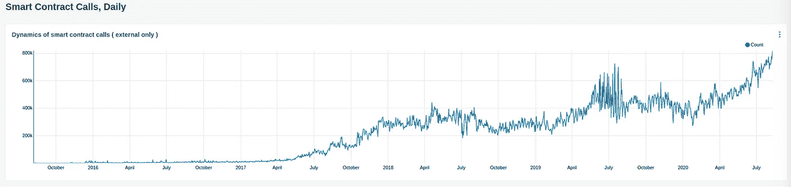

# 以太坊经典受到攻击，可口可乐使用区块链，Medalla 推出

> 原文：<https://medium.com/coinmonks/ethereum-classic-attacked-coca-cola-using-blockchain-medalla-launched-d896b69a55b2?source=collection_archive---------1----------------------->

## 收益农民只是不关心，比特币支付池

[Source](https://www.reddit.com/r/Bitcoin/comments/i6h4ps/what_did_you_do_during_the_coronavirus/)

了解一下[比特币美元成本平均](https://blog.coincodecap.com/stories/bitcoin-dollar-cost-averaging)到[roundly x](https://www.roundlyx.com/accounts/signup/?utm_source=coincodecapemail&utm_medium=email&utm_campaign=coincodecapemail)**30 秒**。****

**别忘了使用“CoinCodeCap**”**促销代码在 BTC 获得 4 美元。**

****

## **最新消息📰**

*   **攻击者在[以太坊经典 51%攻击中窃取了 807K 等](https://blog.bitquery.io/attacker-stole-807k-etc-in-ethereum-classic-51-attack)**
*   **MicroStrategy 采用[比特币作为主要国库](https://www.businesswire.com/news/home/20200811005331/en/MicroStrategy-Adopts-Bitcoin-Primary-Treasury-Reserve-Asset)储备资产**
*   **收益农民[在不到一个小时的时间里将 7600 万美元](https://www.theblockcrypto.com/linked/74604/yield-farmers-deposit-76m-in-unaudited-defi-project-in-less-than-an-hour)存入未经审计的 DeFi 项目**
*   **印度可能开始了迄今为止最大的比特币牛市**
*   **[Medalla 多客户端测试网启动](https://hackmd.io/@benjaminion/eth2_news/https%3A%2F%2Fhackmd.io%2F%40benjaminion%2Fwnie2_200808)查看 Medalla 统计[此处](https://txrx-research.github.io/prkl/medalla-analysis.html)**
*   **[支付池](https://bitcoinmagazine.com/articles/building-on-taproot-payment-pools-could-be-bitcoins-next-layer-two-protocol):比特币的下一个第二层协议？**
*   **[委内瑞拉接受加密纳税](https://thedailychain.com/venezuela-to-accept-tax-payments-in-crypto)**
*   **为了 37 万 USDC，Opyn 被黑了**
*   **美国立法者不希望[利益相关网络被过度征税](https://www.coindesk.com/us-lawmakers-dont-want-proof-of-stake-networks-to-get-overtaxed)**
*   **可口可乐[扩展区块链](/coinmonks/coca-cola-expanding-blockchain-across-supply-chain-dapper-labs-raises-nets-1-2m-in-nft-sales-b27219afd808)跨越供应链[凯尔·埃利科特](https://medium.com/u/7e29992d1be?source=post_page-----d896b69a55b2--------------------------------)**
*   **一个神秘组织已经[劫持了 Tor 出口节点](https://www.zdnet.com/article/a-mysterious-group-has-hijacked-tor-exit-nodes-to-perform-ssl-stripping-attacks/)**

## **播客💽**

*   **安德烈·克罗涅— [目中无人的](https://podcasts.google.com/feed/aHR0cHM6Ly9hbmNob3IuZm0vcy8xYmVlOTM0NC9wb2RjYXN0L3Jzcw/episode/OTg4Mzc1ZTYtMTFiMi00ODcxLTgwYmItMDgxYzgwYTk5YTEx?sa=X&ved=0CAkQ38oDahcKEwiAmoC-tI3rAhUAAAAAHQAAAAAQAQ&hl=en-AU)**
*   **探索前沿 |埃里克·沃尔赫斯**

## **好的读物📑**

*   **[加密原生保险](https://www.fehrsam.xyz/blog/crypto-native-insurance-defi)**
*   **在基础上[市场](https://sepia.substack.com/p/on-foundation-markets)**
*   **[活着的玩家对战死去的玩家](/@samo.burja/live-versus-dead-players-2b24f6e9eae2)**
*   **[明斯克](https://lists.linuxfoundation.org/pipermail/bitcoin-dev/2020-July/018062.html)，一种基于 Miniscript 的脚本语言**
*   **[分散式网页](https://amentum.substack.com/p/the-decentralized-web)**
*   **[坚实度 v0.7.0](/coinmonks/solidity-v0-7-0-is-here-d585cc83820e) 在这里……作者[巴拉吉·帕猜](https://medium.com/u/6c75458764d2?source=post_page-----d896b69a55b2--------------------------------)**
*   **🚀将 [ETH 连接到 IPFS](/@austin_48503/tl-dr-scaffold-eth-ipfs-20fa35b11c35)**
*   **[超越比特互换](https://adlrocha.substack.com/p/adlrocha-beyond-bitswap-i)**
*   **使用 Chainlink 部署您的第一份[合同](https://docs.chain.link/docs/example-walkthrough)**
*   **隐私币[指南](https://www.reddit.com/r/ethereum/comments/i74s55/the_privacy_coin_guide_part_1/)第 1 部分**
*   **用 3 个盒子[瑞秋·布莱克](https://medium.com/u/66b600c2019c?source=post_page-----d896b69a55b2--------------------------------)建立一个[加密的待办事项列表](/3box/building-an-encrypted-todo-list-with-3box-part-1-2-d1619cd02e5b)**
*   **关于比特币[交易规模](/coinmonks/on-bitcoin-transaction-sizes-part-2-9445373d17f4) —第二部分【Johannes Hofmann 博士**
*   **segwit 和批处理如何节省 5 亿美元的费用**
*   **DeFi——为“鲸鱼”打造的生态系统？！斯蒂芬·格拉斯曼**
*   **Solidity 库不能有[状态变量](https://dev.to/mudgen/solidity-libraries-can-t-have-state-variables-oh-yes-they-can-3ke9)——是的，它们可以！**
*   **[清洁合同](https://www.wslyvh.com/clean-contracts/) —智能合同模式指南&实践**
*   **[斯纳克和斯塔克斯](/coinmonks/snarks-and-starks-difference-big-implications-8bfd1db10c8b)。一个小小的差异却有着深远的影响[阿勒塔·维奇](https://medium.com/u/fab202851b3b?source=post_page-----d896b69a55b2--------------------------------)**
*   **[分权治理](/dragonfly-research/decentralized-governance-innovation-or-imitation-ad872f37b1ea):创新还是模仿？阿什温·拉马钱德兰**
*   **[以太坊 2.0 打桩指南](/@SomerEsat/guide-to-staking-on-ethereum-2-0-ubuntu-medalla-lighthouse-c6f3c34597a8)(Ubuntu/me dalla/light house)[Somer Esat](https://medium.com/u/9aa041da3fee?source=post_page-----d896b69a55b2--------------------------------)**

## **多方面的**

*   **[ZK 黑暗森林](https://zkga.me/)**
*   **[Geth v1.9.19](https://github.com/ethereum/go-ethereum/releases/tag/v1.9.19) 发布**
*   **安装另一个以太坊客户端 [Hyperledger Besu](https://besu.hyperledger.org/en/stable/HowTo/Get-Started/Install-Binaries/)**
*   **用 GitHub 和 Fleek 在 IPFS 部署一个[去中心化的 React 应用](https://www.youtube.com/watch?v=HbPEenonaIk&t=1s)**
*   **[Go digital #GoGrayscale](https://twitter.com/Sonnenshein/status/1292792512780947457) ，一个灰度的短广告**
*   **经济更新:联邦政府操纵了资金管理**
*   **[银行家天堂](https://www.youtube.com/watch?v=6ZKzapbQPZA&feature=youtu.be)(一首比特币歌曲)**
*   **弗兰基·麦克唐纳:我对比特币的建议**
*   **以太坊天然气价格创下历史新高，突破 200 Gwei (AYFKM)**

# **照片说明了一切📷**

****

**[Growth of Ethereum Smart Contract Calls](https://stat.bloxy.info/superset/dashboard/defivalue/?standalone=true)**

# **在 Coinmonks 上发布**

**如果你喜欢在 crypto/区块链空间上写教育文章，并且想在 Coinmonks 出版物上发表。只需在**发邮件给我或者 DM 我**[***推特***](https://twitter.com/coinmonks)****

> *****“如果你喜欢读*[*coin monks*](https://medium.com/coinmonks)*[*你也可以捐我们*](/coinmonks/monks-need-your-help-7440418d67ec) *。******

> *****[*直接在您的收件箱中获得最佳软件交易*](https://coincodecap.com/?utm_source=coinmonks)*****

**********