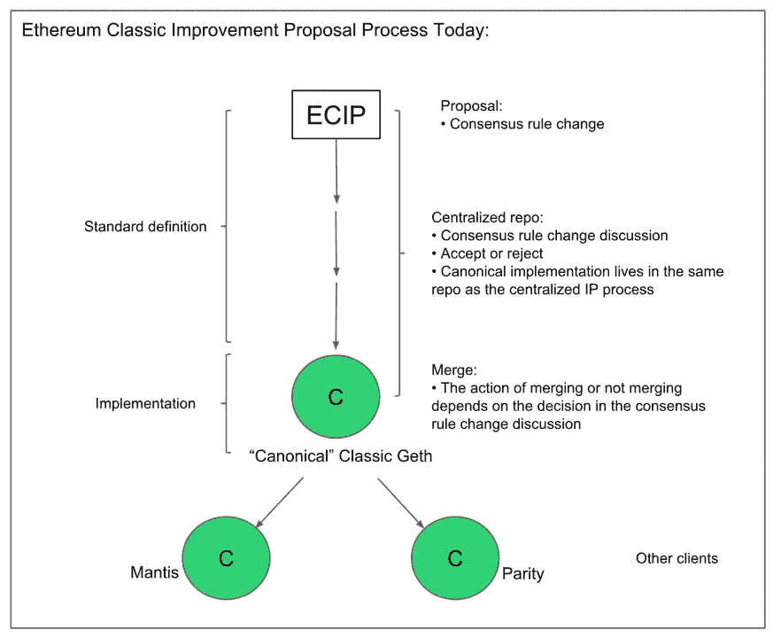
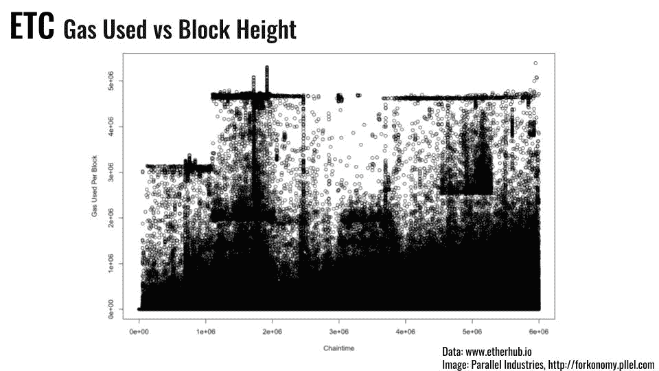

# 以太坊经典:无人治理的区块链？

> 原文：<https://medium.com/coinmonks/ethereum-classic-the-ungoverned-blockchain-b9ae8986a60a?source=collection_archive---------1----------------------->

如果没有领导者，事情怎么做？为什么 ETC 在道硬叉之后还没有被以太坊基金会抛弃而死？在 ETC 网络内部和周围工作的参与者和利益相关者的生态系统将在下面的概述中进行分析。

# **那么，ETC 的“治理”是在哪里以及如何发生的呢？**

对以太坊经典共识规则进行修改是“不受管制的”，就像比特币和以太坊对大量破坏共识的升级没有什么兴趣一样。目前，这是一个临时的*流程，ECIP 的提案在 Github 上提出，在公开/半公开论坛上讨论，如果它们得到广泛支持，并且不会被锁定在名义上规范的“Classic-Geth”客户端，其他客户端(奇偶校验实验室的同名软件和 IOHK 的 Mantis)会合并作为响应。在有争议的拟议升级的情况下，可能会设置一些任意的信号标准(*即* %的矿工升级/信号，[链上碳投票](http://v1.carbonvote.com/)，如 ETH 所用，以证明 DAO 硬分叉的合理性)，尽管自导致网络创建的事件以来，这种情况尚未在 ETC 中发生。*

**Source:** [**https://medium.com/@TokenHash/the-star-improvement-proposal-standard-for-ethereum-classics-ecip-process-df20453de8e6**](/@TokenHash/the-star-improvement-proposal-standard-for-ethereum-classics-ecip-process-df20453de8e6)

**On-chain “Carbon Vote” for TheDAO fork on Ethereum. Source:** [**https://elaineou.com/2016/07/18/stick-a-fork-in-ethereum/**](https://elaineou.com/2016/07/18/stick-a-fork-in-ethereum/)

与基于原始以太坊设计的其他网络一样，一些参数，例如对每个块的 gas 限制的调整——以类似于比特币衍生网络中块大小/重量的方式限制 EVM 计算量——可以通过 miner 信令在每个块的基础上以小增量实施。目前有一些讨论，旨在促使降低每块的气体限制，以避免链增长率问题，该问题使运行 ETH 全节点在繁重的资源要求方面成为挑战。少数大型采矿农场、合作社和联营企业可能聚集 ETC hashrate，这带来了依赖矿工信号的问题，最近在比特币中就证明了这一点，当时合并开采的 EVM 根茎侧链开始使用 80%的网络 hashrate 信号。下游天真地采用“默认”以太坊设置，如 ETH 的每块 800 万气体限制，也是 ETC 无法驾驭的潜在问题。

**ETC Gas Limit versus Block Height. Source:** [**http://etcsummit.pllel.com**](http://etcsummit.pllel.com)

ETC 网络进行了两次硬分叉网络升级，分别是 [ECIP-1010](https://github.com/ethereumproject/ECIPs/blob/master/ECIPs/ECIP-1010.md) 移除“难度炸弹】和 [ECIP-1017](https://github.com/ethereumproject/ECIPs/blob/master/ECIPs/ECIP-1017.md) 建立渐进供给曲线供给上限。

决策过程可以组织得更好、更透明和更明确，目前正在讨论对 ECIP 进程的改进。目前，大多数非正式的社区讨论都在 ETC 的 Discord 服务器上进行，ECIPs 在权力斗争和接管之前的 canonical Github 帐户( [ethereumproject](https://github.com/ethereumproject/) )之后，在指定的 Github 帐户( [ethereumclassic](https://github.com/ethereumclassic/) )上发布，表面上与下面讨论的 ETCLabs 的情况有关。ETCLabs 似乎正准备实施他们自己提出的平行“eclipse”改进建议方案，尽管这可能是一次沟通失误，而不是“共识人质事件”——在撰写本文时情况尚不明朗。以下是一些关于以太坊经典如何做出网络升级和变更决策的最新讨论和提议的链接。

 [## 以太坊经典(ETC):整合新的分散式 ECIP 流程

### 在以前的一篇文章中，我写了关于使用…去中心化以太坊经典改进提议过程(ECIP)

medium.com](/@TokenHash/ethereum-classic-etc-putting-together-the-new-decentralized-ecip-process-7a6cdd9f9fa0)  [## 以太坊经典改进建议

### 在世界和乙氧基

ecips.that.world](https://ecips.that.world)  [## 以太经典/ECIPs

### 在 GitHub 上创建一个帐户，为 ethereumclassic/ECIPs 的开发做出贡献。

github.com](https://github.com/ethereumclassic/ECIPs/blob/master/ECIPs/ECIP-1000.mediawiki) 

ETC 的一些利益相关者希望看到与 ETH 更紧密的合作，一些人持矛盾态度，另一些人则持反对态度。最近[宣布 Bob Summerwill](https://bobsummerwill.com) 担任 ETC 合作执行董事值得关注，因为他在创建企业 ETH 联盟中发挥了重要作用，参与了以太坊基金会，是 Consensys 的高级人物。ETH 和 ETC 之间有一些现有的合作项目，包括 Akomba Labs 的" [Peace Bridge](/akomba/peace-bridge-connecting-ethereum-classic-and-ethereum-e306df01159f) "以允许跨链交易， [Kotti](https://github.com/goerli/testnet) unified PoA testnet 和一些[最近关于 ETC 考虑采用以太坊 2.0 路线图的讨论](https://www.youtube.com/watch?v=404A268f4i0)。

在过去的几个月里，围绕以太坊经典的生态系统的组成发生了变化，之前卓越的私人资助核心开发团队“ETCdev”由于缺乏资金而崩溃，与另一个实体“ETCLabs”组成了一个新的开发团队“ETCLabs Core”，人员严重重叠。一些社区成员将这一系列事件描述为企业收购企图，其他人似乎并不担心。

“ETC 社区仍然很小，在这个熊市中，缺乏来自志愿投资者或其他来源的资金来启动新的核心维护和开发项目或快速支付新的核心开发人员。这是因为没有领导人、基金会、预矿、国库、协议税或任何其他融资噱头会严重污染其他集中化项目。”

# **ETC 历史和网络特点**

区块链以太坊于 2015 年 7 月 30 日开业。当以太坊基金会在 2016 年 7 月 20 日作为 DAO 的[漏洞利用恢复](https://bitcoinmagazine.com/articles/rejecting-today-s-hard-fork-the-ethereum-classic-project-continues-on-the-original-chain-here-s-why-1469038808/)(“[不规则状态转换](/coinmonks/the-dao-is-history-or-is-it-47a6f457338a)”)的一部分进行硬分叉时，他们保留了名称和代号以太坊/ ETH。DAO 剥削者保存战利品的典型连锁分支出乎大多数观察者的意料幸存了下来，并吸引了社区、开发商、交易所和矿业支持。[非锻造链条](https://elaineou.com/2016/07/18/stick-a-fork-in-ethereum/)后来被称为[以太坊经典](https://ethereumclassic.github.io/assets/ETC_Declaration_of_Independence.pdf)(等等)。

以太坊经典(ETC)是利用 Ethash (Dagger Hashimoto)算法的纯工作证明。它是使用这种算法的第二大网络，编组的哈希码比以太坊(ETH)少大约 15-25 倍。由于其作为一个少数 PoW 网络的情况，在协议或节点级别没有 51%的攻击缓解，它被认为容易受到热力学攻击，最近在 T2 观察到了这种情况。采矿是未经许可的，因此不一定知道区块生产商的身份和参与程度。目前正在对 ETC 采矿生态系统进行一些网络和区块链分析。高度怀疑秘密的 FPGA 和/或 ASIC 挖掘导致了最近的多数攻击。在最近的攻击中使用的大部分 hashrate 被怀疑是源于现有的 Ethash 生态系统和市场，如 Nicehash。

以太坊的白皮书于 2013 年末首次发布，2014 年出现了“代币众筹”(= ICO)。在发放的 1.05 亿份供应品中，约有 7200 万份在 ICO 中分发。采矿提供块和叔叔奖励已分发剩余部分。目前正在进行的工作是比较 ETC/ETH 分叉两侧的平衡移动。通货膨胀设定为“5M20 ”,每 500 万个区块减少 20%的采矿奖励，相当于大约 5%的年供应量增长。同样的 2017 年的硬叉( [ECIP-1017](https://github.com/ethereumproject/ECIPs/blob/master/ECIPs/ECIP-1017.md) )也安装了固定补给帽。

以太坊“成为”以太坊经典，因为以太坊基金会声称对“以太坊”名称拥有知识产权，尽管它从规范链中分支出来。这仍然是一个争论点，一些人更喜欢“ETC”这个名称，因为利益相关者的子集在寻找“Classic”的替代术语。

# **ETC 如何为发展和生态系统活动提供资金？**

***什么是参考节点实现？*** 这也是在等争论的焦点。当 ETCdev 停止运行时，用 Golang 编写的迄今为止规范的客户端 [Classic-Geth](https://ethereumclassic.github.io/) 停止了可靠的维护。ETCLabs Core 维护多目标，但 ETC 生态系统中的所有利益相关者目前都不愿意使用他们的软件，因为他们表面上希望有一个独立的[eclipse](https://github.com/etclabscore/ECLIPs/pull/2#pullrequestreview-202791681)改进建议途径，该途径看起来更倾向于硬分叉而不是软分叉。

***还有其他全节点实现吗？*** 奇偶校验实验室维护着他们用 Rust 编写的[奇偶校验客户端](https://github.com/paritytech/parity-ethereum)。

IOHK 维护着他们用 Scala 编写的螳螂客户端。

***客户端开发是如何融资的？*** etc dev 解散后，开发由私人组织——etc labs、Parity 和 IOHK 基金客户开发提供资金。ETC 合作组织(部分由 DCG/格雷和 DFG 资助)也支持协议开发。

IOHK 提出的采用连锁金库的提议受到了抵制，一些利益相关方认为这是固有的集中化，但鉴于 ETCdev 由于资金短缺和缺乏替代融资模式而崩溃/“建立起来，他们就会到来”,现状有可能延长持续的悲惨公地场景。通过 ETCLabs 有一些赠款和资助机会，但目前主要集中在商业/创业孵化上。

大多数基金是由公司控制的，但是 ETC 合作社现在是美国的一个 501(c)(3)非营利组织。还有一个由多重签名钱包控制的小型社区基金，但是目前还没有支付该基金的计划。

***为参考节点提供资金的实体还生产哪些其他软件？*** 很难给出明确的答案，因为目前对于参考实现的定义还没有达成一致。

**奇偶校验** — Rust ETH 客户端，Polkadot/Substrate，比特币客户端，Zcash 客户端。

**ETCdev** —已解散，Emerald 应用程序开发框架和工具，Orbita 侧链。

**ETC 合作** —开发者工具和基础设施*例如*最近的 Google BigQuery 集成。

**IOHK**—Cardano、ZenCash 等的很多软件。

ETCLabs —？

***开发或资助参考节点的实体还做什么？*(非软件)**

**奇偶校验** — Web3 基金会

**etc labs**—VC/创业孵化器

**ETC Coop** —公共关系、社区和生态系统开发、会议组织、企业&开发者关系

**IOHK** —与 dLab / SoSV / Emurgo 的公共关系、峰会、艺术项目(区块链交响乐)、学术合作、风险投资伙伴关系和研究奖学金。

**DCG/灰度/硬币台** —公关，金融工具*例如*。ETC 信托，场外交易…

***开发以外的工作(如营销)是如何获得资金的？不清楚非发展活动的资金和支助是如何分配的。***

DCG/格雷和 DFG 基金等合作社

DFG 基金等实验室

相关项目——有相关的重大项目吗？比如这是不是另一个项目的分叉？其他项目有没有分叉这个？
以太坊(ETH)是这个项目的一个挂帐叉，Callisto (CLO)是这个项目的一个挂帐叉。可能有更多次要的[代码库或分类账分叉](https://hackernoon.com/towards-an-analytical-discipline-of-forkonomy-summer-2018-e6da993ee3f9)。

***重要实体和生态系统利益相关者***

[ETCLabs](https://www.etclabs.org/) 是一家由 DFG、DCG、IOHK 和富士康资助的从事 VC/Startup 和核心开发活动的营利性公司。

[ETC 合作社](https://etccooperative.org)是一个 501(c)(3)非营利组织，总部设在美国，由 DCG 和 DFG 资助。

[ETCdev](https://www.etcdevteam.com/) (已解散)

[IOHK](https://iohk.io/)(Input Output Hong Kong)是查尔斯·霍金森(Charles Hoskinson)领导的公司，他之前从事 BitShares、以太坊和现在的 Cardano。

[DCG](https://dcg.co/) (数字货币集团)是 Barry Silbert 的公司，旗下有 gray gray Investments、CoinDesk、Genesis OTC Trading 等机构。

[DFG](https://www.dfg.group/) (数字金融集团)是一家中国多元化集团，涉及投资区块链和加密货币行业、场外交易、风险基金。

> Wassim Alsindi 在独立实验室 Parallel Industries 指导研究，从数据驱动和人类的角度分析加密货币网络。在 www.pllel.com 的[和推特上的](http://www.pllel.com/) [@parallelind](https://twitter.com/parallelind) 找到他。

# 感谢阅读。在你走之前！

> 如果你觉得这篇文章有趣，请👏并在你能分享的地方分享。记住，你最多可以鼓掌 50 次——这对可见度和温暖模糊的感觉真的有很大的影响。欢迎大家来[www.pllel.com](http://www.pllel.com)和[推特](http://twitter.com/parallelind)闲逛。

> [直接在您的收件箱中获得最佳软件交易](https://coincodecap.com/?utm_source=coinmonks)

