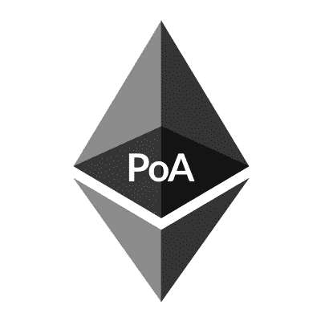

# 以太坊派 PoA vs PoW

> 原文：<https://medium.com/coinmonks/ethereum-clique-poa-vs-pow-11be52cddde1?source=collection_archive---------0----------------------->

# 为什么需要 PoA 而不是 PoW？

当网络有价值时，PoW ( [工作证明](https://en.wikipedia.org/wiki/Proof-of-work_system))是好的，因为它值得昂贵的计算来保护网络免受 [51%的攻击](https://www.investopedia.com/terms/1/51-attack.asp)。而当网络没有价值时，例如以太坊测试网络，PoW 就不能很好地工作。

# 没有价值网络

[**Ropsten**](https://ropsten.etherscan.io/) 测试网络使用 PoW，并于 2017 年 2 月被利用网络低 PoW 的人关闭，方法是在通过网络发送大量交易的同时，将阻塞气体限制提高近 2000%。Ropsten 已经不允许超高的气体限制，但低功率的问题仍有待下一次开发。这个 PoW 漏洞导致了下一个被称为[**rinke by**](https://www.rinkeby.io)**的测试网络，它使用一个被称为**小团体**的 **PoA** ( [权威证明](https://en.wikipedia.org/wiki/Proof-of-authority))来授权签名者铸造区块。**

# **Clique PoA 需要向后兼容**

**Clique 的架构师必须找到一种方法来实现 PoA，同时对核心数据结构做尽可能少的改动，以保持现有以太坊客户端的兼容性。Clique 需要的两个**新**东西包括同步期间的块验证和投票协议。**

**Clique 需要一种方法，让用户在同步时对照可信签名者列表来验证块。问题是 [**奇偶校验**](https://github.com/paritytech/parity-ethereum) 在 warp sync 期间无法访问状态，当使用快速或轻度同步模式时 [**也无法获取**](https://github.com/ethereum/go-ethereum) ，因此排除了使用智能合约来存储块的可信签名者。**

**Clique 还需要嵌入一个投票协议，用于添加或删除可信签名者，而不需要添加任何额外的字段。**

# **巧妙重新利用不必要的字段**

**这就是 ***聪明的*** 部分的用武之地，他们只是将头中的`extraData`字段从 32 字节扩展到 65 字节，这样他们就可以将`[secp256k1](https://en.bitcoin.it/wiki/Secp256k1)` 矿工签名放在那个字段中。在 PoW 版本中，`extraData`字段用于 *fun* 消息，增加额外的 33 个字节对于现有客户端来说可能不是什么大事。*顺便说一句，我确实必须定制我的版本*[*web 3 Python*](https://github.com/ethereum/web3.py)*来忽略额外的字节，因为它在使用 Rinkeby 的早期版本中会导致错误。***

**在`extraData`字段中添加 miner 签名使得块头中的 miner 部分变得不必要，因此他们使用它来让授权签名者提议一个新的或当前的签名者，由所有当前的授权签名者投票。**

**另外，`nonce`字段在 PoA 中也不使用，所以在 Clique 中它被用作投票字段。带有**0x ffffffffffffff**的授权签名者的 nonce 表示添加提议的签名者，而带有**0x 000000000000000**的`nonce`表示踢出提议的签名者。`nonce`和 miner 字段在正常程序块中不进行投票时被设置为零。Clique 投票协议允许客户端统计每个提议签名者的投票(同时同步)以确定当前有效的授权签名者，从而根据授权签名者的动态列表验证每个块头。`EPOCH_LENGTH`用作设置检查点和重置未决投票之前允许的块数。检查点还用于在`extraData`字段中发布授权签名者的列表。这样，客户端可以从一个检查点开始，而不是统计自创世纪区块以来提议签名者的所有投票。**

# **Clique PoA 有多安全？**

**Clique 要求 N/2 +1 个签名者是诚实的签名者，因此简单多数是运行安全网络所需要的。拜占庭式的(不诚实的)签名者在被踢出之前不会造成太大的伤害，因为每个签名者每 N/2 + 1 个街区只能签名一次。一旦一个签名者被认为是拜占庭人，其他签名者可以投票将该节点踢出局。一个有趣的转折是，如果拜占庭签名者在被发现是拜占庭之后试图审查投票反对它的区块。通过将节点的签名频率限制为 N/2 中的 1 来反击这种类型的审查攻击，这意味着 51%的网络将是拜占庭式的。**

# **结论**

**Clique PoA 被巧妙地整合到以太坊中，对建筑的破坏最小。Clique 看起来具有与 PBFT 相同的安全性([实用的拜占庭容错能力](http://pmg.csail.mit.edu/papers/osdi99.pdf))，同时提供卓越的可伸缩性，因为 Clique PoA 在签名者之间只有一轮消息，而 PBFT 有三轮。我希望看到更多的企业实现 PoA 和 Clique，特别是在用户不完全被信任的情况下。完全受信任的系统最好使用 [**Raft**](https://raft.github.io/) ，就像 [**Quorum**](https://github.com/jpmorganchase/quorum) 那样每秒钟可以生成 20 个块。[参见我之前关于 Raft 和 Quorum 的文章了解更多信息。](/coinmonks/quorum-blockchain-consensus-algorithms-ab38790091)**

**你觉得这篇文章怎么样？如果你喜欢它或者学到了什么，请留下你的掌声！ [DarkBlock.io](https://darkblock.io/) 是一家区块链企业发展公司，我们一直在接纳新客户。通过 [sheffield@darkblock.io](mailto:sheffield@darkblock.io) 联系我或访问我们的网站 [DarkBlock.io](https://darkblock.io/) ！**

> **[直接在您的收件箱中获得最佳软件交易](https://coincodecap.com/?utm_source=coinmonks)**

****