# 以太坊:连接 GCP 上不同计算机上的两个节点

> 原文：<https://medium.com/coinmonks/ethereum-connect-two-node-from-different-computer-on-gcp-f1f258ffa9ce?source=collection_archive---------3----------------------->

您可能已经按照文档从不同的计算机连接节点，但它在同一台计算机上工作，但不适用于其他计算机，今天我将指导您完成整个过程。我们将在 google cloud 上使用两台 Linux 机器来完成这项工作，你也可以在两台使用不同操作系统的不同计算机上完成这项工作。如果你遇到了困难，只要说出你的疑问，我们会帮你解决。

# 先决条件

在 google 云平台上创建两个 Linux 机器实例。如果你是在两台不同的物理计算机上做这件事，那也没问题。

**在 Ubuntu 上安装 go-ether eum**

使用 SSH 或任何您喜欢的方式登录到这两个实例。打开终端并在两台机器上执行这些命令来安装 go-ethereum。

```
sudo apt-get install software-properties-common
sudo add-apt-repository -y ppa:ethereum/ethereum
sudo apt-get update
sudo apt-get install ethereum
```

要检查 geth(它是一个多用途的命令行工具，运行在 Go 中实现的完整以太坊节点)是否成功安装在您的系统上，请执行以下命令来检查 geth 版本。如果您看到如下输出，那么 geth 已经成功安装在您的系统中。

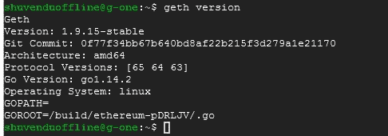

Fig: 1 Geth — checking version

**打开 geth 连接端口**

为 geth 打开一个端口是非常重要的，否则它不会连接。在 GCP 转到 VPC 网络>防火墙。单击“创建防火墙规则”。给它一个名字和标签，最好是两者都用相同的，我把它命名为“ethports”。在源 IP 范围中键入 0.0.0.0/0，这将允许所有 IP。在协议和端口上，选择“特定协议和端口”，选择 TCP 和 UDP，键入将用于运行 geth 的端口号，我们使用 30303 端口。让其他事情保持原样。然后点击“创建”。

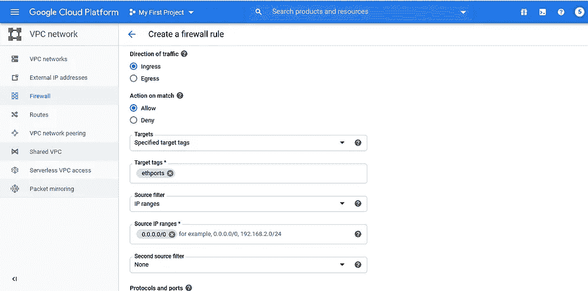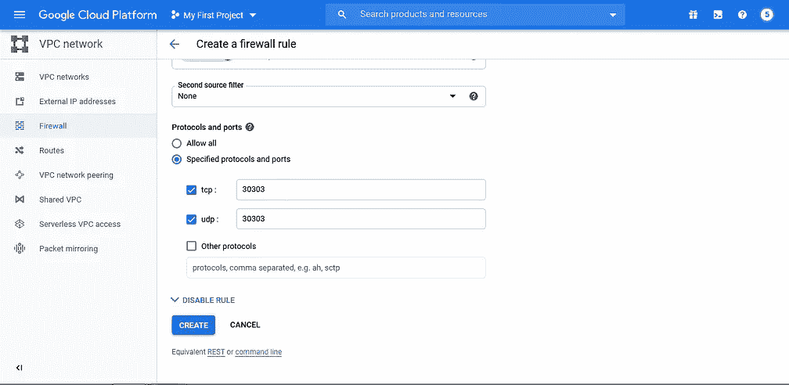

Fig 2: Opening port on GCP

转到计算引擎>虚拟机实例，单击一个实例并编辑它，在其网络标签中添加标签“ethports ”,然后单击保存。对另一个做同样的事情。如果您在物理计算机上，则打开防火墙并添加规则以在两台计算机上打开端口。访问那些链接求助，[*Windows*](https://www.google.com/url?sa=t&rct=j&q=&esrc=s&source=web&cd=&cad=rja&uact=8&ved=2ahUKEwjurpPx0J7qAhXUbCsKHYIWDPAQFjAGegQIDBAG&url=https%3A%2F%2Fwww.blackbaud.com%2Ffiles%2Fsupport%2Finfinityinstaller%2Fcontent%2Finstallermaster%2Fcofirewalls.htm&usg=AOvVaw2wR532yR_smmEgYxmctp9y)[*Linux*](https://www.journaldev.com/34113/opening-a-port-on-linux)。

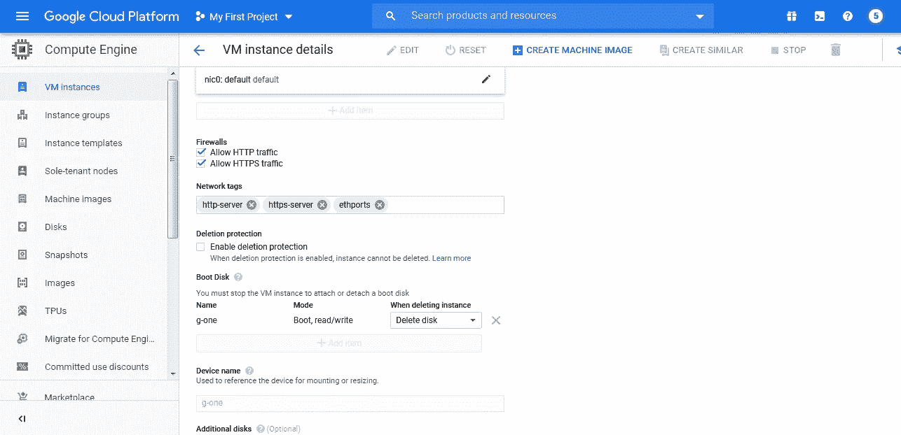

Fig 3: Add Network Tag in Instances

# 创建创世块

我们将创建一个 genesis 文件，用相同的 genesis 文件初始化两个计算机数据目录，并在相同的网络 id 和端口号(我们在上一步中打开的端口)上运行两个节点。重要的是在同一网络上运行两个节点，使用相同的源文件，否则它们不会连接。首先，我们将创建一个以太坊帐户并获取其 id 哈希，然后我们将编写 genesis 文件并在其中分配一些以太。最好在 genesis 帐户上分配一些乙醚，我们将在交易或智能合同部署过程中需要它。

**创建一个以太坊账户**

在一个实例上打开命令提示符，并执行以下命令。这里的“datanode”是存储所有内容的目录。它将要求您输入您的帐户密码，因为我们将它用于测试目的，所以我们将其留空并单击 enter。

```
$ sudo geth --datadir "datanode" account new
```

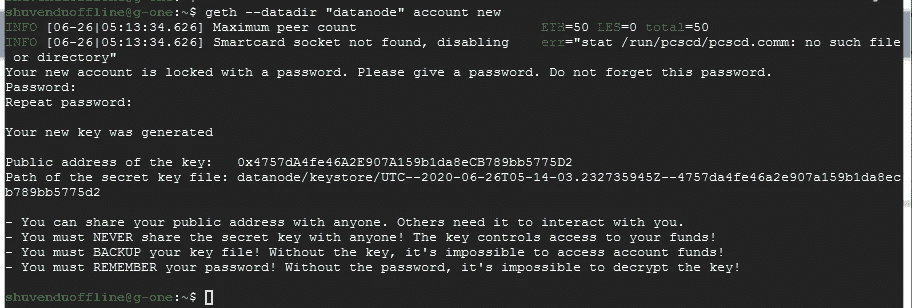

Fig 4: Creating Ethereum Account

复制密钥的公共地址，它是帐户地址。我们需要这个来写我们的创世纪文件。

**写创世纪文件**

在 genesis 文件中，我们将之前创建的帐户作为基本帐户，并在其中分配一些乙醚。您可以将此复制到下面的源文件中，并用帐户哈希替换“您的帐户哈希”。我已经分配了大约 2 乙醚，分配。使用下面的命令用 nano 创建 genesis JSON 文件。你可以使用你最喜欢的文本编辑器来创建创世纪文件。

```
$ sudo nano genesis.json
```

创世纪文件:

```
{
  "config": {
    "chainId": 15,
    "homesteadBlock": 0,
    "eip150Block": 0,
    "eip155Block": 0,
    "eip158Block": 0,
    "byzantiumBlock": 0,
    "constantinopleBlock": 0,
    "petersburgBlock": 0,
    "clique": {
      "period": 5,
      "epoch": 30000
    }
  },
  "difficulty": "1",
  "gasLimit": "8000000",
  "extradata": "0x0000000000000000000000000000000000000000000000000000000000000000YOUR_ACCOUNT_HASH0000000000000000000000000000000000000000000000000000000000000000000000000000000000000000000000000000000000000000000000000000000000",
  "alloc": {
    "YOUR_ACCOUNT_HASH": { "balance": "0x2337000000000000000000" }
  }
}
```

额外的零不是可选的，它们是针对数据类型的。不要删除任何零，这可能会导致错误。

**用 genesis 文件初始化数据目录**

将 genesis 文件写入我们已经创建的数据目录。

```
$ sudo geth --datadir "datanode" init genesis.json
```

如果一切顺利，我们会看到这样的输出。

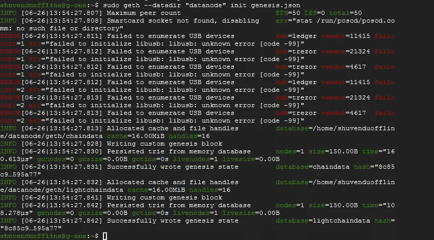

Fig 5: Initialize with the Genesis file

**用第二台计算机上的 genesis 文件初始化数据目录**

首先，我们将把创世纪文件的内容复制到另一台计算机上。使用命令查看 genesis 文件的内容。

```
$ sudo cat genesis.json
```

使用 ssh 或任何东西连接到第二个实例。打开终端，用 nano 或者你喜欢的文本编辑器创建 genesis 文件。跳过您复制的内容。

```
$ sudo nano genesis.json
```

**用第二台计算机上的 genesis 文件初始化数据目录**

在第二台计算机上，我们将使用相同的 genesis 文件初始化数据目录。

```
$ sudo geth --datadir "datanode" init genesis.json
```

您将看到类似于我们在第一台计算机上初始化 genesis 文件(图 5)时看到的输出。

# 让我们开始节点

如果您已经成功完成了上述所有步骤，那么我们现在可以开始启动节点了。我们将从第一台计算机启动该节点，获取它的 enode URL，并将其作为静态节点添加到第二台计算机上。

**从第一台计算机启动节点**

使用下面的命令从第一个实例/计算机启动节点。

```
$ sudo geth --identity "Node1" --networkid 3216 --rpc --rpcport "8545" --rpccorsdomain "*" --rpcapi "eth,web3,net,admin,miner,personal" --port "30303" --datadir "datanode" --verbosity 6 console
```

执行命令后，你会看到文本出现在屏幕上，并自动滚动，不要惊慌其日志从运行节点。保留此命令提示符，从第一台计算机打开新终端/新连接。我们将着手建造新的码头。

“Node1”是我们节点的自定义名称，我们使用 3216 作为我们的网络 id，您可以选择 5 位数以内的任何整数，您必须在另一台计算机上选择相同的名称。不要选择 1，它是以太坊主网络的网络 id。我们使用端口 30303 来运行 geth。请记住，我们已经在前面的步骤中打开了端口，如果您已经打开了另一个端口，请使用该端口。我们已经启用了 RPC 并使用了 RPC 8545 端口。eth，web3 …'是我们需要的 API。要了解每个选项的更多信息，请访问此 [*链接*](https://geth.ethereum.org/docs/interface/command-line-options) 。

**从第一台计算机获取 e node URL**

从第一台计算机上的新终端，我们将使用 RPC 连接到我们的节点。执行下面的命令连接到正在运行的节点，这将打开 geth 的 JavaScript 控制台。

```
$ geth attach rpc:[http://127.0.0.1:8545](http://127.0.0.1:8545)
```

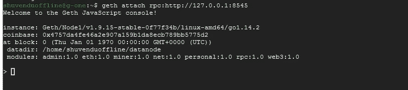

Fig 6: Geth — JavaScript console

在此控制台上，执行命令以获取 enode URL

```
> admin.nodeInfo.enode
```

您将得到这样的输出-(图 7)。复制 enode URL，我们接下来将需要它。

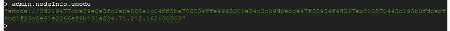

Fig 7: Enode url

**从第二台计算机添加节点作为静态节点**

现在，我们从第一台计算机上运行节点，并从 geth JavaScript 控制台获得了 enode URL。现在移动到第二台计算机，即 ssh 到第二个实例。从终端，在我们之前创建的数据目录“datanode/geth”中导航。要使用`cd`导航到此位置，您可能会遇到权限被拒绝错误。然后使用`sudo -s`命令启动根 shell。然后你可以`cd`到目录`datanode/geth`。

```
$ cd datanode/geth
```

创建一个 JSON 文件`static-nodes.json`。它将由一个 JSON 数组 enode URL 组成。静态节点是当我们启动这些节点时自动连接的节点。使用 nano 创建文件-

```
$ sudo nano static-nodes.json
```

在编辑器上，将 enode URL 粘贴到两个第三个括号内，即作为一个 JSON 数组。然后保存文件。然后使用`exit`命令退出根 shell。

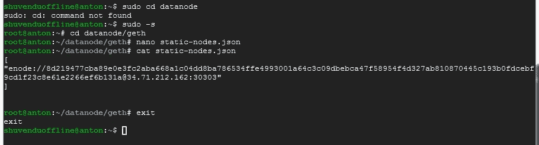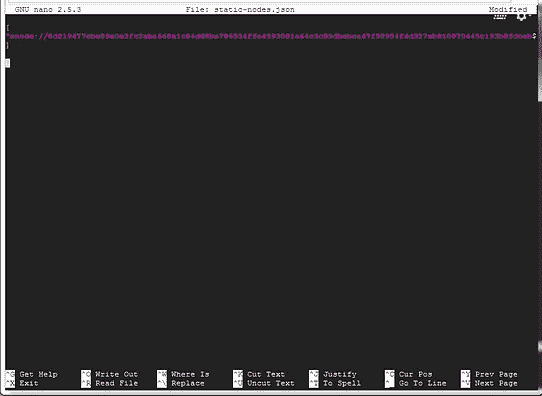

Fig 8: Write the static nodes json file

**从第二台计算机启动第二个节点**

现在，让我们从第二台计算机启动第二个节点。执行下面的命令来启动节点，我们已经在前面的步骤中讨论了关于该命令的所有内容。

```
sudo geth --identity "Node1" --networkid 3216 --rpc --rpcport "8545" --rpccorsdomain "*" --rpcapi "eth,web3,net,admin,miner,personal" --port "30303" --datadir "datanode" --verbosity 6 console
```

它将开始显示日志，并自动滚动。让终端保持原样，打开一个新的终端/到实例的新连接。
从新终端/新连接执行以下命令，连接到正在运行的第二个实例。

```
$ geth attach rpc:[http://127.0.0.1:8545](http://127.0.0.1:8545)
```

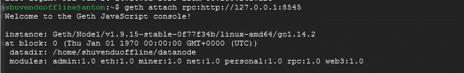

Fig 9: Geth — JavaScript console for Second Node

# 让我们检查同行

我们完成了两个节点的连接。现在，从第二台计算机，geth JavaScript 控制台获取第二个节点的 enode URL `admin.nodeInfo.enode`。之后，在第二台计算机的 JavaScript 控制台上执行`admin.peers`命令，也在第一台计算机的 JavaScript 控制台上执行。如果我们已经成功连接，那么它将显示对方的 enodes 网址为对等。仔细观察下面的图片，你会明白我的意思。

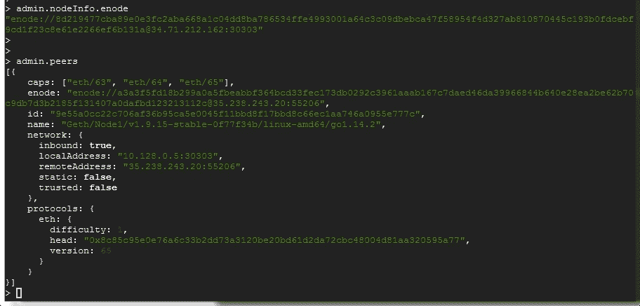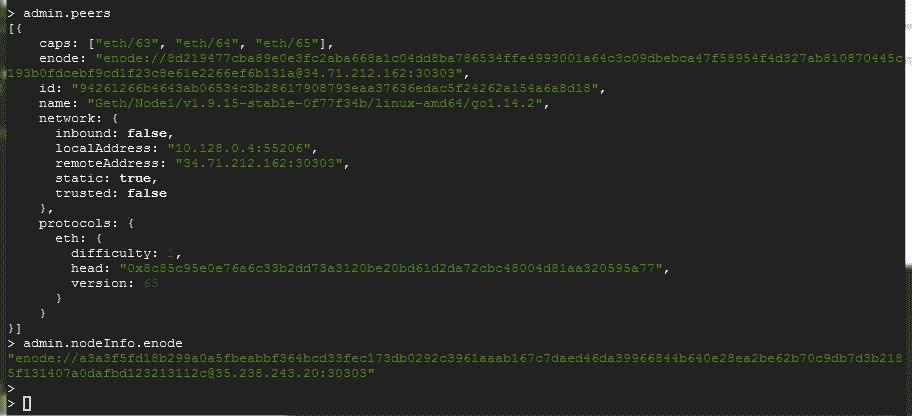

Fig 10 : Geth- Show peers (Left : From First Computer, Right: From Second Computer)

太好了，现在我们的两个节点都连接上了！！
如果这篇文章对你有帮助，请给我一个掌声。请评论，如果你面临任何问题。
谢谢！！

[](/coinmonks/crypto-trading-bot-c2ffce8acb2a) [## 最佳免费加密交易机器人——前 16 名比特币交易机器人[2021]

### 2021 年币安、比特币基地、库币和其他密码交易所的最佳密码交易机器人。四进制，位间隙…

medium.com](/coinmonks/crypto-trading-bot-c2ffce8acb2a) [](/coinmonks/best-crypto-signals-telegram-5785cdbc4b2b) [## 最佳 6 个加密交易信号电报通道

### 这是乏味的找到正确的加密交易信号提供商。因此，在本文中，我们将讨论最好的…

medium.com](/coinmonks/best-crypto-signals-telegram-5785cdbc4b2b) [](/coinmonks/blockfi-review-53096053c097) [## BlockFi 评论 2021 —通过您的加密获得 8.6%的利率

### 让你的密码发挥作用，获得比特币和其他加密货币的最佳利率

medium.com](/coinmonks/blockfi-review-53096053c097) [](/coinmonks/best-crypto-tax-tool-for-my-money-72d4b430816b) [## 加密税务软件——五大最佳比特币税务计算器[2021]

### 不管你是刚接触加密还是已经在这个领域呆了一段时间，你都需要交税。

medium.com](/coinmonks/best-crypto-tax-tool-for-my-money-72d4b430816b)