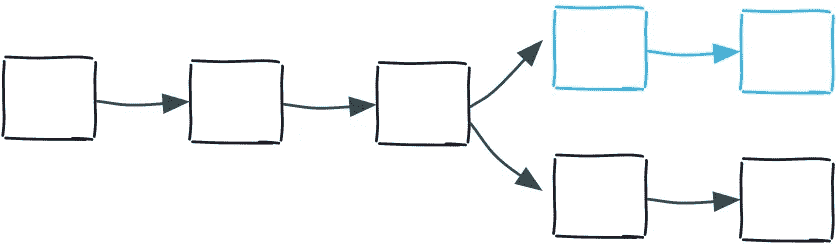

# 以太坊君士坦丁堡升级:你应该知道的事情

> 原文：<https://medium.com/coinmonks/ethereum-constantinople-upgrade-things-you-should-know-aa75e7655345?source=collection_archive---------0----------------------->

君士坦丁堡是以太坊大都会的第二阶段升级。第一阶段升级在区块**4370000 完成。**它被命名为拜占庭。你可以在这里参观拜占庭带来的变化[。](https://github.com/ethereum/wiki/wiki/Byzantium-Hard-Fork-changes)

君士坦丁堡将推出编号为 **7，280，000** 的车型，预计将于 2019 年 2 月 27 日至 28 日抵达。实时倒计时可以在[这里](https://amberdata.io/blocks/7280000)找到。

Blockchain Hard Fork

在这次升级中，大多数引入的变化是关于提供更少的气体操作，并为以太坊的股份证明做好准备。下面描述了与 EIP(以太坊改进提案)相对应的变更。

[**EIP 145:EVM 中的按位移位指令**](https://eips.ethereum.org/EIPS/eip-145)

这个 EIP 是关于以与其他算术运算同等的成本提供原生按位移位的。原生移位指令可以将左右移位操作从 35 gas 减少到 3 gas。

[**EIP 1014:骨感创造 2**](https://eips.ethereum.org/EIPS/eip-1014)

这辆 EIP 是维塔利克·布特林亲自介绍的。EIP 的动机是允许与链上尚不存在的地址进行交互(实际上或在信道中反事实地),但是可以依赖于只有可能最终包含由特定的 init 代码段创建的代码。这对于涉及与合同的反事实交互的国家渠道用例可能很重要。

[**EIP 1052: EXTCODEHASH 操作码**](https://eips.ethereum.org/EIPS/eip-1052)

此 EIP 指定了一个新的操作码，它返回协定代码的 keccak256 哈希。许多契约需要对契约的字节码执行检查，但不一定需要字节码本身。`EXTCODEHASH`的油费是 400。

[**EIP 1234:君士坦丁堡难度炸弹延迟和格挡奖励调整**](https://eips.ethereum.org/EIPS/eip-1234)

这个 EIP 是由非洲学校 T4 提出的。这在以太坊社区引起了巨大的冲突，Afri 退出了这个项目。在这样的愿景下，十几个开发者在 breakermag 上发布了一封[公开信](https://breakermag.com/open-letter-the-ethereum-community-calls-for-end-to-threats-and-toxic-behavior/)。

这个 EIP 将要延迟难度炸弹(或冰河世纪)和降低格挡奖励 3 ETH 到 2 ETH。

这种 EIP 的动机是 Casper 的开发和转换为标桩验证被推迟，Ethash 工作验证对矿工来说应该是可行的，并允许在接下来的 12 个月内平均每 15 秒密封一个新区块。随着冰河期的推迟，有一个愿望不会突然也增加矿工奖励。

难度炸弹已经被知道很久了，现在它将停止发生。为了保持系统的稳定性，抵消冰河期延迟的区块奖励减少会使系统保持与以前相同的总体状态。随着以太坊接近风险证明，减少奖励也降低了矿工驱动链分裂的可能性。

此外，区块奖励将调整到 2 ETH 的基础上，伯侄关系奖励也将相应调整。

# **圣彼得堡升级**

这是关于删除 [EIP 1283:不带脏图的商店净燃气计量](https://eips.ethereum.org/EIPS/eip-1283)。

实际上，君士坦丁堡升级最初计划于 2019 年 1 月 16 日在 7，080，000 街区进行，EIP 1283 即将在其中引入。

EIP-1283 为商店运营引入了更便宜的天然气成本，但安全审计公司 ChainSecurity 发现，对于一些智能合同来说，这可能是易受攻击的。它发布了一篇关于此事的[文章](/chainsecurity/constantinople-enables-new-reentrancy-attack-ace4088297d9)

> 即将到来的君士坦丁堡以太坊网络升级为某些`SSTORE`运营引入了更便宜的天然气成本。作为一个不想要的副作用，当在 Solidity smart contracts 中使用`address.transfer(...)`或`address.send(...)`时，这会导致可重入攻击。以前这些函数被认为是可重入安全的，现在不再是了。

所以君士坦丁堡升级被推迟了。最初的君士坦丁堡更改在延期前应用于测试网络，需要第二次网络升级来逆转最初的君士坦丁堡更改。这被称为**圣彼得堡升级**，它发生在与君士坦丁堡相同的街区编号上。

在[http://forkmon.ethdevops.io/](http://forkmon.ethdevops.io/)可以实时看到网络升级。

希望通过这次升级以太坊网络将变得更加成熟和发展友好。

感谢阅读。

> [在您的收件箱中直接获得最佳软件交易](https://coincodecap.com/?utm_source=coinmonks)

