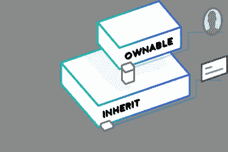

# 以太契约继承

> 原文：<https://medium.com/coinmonks/ethereum-contract-inheritance-427ccb685079?source=collection_archive---------0----------------------->



*这是摘自*[](https://concurrence.io/)**[*探索*](https://concurrence.io/exploration/)*[*契约继承*](https://concurrence.io/exploration/contractinheritance/) *。****

**在我们之前，非常聪明的人已经在以太坊合同中找到了共同的模式，并发表了标准化和硬化的例子来扩展。我们将站在他们的肩膀上，对我们舰队的某些部分使用契约继承。让我们深入研究一下这是如何工作的一个例子。**

**与其编码我们自己的所有权层并可能引入不安全性，不如让我们看看从 [OpenZeppelin 的 zeppelin-solidity repo](https://github.com/OpenZeppelin/zeppelin-solidity) 继承的东西。**

**我们将创建一个名为 **Inherit** 的契约，探索如何继承 OpenZeppelin 的 [Ownable](https://github.com/OpenZeppelin/zeppelin-solidity/blob/master/contracts/ownership/Ownable.sol) 契约:**

**这个轻量级契约只有一个状态变量，即**消息**字符串，并且只能由所有者设置。我们没有自己处理逻辑，而是使用了一个来自 [Ownable](https://github.com/OpenZeppelin/zeppelin-solidity/blob/master/contracts/ownership/Ownable.sol) 契约的修饰符。**

**同样，在我们可以部署之前，**继承**契约需要添加一个 **dependencies.js** :**

```
**const fs = require('fs'); module.exports = {   
'zeppelin-solidity/contracts/ownership/Ownable.sol': fs.readFileSync('zeppelin-solidity/contracts/ownership/Ownable.sol', 'utf8') }**
```

**和一个 **arguments.js** 来传递一个字符串给 **Inherit()** 构造函数。**

```
**const fs = require('fs'); 
module.exports = ["Ethereum is totally rad!"]**
```

**现在我们可以编译和部署**继承**:**

```
**node compile Inherit 
node deploy Inherit**
```

**[Ropsten testnet](https://ropsten.etherscan.io/tx/0x7a8bb50c31574bba53b394bd02ce7dffd208c20680ba08656fee4dc4cc5ef385) 上的合同地址:**

```
**0xd5fa4a24897db806d4879fd72c1637af5c83af65**
```

**我们需要一个脚本来告诉我们关于**继承**契约的当前信息:**

```
**module.exports = (contract,params,args)=>{   
  contract.methods.message().call().then((message)=>{ 
    console.log("MESSAGE:"+message)  
  })
} node contract getMessage Inherit MESSAGE:Ethereum is totally rad!**
```

**我们还需要一个脚本来告诉我们哪个帐户是当前的所有者:**

```
**module.exports = (contract,params,args)=>{   
  contract.methods.owner().call().then((owner)=>{    
   console.log("OWNER:"+owner)   
  }) 
} node contract getOwner Inherit OWNER:0xA3EEBd575245E0bd51aa46B87b1fFc6A1689965a**
```

**太棒了，看起来一切都准备好了。现在，让我们看看当我们尝试一个 **setMessage.js** 脚本时，它是否正常工作:**

```
**module.exports = (contract,params,args)=>{   
  console.log("**== setting message to "+args[6]+" with account "+params.accounts[args[5]])   
  return contract.methods.setMessage(args[6]).send({     
    from: params.accounts[args[5]],     
    gas: params.gas,     
    gasPrice:params.gasPrice   
  }) 
}node contract setMessage Inherit null 1 "WHAT'S GUCC'?"**
```

**(状态为: [etherscan.io](https://ropsten.etherscan.io/tx/0xffd37b5ceb5284a26d65f194068fa109f7fbb713b9b7c5a915d2a710aace6e34) 上的‘0x 0’的交易)**

```
**node contract getMessage Inherit MESSAGE:WHAT'S GUCC'?**
```

**太好了，我们看起来很安全，不用编写和审核我们自己的所有权功能。继承的最后一个测试是看看内置在 [Ownable](https://github.com/OpenZeppelin/zeppelin-solidity/blob/master/contracts/ownership/Ownable.sol) 契约中的 **transferOwnership()** 函数是否对我们的契约有效。**

**我们需要一个 transferOwnership.js 脚本:**

```
**module.exports = (contract,params,args)=>{   
  console.log("**== transferring ownership from "+params.accounts[args[5]]+" to "+args[6])   
  return contract.methods.transferOwnership(args[6]).send({     
   from: params.accounts[args[5]],     
   gas: params.gas,     
   gasPrice:params.gasPrice   
  }) 
}**
```

**(在 [etherscan.io](https://ropsten.etherscan.io/tx/0x5081fdd66cc9822fe5b65ea72d1afa788f5c8b43ef5928c0a3fe0d5533ae6d73) 上的交易)**

```
**node contract getOwner Inherit OWNER:0x4fFD642A057Ce33579a3CA638347b402B909f6D6**
```

**在编写了一段时间的 Solidity 和尝试了超级安全的 T7，并经历了我们能想到的尽可能多的场景之后，能够依靠一个已经对他们的代码有很多关注的值得信赖的第三方真的很好。随着生态系统的发展，项目将会有越来越多的审计，我们将能够信任越来越多的库。**

> **[直接在您的收件箱中获得最佳软件交易](https://coincodecap.com/?utm_source=coinmonks)**

**[](https://coincodecap.com/?utm_source=coinmonks)**

**更多阅读请访问 [https://concurrence.io](https://concurrence.io) 。**