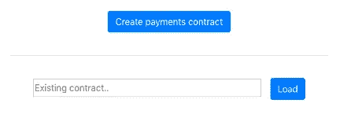
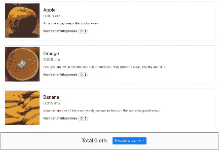
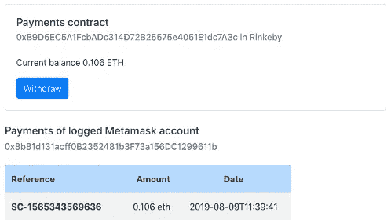

# 以太坊 Dapp 和 Vuejs 应用

> 原文：<https://medium.com/coinmonks/ethereum-dapp-with-vuejs-app-ec56ac8c5951?source=collection_archive---------0----------------------->

在本文中，我将展示一个简单的 *Dapp* 和 *Vuejs* 应用程序来管理以太网中的支付。


该应用程序包括一个管理支付的 *Dapp* 和一个实现使用 *Dapp* 进行支付的*购物车*的[vue js应用程序。](https://vuejs.org/)

您将在该应用中发现的有用问题:

*   Solidity 开发的*以太坊*智能合约示例
*   [*Vuejs*](https://vuejs.org/) app 使用 [*Vuex*](https://vuex.vuejs.org/) 和 [*Vue 路由器*](https://router.vuejs.org/) 的例子
*   [*Vuejs*](https://vuejs.org/) app 与*以太坊*网络的集成
*   将[元掩码](https://metamask.io/)用作以太坊钱包

该项目发布在 github[https://github.com/joaquin-alfaro/ethereum-payment-vuejs](https://github.com/joaquin-alfaro/ethereum-payment-vuejs)上

# Dapp 管理支付

Dapp 的目标是管理在线商店中的以太网支付。dapp 的要求是:

*   提供以以太网支付的方法。
*   用以下信息存储付款:买方帐户、购买参考、付款日期和金额
*   收取一系列款项。
*   管理资金。

## 智能合同

上述要求在以下智能合同中实施:

## **智能合同的主要问题:**

***回退功能***

当事务中调用的方法不存在时，回退函数用作默认函数。回退的主要目的是允许合同接收以太网。

```
function() external payable { require (msg.data.length == 0, 'The called function does not   exist');}
```

**事件*事件*事件**

智能合约使用事件来记录操作。外部应用程序订阅这些日志以获得通知。

在这种情况下，协定为每次付款发出一个事件

```
// Event to notify payments
event Pay(address, string, uint);// Payment function
function pay(string memory id, uint value) public payable {
    require(msg.value == value, 'The payment does not match the value of the transaction'); payments[msg.sender].push(Payment(id, msg.value, block.timestamp)); // Emits event "Pay" to notify the payment
    emit Pay(msg.sender, id, msg.value);}
```

***两个功能列出付款***

目前，不可能从函数中返回结构列表，一种变通方法是使用两个函数，第一个函数获取元素的数量，第二个函数通过索引获取元素。

在这种情况下，的*payments 返回账户的支付次数，而 *paymentsOfAt* 返回支付列表中某个位置的账户的支付次数。*

```
function paymentsOf(address buyer) public view returns (uint) {
    return payments[buyer].length;
}function paymentOfAt(address buyer, uint256 index) public view returns (string memory, uint256 amount, uint256 date) {
    Payment[] memory pays = payments[buyer];
    require(pays.length > index, "Payment does not exist");
    Payment memory payment = pays[index];

    return (payment.id, payment.amount, payment.date);
}
```

## **戴普大厦**

构建智能合约可以使用 [*solc*](https://github.com/ethereum/solidity) 或 [*solcjs*](https://github.com/ethereum/solc-js) *。*为了简单起见，我决定使用 *solcjs* ，因为它是作为 *npm* 模块提供的，并且不需要下载或构建 *solc* 编译器。

```
const solc = require('solc')solc.compile(JSON.stringify(sources))
```

## **Dapp 测试**

对于 Dapp 测试，我将使用 [*mocha*](https://mochajs.org/) 作为测试框架，使用 [Ganache CLI](https://github.com/trufflesuite/ganache-cli) 作为以太坊客户端模拟器。

## 使用 Vuejs 的购物车

[Vuejs](https://vuejs.org/) 是一个类似于 [Angular](https://angular.io/) 和 [React](https://reactjs.org/) 的 UI 框架，其主要特点是可以覆盖两者的需求。

该项目已使用 [vue-cli](https://cli.vuejs.org/) 创建，并使用 [vuex](https://vuex.vuejs.org/) 进行状态管理(vue 的 flux 版本)和 [vue-router](https://router.vuejs.org/) 进行组件路由。

项目的结构:

```
public
 └── assets     # Public images
src
 ├── assets     # Images, css and js
 ├── components # Vue components
 ├── domain     # Business logic. Interaction with smart contracts
 └── views      # Vue components as page purposing
```

## 畴层

*域*文件夹将作为 Dapp 中*视图*和业务逻辑之间的链接

> 尽管区块链充当模型层，但它也在智能合约中提供业务逻辑

域文件夹包含一个 javascript 类。这些类将智能合约的方法与视图层要使用的函数进行映射。它就像一个对象关系映射，但是除了数据之外，还有智能契约和映射*业务逻辑*。

Javascript class mapping Payments.sol smart contract

# 使用

1.  在节点中设置并启动应用程序

```
$ npm install$ npm run serve
```

2.在浏览器中安装 Metamask 插件。【https://metamask.io/ 


Metamask plugin

3.从[http://localhost:8080/#/Payments](http://localhost:8080/#/payments)创建支付合同



Component to create or load existing contract in Ethereum network

一旦在区块链网络中创建了合同，就会显示详细信息


Detail of payment contract

4.转到购物车。[http://localhost:8080/#/shopping](http://localhost:8080/#/shopping)



Shopping cart

5.往篮子里放一些水果，然后付款。


一旦支付交易在区块链提交，将被重定向至支付合同的详细信息。详细信息将显示您的购买情况。



Detail of contract showing payments

6.从付款合同中提取资金到业主账户。[http://localhost:8080/#/payments](http://localhost:8080/#/payments)


Withdraw of funds from Payments contract

# GitHub 上的知识库

[](https://github.com/joaquin-alfaro/ethereum-payment-vuejs) [## 华金-阿尔法罗/以太坊-付款-vuejs

### 管理以太网支付的简单应用程序。

github.com](https://github.com/joaquin-alfaro/ethereum-payment-vuejs) 

> [在您的收件箱中直接获得最佳软件交易](https://coincodecap.com/?utm_source=coinmonks)

[](https://coincodecap.com/?utm_source=coinmonks)