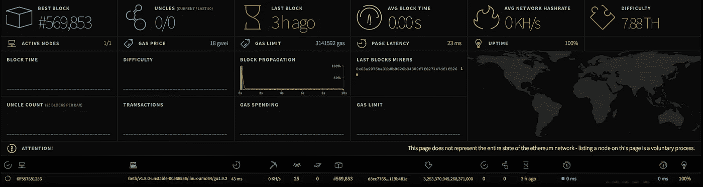
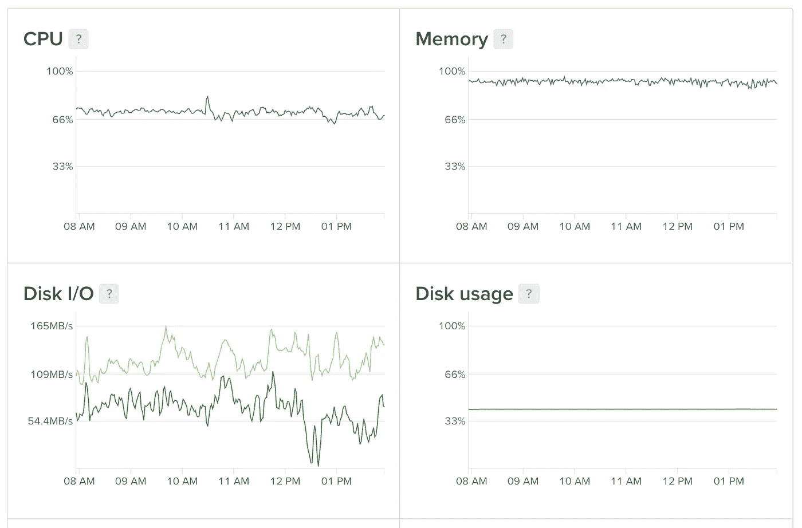

# 以太坊❤数字海洋

> 原文：<https://medium.com/coinmonks/ethereum-digital-ocean-70eb9828912c?source=collection_archive---------0----------------------->

如何在数字海洋上安装**以太坊**全节点及其效果



## 为什么？

*   我们需要服务器来管理**以太坊**账户
*   我们需要用 Docker 运行它，这样我们就可以在本地运行它。
*   我们需要在 [**数字海洋**](https://m.do.co/c/6dcfcc2a3392) **(** 或其他供应商上运行它，所以…Docker！)

## **如何？**

*   手动设置新的$5 [**数字海洋**](https://m.do.co/c/6dcfcc2a3392) 或[无手动](/digithun/packer-digitalocean-63a4a66edbd6)
*   安装 5gb 卷连接
*   跟随[这一步](https://github.com/rabbotio/geth-docker)

## 结果？



并且卡住了…


尝试 10 美元，更快的同步，但仍然停留在 569，881

尝试 20 美元，更快的同步，但仍然停留在 569，822


坏块！


尝试删除数据库

```
geth removedb
```

仍然停留在 569，982

我们哪儿也不去，让我们试试我的 Macbook Pro 13 英寸宽 TouchBar 16gb


结果是…

```
{
  currentBlock: 4631471,
  highestBlock: 4631728,
  knownStates: 1135919,
  pulledStates: 1121936,
  startingBlock: 4631429
}
```

相当接近，但我从来没有达到最高的块！我想我现在必须放弃了(是的，我失败了！).因为我不需要全节点 ATM，所以让我们稍后再试试吧！

## 号外:给我的

1.  带有完全同步**以太坊**客户端的全节点 GPU 机器。
2.  拥有至少一个**以太坊**账户作为**币库**(或以太库)

就这些了，快乐以太！

## 注意(参考)

> 不要错过免费获得 10 美元[**digital ocean**](https://www.digitalocean.com/?refcode=6dcfcc2a3392)←2 个月免费托管的机会！
> 并声称你最便宜的 ***。io*** 名称在它消失之前在 [**名称便宜**](https://www.namecheap.com/?aff=99054) 。

> [在您的收件箱中直接获得最佳软件交易](https://coincodecap.com/?utm_source=coinmonks)

[](https://coincodecap.com/?utm_source=coinmonks)