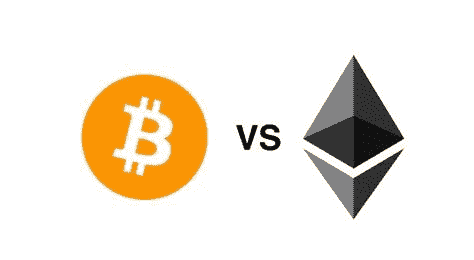

# 以太坊颠覆比特币——为什么以太坊现在如此流行

> 原文：<https://medium.com/coinmonks/ethereum-flips-bitcoin-why-eth-is-currently-so-trendy-dc047ffab1c0?source=collection_archive---------2----------------------->

以太坊将超越比特币。所谓的 BTC 翻转目前正在成为以太坊的一种新叙事。这是由于目前 ETH 的日交易量较高，但基于目前有利于市值第二大加密货币的链上数据。