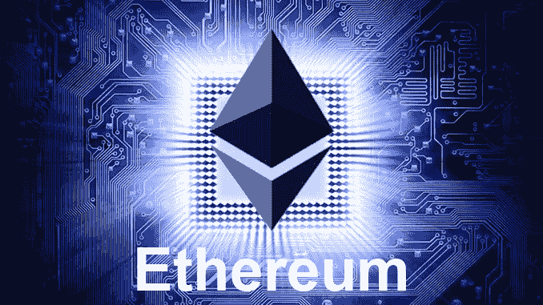

# 以太坊基金会宣布柏林硬福克

> 原文：<https://medium.com/coinmonks/ethereum-foundation-announces-berlin-hardfork-603773bbc2aa?source=collection_archive---------0----------------------->

四月，以太坊的下一个硬分叉将被激活。对于外行人来说，这些变化看起来相当神秘。广泛期待但也有争议的更新 EIP 1559 仍然在外面——目前。

自 3 月 8 日起，以太坊的柏林升级正式宣布。这次升级将是一系列非向后兼容的 hardforks 的一部分，开发者已经…