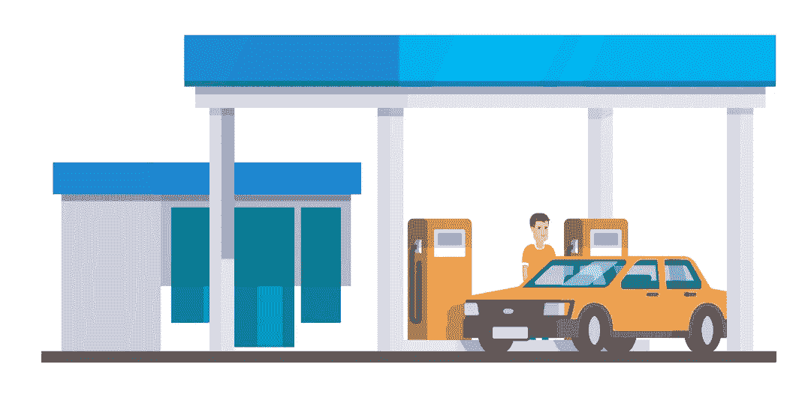

# 以太气用简单的英语解释

> 原文：<https://medium.com/coinmonks/ethereum-gas-explained-in-plain-english-d9e60a699c54?source=collection_archive---------0----------------------->

在这篇文章中，我将尝试解释以太坊最令人困惑的一个方面——气体。你可能听说过它，但最有可能的是，它对你来说没有多大意义。气体的概念确实令人困惑，部分原因是它是以太坊计算引擎(EVM)使用的低级概念。然而，气体是以太坊持续运行的原因，清楚地理解这个概念很重要。我向你保证，看完这篇文章后你会对气体有最清晰的认识。

要问的第一个问题是气体到底为什么存在。毕竟，比特币或其他加密货币中没有气体的概念。让[以太坊](https://sharpcode.pro/tag/ethereum)与比特币不同的独特之处在于智能合约的存在。智能合同只是一个计算机程序的花哨名称。

暂时忘掉以太坊和智能合约吧。想想你的车。你的汽车有一个需要汽油才能运转的引擎。为了从 A 点到达 B 点，发动机燃烧一些汽油。距离越长，需要的汽油就越多。你在加油站购买汽油并付钱。然而，你如何估计某次旅行在金钱方面会花费你多少钱呢？首先，你估计汽油的总消耗量。为此，您需要计算行程的大致距离(例如，以公里为单位)并乘以您的汽车的平均油耗(比如每 100 公里 9 升)。此外，将总消耗量乘以汽油价格(例如每升 1.55 欧元)。因此，你得出了这次旅行的大概费用。

这里的工作方式几乎完全一样。智能合同包含由计算机执行的命令。这意味着当智能合约运行时，它会像你的汽车发动机消耗汽油一样消耗某人的计算能力。这个人需要为所提供的计算资源付费。因此，智能合同中的每一个命令都有一个用汽油衡量的价格(就像每行驶一公里都要消耗一定量的汽油)。一些命令花费更多，一些命令花费更少，但是它们从来都不是免费的。再想想你的车。你的车会消耗不同数量的汽油，这取决于你是在高速公路上行驶，上坡还是在城市拥挤的交通中挣扎。同样，智能合约中的不同命令会给计算机带来不同的压力，从而消耗不同的汽油量。

***让我们总结一下到目前为止我们所拥有的:***

*   以太坊就像汽车发动机。
*   以太坊的汽油就像你车里的汽油。
*   在以太坊，你支付乙醚来购买汽油，在现实生活中，你支付金钱(如美元)来购买汽油。
*   执行明智的合同就像旅行一样。
*   智能合约命令的执行类似于覆盖一定的距离。
*   智能合同执行价格就像旅行的总成本。

现在，关于以太坊的一个有趣的事情是，虽然每个命令都有一个预先确定的固定的天然气成本，但天然气价格并不固定。当智能合同被调用时，你指定你愿意为汽油支付多少钱。另一方面，其计算资源被使用的人(矿工)决定是否接受提议的价格。显然，矿工试图最大化他们的利润，因此他们愿意接受更高的天然气价格交易。从技术上来说，当你调用以太坊智能合约时，如果你将天然气价格定得很低，它可能不会起作用。以太坊钱包建议合理的天然气价格，但同样，这是完全由你来指定天然气价格。同时，你可以指定你愿意花费的最大汽油量。实际花费的汽油可能会更低，但绝不会高于你愿意支付的价格。

最后，必须注意，gas 既用于常规事务(即发送以太坊)，也用于智能契约调用。

# 谢谢大家！

你喜欢这个故事吗？访问[**我的博客**](https://sharpcode.pro) 了解更多关于以太坊、[智能合约](https://sharpcode.pro/tag/smart-contracts)、区块链、ico 和加密货币的有趣和独家故事。