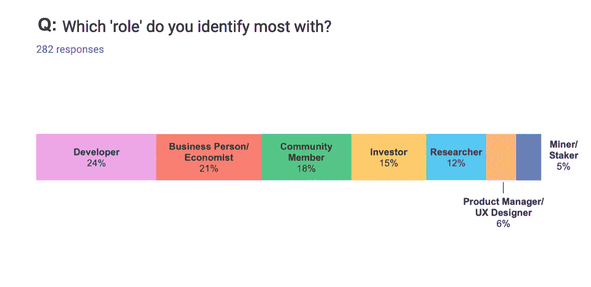
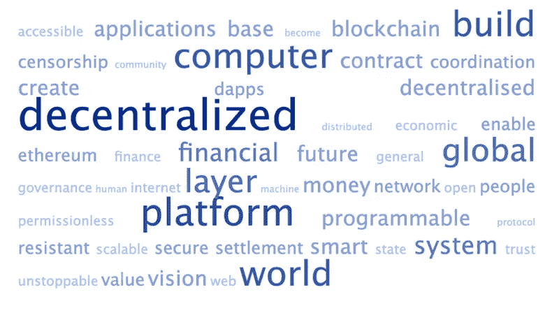
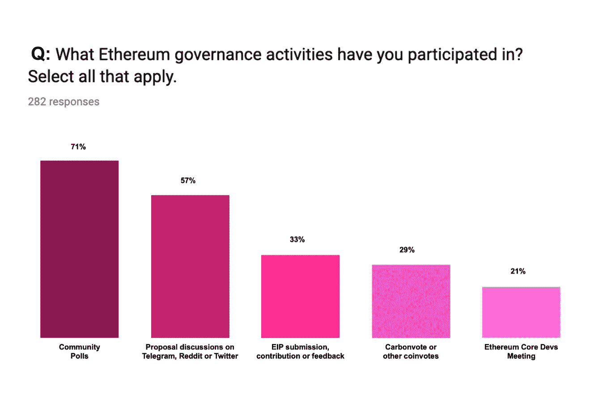
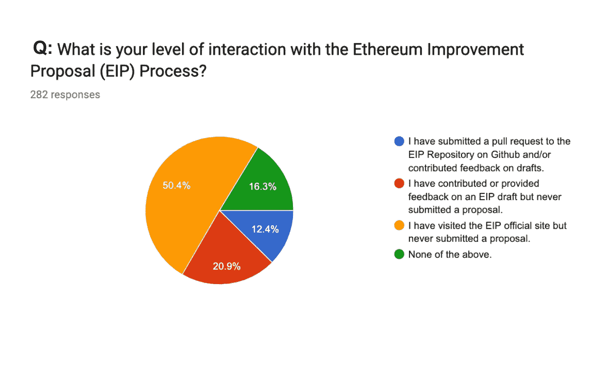
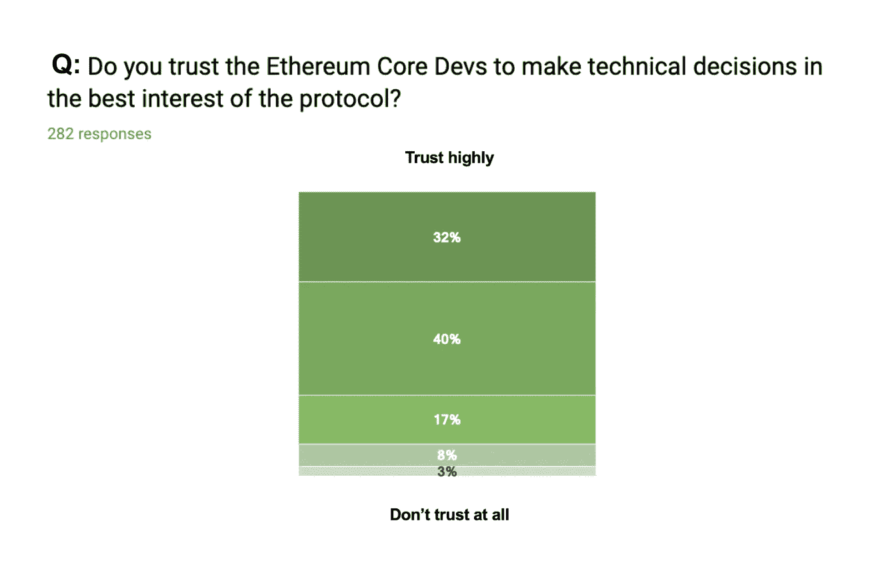
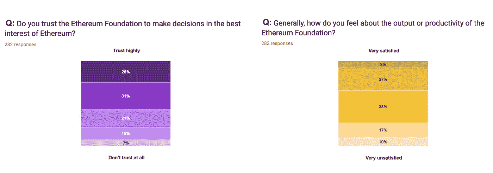
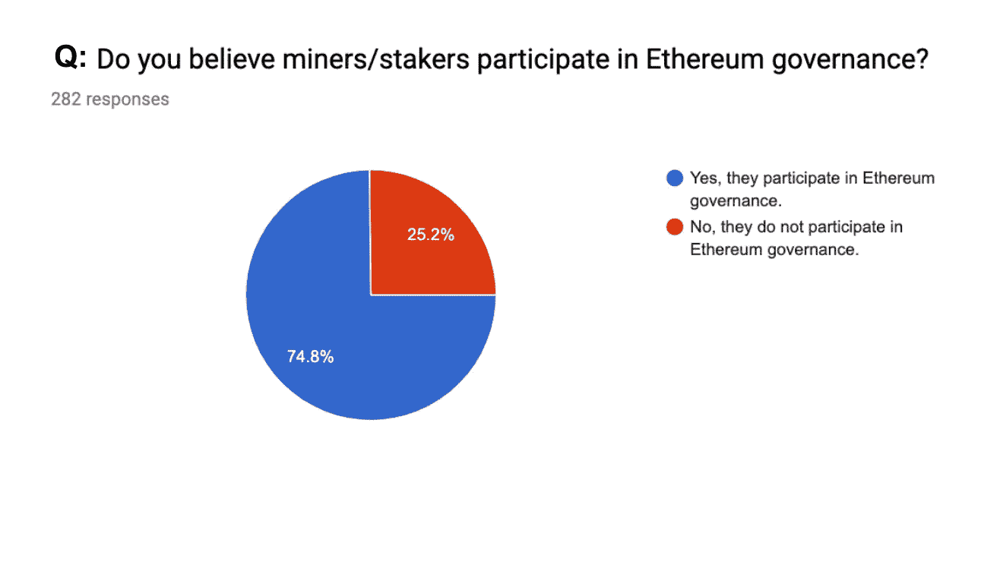
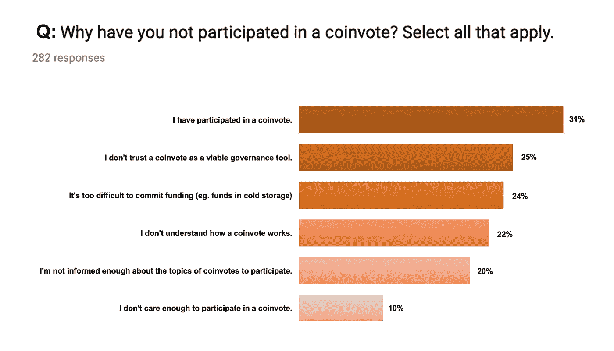
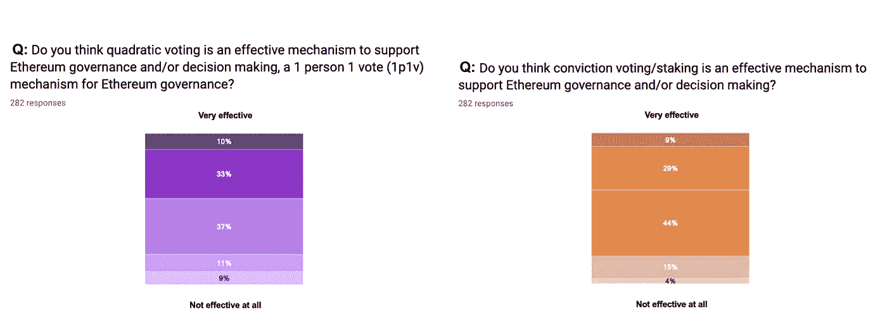
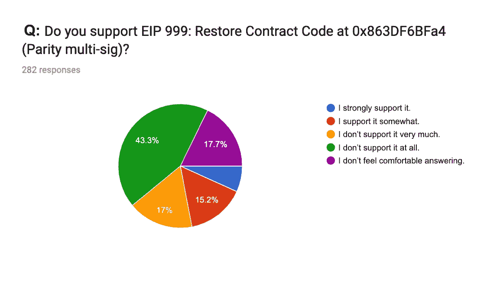

# 以太坊治理调查结果

> 原文：<https://medium.com/coinmonks/ethereum-governance-survey-results-c67c11695f2a?source=collection_archive---------2----------------------->

你可以在任何地方听到窃窃私语——在大厅里，在体育馆里，在最近的 ETH 黑客马拉松上:以太坊治理？

在这个讨论中，我[开发了一个调查](https://twitter.com/evabeylin/status/1117810047436779522)来捕捉社区对以太坊技术和政治决策的观点。

该调查的目的是为更准确的情感分析获取定量数据，并降低热门话题的信噪比。希望这些数据会很有趣，并能为以太坊的未来治理提供信息。

**结果已经处理完毕。**

在我们开始之前，请注意以下几点:

*   该调查是自愿创建的，它不是由任何组织委托或为任何组织进行的，没有任何组织私下获得或了解原始数据、图表或定性见解。
*   该调查旨在尽可能广泛地分发，以纳入不同的利益攸关方。在[推特](https://twitter.com/evabeylin/status/1117810047436779522?ref_src=twsrc%5Etfw%7Ctwcamp%5Etweetembed%7Ctwterm%5E1117810047436779522%7Ctwgr%5E393039363b74776565745f6d65646961&ref_url=https%3A%2F%2Fbitcoinexchangeguide.com%2Feva-beylin-of-ethereum-foundation-creates-a-survey-to-take-a-look-at-community-sentiments%2F)、 [ETH 魔术师](https://ethereum-magicians.org/t/ethereum-governance-survey-call-to-action/3137)、 [ethresear.ch](https://ethresear.ch/t/ethereum-governance-survey/5373) 、 [Reddit](https://www.reddit.com/r/ethereum/comments/becuy4/ethereum_governance_survey_call_to_action/) 上，通过口口相传的方式分享；然而，结果可能会受到样本偏差的影响。
*   数据以匿名方式收集——不需要电子邮件地址或其他标识符。
*   Status 去年开展的 [EIP0 共享价值观调查](https://ethereum-magicians.org/t/share-your-values-on-the-eip0-shared-values-survey/454)为数据分析开创了先例，并激发了此次调查。
*   这些数据和分析并不反映我过去或现在的雇主的信念，也不反映所有以太坊利益相关者的信念。
*   感谢每一个反馈的人，非常感谢！

*请敲鼓*

# 以太坊治理调查数据

这篇文章只是强调了一些结果。查看 [**图表**和**原始数据**](https://github.com/evabeylin/EthereumGovernanceSurvey) 进行更深入的分析。🤓

## **趣味数据花絮**

*   282 名受访者
*   94%的人认同以太坊社区的成员
*   70%是代币持有者
*   45%在以太坊的组织中工作
*   39%的人在 DAO 黑客事件发生时不在以太坊
*   51%拥有超过 100 个 ETH
*   89%的人使用过基于以太坊的 dapps
*   84%的人支持以太坊的风险证明共识
*   57%的人参加过以太坊聚会
*   41%上过敌无双大学
*   73%的人使用加密 Twitter 来了解更多关于以太坊的信息
*   66%的人使用 Reddit 了解更多关于以太坊的信息
*   61%的人利用以太坊简讯中的一周时间了解以太坊
*   36%的人认为 Crypto Twitter 最能抓住生态系统/社区情绪
*   24%的人认为 Reddit 最能抓住生态系统/社区情绪

## **以太坊的愿景**

当被问及是否理解以太坊的愿景时，52%的人说他们非常理解，而 41%的人说他们有点理解。92%与愿景一致。

> 以太坊:去中心化的世界计算机和全球金融平台。

这个单词图并不令人惊讶，坦率地说，看到对愿景设置的共识令人放心。然而，尽管热情高涨，社区也可以从以太坊战术目标的更大视野中受益。

我们应该问自己这样的问题:

采用的愿景是什么？如果不与现有的中央实体(如坡道、交易所)、系统(如中央银行)或监管机构合作，采用是否可行？我们应该考虑收养吗？

以太坊在哪里竞争？后端？中间件？面向用户的应用？有哪些意向产品？

## **以太坊治理活动**

18%的受访者表示他们不想参与技术或政治治理，51%的人希望两者都参与。

48%的人表示他们希望每季度或每半年参加一次治理活动，32%的人希望每两周参加一次。

与此同时，大多数受访者参与了加密 Twitter 投票，但只有 33%的人参与了 EIP，21%的人参加了以太坊所有核心开发者会议。(问题 22)

这表明，在社交媒体上积极讨论方案更新的大多数受访者可能没有为方案制定本身做出贡献。

事实上，58%的受访者从未参加过所有核心开发人员会议，尽管大多数受访者知道在哪里可以找到参加现场会议的链接。

41%的受访者有时会在会后查看笔记/视频，只有 15%的人会在每次会议后认真查看。

总的来说，以太坊所有的核心开发人员在做出技术决策时被高度信任，但在做出关于以太坊的政治决策时却不太被信任。这些数据还表明，以太坊协议的决策过程还有提高透明度的空间。*(查看 Q34–42，了解更多关于所有核心开发者大会和 EIP 流程的观点分析。)*

由于大多数回答者*不会*参加所有核心 Devs 会议，也不会对 EIPs 做出贡献，因此，也许更多的非技术性或高层次的总结会更有效地通知社区的其他成员。这可能有助于缓解任何源于缺乏知识而非敌对意图的非理性恐慌。

向 Tim Beiko 致敬，他一直在亲切地直播所有核心开发人员的电话，不管晚上有多晚！

在[以太坊基金会](https://www.youtube.com/channel/UCNOfzGXD_C9YMYmnefmPH0g/featured) youtube 频道上创建一个专门用于所有核心开发者会议的播放列表，也可能对那些寻找流媒体的人有所帮助，并使其更容易疯狂观看过去的会议。即将来到你身边的网飞。

作为参考，这里有一些资源，您可以从中了解更多关于所有核心 dev、EIP 进程和以太坊技术路线图的信息:

*   [所有核心 Devs 会议项目管理:议程和会议记录](https://github.com/ethereum/pm)
*   [以太坊基金会频道](https://www.youtube.com/channel/UCNOfzGXD_C9YMYmnefmPH0g/featured)(会议直播上传此处)
*   [EIP 网站](http://eips.ethereum.org/)
*   [EIP 知识库](https://github.com/ethereum/EIPs)
*   以太坊技术路线图
*   [以太坊路线图](https://eth.wiki/roadmap) — eth.wiki
*   [分片路线图](https://github.com/ethereum/wiki/wiki/Sharding-roadmap)
*   [以太坊 2.0(宁静)阶段](https://docs.ethhub.io/ethereum-roadmap/ethereum-2.0/eth-2.0-phases/) — Ethhub

## **以太坊基金会透视**

关于以太坊基金会的话题，受访者表示他们高度信任该组织，但认为可以有更明显的产出/生产力。该数据还表明，人们希望英孚的运营、研究和拨款决策过程更加透明。

然而，自从开展这项调查以来，EF 已经进行了一些更新，使我们对正在进行的工作有了更深入的了解和透明度:

*   英孚支持团队:发展报告(6 月 21 日)
*   [以太坊基金会 2019 春季更新](https://blog.ethereum.org/2019/05/21/ethereum-foundation-spring-2019-update/)(5 月 21 日)
*   [阿雅的 EF 更新@ Ethereal](https://www.youtube.com/watch?v=ccqAoM9AsXs)(5 月 10 日)——*4:03:38*
*   新 ethereum.org 发布[(4 月 30 日)](https://blog.ethereum.org/2019/04/30/beginning-a-new-ethereum-org/)

查看 Aya 在 Ethereal 的视频，其中她介绍了拨款决策过程以及在接下来的一年中花费 3000 万美元资助 ETH1.x 开发者和一般“核心”以太坊支持和开发的意图。

Aya 还讨论了对长期研究的承诺、全球以太坊活动、定期团队更新计划以及关于研究团队和内部计划进展的季度 EF 博客。最后，Aya 鼓励发展更多像 EF 这样的组织来支持可持续和开源的以太坊项目，比如 MolochDAO。

## **矿工&利益相关者在治理**

一个热点话题是矿工和利益相关者是否参与以太坊治理。75%的受访者表示，矿工目前确实参与以太坊治理；更有意思的是，77%的人认为应该！

我们应该停止这种做法，*参与以太坊协议决策过程的每个*利益相关者都要参与治理。

## **以太坊作为政治体系**

最有趣的问题是以太坊治理应该效仿哪种政治体系。46%的人倾向于民主(多数人统治，没有单一统治者)，32%的人倾向于共和制(通过选举代表的平等发言权，代议制民主)。

此外，7%的人认为神权政治是正确的选择。(摩洛神我们的主和救世主？！)6%倾向寡头政治，4%倾向共产主义。

## **治理机制**

由于以太坊中的身份问题还没有解决，所以很难执行抗 sybil 治理。在过去，已经使用了 coinvotes、预测市场和 DAOs，并且最近已经探索了像二次投票和信念投票/赌注这样的机制。

只有 35%的受访者说他们过去参加过共同投票(如 Carbonvote，Tennagraph)。其他人认为缺乏信任和难以承诺资金是缺乏参与的原因。

关于预测市场(如 futarchy)，30%的人认为它们是有效的管理工具，46%的人持中立态度。

58%的受访者在公元(道之后)加入以太坊。虽然在 DAO 黑客事件发生时，只有 42%的受访者正在建设或投资以太坊，但 39%的受访者仍会信任 DAO 对以太坊治理做出决策(例如，为以太坊开发人员分配公共产品资金)。

关于不同类型以太坊 Dao 的更多信息，请查看这篇文章。今天最著名的社区 DAO 是 MakerDAO，MolochDAO，Meta Cartel，HumanityDAO，DAOstack 和一系列阿拉贡 DAO。

尽管二次投票和信念投票仍然相对未经测试，但受访者对其有效性持积极态度。请做更多的实验！

## **密码争议**

这项调查的警告是，只有 282 名受访者，结果可能偏向于那些在特定网络中积极使用社交渠道并足够关心分享他们意见的人。因此，结果并不能完全反映以太坊社区的观点…尽管如此，在有争议的话题上还是有一些有趣的见解。

51%的人认为硬分叉是激励协作以太坊治理的强大机制。

65%的人关心以太坊链是否分裂(再次)，但 76%的人关心以太坊社区是否分裂。这意味着以太坊协议本身没有构建和维护它的社区重要。我们应该更多地考虑这在采用的背景下意味着什么——也许多个以太坊链对于不同的用例来说是理想的，由一个社区来管理它们。

84%支持以太坊 PoS 共识，40%支持 PoW，37%支持 ProgPoW(程序化 PoW)。

32%的受访者支持链上治理。

关于我们这个时代最有争议的讨论:60%的人说他们不支持 EIP 999。

在调查期间， *EIP 1890:对可持续生态系统资助的承诺(如整体奖励资助)*也被广泛讨论，45%的受访者支持。

## **治理挑战&解决方案**

以太坊治理调查的结果很有意思，它更清晰地展现了社区的不满。

当被问及治理方面的挑战时，受访者强调了几个要点，尽管大多数人都没有反映出来。

为了更好地划分挑战，我将它们分成了几组:多样性、协作、领导、沟通和工具。我们可以专注于如何解决挑战，而不是在挑战面前磨磨蹭蹭。

我们可以做以下几件事来改善以太坊治理:

**多样性**

*   为社区的所有成员，包括开发人员、研究人员、矿工、投资者、商业人士、搬运工等，提供平等的信息和工具访问。—不要歧视，这里没人是专家。
*   鼓励以太坊之外的人以及超级粉丝的讨论和参与。在爱丽丝掉进兔子洞之前，我们都是爱丽丝。
*   通过多种渠道(如以太坊论坛、Reddit、Twitter)分享研究并征求反馈，以纳入各种观点并减少狭隘的群体思维。

**协作**

*   不要害怕竞争。与从事类似研究或开发工作的人员组成工作组，以提高知名度、减少冗余并加速创新(例如，许多 ETH2.0 团队密切合作，国家渠道团队公开协作)
*   创建工作室。最近，一个名为 [Scaling Ethereum](http://scalingethereum.org) 的研究研讨会开始了，聚集了 oracles、dex、第 1 层和第 2 层可伸缩性的研究人员。这不是一个排他性的组织，任何人都可以做一个伸缩以太坊！

**领导**

*   不要依赖一个规范的领导者，每个项目都可以制定自己的规则和治理。64%的受访者建议以太坊 PM 工作应该分散给许多领导者。以太坊没有单一的领导者——无论是组织还是个人。
*   要负责任。权力下放赋予许多人而不是少数人以责任。不要害怕开始一个社区或项目，没有人告诉你你不能。这是开源的。也不要指望*一个*组织是最负责任的。

**通信**

*   分享信息和更新时要积极主动，而不是被动反应。如果你是一个高度批判性的、参与性的或有声望的个人/项目，很可能有一个关于你的工作的持续更新的期望——像我们的区块链，社区是相当公开的。
*   不要把缺乏知识和缺乏透明度混为一谈。如果你对当前的技术路线图、政治决策或明年敌无双标志的颜色不清楚，请在分享反馈之前查看所有可用的资源和论坛。
*   了解最新的资源。其中最好的是以太坊新闻和[以太坊基金会博客](https://blog.ethereum.org/)中的[周](https://www.weekinethereum.com/)

**工装**

*   造一把刀。
*   这些新的治理机制虽然在实地进行了更多的试验，但在很大程度上仍未经过测试。大声喊出来 [Fomo3D](https://exitscam.me/) 创造了迄今为止最大的价值结合曲线，大声喊出来 [TCR Party](https://www.tcr.party/) 测试了由 100 多名加密 Twitter 用户测试的加密经济治理。

总之，以太坊治理 ***并没有*** 失败。

随着协议的发展和社区的扩大，它也在不断发展。没有一个单一的数据源能够捕捉到这个完全不同的社区的情绪，所以从各种工具和子社区中获取反馈是很重要的。

希望这项调查提供了一些有用的见解，将来会有更多的研究。

*感谢*[*Abbey Titcomb*](https://medium.com/u/5967a5d3b611?source=post_page-----c67c11695f2a--------------------------------)*的反馈和笔记。*

> [直接在您的收件箱中获得最佳软件交易](https://coincodecap.com/?utm_source=coinmonks)

