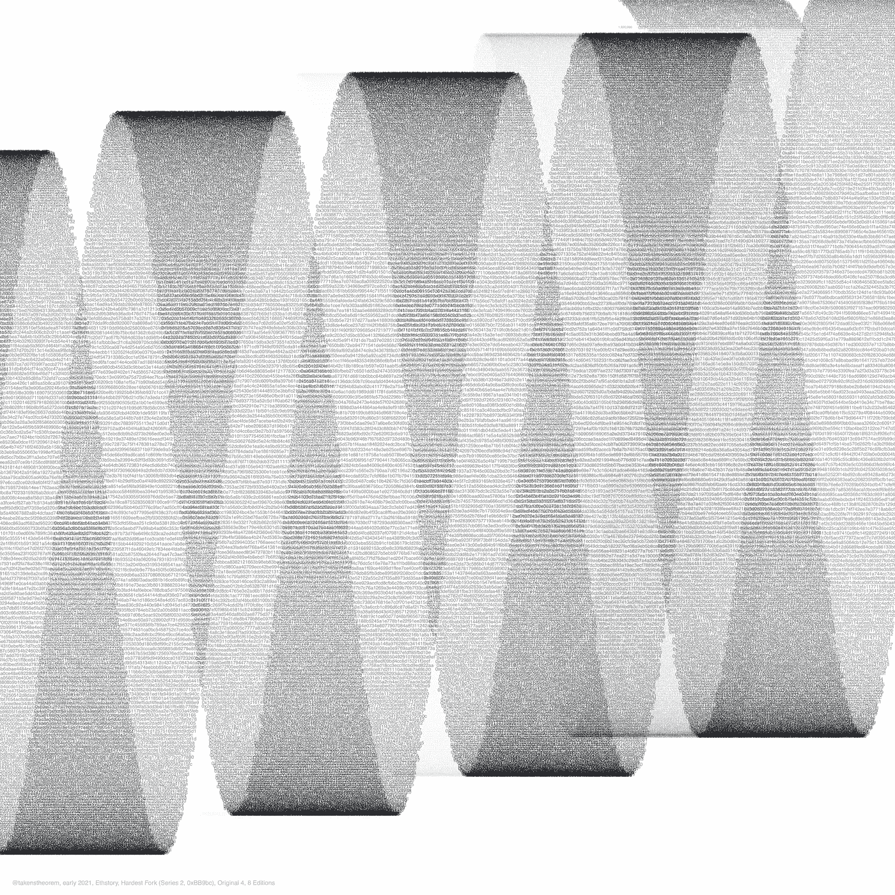
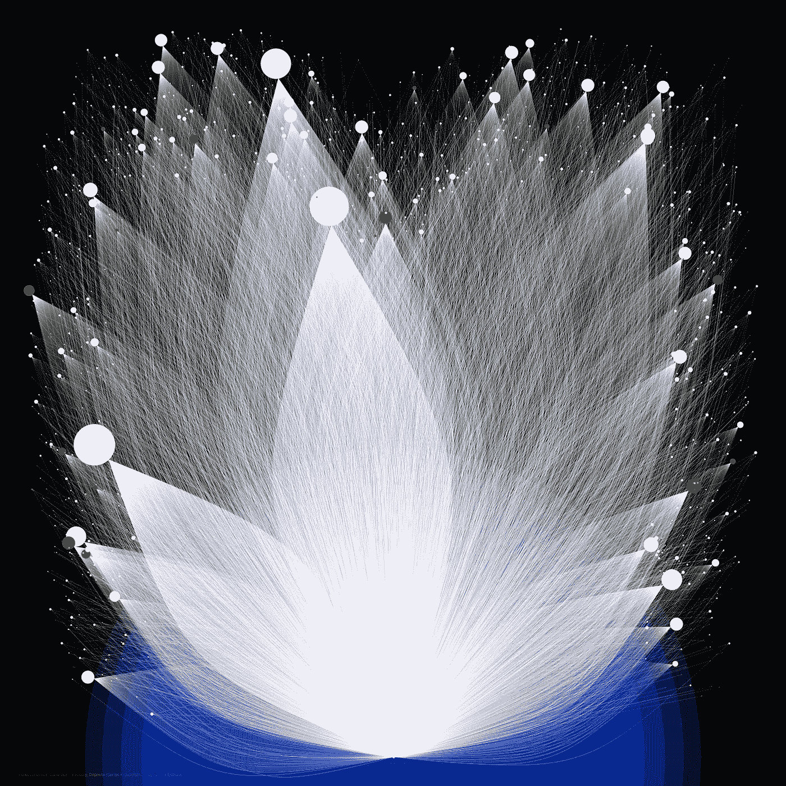

# 5 分钟后以太坊历史

> 原文：<https://medium.com/coinmonks/ethereum-history-in-5-minutes-ca3aa7061397?source=collection_archive---------2----------------------->

## 快速复述以太坊的历史，使用漂亮的图片和著名作品的引用。

每一个[可视化](https://ethstory.eth.link)都是直接从 on-chain 和其他数据中构建的，并伴随着引自[卡米·鲁索](https://twitter.com/CamiRusso)和[马特·莱辛](https://twitter.com/mattleising)的精彩书籍，以及来自伟大的[埃特胡布](https://EthHub.io)、[马孜·雷德](https://andrewsteinwold.substack.com/)、[目中无人的](https://thedefiant.io/what-are-automated-market-makers-like-uniswap/)和[ethereum.org](https://ethereum.org)的一些资源。

# 2013–2015

“2014 年 4 月…加文发表了以太坊黄皮书，这是 Vitalik 白皮书的技术规范。虽然[2013]白皮书首次描述了以太坊的概念，但黄皮书深入到了以太坊虚拟机的具体细节。”([鲁索](https://www.harpercollins.com/products/the-infinite-machine-camila-russo)，第 113 页)

“WPYP Chromosome.” Blending thousands of elements from the white (2013) and yellow (2014) papers, in almost their entirety. [See here for more detail](https://opensea.io/assets/0x495f947276749ce646f68ac8c248420045cb7b5e/76239962253391602540897856100159297712186421936948015313417445423617597767681).

“在(2014 年)销售开始时……一个比特币购买了 2000 个以太……当投资者将他们的比特币发送到 EthSuisse 钱包时……[t]他们获得了一个以太坊钱包和密码。”([鲁索](https://www.harpercollins.com/products/the-infinite-machine-camila-russo)，第 133-134 页)

“Inject BTC.” The crowdsale had many purchasers (dots above) use bitcoin, flowing into the sale wallet (bottom left). [See here for more details](https://opensea.io/assets/0x495f947276749ce646f68ac8c248420045cb7b5e/76239962253391602540897856100159297712186421936948015313417445420319062884353).

“……筹集的资金数量也反映了一个备受期待的项目，该项目由一位被誉为天才程序员的青少年领导，旨在打造下一代区块链。”([鲁索](https://www.harpercollins.com/products/the-infinite-machine-camila-russo)，第 141 页)

“Bridging BTC.” Linking crowdsale purchasers (orange) to their future Ethereum wallets (dotted). [More details here](https://opensea.io/assets/0x495f947276749ce646f68ac8c248420045cb7b5e/76239962253391602540897856100159297712186421936948015313417445431314179162113).

“在(2015 年)7 月 30 日晚上，维塔利克、杰夫、加夫和其他像弗拉德·扎姆菲尔这样的开发者在等待倒计时……‘然后网络启动了，’维塔利克说。”([雷辛](https://www.amazon.com/Out-Ether-Amazing-Ethereum-Destroyed/dp/1119602939)，第 221 页)

“Birth.” The crowdsale Bitcoin wallet (36PrZ) leads to the birth of the Ethereum mainnet in 2015, its first transactions shown. [More detail here](https://opensea.io/assets/0x495f947276749ce646f68ac8c248420045cb7b5e/76239962253391602540897856100159297712186421936948015313417445426916132651009).

# 2014–2016

“他们没有故意做两个独立的版本[2014]…拥有多个客户端也更安全，以防一个实施受到攻击。”([鲁索](https://www.harpercollins.com/products/the-infinite-machine-camila-russo)，第 113 页)

“Clients.” The codebase of the two major Ethereum clients, one in Go and the other in Rust, on the backdrop of their yellow paper specification. [See here for more details](https://opensea.io/assets/0x495f947276749ce646f68ac8c248420045cb7b5e/76239962253391602540897856100159297712186421936948015313417445441209783812097).

“到那天(2015 年 7 月)结束时，Vitalik 和 Gavin 聚集在电视机前，其余的开发人员也紧随其后。一些人打开了一瓶啤酒，站在一起看着街区号码滴答作响。([鲁索](https://www.harpercollins.com/products/the-infinite-machine-camila-russo)，第 155 页)

“Big Bang.” The first transactions from 2015 July’s genesis, node size reflects crowdsale ether, branching into new projects. [See here for description](https://opensea.io/assets/0x495f947276749ce646f68ac8c248420045cb7b5e/76239962253391602540897856100159297712186421936948015313417445445607830323201).

“攻击已经开始[2016 年 6 月]。随着盗窃行为的继续，一天中会出现数千笔这样的小额交易。全世界的人都目睹了这一切，却无力阻止。最终价值 5500 万美元的以太网被盗，成为当时历史上最大的数字盗窃案。”( [Leising](https://www.amazon.com/Out-Ether-Amazing-Ethereum-Destroyed/dp/1119602939) ，第 4 页)

“Reentrancy.” Major depositors to the DAO, which held over $100 million in ether, and the reentrancy attack that drained more than $50 million (dark lines) and the recovery of ether (light lines). [See here](https://opensea.io/assets/0x495f947276749ce646f68ac8c248420045cb7b5e/76239962253391602540897856100159297712186421936948015313417445452204900089857).

“……以太坊社区见证了他们的区块链的新版本诞生。或者，准确地说，他们的老区块链不会死。它后来被称为以太坊经典，或等。”( [Leising](https://www.amazon.com/Out-Ether-Amazing-Ethereum-Destroyed/dp/1119602939) ，第 240 页)

“Hardest Fork.” Reverting ether balances by hard fork, block hashes leading into the hard fork of mid 2016, and Ethereum Classic splits off into its own future (green). [See here for more description](https://opensea.io/assets/0x495f947276749ce646f68ac8c248420045cb7b5e/76239962253391602540897856100159297712186421936948015313417445461000993112065).

# 2017–2020

“起初，每周大约有一个 ICO，然后是每隔几天一个，然后在同一天可能会有多达两个。每隔一周，一个 ICO 似乎完全让之前的那个庞然大物相形见绌。”([鲁索](https://www.harpercollins.com/products/the-infinite-machine-camila-russo)，第 235 页)

“Proliferation.” Peaking in 2017, the “Initial Coin Offering” era was built almost entirely on Ethereum. [See here for more summary](https://opensea.io/assets/0x495f947276749ce646f68ac8c248420045cb7b5e/76239962253391602540897856100159297712186421936948015313417445465399039623169).

“以太坊现在价值超过 1000 亿美元。交易员涌入市场的速度如此之快，以至于一些最大的加密货币交易所瞬间崩溃。”([鲁索](https://www.harpercollins.com/products/the-infinite-machine-camila-russo)，第 278 页)

“Mania.” Ethereum (dark blue) was among other cryptocurrencies seeing explosive rise in speculative value in 2017, only to rapidly collapse in 2018\. Acoss time (x-axis), coins (colors) have their metrics peak near January 2018 then fall. [See here for more details](https://opensea.io/assets/0x495f947276749ce646f68ac8c248420045cb7b5e/76239962253391602540897856100159297712186421936948015313417445471996109389825).

“Uniswap 是 DeFi 的金童，它的交易量甚至超过了像比特币基地专业交易所和北海巨妖这样受欢迎的中央交易所。”([目中无人](https://thedefiant.io/what-are-automated-market-makers-like-uniswap/))

“Swapcircuit.” Clockwise “swaps” on [Uniswap](https://uniswap.org) in September, 2020, when the project began to approach $1 billion in daily volume. [See here for description](https://opensea.io/assets/0x495f947276749ce646f68ac8c248420045cb7b5e/76239962253391602540897856100159297712186421936948015313417445508279993106433).

OpenSea 是第一个基于区块链资产的去中心化的 P2P 市场，包括加密收藏品、游戏项目和其他由区块链支持的资产( [EthHub](https://docs.ethhub.io/built-on-ethereum/marketplaces/opensea/) )

“The Open Sea.” Thousands of sales of collectibles on Ethereum (via OpenSea). An entire marketplace of digital goods has been built upon Ethereum. [See here for summary](https://opensea.io/assets/0x495f947276749ce646f68ac8c248420045cb7b5e/76239962253391602540897856100159297712186421936948015313417445486289760550913).

# 2020 年—未来

“以太坊使用的脚本语言是图灵完全的，这基本上意味着用户可以设计的 DApps 类型只受他们的编程技能和创造力的限制……这可以包括游戏、数字收藏品、在线投票系统、金融产品和许多其他产品。”( [EthHub](https://docs.ethhub.io/ethereum-basics/what-is-ethereum/) )

“TCP/IP.” Is Ethereum (base circles) becoming TCP/IP of programmable finance? Here, for several major projects related to decentralized finance, any variation seen in this simple diagram is a reflection from raw data. [See here for more details](https://opensea.io/assets/0x495f947276749ce646f68ac8c248420045cb7b5e/76239962253391602540897856100159297712186421936948015313417445515976574500865).

“元宇宙是人们生活、工作和娱乐的虚拟环境。你可以把它想象成类似于电影《玩家一号》中的虚拟世界‘绿洲’，但不是一个中央公司控制一切，而是元宇宙的用户控制他们自己的资产。”([马孜红](https://andrewsteinwold.substack.com/p/-metaverse-native-vs-incumbent))

“The Metaverse.” There are thousands of lands and connections here. The edges connecting these lands mean they are owned by the same user. [Details here](https://opensea.io/assets/0x495f947276749ce646f68ac8c248420045cb7b5e/76239962253391602540897856100159297712186421936948015313417445524772667523073).

“分片是一个多阶段升级，旨在提高以太坊的可扩展性和容量。碎片链将网络负载分散到 64 个新链上。碎片链应该会在 2021 年的某个时候出货。”(【ethereum.org】T4)

“64 Shards.” The 64 future shards are depicted with the very first 64 slot roots associated with the Beacon chain. The codebase for the Go-based (Prysm, green) and Rust-based (Lighthouse, orange) clients stitch these symbolic shards into one structure. [See here](https://opensea.io/assets/0x495f947276749ce646f68ac8c248420045cb7b5e/76239962253391602540897856100159297712186421936948015313417445533568760545281).

“灯塔链将为以太坊引入利益证明……把它想象成一种公益，它将使以太坊更加健康，并在这个过程中为你赢得更多的 ETH。在实践中，这将涉及到你[存款] ETH，以激活验证软件。作为验证者，您将处理交易并在链中创建新的块。”([ethereum.org](https://ethereum.org/en/eth2/beacon-chain/))

“Deposits.” [See here](https://opensea.io/assets/0x495f947276749ce646f68ac8c248420045cb7b5e/76239962253391602540897856100159297712186421936948015313417445501682923339777).

> 节点排列在一个环形图上，折叠起来并抖动。边缘反映了许多存款，显示的线条根据每个存款人的在链数据按比例编号。不断扩大的蓝色存款池的半径锁定在合约中以太的累积总和上，以超过 2%的以太总量结束于外环……我们看到了以太坊的未来——交易吞吐量数量级扩展的承诺...我们等待着它的未来。

*塔肯斯定理用途* [*碎碎念*](https://twitter.com/takenstheorem) *。见*[*eth story . eth . link*](https://ethstory.eth.link)*关于这个项目及其起源的许多细节。这些视觉效果作为 NFTs 被拍卖，所有收益都捐给了慈善机构(包括 GiveDirectly、GiveWell、雨林基金会美国分会等等；这些捐赠的链上证明见*[*eth story . eth . link*](http://ethstory.eth.link)*)。*