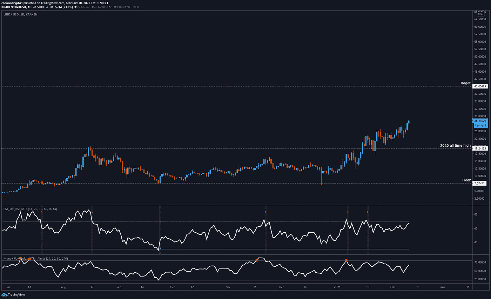
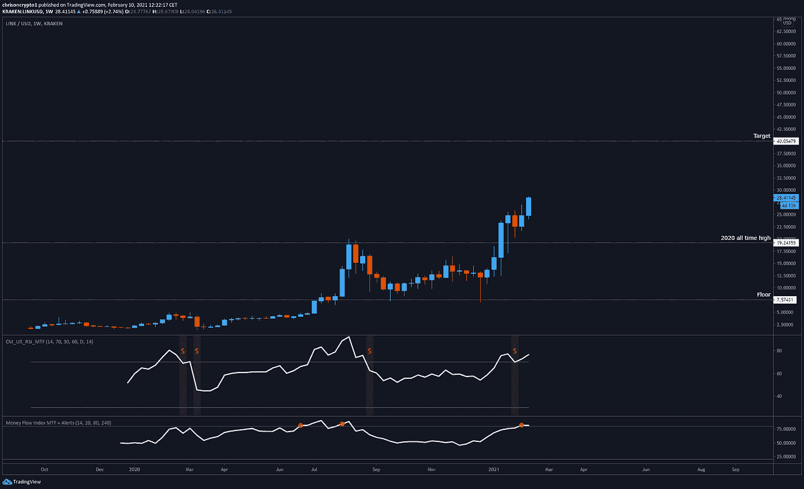

# 芝加哥商品交易所期货推出后，以太坊首次触及 1800 美元

> 原文：<https://medium.com/coinmonks/ethereum-hits-1800-for-the-first-time-after-cme-futures-launch-ce9fe38d4598?source=collection_archive---------1----------------------->

以太坊 CME 期货的推出并没有产生看跌的投资者所警告的效果。相反，随着比特币、以太坊和替代币的兴起，整个加密货币领域创造了新的历史新高。

让我们开始吃吧。

## 芝加哥商业交易所期货推出后，以太坊首次触及 1800 美元

就在芝加哥商品交易所推出以太坊期货产品的一天后，以太坊的价格在周二创下新纪录。

在整合之前，加密指数上涨至 1，850 美元，在 24 小时内从高峰到低谷上涨了 8%。这一表现恰逢比特币价格创下新纪录，此前特斯拉[透露](https://chrisoncrypto.com/blog/f/tesla-buys-15-billion-in-bitcoin)15 亿美元的比特币投资，增加了主流加密技术的采用势头。

根据 [coinmarketcap](https://coinmarketcap.com/headlines/news/cme-eth-futures-contracts-launch-first-day/) 的数据，在交易的第一天，CME 交易了 400 份乙醚期货合约，相当于大约 19400 份乙醚或 3300 万美元。

在 CME 期货推出之前，许多人猜测上市后 ETH 价格下跌的可能性——引用 BTC 期货上市标志着 2017 年牛市的顶部。

然而，这样的倾销并没有发生，根据以太坊的历史高点和不同的情况，这种猜测似乎不太可能有结果。事实上，与当时相比，市场在结构上有所不同，自上一轮周期以来，机构投资者对 crypto 的态度已经发生了根本变化。

截至今天，投资者仍然没有多少方法可以轻松接触以太坊。随着瑞士联邦理工学院芝加哥商品交易所期货的推出，这种情况可能会改变，这可能会给这场熊熊大火火上浇油。

# 技术上来说

## Altcoins 起飞；下一个是林克吗？

无论是[任](https://www.tradingview.com/x/0CxZRQ3r/)、 [LTC](https://www.tradingview.com/x/fJ5Kxy9i/) 、 [COMP](https://www.tradingview.com/x/ipvVnCGD/) 、 [ADA](https://www.tradingview.com/x/rLfLbRSt/) 甚至是[FIL](https://www.tradingview.com/x/lYaffaBi/),[电报频道](https://t.me/chrisoncryptochannel)报道过的每一个山寨币都是正式的盈利交易，而文件币是最终表现落后的投资组合。这标志着简单购买和持有这些加密货币的利润率达到 100%。

也就是说，绝对没有理由固步自封。

在最初出版时，LINK 的交易价格接近 28 美元。不像其他的替代硬币已经走上抛物线，代币仍有增长空间。

每日时间框架上的相对强弱指数(RSI)仍处于看涨区域，卖出信号尚未闪现，因为硬币交易于前 20 美元的历史高点之上。

然而，当缩小周线时间框架时，情况发生了巨大的变化，揭示了一个正在发展的周线熊市背离(这还有待证实)。

2 月可能是加密空间巩固其万亿美元市值之前的“最后一次欢呼”，还是失控的价格会在 Q1 结束之前将这次登月任务带入一个令人兴奋的范式？

在后一种情况下，这个故事不太可能有一个美好的结局。

时间会证明一切。

下次再见。

**加入** [**电报**](https://t.me/chrisoncryptochannel) **频道进行实时更新！
关注我的** [**多嘴多舌**](https://gab.com/chrisoncrypto) **和下面我的社交门户。**

[https://www.paypal.com/donate?hosted_button_id=C9VRLGTBHQX2N](https://www.paypal.com/donate?hosted_button_id=C9VRLGTBHQX2N)

[https://chrisoncrypto.com/blog/f/mastercard-announced-plans-to-support-cryptocurrencies-in-2021](https://chrisoncrypto.com/blog/f/mastercard-announced-plans-to-support-cryptocurrencies-in-2021)

[https://chrisoncrypto.com](https://chrisoncrypto.com)

你也可以用比特币支持我！
**BTC** 地址:**3 eydseypjhn 68 axkncuqbb 7 ebqcxrejamr**

最诚挚的问候，

**克里斯托·阿塔尔德**克里斯托·阿塔尔德
克里斯托·阿塔尔德
克里斯托·阿塔尔德[www.cityam.com](https://www.cityam.com)阿塔尔德
直接接通:[电报](https://t.me/chrisoncrypto)

*原发布于*[*https://mailchi . MP*](https://mailchi.mp/a66bea7b0c2d/ethereum-hits-1800-for-the-first-time-after-cme-futures-launch?e=[UNIQID])*。*