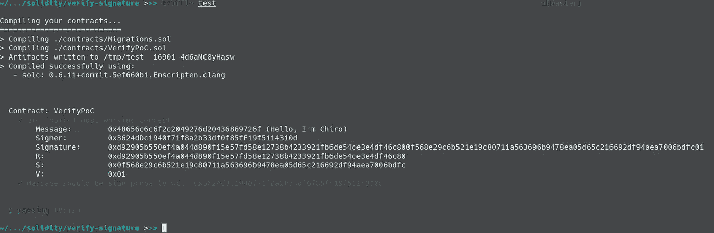

# 以太坊:提高消息验证的可靠性

> 原文：<https://medium.com/coinmonks/ethereum-improve-message-verification-in-solidity-f657091932d1?source=collection_archive---------1----------------------->

**我看了这篇文章，** [**签名:在 Solidity 中验证消息**](https://blog.ricmoo.com/verifying-messages-in-solidity-50a94f82b2ca) **。这是一篇很好的文章，但是这段代码让我不舒服。这太浪费和肮脏，然后我实现我的，所以你可以做比较。**

# 以太坊中的消息签名

以太坊上几乎所有的信息都是用给定的格式签名的:

```
"\x19Ethereum Signed Message:\n" + message.length + messageE.g: “\x19Ethereum Signed Message:\n16Hello, I’m Chiro”
```

这个前缀`"\x19Ethereum Signed Message:\n"`用于确保签名的消息不会在其他地方被**【重用】**。

# 改进

如您所见，唯一阻止我们归档 onchain 验证的是`message.length`。你需要将一个数字编码成字符串，这里有 [RicMoo](https://medium.com/u/889387e95e0b?source=post_page-----f657091932d1--------------------------------) 的代码:

基本概念可以简化为:

```
function uintToStr(value) {
  let result = [];
  for (let i = value; i > 0; i = (i / 10) >>> 0) {
    result.push(String.fromCharCode((i % 10) + 0x30));
  }
  return result.reverse().join('');
}
```

基数是`10`，所以我们需要对`10`取模来得到数字，并将结果与`0x30`相加来得到它的 ASCII 码。

```
E.g:
123 % 10 = 3
3 + 0x30 = 0x33 (ASCII of “3”)
```

以下是我不带占位符的实现:

`truffle test`的结果:



Test result

结果和完整代码可以在这里找到:

[](https://github.com/chiro-hiro/examples/blob/master/solidity/verify-signature/) [## chiro-Hiro/示例

### 我读了这篇文章，签名:验证消息的可靠性。这是一篇很好的文章，但是这段代码让我…

github.com](https://github.com/chiro-hiro/examples/blob/master/solidity/verify-signature/) 

# 结论

*   我的实施成本`5846 Gas`、 [RicMoo](https://medium.com/u/889387e95e0b?source=post_page-----f657091932d1--------------------------------) 的实施成本`6440 Gas`
*   验证序列化签名成本的新功能`6160 Gas`
*   理论上，它可以验证长度等于 10 -1 的消息

## 另外，阅读

*   最好的[密码交易机器人](/coinmonks/crypto-trading-bot-c2ffce8acb2a)
*   [密码本交易平台](/coinmonks/top-10-crypto-copy-trading-platforms-for-beginners-d0c37c7d698c)
*   最好的[加密税务软件](/coinmonks/best-crypto-tax-tool-for-my-money-72d4b430816b)
*   [最佳加密交易平台](/coinmonks/the-best-crypto-trading-platforms-in-2020-the-definitive-guide-updated-c72f8b874555)
*   最佳[加密贷款平台](/coinmonks/top-5-crypto-lending-platforms-in-2020-that-you-need-to-know-a1b675cec3fa)
*   [最佳区块链分析工具](https://bitquery.io/blog/best-blockchain-analysis-tools-and-software)
*   [加密套利](/coinmonks/crypto-arbitrage-guide-how-to-make-money-as-a-beginner-62bfe5c868f6)指南:新手如何赚钱
*   最佳[加密制图工具](/coinmonks/what-are-the-best-charting-platforms-for-cryptocurrency-trading-85aade584d80)
*   [莱杰 vs 特雷佐](/coinmonks/ledger-vs-trezor-best-hardware-wallet-to-secure-cryptocurrency-22c7a3fd391e)
*   了解比特币的[最佳书籍有哪些？](/coinmonks/what-are-the-best-books-to-learn-bitcoin-409aeb9aff4b)
*   [3 商业评论](/coinmonks/3commas-review-an-excellent-crypto-trading-bot-2020-1313a58bec92)
*   [AAX 交易所评论](/coinmonks/aax-exchange-review-2021-67c5ea09330c) |推荐代码、交易费用、利弊
*   [Deribit 审查](/coinmonks/deribit-review-options-fees-apis-and-testnet-2ca16c4bbdb2) |选项、费用、API 和 Testnet
*   [FTX 密码交易所评论](/coinmonks/ftx-crypto-exchange-review-53664ac1198f)
*   [n 零审核](/coinmonks/ngrave-zero-review-c465cf8307fc)
*   [比特交换评论](/coinmonks/bybit-exchange-review-dbd570019b71)
*   [3Commas vs Cryptohopper](/coinmonks/cryptohopper-vs-3commas-vs-shrimpy-a2c16095b8fe)
*   最好的比特币[硬件钱包](/coinmonks/the-best-cryptocurrency-hardware-wallets-of-2020-e28b1c124069?source=friends_link&sk=324dd9ff8556ab578d71e7ad7658ad7c)
*   最佳 [monero 钱包](https://blog.coincodecap.com/best-monero-wallets)
*   [莱杰纳米 s vs x](https://blog.coincodecap.com/ledger-nano-s-vs-x)
*   [bits gap vs 3 commas vs quad ency](https://blog.coincodecap.com/bitsgap-3commas-quadency)
*   [莱杰纳米 S vs 特雷佐 one vs 特雷佐 T vs 莱杰纳米 X](https://blog.coincodecap.com/ledger-nano-s-vs-trezor-one-ledger-nano-x-trezor-t)
*   [block fi vs Celsius](/coinmonks/blockfi-vs-celsius-vs-hodlnaut-8a1cc8c26630)vs Hodlnaut
*   Bitsgap 评论——一个轻松赚钱的加密交易机器人
*   [第四次审查](/coinmonks/quadency-review-a-crypto-trading-automation-platform-3068eaa374e1)——一个为专业人士设计的秘密交易机器人
*   [PrimeXBT Review](/coinmonks/primexbt-review-88e0815be858) |杠杆交易、费用和契约
*   [埃利帕尔泰坦评论](/coinmonks/ellipal-titan-review-85e9071dd029)
*   [SecuX 石材审核](https://blog.coincodecap.com/secux-stone-hardware-wallet-review)
*   [BlockFi Review](/coinmonks/blockfi-review-53096053c097) |获取高达 8.6%的加密利息