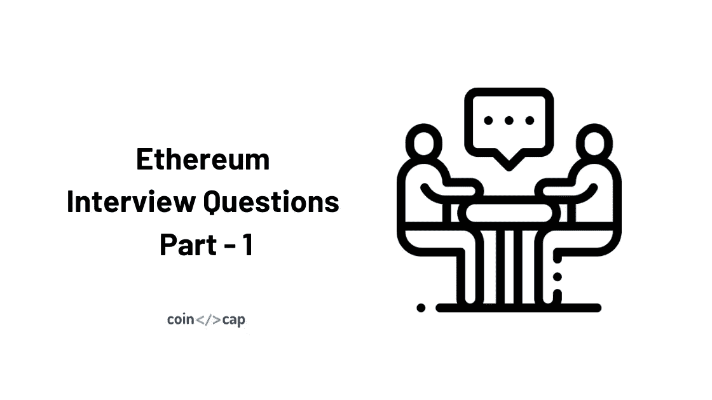
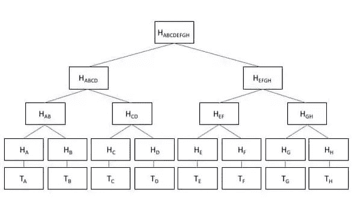

# 以太坊面试问题—第一部分

> 原文：<https://medium.com/coinmonks/ethereum-interview-questions-part-1-99cfc959526e?source=collection_archive---------4----------------------->

## 什么是状态机？以太坊为什么叫状态机？

**状态机**指的是根据输入从一个状态到另一个状态进行事务处理的东西。

当节点进行事务处理时，当前状态转换到某个最终状态。在任何时间点，这个最终状态都代表以太坊的当前状态。

## 什么是 Merkle 树？默克尔树在区块链有什么重要性？以太坊如何实现 Merkle 树？

从最一般的意义上来说，Merkle 树是一种将大量数据“块”散列在一起的方式，它依赖于将块分割成许多桶，其中每个桶仅包含几个块。然后取每个桶的散列并重复相同的过程，继续这样做，直到剩余的散列总数变成只有一个:根散列(Merkle Root)。

二进制 Merkle 树如下所示:

Binary Merkle tree

Merkle 根很重要，因为它总结了块中的每个事务，并且位于块头上。如果块中存储的事务有任何恶意更改，Merkle 根也会更改。这使得验证块内是否发生了事务变得更加容易。

以太坊区块链使用基本 Merkle 树的修改版本，它实际上被称为 Merkle Patricia 树、Patricia 树或 Patricia Trie。

每个以太坊块头有三棵 Merkle 树。

1.  处理
2.  状态
3.  收据(本质上，显示每笔交易的*效应*的数据)

第一个是块上事务的根，第二个是显示以太网状态的根，第三个是收据根。

以太坊的全局状态由帐户地址和帐户状态之间的映射组成。该映射存储在 Merkle Patricia 树中。在这种数据结构中，数据以键值对的形式存储。以太坊中的状态是不同的，正如 Vitalik Buterin 所解释的，这是一个键值映射。密钥是帐户的地址，值是随机数、帐户余额、代码和存储。

## gas 参数如何从攻击者手中拯救系统？

让我们考虑这样一种情况，攻击者想要通过运行一个包含无限循环的智能契约来停止以太坊网络。如果没有 gas 参数，每个节点都将执行无限循环，最终导致网络崩溃。

算上气体参数，如果攻击者运行这样一个[智能合同](https://blog.coincodecap.com/tag/smart-contact/)，他也必须附加等量的气体，即乙醚。因此，这只会导致攻击者的损失，因为他最终会耗尽汽油，执行将在那一刻停止。这就是气体参数如何从攻击者手中拯救以太坊网络。

气体是以太，是网络的加密货币。

## 合同代码在哪里执行？

当挖掘节点在其生成的块中包含事务时，将执行智能协定。相关气体充当运行智能合同的燃料。如果天然气价格足以运行合同，则智能合同所指示的状态转换和相关交易被包括在块中，然后在网络中广播。如果气体不足，它会抛出一个错误。然后，当其他节点将该块包含在本地以太网中时，智能合约代码将由它们运行。

## 什么是道，它是如何运作的？

[分散自治组织](https://github.com/ethereum/wiki/wiki/White-Paper#decentralized-autonomous-organizations)是由透明智能契约中编码的规则表示的组织，由股东或董事会控制。

对于某些强制执行的行为，无论是转移资金还是修改基本代码，都应该得到至少三分之二成员的同意。分配一个道的资金的方法可以从奖金、工资、内部货币到奖励工作。

## 什么幽灵协议？它在以太坊解决什么问题？

GHOST(贪婪的最重观察子树)协议挑选在其上进行了最多计算的路径。

GHOST 通过不仅包括块的父块和更远的祖先块，而且包括陈旧的块(称为叔叔块),来将哪个链是“最长的”计算包括在内，从而解决了网络安全损失的问题。

## 说出账户状态的 4 个组成部分？

**nonce** :对于一个外部拥有的账户，这个数字代表从账户地址发送的交易数量。对于合约账户，现时是账户创建的合约数量。

**余额**:该地址拥有的卫数。

**storage root**:Merkle Patricia 树的根节点的散列。此树编码此帐户存储内容的散列，默认情况下为空。

**codeHash** :该账户 EVM 码的哈希。对于合约帐户，这是经过哈希处理并存储为 codeHash 的代码。对于外部拥有的帐户，codeHash 字段是空字符串的散列。

## 以太坊中交易的签名和验证是如何进行的？

私钥和交易数据一起用于签署交易。事务中的 ECDSA 签名由三个参数 r、s 和 v 组成。以太坊客户端提供了一个全局方法，在给定这三个参数的情况下返回一个地址。如果返回的地址与签名者的地址相同，则签名有效。

## 难度的重要性是什么？

块的“难度”用于在验证块所花费的时间上加强一致性。如果某个块比前一个块验证得更快，以太坊协议会增加该块的难度。如果块验证比前一个块花费更多的时间，以太坊协议会降低该块的难度。

## 什么是固有气体值？

天然气内在价值给出了天然气费用的估计成本。因此，交易的 gas 限制必须等于或大于固有 gas。固有气体包括-

1.  执行交易的预定义成本为 21，000 汽油
2.  与交易一起发送的数据的气体费用(等于零的数据或代码的每个字节为 4 气体，数据或代码的每个非零字节为 68 气体)
3.  如果交易是合同创造，额外的 32，000 天然气

## 以太坊中账号 nonce 的重要性是什么？

账户随机数是每个账户中的交易计数器。它用于防止重放攻击，即在一个区块链上进行交易，并恶意或欺骗性地重复交易。

## 什么是国家频道？

状态通道用于扩展以太坊区块链，并通过将链上组件移至链下来降低小额支付的成本。这可以避免与微支付相关的延迟和费用。这类似于比特币中的闪电网。状态通道中的参与者传递加密签名的消息，而不将它们发布到主链，直到他们都决定关闭通道。

## 什么是密语协议？

Whisper 是建立在以太网上的 Dapps 的对等通信协议。它为 Dapps 提供了一个注重隐私的加密消息系统。[密语协议](https://github.com/ethereum/wiki/wiki/Whisper)的属性-

*原载于 2020 年 5 月 19 日***。**

> *[直接在您的收件箱中获得最佳软件交易](https://coincodecap.com/?utm_source=coinmonks)*

**