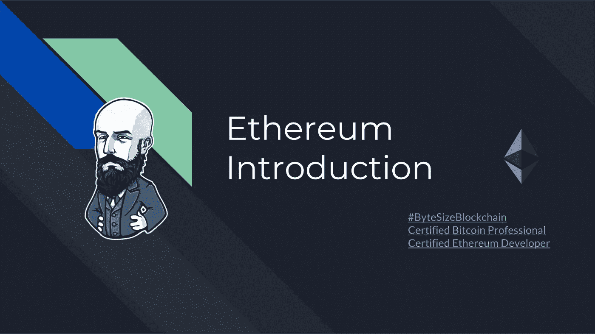
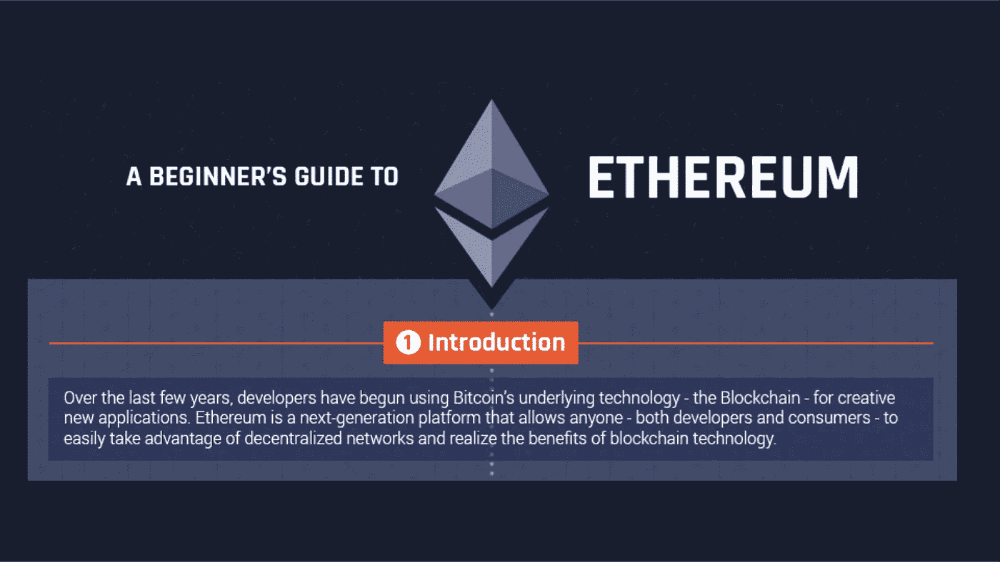
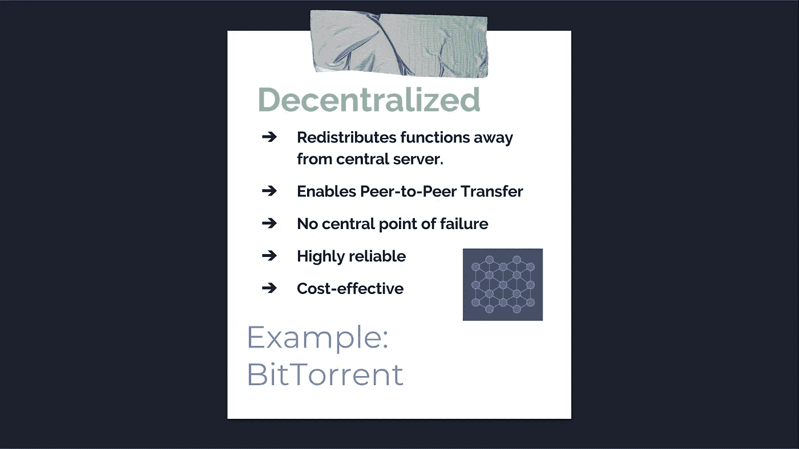
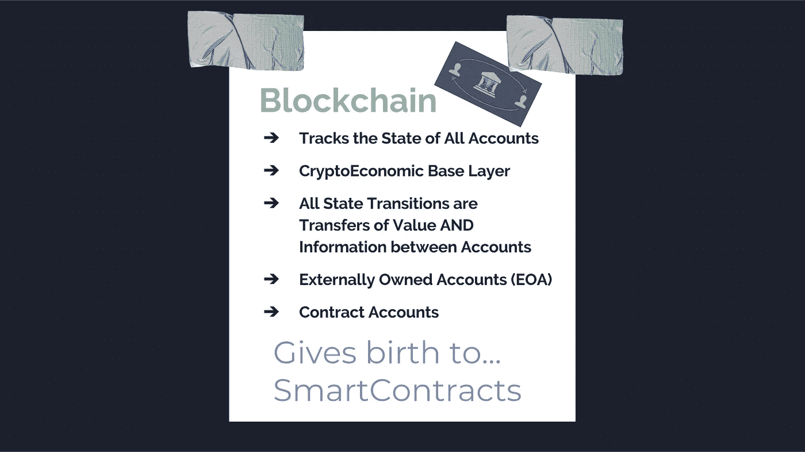
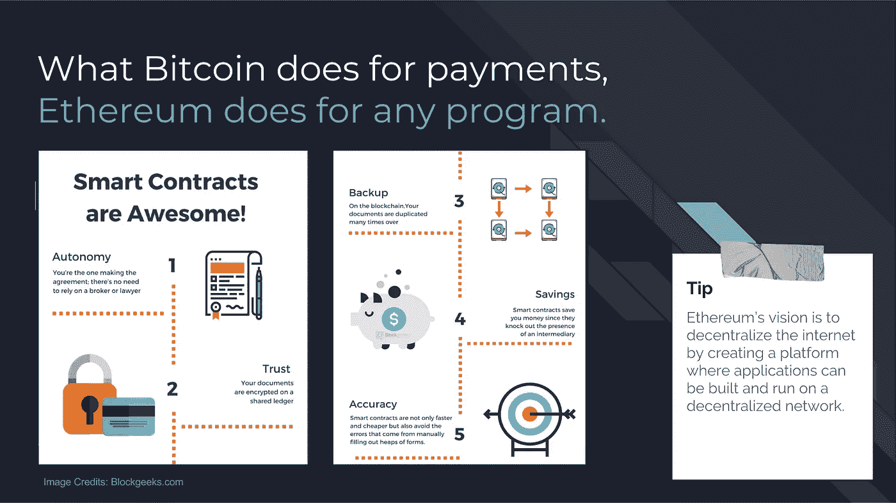
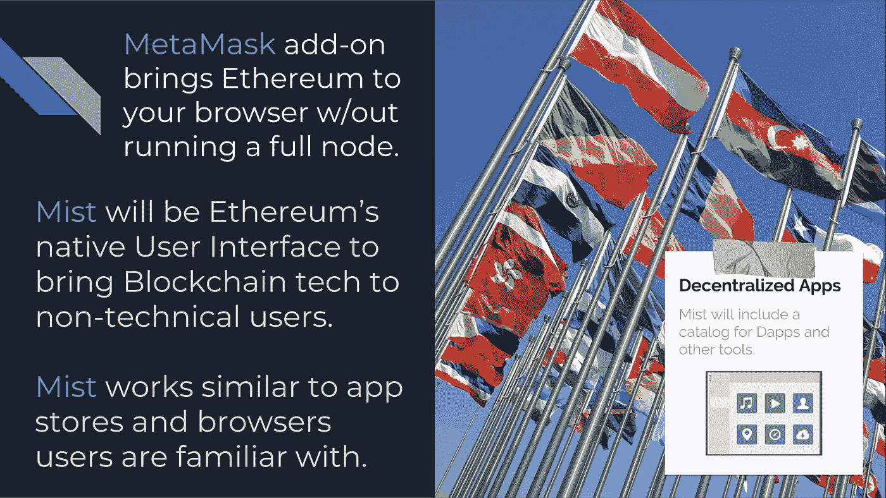
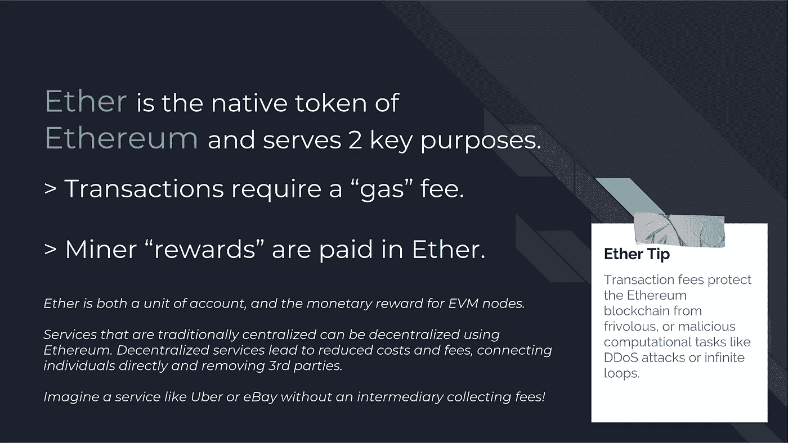
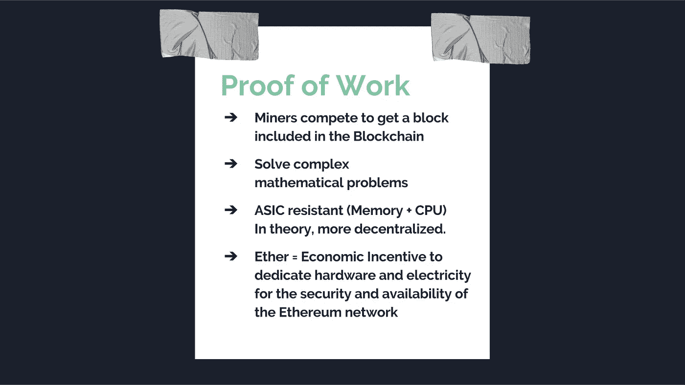
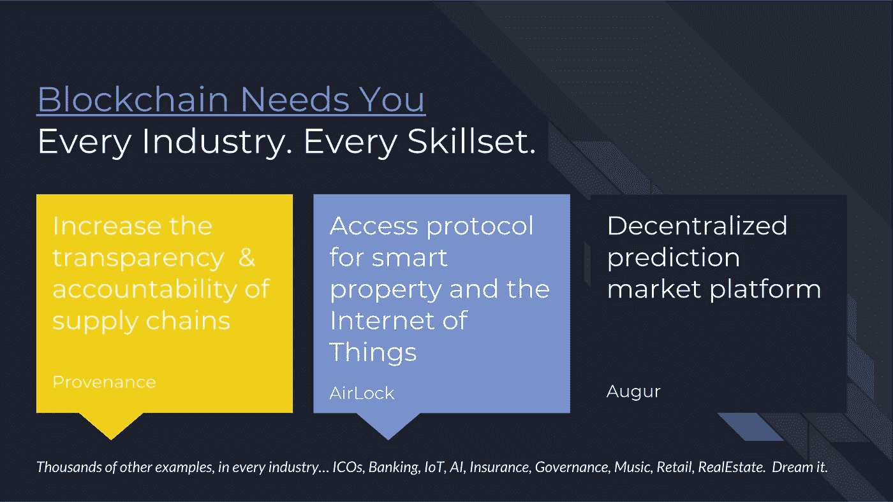

# 以太坊游戏攻略

> 原文：<https://medium.com/coinmonks/ethereum-introduction-bbf7299cf1?source=collection_archive---------0----------------------->

*丹·埃蒙斯是* [*埃蒙斯皮雷有限责任公司*](http://www.emmonspired.com/) *的所有者，一名* [*认证比特币专业人士*](https://cryptoconsortium.org/lookup/6f0d14) *，认证以太坊开发者，全栈开发者和加密货币项目顾问。他还是一个名为*[*ByteSizeBlockchain*](https://www.youtube.com/watch?v=SVBZ7mdgGcA)*的 Youtube 频道和 iTunes 播客的创作者。*

> [直接在您的收件箱中获得最佳软件交易](https://coincodecap.com/?utm_source=coinmonks)

