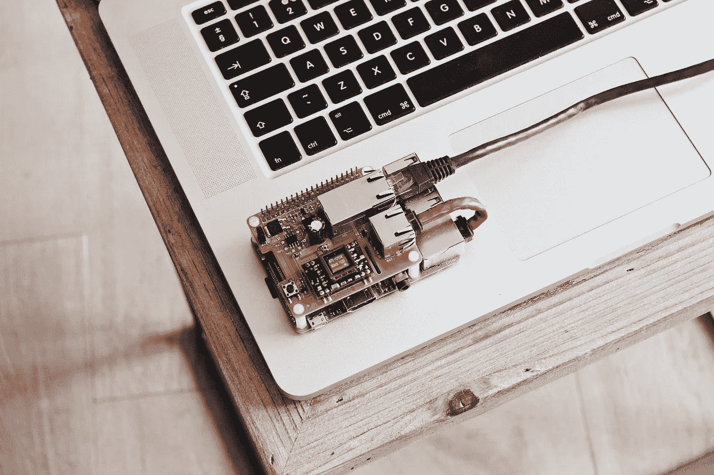

# 以太坊 IOT 儿童接地装置四:Arduino &回顾

> 原文：<https://medium.com/coinmonks/ethereum-iot-kid-grounding-device-iv-arduino-in-retrospect-b7a32e5ec185?source=collection_archive---------5----------------------->

Photo by [Louis Reed](https://unsplash.com/photos/zDxlNcdUzxk?utm_source=unsplash&utm_medium=referral&utm_content=creditCopyText) on [Unsplash](https://unsplash.com/search/photos/iot?utm_source=unsplash&utm_medium=referral&utm_content=creditCopyText)

这是以太坊 IOT 儿童接地装置项目的第四部分，也是最后一部分。在这一部分，我将重点描述每当孩子移动时，将 PIR 传感器放在一起写入以太坊区块链的过程。我还将讨论我对这个项目的想法，解释它的不足之处，以及如何在下一次迭代中做得更好。