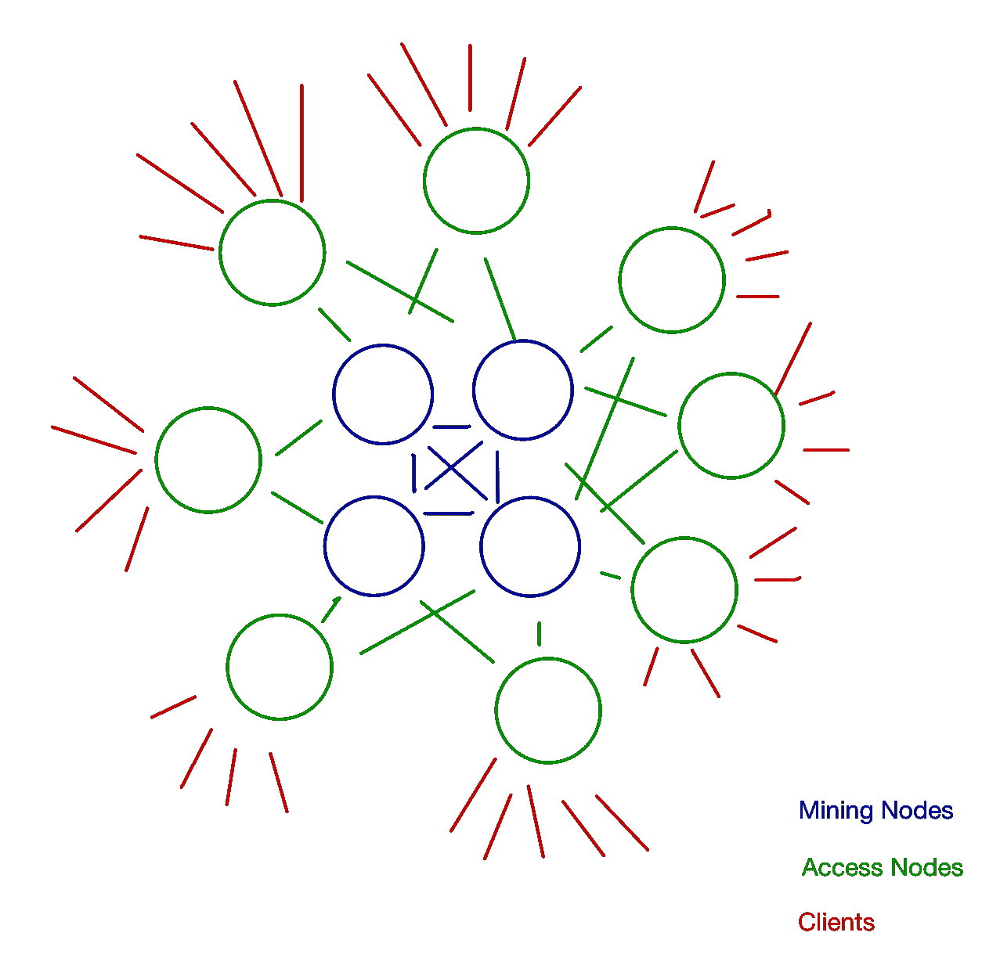

# 以太坊不仅仅是智能合约

> 原文：<https://medium.com/coinmonks/ethereum-is-about-so-much-more-than-smart-contracts-79d1af581d72?source=collection_archive---------7----------------------->

以太坊通常被称为总部位于区块链的智能合约平台，虽然这是正确的，但这大大低估了以太坊的能力，它的最终命运很可能超越 T2 的智能合约。在这篇文章中，我想说的是，按如下方式思考以太坊通常更有用:

> 以太坊是一个分布式和复制的运行时，可以运行任意代码，并带有强大的认证机制

或者，考虑到以太坊运行时不是特别强大，更适合在数据上运行一些小的处理，我们可以使用一个吸引人的名字**智能(复制)数据**。

# 以太坊和固体简介

那么以太坊是什么？基本上，它是运行以太坊字节码的以太坊虚拟机(“EVM”)和分布式、复制的、基于区块链的执行环境的组合，以太坊虚拟机就像 Java 虚拟机运行 Java 字节码一样，执行环境确保代码执行的某些属性，特别是不可能重写历史:虚拟机的状态可以改变，但过去的状态历史总是被保留。

从设计的角度来看，Ethereum 就像 ORM 一样，在现代 web 开发框架中的*模型*层封装数据库访问:不是允许直接访问底层数据，而是将所有内容封装到对象中，分别使用*getter*和*setter*来读取和写入数据，但也在模型中实现了更高级的逻辑，例如确保数据约束和一致性得以保留。

我想举一个简单的例子来说明这在实践中是如何运作的。这个例子使用以太坊的*映射*数据类型，这是一个集成到平台中的键/值存储，也是它的主要数据库结构。代码示例是用 Solidity 编写的，Solidity 对于 EVM 来说就像 Java 对于 JVM 一样:是平台的主要编程语言。在 Solidity 中，在其他编程语言中通常被称为*对象*的东西被称为*契约*。在本例中，我们定义了一个名为 *DataWrapper* 的契约，它包含一个键/值存储库 *values* ，该存储库将一个 256 位值与以太坊地址相关联。

```
contract DataWrapper {
    mapping(address => uint256) values;
    ...
}
```

为了读取与给定地址相关的值，我们可以使用下面的 getter，它必须在契约中定义

```
function getValue(address _addr) public view returns (uint 256 value) {
    return values[_addr];
}
```

而且，如果我们想允许直接设置这个值，我们应该使用这样的代码

```
function setValue(address _addr, uint256 _value) public {
    values[_addr] = _value;
}
```

有趣的是，我们可以限制这些数据的用途。例如，我们可以限制来自某个*所有者*地址的请求的写访问

```
address owner;
...
function setValue(address _addr, uint256 _value) public
    require (msg.sender == owner);
    values[_addr] = _value;
}
```

或者某一组地址

```
mapping (address => bool) isAuthorised;
...
function setValue(address _addr, uint256 _value) public
    require (isAuthorised[msg.sender]); 
    values[_addr] = _value;
}
```

真正有趣的地方是当授权被委托给另一个合同时。在下面的例子中， *authContract* 是类型为 *authContractType* 的契约，它已经被部署在以太坊上，代码片段可以调用它来检查调用者是否是授权人员组的一部分

```
authContractType authContract;
...
function setValue(address _addr, uint256 _value) public
    require (authContract.isAuthorised(msg.sender));
    values[_addr] = _value;
}
```

这不是一个关于如何在 Solidity 中编程的教程，所以我将在这里停下来，但对我来说，引入一些概念是很重要的，这些概念使我下面要讨论的内容更容易理解。

# 对 Web3 和元掩码的更简短的介绍

在我更详细地讨论区块链如何在企业环境中有用之前，我需要再讨论一组话题，即 Web3、浏览器和元掩码。Web3 是一个 JavaScript 框架，它公开了提供 API 的同名对象，任何其他 JavaScript 代码(例如浏览器中的代码)都可以使用该 API 与以太坊区块链进行交互。特别是，Web3 对象抽象出了实际的以太坊 API 调用，因为每个实例化的 Web3 对象都绑定到一个特定的链。此外，Web3 对象负责密钥管理——尤其是*私钥管理*和安全性——因此应用程序代码不必处理链交互的这一安全关键部分，更重要的是，永远不会访问私钥。

MetaMask 是一个浏览器插件，它将 Web3 对象暴露给浏览器显示的每个页面。大多数页面都会忽略这个对象，但是想要与基于以太坊的区块链交互的页面可以通过 MetaMask 的 Web3 对象来实现。每当一个操作需要一个私有密钥时，这个密钥只应用于插件内部的请求，或者甚至可能应用于相关的硬件设备，如 *LedgerWallet* 。

以下代码片段使用参数 *myParameters* 调用地址为 *contractAddress* 的契约上的方法 *myMethod* ，该方法具有 ABI *contractAbi* 。呼叫者地址——因此也是支付汽油费用的地址——是 Web3 对象中的第一个地址。

```
const contract      = new web3.eth.Contract(contractAbi, contractAddress);
const myAccount     = web3.eth.accounts[0];
const gas           = await contract.methods.myMethod(myParameters).estimateGas({
                                       from: myAccount});
const response      = await contract.methods.myMethod(myParameters).send({
                                       from: myAccount, gas: gas});
```

当在浏览器中执行这段代码时，MetaMask 将与用户交互，请求权限，如果已经授予权限，则将请求转发到最近的节点。

# 构建基于区块链的单点登录系统

在许多 IT 服务都是通过基于浏览器的界面提供的企业环境中，Web3 和 Metamask 的结合非常有趣。例如，如下所述，我们可以在以太坊上构建一个单点登录系统，作为验证公司所有 web 服务的基础。

# 固定用户地址

为了简单起见，我们首先假设我们想要针对一个 web 服务对一个用户进行身份验证，这个 web 服务既可以运行在公司的内部网上，也可以公开地运行在互联网上，这并不重要。让我们进一步假设，在用户被认证之后，我们对一些基于令牌的机制感到满意，所以我们想要做的就是用一些基于 Web3/Metamask 的过程来替换“请输入您的用户名和密码”对话框。

目前，我们假设每个用户都有一个以太坊地址，服务器有一个用户和相关地址的列表，并且用户通过证明他们知道各自的私钥来声明他们的身份。处理这种情况的一种方法是下面的认证对话:

1.  服务器为用户提供随机身份验证随机数
2.  用户用私钥签署 nonce，并向服务器返回*(签名，地址)*
3.  服务器断言随机数、签名和地址是一致的
4.  服务器返回将用户标识为与所提供的地址相关联的用户的令牌

上面的第 2 步——用用户的私钥对 nonce 进行签名——是在 MetaMask 中执行的，可能会与一些外部密钥托管设备进行交互。

通过这个非常简单的模型，我们可以得出两个结论:

*   我们没有使用区块链——我们所做的只是利用了这样一个事实，即知道与以太坊地址相关联的私钥允许发布数字签名
*   我们所有的 web 服务都必须能够访问一个表，这个表将以太坊地址与用户身份相关联，并且在大多数情况下还与那些身份相关联的特定角色和权限相关联

每个 web 服务都必须维护自己的关联用户和地址的表，这似乎是次优的，并且容易出错，所以我们可能需要一些数据库来为我们做这种关联。原来以太坊区块链是一个数据库，那么如果…drumroll…我们用以太坊做这个呢？

# 使用以太坊将地址与用户身份相关联

现在让我们假设有一家公司使用一个简单的数字系统来标识员工:第一个员工的数字是 1，第二个员工的数字是 2，依此类推，员工的数字永远不会被重用。记住第一部分的代码片段，在 Solidity 中，我们可以使用映射将地址与员工编号关联起来

```
mapping(address => uint) userIdbyAddress;
```

如果我们想知道给定用户的地址是什么，我们可能还需要反向映射

```
mapping(uint => address) AddressbyUserID;
```

setter 函数将同时设置这两个参数

```
function associate(address _addr, uint _userID) public
    require (authContract.isAuthorisedToAssociateAddresses(msg.sender));
    userIdbyAddress[_addr]      = _userID;
    AddressbyUserID[_userID]    = _addr;
}
```

当用户离开公司时，我们可能也需要相应的分离功能

```
function terminate(_userID) public
    require (authContract.isAuthorisedToTerminate(msg.sender));
    address addr = AddressbyUserID[_userID];
    AddressbyUserID[_userID]    = address ("0x0");
    userIdbyAddress[addr]       = 0;
}
```

请注意对 *authContract* 的调用，以确保执行这些操作的任何人实际上都有权这样做。

原则上，我们的 web 服务可以自己处理签名的验证，但是正如我们上面讨论的，以太坊上的数据是*智能数据*，所以这些操作可以在 chain 上执行。例如，我们可以在契约上有以下帮助函数，它也进行地址和用户之间的关联(注意，代码不是真正可靠的代码，因为处理签名实际上稍微复杂一些)

```
function sign_nonce(uint _nonce) public view returns (signature sig){
    return signature(_nonce, msg.sender)
}function verify_nonce_signature(uint _userID, uint _nonce, signature _sig)
                                    public view returns (bool verifiedCorrectly){
    address addr = AddressbyUserID[_userID];
    return verify_signature(_nonce, _sig, addr);
}
```

在这种情况下，页面上的代码将包含以下代码片段

```
const c           = new web3.eth.Contract(contractAbi, contractAddress);
const addr        = web3.eth.accounts[0];
const signature   = await c.methods.sign_nonce(nonce).send({from: addr, gas: gas});
const token       = await convert_signed_nonce_to_token(signature, addr)
```

其中*convert _ signed _ nonce _ to _ token*将是向服务器发送签名和地址的函数，然后服务器调用 *verify_nonce_signature* ，如果满足，则返回访问令牌。

有一件事我在上面没有提到，但在这里很重要，那就是*视图*功能——不改变链状态的功能——可以在(a)本地节点上执行，而不必广播到整个网络，以及(b)不消耗汽油，所以只要本地节点足够反应迅速，这些操作就足够快，不会对用户体验产生负面影响。

# 但是我们真的想在公共区块链上运行这个吗？

房间里的大象是不是在以太坊主链上建造这一切是一个好主意。这方面的一些考虑:

1.  如果每个人都开始以这种方式使用以太坊，它是否能够以合理的成本提供足够的计算能力，或者它是否会变得非常慢和/或运行起来过于昂贵？
2.  假设吞吐量足够(第 1 点。)，延迟对于我们希望使用它的应用程序来说是可接受的吗？
3.  企业希望自己的部分私人数据对全世界都是可读的吗，即便是以匿名、模糊、删节或加密的形式？

不同的公司会做出不同的选择，但对他们中的许多人来说，至少对上述一些问题的答案是“不”。让我们轮流得分。至于(1)，很明显，以太坊(其中每个挖掘节点必须执行每个计算)在当前形式下不是特别可扩展的。它也不是特别节能，因为它依赖于工作证明。引入分片和转向证据可能会改变这一点，但是否有可能在一台大规模复制的世界计算机上运行世界上所有的计算，仍然没有定论。

第(2)点是相关的:上面的例子表明，在某些情况下，公司可以控制延迟，例如通过运行足够的非挖掘节点，这些节点可以评估非状态改变的“视图”调用，而不必转到主链。然而，一旦涉及到状态变化，这就不再可能了:等待时间取决于交易被包括在开采区块中所花费的时间，而这主要取决于公司愿意支付的天然气价格。由于在高需求时期只有有限的输送量，即使平均输送量足以满足该链的所有用户，天然气价格也可能上升到所有合理的限度之外。

第(3)点最后限制了什么功能可以放在链上。即使是一个简单的 SSO 系统也可能向竞争对手泄露重要信息，例如雇佣和解雇了多少人，如果像特定权限这样的事情也在 chain 上管理，还可能在内部晋升或调动。

对于我们的 SSO 系统，几乎可以肯定，不同的链操作模型将是最佳的，特别是只有几个挖掘节点的私有授权证明链，以及围绕它们的足够多的非挖掘节点环，这允许最大的吞吐量和非状态改变请求的最小延迟。在这种情况下，授权证明仅仅意味着存在某种中央机构来决定哪些节点参与网络，以及它们具有哪些角色。

更具体地说，该系统可能包括

*   3–5 个高性能挖掘节点(蓝色)，位于不同的数据中心和不同的区域，以主导节点/后备模式或确定性或随机性、基于等待时间的循环模式运行
*   足够多的非挖掘节点(绿色)，位于用户附近，以便以最小的延迟处理读取请求
*   连接正在运行的元掩码的用户连接到他们的本地非挖掘节点(红色)，并且可能有一个辅助回退节点来提高可靠性



A private-chain proof-of-authority network topology

还将有一个经典的非分布式计算平台来处理大多数请求，这些请求要么需要访问机密数据，要么需要在复制系统中无法有效提供的计算能力。

# 结论

如果你一路走到这一步，恭喜你。当我开始写这篇文章时，我不想让它变得太专业，但是当我写这篇文章时，我觉得非常具体是很重要的，这样很明显，在以太坊上构建 SSO 系统实际上非常容易，并且基本上只需要几百行代码，并且私有授权证明链的系统设计和资源强度与传统的非复制系统没有显著不同。

我们已经看到，使用 Ethereum / Web3 / MetaMask 技术实现 SSO 系统非常简单，并且与当今企业 IT 通常分布中央 IT 的方式(即使用浏览器)配合得非常好。我们还看到，使用公共以太坊区块链可能不是该特定用例的最佳系统架构，私有的授权证明链可能更好。如果这是理想的解决方案，那么在公司自己的服务器上建立这样一个链是相对容易的，但是也有许多供应商能够为他们的客户运行区块链即服务系统，包括在 Azure 上几乎是一键安装，而不必显式地委托任何服务器。

最终选择系统架构总是一种权衡，权衡各种架构选择的优缺点，因此在结束之前，我想从多个方面比较一下基于区块链的私有单点登录解决方案和标准集中式单点登录解决方案:

**安全。基于区块链的系统的安全性可能会更好，特别是如果使用保存私钥的硬件设备。即使在本地级别有密码，它们也不会通过网络传输(当然密钥也不会)，因此即使是完全受损的后端也不允许攻击者冒充用户的身份。在基于密码的系统中，如果用户的本地环境遭到破坏，那么他的安全性就完全被破坏了，除非使用某种穷人的零知识技术(“请提供密码的字符 2、3 和 5”)或双因素认证。这同样适用于基于区块链的系统，其中密钥保存在系统本身中。然而，如果密钥保存在外部设备上，那么即使是完全受损的系统也只允许在该系统上冒充该用户，并且只有当用户能够被诱骗执行解锁外部设备的正确动作时。**

**全民上网。**对于基于区块链的解决方案，系统的通用可访问性稍差:虽然基于密码的单点登录可以从任何浏览器访问，但基于区块链的系统只能从持有私钥的计算机访问。然而，当在可以插入任何计算机或者通过蓝牙连接到任何合适的移动设备的外部设备上具有密钥时，这可以减轻。在这种情况下，可访问性是相同的，但基于区块链的系统的安全性更好，因为即使在受损的系统上使用，它也不会泄露密钥。

**UX。**基于区块链的系统的 UX 是相似的，并且可能稍微好一点，这取决于元掩码如何在本地级别解锁。原则上也可以运行分层安全策略，其中只要安全设备存在于计算机中，对一些低风险 web 服务的访问总是可能的，其他服务可能需要在安全设备上的物理敲击来解锁它，并且高风险服务最终可能需要基于密码的安全设备解锁。

**复杂。**基于区块链的系统的安装大多是一键安装，因为配置相当标准。即使需要一些配置工作，这也是一次性的工作，因为一旦安装了区块链，它就可以用作任何基于区块链的应用程序的运行时。对于传统解决方案，安装很可能更复杂。首先，它需要安装和配置所使用的特定软件堆栈(诚然，这可以是容器化的，但这是必须要做的事情，而对于以太坊来说，这已经完成了)。更重要的是，在分布式情况下，它需要相当复杂的主/从服务器配置，这将是特定于 SSO 应用程序的，并且必须为每个其他分布式应用程序重复进行。

**韧性。**这个基于区块链的系统对单个服务器和网络连接的中断具有很高的弹性。例如，如果挖掘服务器关闭，只要至少有一台挖掘服务器仍在运行，系统就会照常运行。如果所有广域网连接都中断，并且没有一个挖掘服务器是可访问的，那么系统就不能再被更新，但是它仍然可以以只读模式运行，因此特别是所有的身份验证操作仍然可以工作。如果其中一个非挖掘节点关闭，最坏的情况是会影响依赖该节点的用户。如果它们连接到多个节点，或者可以根据需要故障切换到其他节点，也不会有任何影响。对于基于区块链的系统来说，最糟糕的故障模式是网络分段，其中挖掘节点开始自己工作，并且在默认的区块链操作模型中，一些历史可能随后被丢弃。然而，有多种策略可以缓解这种情况，包括在主链顶部重写事务而不是丢弃它们，只要它们不矛盾(在非恶意故障模式的情况下，它们通常不会矛盾)。

对于经典系统，弹性取决于其特定的设计。如果是单个服务器——或者连接到同一个数据库的多个服务器——那么如果该服务器/数据库宕机，整个 SSO 系统的读写都会宕机。然而，也可以在传统世界中构建分布式复制系统，例如使用多主/从设置，其中主节点对应于挖掘节点，从节点对应于非挖掘节点。这些系统将具有与相应的区块链设计相同的故障模式。话虽如此，在区块链上，从系统分区恢复可能稍微容易一些，因为它保留了状态*变化*的历史，而传统的分布式数据库可能只保留了*最终状态*。

**成本。**如果实施了私有链设计，运行硬件的成本将与运行经典系统的成本相当。由于系统的分布式性质，可能会有轻微的开销，但是在任何情况下，两种情况下的硬件需求都很小，因此成本可以忽略不计。然而，基于区块链的代码更简单，重要的是不需要服务器，因为以太坊节点被预先打包成容器，可以通过最少的配置进行部署。

总结结论，实际上有许多很好的理由说明为什么单点登录系统将在区块链上运行，而不是在传统的集中式甚至分布式复制系统上运行。这并不意味着它必须保证转换，但是当设计一个新的单点登录系统时，区块链应该是一个严肃的竞争者。

SSO 并不是一个特别特殊的例子，在许多其他应用程序中，基于区块链的系统——或者在大多数情况下，一个混合系统——其中一些功能被转移到链上，而其他功能被保留在链外——可能会表现得更好。这当然是一个令人兴奋的领域，值得进一步研究！