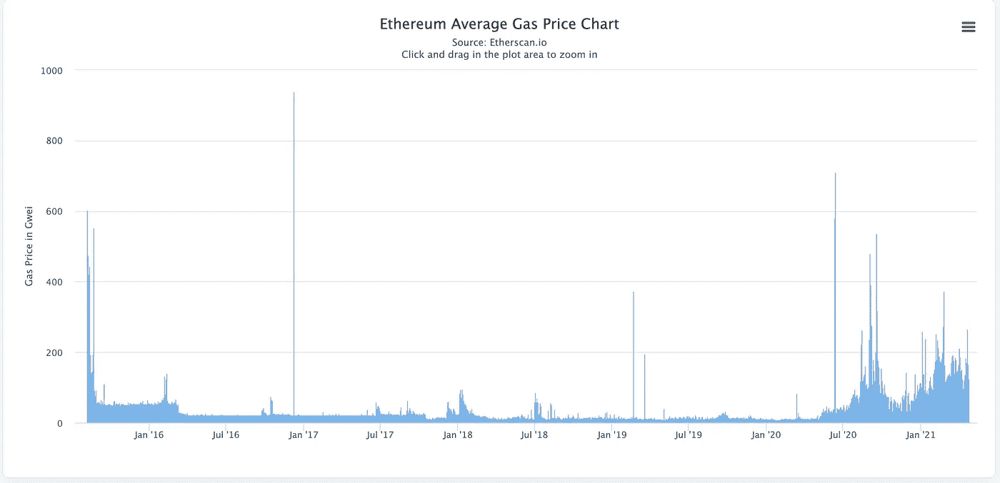
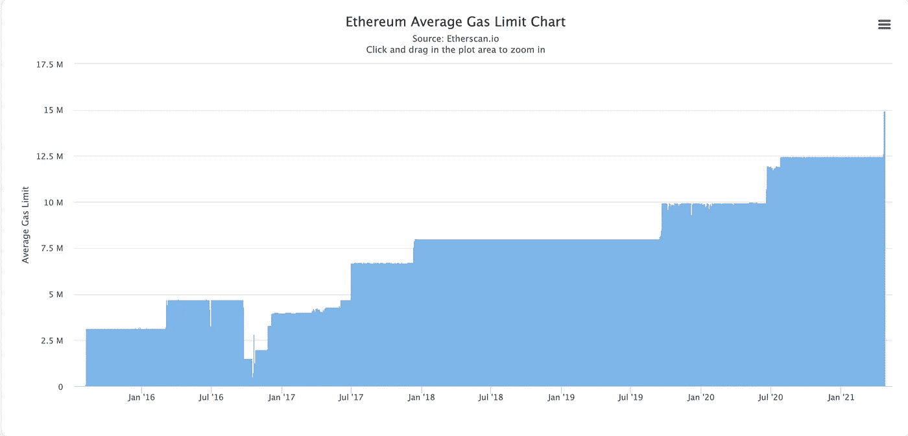
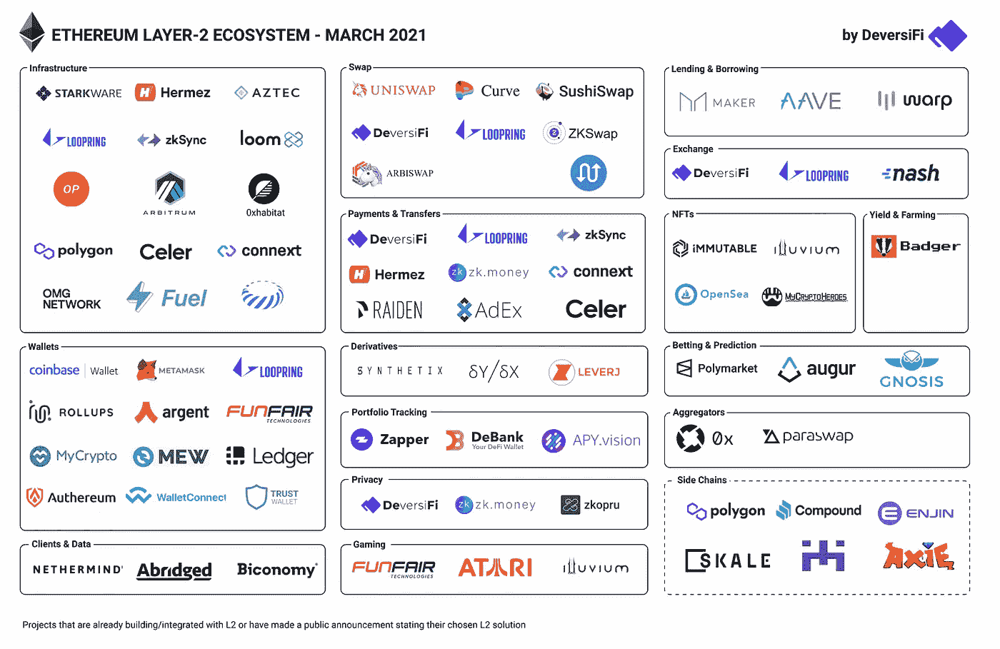
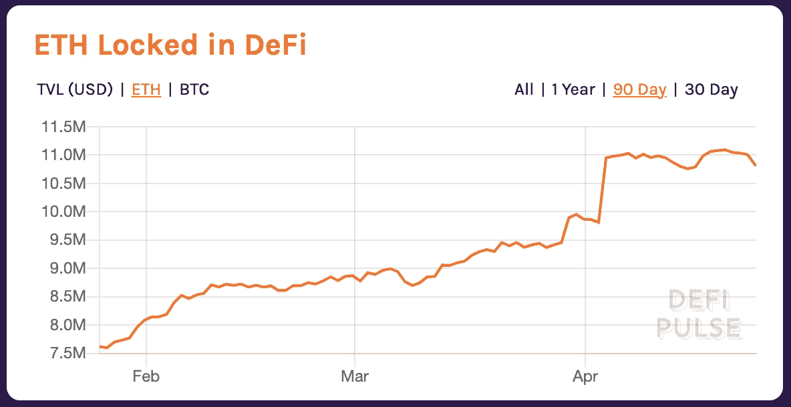
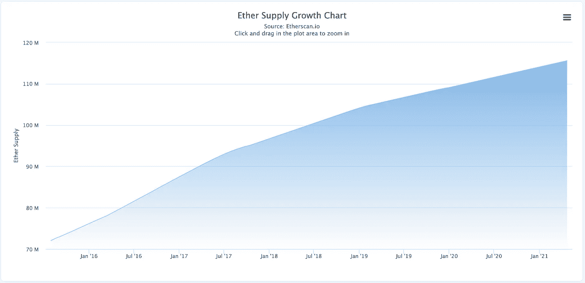

# 以太坊是你所需要的

> 原文：<https://medium.com/coinmonks/ethereum-is-all-you-need-5ece87321b9f?source=collection_archive---------1----------------------->

## 为什么我一直在积累 ETH 而从不卖出

Source: [https://wallpaperaccess.com/ethereum](https://wallpaperaccess.com/ethereum)

和往常一样，这篇文章是为教育目的而写的。这既不构成财务建议，也不构成交易建议。过去的表现并不代表未来的结果。

*不要投资超过你能承受的损失。这不是财务建议；总是自己做研究:)*

昨天，我谈到了以太坊及其原生货币以太是整个加密行业中最有用的平台和货币——以太坊有能力成为世界上的超级计算机。

我展示了以太不仅仅是一种货币。

它作为一种推动区块链网络的商品，以及类似于比特币和其他加密货币的价值储存手段，具有价值。

它是分散式金融的一个基本组成部分——作为分散式交易所的一个基础组合，用户可以获得新硬币，也可以作为一种抵押形式进行借贷或用作有收益的资产。

也就是说，以太坊要实现其作为世界超级计算机的全部潜力，还需要大量的改进。

**阻碍其愿景实现的最大也是最明显的障碍是其目前正在经历的网络拥堵。**

因为一个区块中允许的天然气量是有上限的，所以在一个开采区块中只允许这么多的交易。

由于交易的数量在本质上是有上限的，用户将对有限的空间进行竞标，从而提高他们愿意支付的天然气费价格，以便矿商将特定交易优先安排到最快的区块。

因此，在牛市的某些时段，平均汽油费高得惊人——最高时从 200 到 300 gwei 不等。

*注:卫是乙醚的最小单位——gwei 是千兆卫。作为参考，200-300 gwei 意味着以 ETH 的当前价格为一项简单的 ETH 交易支付 30-40 美元。*

# 以太坊的未来是光明的

尽管燃气费很高，以太坊仍然在使用方面打破记录——从活跃开发者数量[和基于以太坊的应用数量](https://www.coindesk.com/ethereum-outpaces-bitcoin-developer-activity-2020-electric-capital-report)到日常交易、[锁定总价值](http://defipulse.com)、以太价格、唯一地址等。

这是网络拥塞的一线希望。尽管成本高昂，以太坊仍然是最活跃、使用最多的区块链平台。

真正展示了智能合约平台在世界上的产品市场契合度，以及人们对它的需求程度。

幸运的是，以太坊社区在接下来的一年里有一系列令人惊叹的升级、产品和举措，将缓解拥堵问题——巩固其作为该领域最佳货币技术的地位。

本周早些时候，我在《T2》中提到了我在 Crypto 的四年反思，社区才是王道，这就是为什么。

此时此刻，成千上万疯狂聪明的开发人员正致力于使以太坊更加可用。这种火力将击败区块链的任何其他创新。

> **尽管成本高昂，以太坊仍然是最活跃、使用最多的区块链平台。**

我将把计划分成两个部分:需求加速和供应调整。

# 未来需求

很直观地看到，以太坊上的高额燃气费正在抑制对以太坊的需求——从而抑制了 dapps 上的潜在交易量和想要使用该平台的用户的绝对数量。

因此，有理由认为，解决以太坊的吞吐量/拥塞问题将在该平台上引发另一波采用和使用浪潮。

## 当前正在实施的解决方案

拥塞问题的一个快速解决方案来自上周的柏林升级——对以太坊的升级，包含四个以太坊改进提案(EIP ),提高了网络的效率。

因此，矿工们觉得将天然气限制提高到 15M 比较合适——允许每个新开采的区块容纳更多的交易，理论上增加了网络吞吐量，从而降低了天然气费用。

Gas limit has been increased due to the Berlin upgrade. Source: EtherScan.io

另一个正在进行的倡议是 [Flashbots](/flashbots/flashbots-transparency-report-march-2021-d3930b4b98a9) ，这是一个向矿工发布模糊通信线路的组织，让用户谨慎地为特定交易付费。

这在理论上应该有助于提高汽油费，因为高汽油费的很大一部分是由于套利者在交易之前看到了其他套利者的交易，并试图以更高的出价获得套利机会。

## 第 2 层缩放

关于第 2 层扩展有很多要说的…太多了，值得在未来专门发表一篇文章。

第二层(也称为第二层)是位于另一个核心区块链(第一层或 L2)之上的二级区块链，其中 dapps 可以处理事务和状态变化，只偶尔与 L1(本例中为以太坊)进行数据协调。

把它想象成把最重要的信息发送回以太坊——相对于当前在 L1 处理一切的状态。

第 2 层扩展可以显著增加事务的数量。根据解决方案的不同，吞吐量会增加到 2K-4K TPS，从而大幅降低第 2 层交易的燃气费用。

现在有许多不同的第二层解决方案试图扩展以太坊。

许多领先的竞争者——比如乐观——计划在今年的夏秋季节发布到 mainnet 上。

Source: [Reddit](https://www.reddit.com/r/ethereum/comments/mfru8u/layer2_ethereum_is_in_supersonic_mode_big_props/)

## ETH2 升级

以太坊 2.0(称为 ETH2)引入了两个重要的概念——利益证明和分片——这将极大地提高网络的交易吞吐量。

尽管如此，我不会真正关注 ETH2 的需求生成影响，因为即使有了分片，以太坊仍需要第 2 层扩展才能在 2-4K TPS 吞吐量上与 Visa 竞争。

然而，随着 PoS 的出现，以太坊将转向一种不那么耗能的共识机制——这可能会平息环保主义者的批评，并使另一波采纳者加入进来。

# 未来供应

未来以太坊的升级不仅会增加需求，而且它的供应也会受到实质性的改变和限制。

从《经济学 101》中，我们知道供给受限/萎缩——加上新的需求——将导致资产价格上涨。

需要考虑的三个概念是:由于 ETH2 过渡到股权证明而导致的供应下降，DeFi 持续增长导致的额外下降，以及将 ETH 改为递减供应计划的建议(EIP-1559)。

## ETH2 打桩

利益相关证明通过已锁定(即锁定/存放且不能移除)ETH 的验证器来实现以太坊虚拟机状态的一致性。

对于每一个区块，验证者的奖励是基于他们的押记的 ETH 与整个押记的 ETH 池的比例。

目前，所有以太网的 3.4%被锁定在信标链中，以通过利益证明(称为 PoS)来帮助确保以太坊区块链的安全——随着 ETH2 的推出(合并)定于今年冬季，更多的以太网可能会被锁定。

这意味着，为了确保网络安全，整个 ETH 供应的 3%以上基本上被排除在循环之外。这些验证者如果想获得奖励，就不能出售他们的 ETH。

## 持续定义打桩

除了为 PoS 锁定的 ETH 之外，ETH 还被锁定在 DeFi 应用中，以便获得收益或获得流动性奖励等。

目前，9.6%的人患有营养不良。

虽然这种 ETH 更具流动性，更有可能从 DeFi 应用程序中解锁，但获得这种 ETH 仍然有很大的障碍，因此减少了资产的有效流通供应。

Source: DeFi Pulse

## EIP-1559 年

像比特币一样，以太被发送给开采每个区块的矿工，作为验证交易和保护网络的奖励。

然而，与比特币不同，以太没有固定的供应时间表——而是选择目标通胀时间表，类似于央行的时间表。

鉴于永远只会有 2100 万枚 BTC 地雷，我们不知道最终会有多少。

EIP-1559 是以太坊提案(EIP 代表以太坊改进提案)，完全改变了 ETH 的供货计划。

每个区块都有一个基础费，每次铸造该区块时都会被烧掉(即退出流通)。

因此，网络使用得越多，以太网就被消耗得越多——从而最终将以太网变成一种通缩资产。

Imagine this going down over time.

# 结束语

所以现在你明白我为什么这么看好以太坊和 ETH 了吧！

事后看来，我浏览了一些超级密集和复杂的主题，所以我将在未来的帖子中盘点和充实这些主题:)

如果你认为这篇博文值得你花 5 分钟来阅读，请在下面鼓掌(最多 50 次)或者与一个会从这篇内容中受益的朋友分享。非常感谢！

> 加入 Coinmonks [电报集团](https://t.me/joinchat/PmKOYQ9NNKZlZGNl)，了解加密交易和投资

## 另外，阅读

*   [什么是保证金交易](https://blog.coincodecap.com/margin-trading) | [美元成本平均法](https://blog.coincodecap.com/dca)
*   最好的[加密交易机器人](/coinmonks/crypto-trading-bot-c2ffce8acb2a) | [网格交易机器人](https://blog.coincodecap.com/grid-trading)
*   [3 商业评论](/coinmonks/3commas-review-an-excellent-crypto-trading-bot-2020-1313a58bec92) | [Pionex 评论](/coinmonks/pionex-review-exchange-with-crypto-trading-bot-1e459d0191ea) | [Coinrule 评论](/coinmonks/coinrule-review-2021-a-beginner-friendly-crypto-trading-bot-daf0504848ba)
*   [AAX 交易所评论](/coinmonks/aax-exchange-review-2021-67c5ea09330c) | [德里比特评论](/coinmonks/deribit-review-options-fees-apis-and-testnet-2ca16c4bbdb2) | [FTX 交易所评论](/coinmonks/ftx-crypto-exchange-review-53664ac1198f)
*   [n ave 零点回顾](/coinmonks/ngrave-zero-review-c465cf8307fc) | [Phemex 回顾](/coinmonks/phemex-review-4cfba0b49e28) | [PrimeXBT 回顾](/coinmonks/primexbt-review-88e0815be858)
*   [Bybit 交易所评论](/coinmonks/bybit-exchange-review-dbd570019b71) | [Bityard 评论](/coinmonks/bityard-review-7d104239be35) | [CoinSpot 评论](https://blog.coincodecap.com/coinspot-review)
*   [3 commas vs crypto hopper](/coinmonks/3commas-vs-pionex-vs-cryptohopper-best-crypto-bot-6a98d2baa203)|[赚取加密利息](/coinmonks/earn-crypto-interest-b10b810fdda3)
*   最好的比特币[硬件钱包](/coinmonks/the-best-cryptocurrency-hardware-wallets-of-2020-e28b1c124069?source=friends_link&sk=324dd9ff8556ab578d71e7ad7658ad7c) | [BitBox02 回顾](/coinmonks/bitbox02-review-your-swiss-bitcoin-hardware-wallet-c36c88fff29)
*   [莱杰 vs n rave](/coinmonks/ledger-vs-ngrave-zero-7e40f0c1d694)|[莱杰 nano s vs x](/coinmonks/ledger-nano-s-vs-x-battery-hardware-price-storage-59a6663fe3b0) | [币安评论](/coinmonks/binance-review-ee10d3bf3b6e)
*   [加密复制交易平台](/coinmonks/top-10-crypto-copy-trading-platforms-for-beginners-d0c37c7d698c) | [Coinmama 评论](/coinmonks/coinmama-review-ace5641bde6e)
*   [CoinLoan 评论](/coinmonks/coinloan-review-18128b9badc4) | [YouHodler 评论](/coinmonks/youhodler-4-easy-ways-to-make-money-98969b9689f2) | [BlockFi 评论](/coinmonks/blockfi-review-53096053c097)
*   最好的[加密税务软件](/coinmonks/best-crypto-tax-tool-for-my-money-72d4b430816b) | [硬币追踪评论](/coinmonks/cointracking-review-a-reliable-cryptocurrency-tax-software-5114e3eb5737)
*   最佳[加密借贷平台](/coinmonks/top-5-crypto-lending-platforms-in-2020-that-you-need-to-know-a1b675cec3fa) | [杠杆令牌](/coinmonks/leveraged-token-3f5257808b22)
*   [BlockFi vs Celsius](/coinmonks/blockfi-vs-celsius-vs-hodlnaut-8a1cc8c26630)|[Hodlnaut 点评](/coinmonks/hodlnaut-review-best-way-to-hodl-is-to-earn-interest-on-your-bitcoin-6658a8c19edf) | [KuCoin 点评](https://blog.coincodecap.com/kucoin-review)
*   [Bitsgap 评审](/coinmonks/bitsgap-review-a-crypto-trading-bot-that-makes-easy-money-a5d88a336df2) | [Quadency 评审](/coinmonks/quadency-review-a-crypto-trading-automation-platform-3068eaa374e1) | [Bitbns 评审](/coinmonks/bitbns-review-38256a07e161)
*   [埃利帕尔泰坦评论](/coinmonks/ellipal-titan-review-85e9071dd029) | [赛克斯斯通评论](/coinmonks/secux-stone-hardware-wallet-review-15-discount-coupon-2020-7577032faa6e)
*   [本地比特币评论](/coinmonks/localbitcoins-review-6cc001c6ed56) | [加密货币储蓄账户](https://blog.coincodecap.com/cryptocurrency-savings-accounts)
*   最佳[区块链分析](https://bitquery.io/blog/best-blockchain-analysis-tools-and-software)工具| [赚比特币](/coinmonks/earn-bitcoin-6e8bd3c592d9)
*   [加密套利](/coinmonks/crypto-arbitrage-guide-how-to-make-money-as-a-beginner-62bfe5c868f6)指南| [如何做空比特币](/coinmonks/how-to-short-bitcoin-568a2d0b4ae5)
*   最佳[加密制图工具](/coinmonks/what-are-the-best-charting-platforms-for-cryptocurrency-trading-85aade584d80) | [最佳加密交易所](/coinmonks/crypto-exchange-dd2f9d6f3769)
*   [如何在印度购买比特币？](/coinmonks/buy-bitcoin-in-india-feb50ddfef94) | [瓦济克斯审查](/coinmonks/wazirx-review-5c811b074f5b)
*   [印度比特币交易所](/coinmonks/bitcoin-exchange-in-india-7f1fe79715c9) | [比特币储蓄账户](/coinmonks/bitcoin-savings-account-e65b13f92451)
*   [CoinDCX 评论](/coinmonks/coindcx-review-8444db3621a2) | [加密保证金交易交易所](https://blog.coincodecap.com/crypto-margin-trading-exchanges)