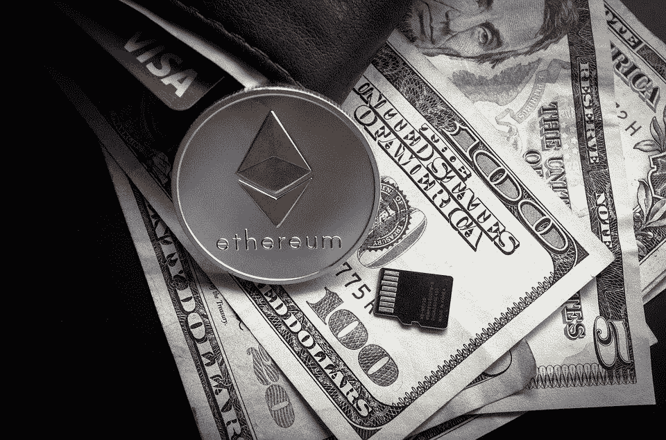
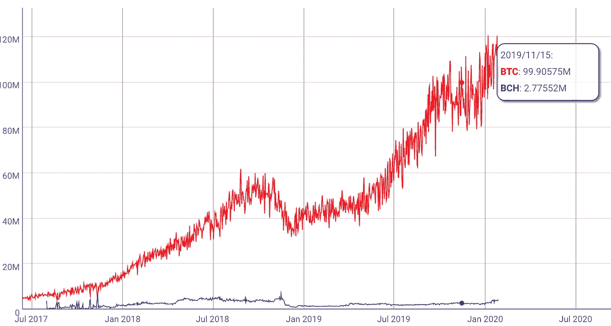
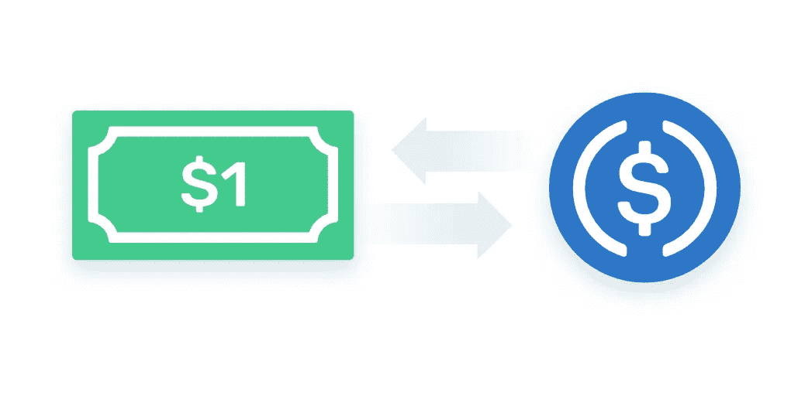
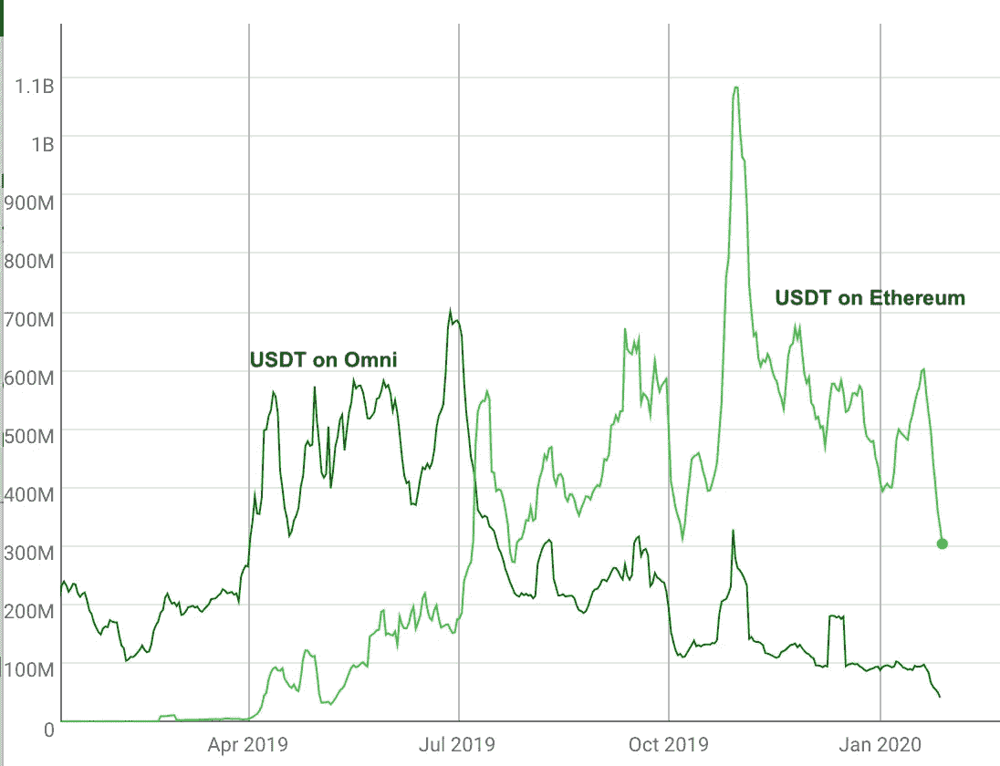

# 以太坊扼杀了比特币的支付使用案例

> 原文：<https://medium.com/coinmonks/ethereum-is-killing-bitcoin-payments-d51d6ea72a12?source=collection_archive---------0----------------------->

## **快速终结，无波动——一切尽在以太坊**

多年来，比特币及其分支(如比特币现金)一直试图成为互联网货币，但规模问题阻碍了它的发展。现在看来，一个不太可能出现的竞争者以太坊(Ethereum)正在成为数字支付的发源地。

考虑到比特币的易波动性和低阻塞率，以太坊上出现了三只稳定币:Tether、USDC 和 DAI。以太坊凭借其较高的吞吐量和出众的支付特性，使得比特币乃至比特币现金俨然已成明日黄花。

# 用比特币支付

2010 年 5 月，拉斯洛·汉耶兹花了 1 万枚比特币买了两个比萨——这是第一次用比特币进行的真实交易。从那时起，比特币就被用来购买无数的东西，从电脑到房子。他们认为比特币是数字现金，是一种自主的储蓄和消费方式。

但随着时间的推移，比特币越来越流行，它的使用也变得越来越麻烦。区块填满了，交易费也填满了。确认付款的过程从几分钟到有时一个小时甚至更长。

问题严重到比特币一分为二。比特币核心(Bitcoin Core，又称 BTC)在扩展数据块规模方面采取了保守策略，主要通过第 2 层网络进行扩展。比特币现金则采取了更直接的方式，将区块大小提高到了 8MB。

# 2020 年的比特币支付

Expect to wait if you’re paying with Bitcoin

如今的比特币支付得益于 isolated Witness 的升级，以及更加成熟的闪电网络(Lightning Network)，但 10 分钟的阻塞时间和比特币固有的波动性让它与主流支付相距甚远。

2018 年，比特币核心激活了“隔离见证”。这将有效区块大小从 1MB 增加到几乎 4MB。如今，Segwit 得到了广泛的支持，网络交通堵塞几乎已经消失。交易费再次较低，交易得到确认在大约一个区块。然而，用户仍然需要等待大约 10 分钟，直到他们的交易收到一个确认，这对于支付协议来说远非理想。

闪电网络旨在解决速度问题。Lightning Network 是比特币的第 2 层支付网络，它使用智能合约和支付路由网络，使用户能够快速、安全地进行链外资金转账。它实现了相当好的分散性、隐私性和可扩展性，但这样做是以可用性为代价的。

Lightning 网络的用户需要将他们打算用于支付的资金在网络上锁定一定的时间，在此期间他们无法在主比特币网络上使用这些资金。此外，如果接收者离线，则不能进行支付。

就比特币的可扩展性而言，闪电网络是一种非常酷的方法，但从 Segwit 推出至今的两年时间里，它的使用率似乎一直很低，可用性问题也一直没有得到解决。

Lightning 和 Segwit 仍然没有解决比特币支付的最后一个问题——波动性。大多数人对一分钟一分钟改变价值的钱不感兴趣。

即使是那些相信比特币的自我主权货币叙事的人，通常也不会对用它支付很感兴趣——他们宁愿“拥有”它，看着价格上涨。

# 比特币现金——更快但不太安全

Bitcoin hashrate completely dominates BCH — [CoinMetrics](https://coinmetrics.io/charts/#assets=btc,bch_log=false_left=HashRate_zoom=1549988632460.7324,1580169600000)

比特币现金采取了更直接的方法来解决比特币的吞吐量和速度问题。通过将比特币的块大小增加到 8MB，它的吞吐量增加了 8 倍，并且通过允许 0 确认交易，它能够大幅提高速度。

但是这些改进是以牺牲安全性为代价的。通过 0 确认的交易基本上没有通过任何有意义的区块链共识。

更麻烦的是，BCH 与 BTC 共享相同的挖掘算法。开采 BTC 煤矿的矿工可以很容易地将他们的机器换成开采 BCH 煤矿。由于 BTC 的黑客力量目前是 BCH 的 50 倍，即使是一小部分 BTC 矿工也能轻易制服网络，对 BCH 进行 51%的攻击。

这些攻击不是理论上的，它们已经发生多次了。事实上，有人做了一个网站，你可以在上面追踪比特币现金的双重花费: [doublespend.cash](http://doublespend.cash) 。

# 以太坊来了

如今，我们不必满足于不安全的支付、10 分钟的确认时间或波动性。以太坊上的 Stablecoin 支付一般在一分钟内确认，价格不会波动，并且被广泛采用，足以用于支付。

这些硬币，无论是它的系绳，，还是戴，都提供了快速的终结，因为它们运行在以太网上。最重要的是，正如 stablecoins 所说，用户不必担心波动性。

# 戴——去中心化的稳定货币

DAI proved its worth as a stablecoin in 2018 — [CoinGecko](https://www.coingecko.com/en/coins/sai)

戴可能是以太坊里最有趣的一个人了。作为一种分散的稳定货币，每个 DAI 令牌都有 150%的加密货币担保。更好的是，与 Tether 不同，戴的加密货币储备在区块链上是完全透明和可见的。

戴的价格受到自动清算机制的保护，如果抵押品的价格低于安全水平，自动清算机制就会发挥作用。即使在 2018 年乙醚价格下跌 90%的时候，戴仍然非常接近 1 美元的目标。除了清算，就连治理也是以自动化的方式处理的，这使得戴成为以太坊上最分散化的稳定货币。

# USDC——比特币基地支持的数字美元

Every USDC is redeemable for 1 $USD

USDC 是一种美元支持的稳定货币，任何人只要有美国银行账户就可以提取美元。由美国最大的加密货币交易所比特币基地创建，储备每月由 T2 审计。USDC 持有者可以放心，一个负责任的托管人正在支持他们的资金。

USDC 最大的优势也是它的弱点——中央集权。由于比特币基地是一个美国实体，任何向受制裁实体转移资金或进行比特币基地认为可疑的交易的人都可能被冻结 USDC。

# 系绳——最稳定的液体硬币

Tether transacts mainly on Ethereum — [CoinMetrics](https://coinmetrics.io/charts/#assets=usdteth,usdt_log=false_left=TxTfrValAdjUSD_zoom=1549988632460.7324,1580169600000)

Tether 于 2014 年首次发行，是最古老的稳定硬币，也是世界上流动性最强的稳定硬币。根据 Coinmetrics 的数据，平均每天有数亿笔交易。

Tether 过去只在比特币 Omni 网络上，但在 2018 年作为 ERC-20 扩展到以太坊网络。在以太坊上，Tether 交易更快更便宜。以前在 Omni 上需要一个小时的传输现在在以太坊上只需要不到一分钟。难怪在 2019 年，ERC-20 系绳爆炸式增长。ERC-20 系绳交易现在主导系绳交易量。

虽然很流行，但 Tether 并不透明。这是一种美元支持的稳定货币，但这些美元存在不透明的银行账户中。由于 Bitfinex 经常面临银行问题，而 tether 的普通持有者无法将 tether 提取为法定货币，Tether 的美元储备受到了质疑。由于这些问题，竞争对手不断涌现。

# 更好的钱包

Argent Wallet provides a superior user experience

以太坊钱包也极大地改善了用户体验，使得在现实生活中使用加密货币比以往任何时候都更容易。银色钱包是无种子的——你不必在一张纸上匆匆写下 12 个单词，然后藏在某个地方。它使用像 tom.argent.xyz 这样人类可读的名称，而不是像 1 bvbmseystwetqtfn 5 au 4m 4g fg 7 xjanvn 2 这样容易输入错误的地址。它还具有多签名、支付限额等额外功能，所有这些都不需要用户拥有计算机科学学位就可以使用。

# 更快、更便宜、更好

比特币开创了加密货币支付，但以太坊让它变得更好。无论你喜欢哪种稳定币，USDC 币、戴币还是泰索币，支付都比基于比特币的更快更便宜。因为这些是稳定的货币，你也不必担心波动性——就像用美元支付一样。

随着更快的交易、更低的费用和更好的用户体验，很明显:加密支付的未来在以太坊。

*如果你觉得这篇文章有帮助，请*👏，谢谢！

## **了解以太坊发生的更多事情:**

*   [什么是 DeFi？](/coinmonks/what-is-defi-2cee0dceeeab)
*   [这些顶级 DeFi 应用将我们从银行中解放出来](/coinmonks/these-top-defi-apps-are-freeing-us-from-banks-83f724bc543e)
*   [UniSwap 不是你普通的 DEX](/swlh/uniswap-isnt-your-ordinary-dex-c37fcaa67470)

> [直接在您的收件箱中获得最佳软件交易](https://coincodecap.com/?utm_source=coinmonks)

