# 以太坊:土地市场 Dapp 教程—第 1 部分—创建和部署智能合同

> 原文：<https://medium.com/coinmonks/ethereum-land-marketplace-dapp-tutorial-part-1-create-and-deploy-a-smart-contract-351bc0d62be2?source=collection_archive---------1----------------------->

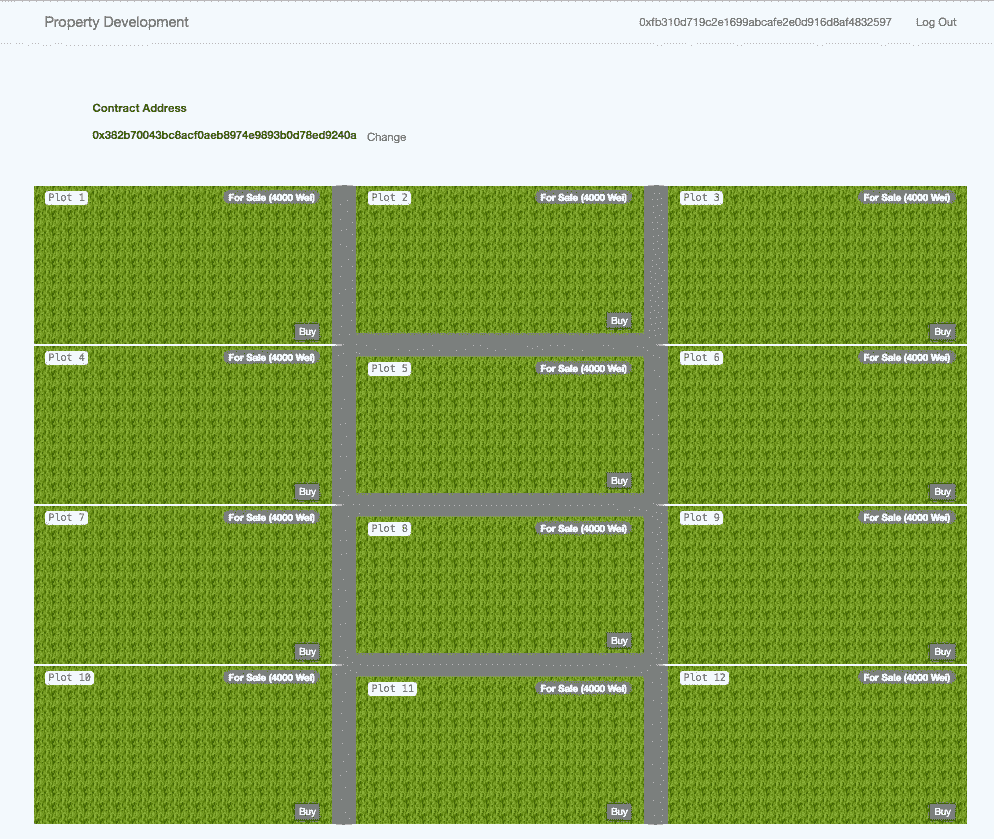

Property Website (Dapp)

在我的前一篇文章中，我带你了解了如何建立一个私人以太坊区块链。这是本教程的先决条件，因为我们将在此基础上进行构建。在本教程中，我们将

1.  创建智能合同
2.  将智能合同部署到本地区块链
3.  从网站与智能合同交互。

我们将在 **solidity** 中编写智能合同。Solidity 是在以太坊虚拟机上编写智能联系人的语言。请注意，本教程的目的是向您展示创建智能合约并与之交互的基础知识，我不会详细介绍最佳实践或语法。

> [发现并回顾最佳区块链软件](https://coincodecap.com)

# 智能合同

什么是智能合约？智能合同也称为自动执行合同，有助于在不需要中间人的情况下交换任何有价值的东西(土地、金钱等)。这是一个非常简单的定义，但应该足够了。在谷歌上快速搜索会发现大量更深入的解释。

在本节中，我们将开发一个智能合同，允许任何人购买或出售(如果他们拥有)地块。为简单起见，这块虚构的土地正好有 12 块不可分割的地块。让我们列出这个智能合同的要求。

**土地买卖合同—要求**

1.  在创建时，它应该有 12 个地块以 4000 英镑的固定价格出售。
2.  应该有一个 api 来获取所有图及其当前状态的列表。
3.  任何有足够乙醚的人都可以购买任何待售的地块。
4.  地块所有者应该能够以任何价格出售地块。
5.  地块所有者应该能够在任何时候将他们挂牌出售的地块从市场上拿走(前提是它还没有被出售)。
6.  用户应该能够随时提取他们的乙醚/钱。

让我们开始吧。

**启动 Remix (IDE)**

为了开发智能合同，我们将使用基于浏览器的 IDE，称为 remix。从任何浏览器(最好是 Chrome 或 Firefox)打开 [remix](https://remix.ethereum.org) 。

**链接 Remix 到你本地的区块链**

如果您仍在运行上一教程中的区块链控制台，请退出该控制台。为了让 remix 连接到您的本地区块链，您需要公开 rpc api。为此，请使用下面的命令重新启动控制台

```
**geth** —**datadir** ./datadir_new —**networkid** 2018 —**port** 30306 —**nodiscover** —**rpc** —**rpcapi** “db,personal,eth,net,web3,debug” —**rpccorsdomain**=”*” —**rpcaddr**=”localhost” —**rpcport** 8545 **console**
```

该命令启动 geth 控制台，并公开端口 **8545** (可以是任何有效的端口号)上的 rpc api。

现在在你的浏览器中进行混音

选择运行选项卡

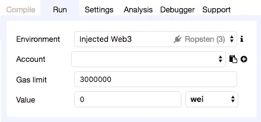

Run tab

从环境下拉列表中选择 Web3 Provider。通过选择 Web3 Provider，您告诉 remix 您想要连接到您的区块链实例，而不是使用嵌入式 VM。

出现以下提示时，选择“确定”

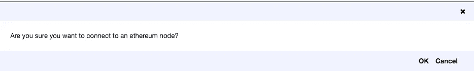

Confirmation Prompt

然后再次选择确定。如果您对`rpcport`使用了不同的值，那么您将需要更新端口号。

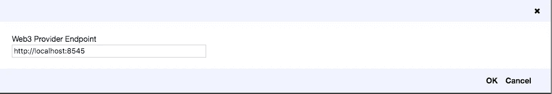

Provider Endpoint

*如果你的 geth 控制台没有运行或者端口号错误，你会得到一个弹出消息，提示 remix 无法连接。*

现在让我们在 remix 中为我们的合同创建一个新的 solidity 文件。要创建一个新文件，请单击屏幕最左上角的加号(+)按钮，并在出现提示时输入文件名。

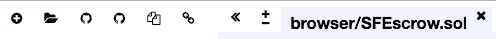

Select + icon on the left

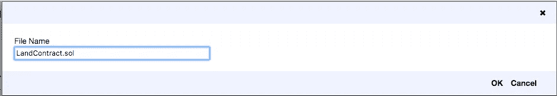

Enter Filename

将代码粘贴到新的 solidity 文件中。

在我们继续之前，让我们快速浏览一下代码。

任何 solidity 代码中的第一行都是编译代码时应该使用的 solidity 编译器的版本。这一点很重要，因为这种语言仍然相对较新且不稳定，不同编译器版本之间的解释可能存在差异。

# 构造器

现在让我们仔细看看构造函数。

在这里使用的 solidity 版本中，constructor 关键字用于声明一个构造函数。在 solidity 中可以重载构造函数。

构造函数中的第一行将契约分配给创建者。你可以把合同想象成有限责任公司。尽管有限责任公司本身是一个法律实体，但它最终是由一个或多个股东所拥有。类似地，当一个合同被创建时，它有自己的地址，但是它通常有一个或多个所有者来管理合同的生命周期。

你大概在想，`msg`物体是从哪里来的？msg 对象是始终存在于全局命名空间中的许多全局变量和函数之一，主要用于提供关于区块链的信息，或者是通用的实用函数。点击查看更多详情[。在我们的例子中，我们希望将这个契约的所有权分配给创建者。](http://solidity.readthedocs.io/en/v0.4.24/units-and-global-variables.html)

构造函数中的下面几行代码只是为地块指定了一个固定的价格，并将它们挂牌出售。

# 获取地块

此功能允许我们检索图列表。

变量前的 memory 关键字告诉编译器不要在`storage`中声明变量，后者更昂贵。即只在内存中保存这个变量，一旦方法返回就丢弃它。在这个版本的 solidity 中，你可能会发现另一件奇怪的事情，那就是你不能返回“复杂”的对象，但是你可以返回多个值。这就是为什么在 getPlot 方法中，我将 plots 数组分成 3 个变量。

# 购买地块

buyPlot 函数用于通过指定地块的索引(从零开始)并发送足够的以太网以满足要价来购买地块。它做一些基本的检查，将乙醚从买方转移到卖方的账户，然后将地块的所有权转移给买方。最后，它引发了一个事件。我们将在后面看到如何订阅事件。

# 出售土地

`putPlotUpForSale`功能允许当前土地所有者以任何价格出售土地。同样，一旦该地块被出售，我们就会引发一个事件，以便所有订阅者都可以对此做出反应。

# 将地块撤出市场

`takeOffMarket`功能允许卖家将他们之前投放市场的地块拿走。这可能是为了改变要价，或者因为他们不再有兴趣出售。

# 提取资金

几乎每份合同都要求所有者或利益相关者有一种方式来提取属于他们的资金。`withdrawFunds`功能允许合同中有资金的任何人提取他们所有的资金。您可以对此进行修改，以允许风险承担者执行部分或全部撤回。

# 破坏

`destroy`功能与我们上面列出的功能需求无关，但它允许所有者破坏或废除该合同。在产品代码中，你将不得不考虑一些我忽略的东西。比如，在给`selfdestruct`打电话之前，先给业主汇钱。

# 部署智能合同

*   如果没有运行 geth，可以使用前面提供的命令运行它。
*   从 geth 控制台解锁您要用于部署合同的帐户。要使用默认的/coinbase 帐户，请在 geth 控制台中发出命令。`personal.unlockAccount(eth.accounts[0])`。您将得到一个提示，要求您输入该帐户的密码。
*   在 remix 中，选择编译选项卡并选中自动编译

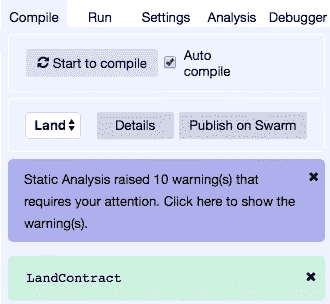

*   如果有任何编译问题，您将在编译选项卡上看到所有错误或警告，否则您将看到绿色背景，上面有您联系人的姓名，如上图所示。
*   现在，切换回运行选项卡。从帐户下拉列表中选择您之前解锁的帐户，选择您的合同，然后按部署按钮。

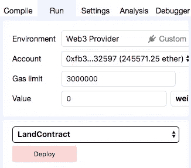

*   你应该会看到混音控制台中的`creation of Contract pending...`，如下图所示

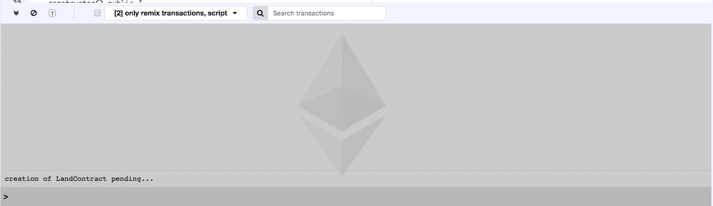

*   在 geth 中，通过发出`miner.start(1)`命令启动 miner，您应该会在 remix 日志中看到更多活动，如下图所示

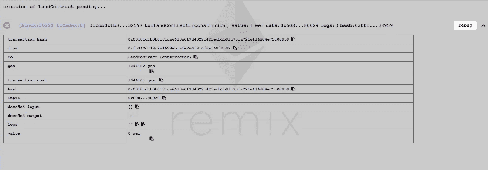

Contract Creation — Remix Console Log

remix 允许您做的一件很酷的事情是，它允许您与部署的契约进行交互。部署完契约后，您应该在 remix 的 deployed contracts 部分(右下角)看到一个新项目。

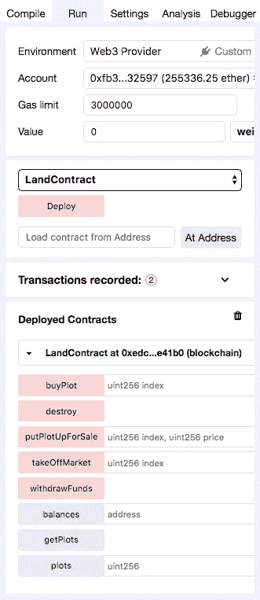

Deployed Contracts

例如，要获取索引为 0 的绘图的状态，请在绘图旁边的文本框中输入 0。

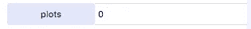

Request

然后单击 plots 按钮，输出应该显示绘图的状态。

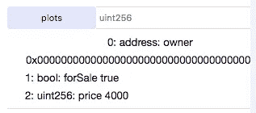

Plot Status

您将观察到输出/状态与您初始化该图时使用的值相匹配。尝试其他方法/函数。

现在让我们转到本教程的第二部分，我们将从 web 应用程序调用此合同。