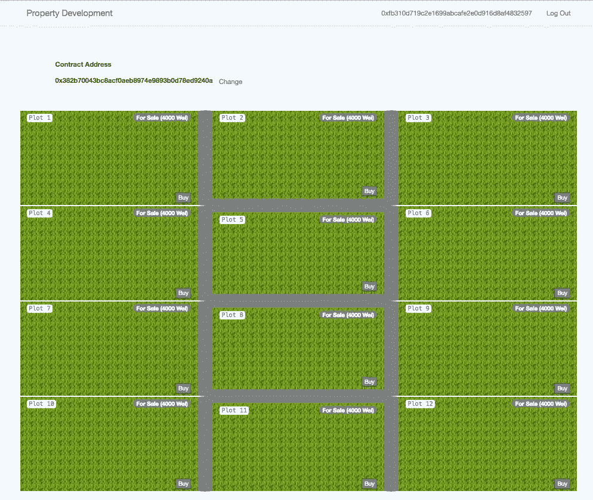
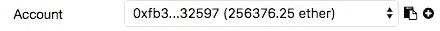

# 以太坊:土地市场 Dapp 教程—第 2 部分—与 Web 应用程序集成

> 原文：<https://medium.com/coinmonks/ethereum-land-marketplace-dapp-tutorial-part-2-integrate-with-a-web-app-85db82d732cd?source=collection_archive---------2----------------------->



Property Website

[GitHub 回购](https://github.com/toluhi/property-developer)

在本节中，我们将从一个 web 应用程序调用我们在本教程的第[部分 1](/@adeyemitoluhi/ethereum-land-allocation-dapp-tutorial-part-1-create-and-deploy-a-smart-contract-351bc0d62be2) 中开发的智能契约。

从这个 [GitHub repo](https://github.com/toluhi/property-developer) 中签出 web 应用程序代码。您需要在计算机上安装 npm。你可以在这里找到关于如何安装 npm/node [的细节](https://www.npmjs.com/get-npm)。

# 安装依赖项

启动终端或命令提示符，导航到您下载或签出代码的目录，然后运行`npm install`。

你可能会注意到的第一件事是，该网站是一个基于 react/redux 的应用程序。如果你不熟悉他们，不要担心。我们将只关注智能合约集成，希望很明显你需要做什么来用不同的库/框架实现类似的东西。

# 开放 Web 套接字 API

我们需要做的下一件事是，停止 geth 控制台，如果它还在运行，然后用下面的命令重新启动它。

```
**geth** —**datadir** ./datadir_new —**networkid** 2018 —**port** 30306 —**nodiscover** —**rpc** —**rpcapi** “db,personal,eth,net,web3,debug” —**rpccorsdomain**=”*” —**rpcaddr**=”localhost” —**rpcport** 8545 --**ws** --**wsapi** "db,personal,eth,net,web3,debug" --**wsorigins**="*"  --**wsaddr**="localhost" --**wsport** 8546 **console**
```

该命令与前一个命令的不同之处在于，它还通过 web socket (port **8546** )公开了 geth api。

# 从混音版复制 ABI

按照以下步骤将 ABI 从混音复制到`src\contracts\landContract.json`。

*   开放式混音
*   转到编译选项卡


Compile Tab

*   单击详细信息，向下滚动到出现的模态视图，然后单击 ABI 旁边的复制图标。这会将 ABI 复制到剪贴板。


ABI

*   将 ABI 粘贴到`src\contracts\landContract.json`文件中。

那么，什么是 ABI，我们为什么需要它？ABI 使您能够对智能合约的调用进行编码，并从交易中读取/解码数据。

如果您没有进行任何自定义更改，那么您的 ABI 应该与下面的 landContract.json 的内容相同。

# 连接

在本节中，我们将修改`src\action\index.js`。我们需要修改的相关部分有占位符，我们将处理这些占位符。

我们在这个文件中导入了两个关键模块，第一个是`web3`，第二个是我们之前更新的 ABI 文件。

我们首先需要更新的是区块链的 web 套接字地址。

因为我们连接到本地运行的区块链，如果您还记得的话，我们将 wsport 设置为 8546，将 provider 设置为`ws://localhost:8546`。

要使用这个网站，用户必须用他们的地址和密码登录。为此，我们将使用个人图书馆。修改登录函数，如下所示。

Login

如果新用户使用这个网站的唯一方式是在 geth 控制台上创建一个帐户，这将是一个糟糕的用户体验。同样，使用个人库，我们公开了帐户创建功能。将注册功能更新为。

下一个功能`changeContractAddress`允许这个站点的用户改变他们正在交互的合同的实例(地址)。当这个函数成功加载一个合同时，它应该做两件主要的事情。首先，加载图及其状态的列表，以便它可以更新 UI 并订阅事件，以便它可以在发生更改时做出响应。这也是需要 ABI 的地方。将函数更新为。

最后三个未实现的函数是 buyPlot、sellPlot 和 takeOffMarket，希望这些函数应该做什么很明显。用这些替换 3 个函数。

为了调用函数或监听契约上的事件，我们使用在`changeContractAddress`函数中创建的契约实例。

打开命令提示符/终端，导航到您的签出文件夹。然后跑`npm start`。一旦启动，从你电脑上的任何浏览器进入 localhost:8080，你应该会看到下面的登陆界面。


Landing Page

让我们试试登录功能。

*   从 remix 中，通过选择帐户并单击下拉菜单旁边的复制按钮，复制有以太的帐户的地址。



Account With Ether

*   单击登录，并在出现的模式弹出窗口中输入地址和密码。然后单击登录


Login

*   这将为您提供一个输入合同地址的屏幕。您可以通过单击已部署合同旁边的复制按钮从 remix 获取合同地址。


Copy Contract Address

*   粘贴地址并按回车键


Enter Contract Address and Press Enter

这应该给你提供了可用的情节。


Available Plots

*   在 geth 控制台`miner.start(1)`上启动 miner，点击购买按钮。一旦你的购买请求被挖掘出来。你会注意到“买入”按钮变成了“卖出”。你也可以从 remix 中验证剧情的状态。


After Buying

*   点击出售按钮出售地块。输入一个要价，比如说 12000 魏，你会注意到，在你的卖出交易被挖掘后，用户界面将更新，你当前拥有的地块上的选项将改变，以将该地块从市场中移除。


Plot on Sale

有趣的是，在不同的选项卡上打开 localhost:8080 并尝试注册，这应该会创建一个新帐户。一旦账户被创建，从你的 coinbase 账户转移一些乙醚到新账户(如果你已经忘记如何转移，请参见[这个](/coinmonks/ethereum-setting-up-a-private-blockchain-67bbb96cf4f1)教程)。)然后尝试在账号之间买卖剧情。

希望这对你有用。请在下面的评论区留下任何评论或反馈。

[GitHub 回购](https://github.com/toluhi/property-developer)