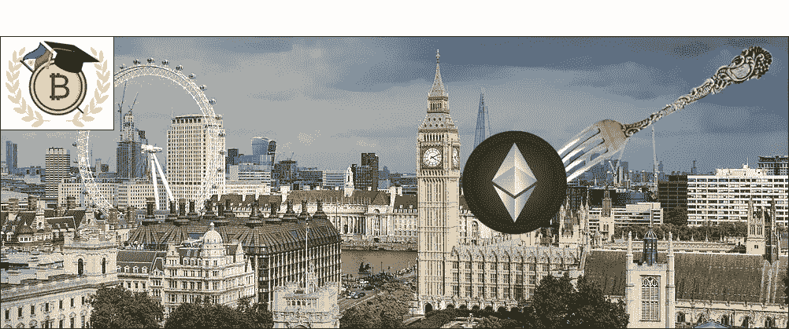

# 以太坊伦敦硬叉和期待什么

> 原文：<https://medium.com/coinmonks/ethereum-london-hard-fork-and-what-to-expect-e8910071d94?source=collection_archive---------6----------------------->

以太坊的伦敦硬分叉或以太坊改进提案 1559 (EIP-1559)预计将于 2021 年 8 月 4 日或第 12，965，000 号街区实施，并使以太坊爱好者紧张地坐在那里。对于一个典型的投资者来说，这到底意味着什么？今天我分享一个即将到来的改进的简要概述，以及它将如何影响以太坊的价格。

首先，以太坊是一家拥有智能合约功能的区块链，在市场资本总额和创收方面是其所在领域中最大的。Aave、Curve、Uni 等 DeFi apps 以及 Axie Infinity、Opensea 等 NFT 都是在以太坊链条下打造的。由于油价的原因，利润的诱惑在某种程度上不利于零售。正常交易的当前平均天然气价格约为 40 Gwei/0.0005 Eth(1.15 美元)，而利用智能合同的交易可达到 125 Gwei/0.0055 Eth(11.00 美元)

Ethereum average gas price for 2021

上图显示汽油价格并未固定。网络中的安全交易基于“第一价格拍卖”,在高度拥堵期间，费用会飙升，如果汽油太低，交易就会受阻。

那么 EIP-1559 会降低汽油费吗？这次升级不会，但这将是一个起点。EIP-1559 将在一个压缩的范围内结算交易费用，用户将不再需要为他们的交易安全出价。

EIP-1559 将通过松弛机制来提高块空间的效率。这将允许一些块变大，只要前面或后面的块变小。这有助于减少网络拥塞造成的延迟。

EIP-1559 也将防止经济抽象，因为交易费用将只为燃烧机制支付。是的，升级中包含了刻录机制。

一个以太坊交易将有一个将被烧掉的基本费用、区块奖励和给以太坊矿工的额外费用(或小费)。每次交易燃烧以太坊巩固了以太网在平台中的效用，平衡了通货膨胀，同时仍然奖励矿工保护区块。

基本费用的消耗现在将使 Eth 成为一种通缩资产和良好的价值储存手段。据估计，70%的交易费用将会被烧掉，使其弹性降低，因为以太坊已经毫无弹性可言。下面显示了交易所中以太坊的供应量占总供应量的百分比。从年初开始，我们已经看到了从 22%到 18%的下降。

18% of the total Eth remains in exchanges

我们预计 EIP-1559 实施后，销售压力会有所减轻。分析师认为，流通的 Eth 可能会减少 30%，这相当于比特币减半的一半影响。有了这个预测，我们可以对结果进行基准测试，并使用它来预测 Eth。

2016 年 7 月 BTC 减半:518 天后增长 3.115%

EIP-1559 实施价格预测:260 天后增长 1，557%

以太坊目前的价格为 2200 美元/以太网，我们可能会在 2022 年看到 34400 美元/以太网。这还有待证实，但现在，一幅画面开始形成。

TL；速度三角形定位法(dead reckoning)

*   EIP-1559 升级预计在 2021 年 8 月 4 日
*   升级降低了交易费用波动性，有效地利用了块空间，并防止了经济抽象
*   由于作为升级的一部分的燃烧机制，预计 Eth 的销售压力将减少

[https://twitter.com/Rightsideonly](https://twitter.com/Rightsideonly)

> 加入 [Coinmonks 电报频道](https://t.me/coincodecap)，了解加密交易和投资

## 另外，阅读

 [## 币安 ETH 2.0 打桩-你需要知道的一切[2021]

### 无论你是一个完全的初学者还是一个挥霍的交易者，币安都是你开始下注的最佳地点…

blog.coincodecap.com](https://blog.coincodecap.com/binance-eth2-staking)  [## 切分:以太坊 2.0 的大脑

### 在我们之前的文章中，我们谈到了信标链。对于心脏，你需要记忆来储存信息。那个…

blog.coincodecap.com](https://blog.coincodecap.com/sharding-in-ethereum)  [## 灯塔链:以太坊 2.0 之心

### 以太坊 1.0 于 2015 年上线。在撰写本文时，它使用了经典的工作证明(同样…

blog.coincodecap.com](https://blog.coincodecap.com/ethereum-beacon-chain)  [## 加密交易机器人——最佳免费加密交易机器人

### 2021 年币安、比特币基地、库币和其他密码交易所的最佳密码交易机器人。四进制，位间隙…

medium.com](/coinmonks/crypto-trading-bot-c2ffce8acb2a)