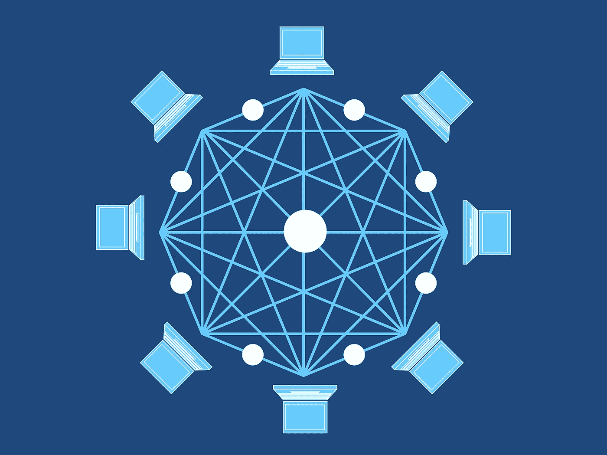
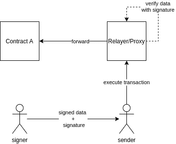

# 以太坊元交易 101

> 原文：<https://medium.com/coinmonks/ethereum-meta-transactions-101-de7f91884a06?source=collection_archive---------1----------------------->



在以太世界中，事情的发生要归功于交易。这些交易，就像生活中的一切，都不是免费的。为了创建和执行一项交易，你需要以“汽油”的形式支付一笔费用，这需要花费 [ETH](https://coinmarketcap.com/currencies/ethereum/) 。

但是，如果您想创建一个交易，但又没有钱支付汽油费用，该怎么办呢？这就是元交易的用武之地！

> 元事务是由一个人创建和签署离线数据，并由另一个支付天然气费用的人执行的事务。

由于元交易不是系统自带的，您需要使用第三方设置(例如 [GSN](https://opengsn.org/) ，或者创建自己的设置。

# 设置

一个非常基本的设置包括 3 个实体:

*   **签名者—** 拥有 0 以太的地址，并且是事务的创建者。该地址是签署交易数据的地址。
*   **发送方—** 有以太网的地址，愿意代表你发送交易，从而支付油费。
*   **中继/代理—** 智能契约，它将读取已签名的数据，根据提供的签名对其进行验证，并将调用转发给实际契约。



*注意，在这种情况下，交易发送方将是代理契约(例如 msg.sender)。在 ERC-20 转移的情况下，签名者需要批准代理契约以代表其转移令牌(除非 ERC-20 契约已经支持元事务)。参见*[*EIP-1776*](https://github.com/ethereum/EIPs/issues/1776)

让我们看一个简单的使用案例…

# 用例:发送令牌

*(为了简化示例，假设 ERC-20 令牌转移的任何批准都已提前完成)*

想象一下，你有一个以太坊地址，里面有 0 个以太，一个友好的区块链朋友给你发了 1000 戴。您无法使用它们，因为您没有足够的资金来执行任何交易。

相反，您可以做的是利用元事务。

## 步骤#1:生成元事务

元事务基本上是一条带有一些数据的消息，这些数据已经由任何想要执行事务的人进行了签名。然后，签名的数据由另一方(支付燃气费的一方)验证并在正常的以太坊交易中发送。

假设我们要将这些代币转移到另一个账户，这意味着我们需要用以下数据创建一个交易:

*   **接收方**:0x 00007 e 87416d 7328 fc 74663 f 37 E0 df 53777188 FB
*   **金额**:10000000000000000000(1000，18 位小数)

使用 web3js，我们可以轻松地为这样的函数调用构建 calldata:

`transferFrom(senderAddress, receiverAddress, 1000);`

它被翻译成下面的字节码:

```
0xa9059cbb
0000000000000000000000000000ef76331b59b1cc5e82ba1d2f840dbac1c73e
00000000000000000000000000007e87416d7328fc74663f37e0df53777188fb
00000000000000000000000000000000000000000000003635c9adc5dea00000
```

## 第二步:签署数据

既然您已经创建了想要执行的操作的 calldata，那么是时候对它进行签名了，这样代理契约就可以验证这个 calldata 在整个过程中没有被篡改。

除了这些数据之外，我们还希望确保调用正确的合同，因此让我们将目标合同地址添加到我们希望签署的数据中。最简单的方法是为所有要签名的数据创建一个散列，并对散列而不是原始数据进行签名。

```
// pack the DAI Token address and our "transferFrom()" calldata together and sign them.let rawData = web3.eth.abi.encodeParameters(
  ['address','bytes'],
  [DaiTokenAddress,data]
);// hash the data.
let hash = web3.utils.soliditySha3(rawData);// sign the hash.
let signature = web3.eth.sign(hash, signer);
```

## 第三步:把数据交给天然气支付者

一旦创建并签署了数据，就将它交给将在链上执行事务的服务/地址。

根据代理合同的结构，天然气付款人可能需要不同结构的数据(您签署的数据也可能需要不同)。但是为了简单起见，让我们考虑我们有下面的基本代理契约功能(注意！不安全生产):

为了成功地执行交易，天然气支付者需要用由**签名者**提供的值调用我们的代理契约的`forward()`函数。

*   **_to:** 戴令牌合同地址(这是我们的目标合同)。
*   **_data:** 签名人生成的 calldata。(我们做的带有`transferFrom(...)`的那个)。
*   **_signature:** 对数据进行签名得到的签名。

这将使我们的代理契约调用 DAI 令牌地址，并执行转移 1000 DAI 的`transferFrom()`函数。

## 需要考虑的事项

有许多可以/应该添加的安全改进(例如在签名消息中添加一个 nonce，以防止重放攻击)。

但是这个例子的目的是向你展示**人 A** 如何在不支付汽油的情况下签署一条消息，然后由**人 B** 执行。从现在开始，有无限的改进和改变可以满足你的需求。

> 加入 coin monks[Telegram group](https://t.me/joinchat/EPmjKpNYwRMsBI4p)学习加密交易和投资

## 另外，阅读

*   [学习以太坊和 Web3 开发](http://blog.coincodecap.com/go/learn)
*   最好的[密码交易机器人](/coinmonks/crypto-trading-bot-c2ffce8acb2a)
*   [3 商业评论](/coinmonks/3commas-review-an-excellent-crypto-trading-bot-2020-1313a58bec92)
*   [Pionex 评论](/coinmonks/pionex-review-exchange-with-crypto-trading-bot-1e459d0191ea)
*   [AAX 交易所评论](/coinmonks/aax-exchange-review-2021-67c5ea09330c) |推荐代码、交易费用、利弊
*   [Deribit 审查](/coinmonks/deribit-review-options-fees-apis-and-testnet-2ca16c4bbdb2) |选项、费用、API 和 Testnet
*   [FTX 密码交易所评论](/coinmonks/ftx-crypto-exchange-review-53664ac1198f)
*   [n 零审核](/coinmonks/ngrave-zero-review-c465cf8307fc)
*   [Bybit 交换审查](/coinmonks/bybit-exchange-review-dbd570019b71)
*   [3Commas vs Cryptohopper](/coinmonks/3commas-vs-pionex-vs-cryptohopper-best-crypto-bot-6a98d2baa203)
*   最好的比特币[硬件钱包](/coinmonks/the-best-cryptocurrency-hardware-wallets-of-2020-e28b1c124069?source=friends_link&sk=324dd9ff8556ab578d71e7ad7658ad7c)
*   [密码本交易平台](/coinmonks/top-10-crypto-copy-trading-platforms-for-beginners-d0c37c7d698c)
*   最佳 [monero 钱包](https://blog.coincodecap.com/best-monero-wallets)
*   [莱杰纳米 s vs x](https://blog.coincodecap.com/ledger-nano-s-vs-x)
*   [bits gap vs 3 commas vs quad ency](https://blog.coincodecap.com/bitsgap-3commas-quadency)
*   最好的[加密税务软件](/coinmonks/best-crypto-tax-tool-for-my-money-72d4b430816b)
*   [最佳加密交易平台](/coinmonks/the-best-crypto-trading-platforms-in-2020-the-definitive-guide-updated-c72f8b874555)
*   最佳[加密贷款平台](/coinmonks/top-5-crypto-lending-platforms-in-2020-that-you-need-to-know-a1b675cec3fa)
*   [莱杰纳米 S vs 特雷佐 one vs 特雷佐 T vs 莱杰纳米 X](https://blog.coincodecap.com/ledger-nano-s-vs-trezor-one-ledger-nano-x-trezor-t)
*   [block fi vs Celsius](/coinmonks/blockfi-vs-celsius-vs-hodlnaut-8a1cc8c26630)vs Hodlnaut
*   Bitsgap 评论——一个轻松赚钱的加密交易机器人
*   为专业人士设计的加密交易机器人
*   [硬币追踪审查](/coinmonks/cointracking-review-a-reliable-cryptocurrency-tax-software-5114e3eb5737)
*   [尤霍德勒评论](/coinmonks/youhodler-4-easy-ways-to-make-money-98969b9689f2)
*   [埃利帕尔泰坦评论](/coinmonks/ellipal-titan-review-85e9071dd029)
*   [SecuX Stone 点评](https://blog.coincodecap.com/secux-stone-hardware-wallet-review)
*   [BlockFi 评论](/coinmonks/blockfi-review-53096053c097) |从您的密码中赚取高达 8.6%的利息
*   [共同规则审查](https://blog.coincodecap.com/coinrule-review-a-perfect-trading-bot)
*   [最佳区块链分析工具](https://bitquery.io/blog/best-blockchain-analysis-tools-and-software)
*   [加密套利](/coinmonks/crypto-arbitrage-guide-how-to-make-money-as-a-beginner-62bfe5c868f6)指南:新手如何赚钱
*   最佳[加密制图工具](/coinmonks/what-are-the-best-charting-platforms-for-cryptocurrency-trading-85aade584d80)
*   了解比特币最好的[书籍有哪些？](/coinmonks/what-are-the-best-books-to-learn-bitcoin-409aeb9aff4b)

> [直接在您的收件箱中获得最佳软件交易](/coinmonks/newsletters/coinmonks)

[](https://medium.com/coinmonks/newsletters/coinmonks)